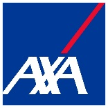
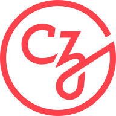
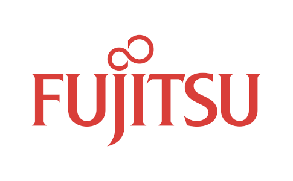
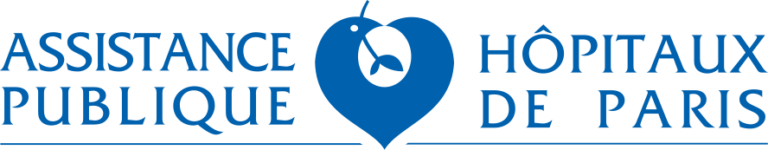

هذا نص بتنسيق RST أريد ترجمته إلى اللغة العربية:

.. _about:

معلومات عنا

(ملاحظة: الرموز الخاصة والرموز والمعادلات الرياضية والروابط والتاجات والشفرة البرمجية لم تتم ترجمتها كما طلبت)

  تاريخ
    ----

    بدأ هذا المشروع في عام 2007 كمشروع جوجل الصيفي للرمز من قبل ديفيد كورنافو. في وقت لاحق من ذلك العام، بدأ ماتيو بروشر العمل على هذا المشروع كجزء من أطروحته.

    في عام 2010، تولى فابيان بيدريغوزا، جايل فاروكو، ألكسندر غرامفورت وفينسنت ميشيل من إنريا قيادة المشروع وأصدروا أول إصدار عام في الأول من فبراير 2010. منذ ذلك الحين، ظهرت عدة إصدارات تتبع دورة تقريبية مدتها ثلاثة أشهر، وقامت مجتمع دولي مزدهر بقيادة التطوير. نتيجة لذلك، تمتلك إنريا حقوق الطبع والنشر على العمل الذي قام به الأشخاص الذين كانوا يعملون في إنريا في وقت المساهمة.

    الحوكمة
    --------

    يتم وضع عملية صنع القرار وهيكل الحوكمة في سكيكيت-ليرن في :ref:`وثيقة الحوكمة <governance>`.

    .. The "author" anchors below is there to ensure that old html links (in
       the form of "about.html#author" still work)

    .. _authors:

    الأشخاص وراء سكيكيت-ليرن
    ----------------------------

    سكيكيت-ليرن هو مشروع مجتمعي، تم تطويره من قبل مجموعة كبيرة من الأشخاص في جميع أنحاء العالم. ومع ذلك، هناك عدد قليل من الفرق المذكورة أدناه، لديها أدوار مركزية، ومع ذلك يمكن العثور على قائمة أكثر اكتمالا من المساهمين `على جيثب <https://github.com/scikit-learn/scikit-learn/graphs/contributors>`__.

    فريق الصيانة
    ........

    الأشخاص التالية أسماؤهم حاليًا هم المديرون، المسؤولون عن توحيد تطوير وصيانة سكيكيت-ليرن:

    .. include:: maintainers.rst

    .. note::

      يرجى عدم إرسال بريد إلكتروني إلى المؤلفين مباشرة لطلب المساعدة أو الإبلاغ عن المشكلات.
      بدلاً من ذلك، يرجى الاطلاع على `ما هي أفضل طريقة لطرح الأسئلة حول استخدام سكيكيت-ليرن
      <https://scikit-learn.org/stable/faq.html#what-s-the-best-way-to-get-help-on-scikit-learn-usage>`_
      في الأسئلة الشائعة.

    .. seealso::

      كيف يمكنك :ref:`المساهمة في المشروع <contributing>`.

    فريق التوثيق
    ...............

    يساعد الأشخاص التالية أسماؤهم في توثيق المشروع:

    .. include:: documentation_team.rst

    فريق تجربة المساهمين
    ...........................

    الأشخاص التالية أسماؤهم هم المساهمون النشطون الذين يساعدون أيضًا في
    :ref:`تجربة المشكلات <bug_triaging>`, PRs، والصيانة العامة:

    .. include:: contributor_experience_team.rst

    فريق الاتصالات
    .................

    يساعد الأشخاص التالية أسماؤهم في :ref:`الاتصال حول سكيكيت-ليرن
    <communication_team>`.

    .. include:: communication_team.rst

    مطورو النواة الفخريون
    ........................

    الأشخاص التالية أسماؤهم كانوا مساهمين نشطين في الماضي، ولكنهم لم يعودوا نشطين في المشروع:

    .. include:: maintainers_emeritus.rst

    فريق الاتصال الفخري
    ...........................

    الأشخاص التالية أسماؤهم كانوا نشطين في فريق الاتصال في الماضي، ولكن لم يعد لديهم مسؤوليات اتصالية:

    .. include:: communication_team_emeritus.rst

    فريق تجربة المساهمين الفخري
    ....................................

    الأشخاص التالية أسماؤهم كانوا نشطين في فريق تجربة المساهمين في الماضي:

    .. include:: contributor_experience_team_emeritus.rst

    .. _citing-scikit-learn:

    الاستشهاد بسكيكيت-ليرن
    -------------------

    إذا كنت تستخدم سكيكيت-ليرن في منشور علمي، فإننا نقدر الاستشهادات بالورقة التالية:

    `سكيكيت-ليرن: التعلم الآلي في بايثون
    <https://jmlr.csail.mit.edu/papers/v12/pedregosa11a.html>`_, Pedregosa
    *et al.*, JMLR 12, pp. 2825-2830, 201

    الدخول بيبتكس::

      @article{scikit-learn,
        title={Scikit-learn: Machine Learning in {P}ython},
        author={Pedregosa, F. and Varoquaux, G. and Gramfort, A. and Michel, V.
                and Thirion, B. and Grisel, O. and Blondel, M. and Prettenhofer, P.
                and Weiss, R. and Dubourg, V. and Vanderplas, J. and Passos, A. and
                Cournapeau, D. and Brucher, M. and Perrot, M. and Duchesnay, E.},
        journal={Journal of Machine Learning Research},
        volume={12},
        pages={2825--2830},
        year={2011}
      }

    إذا كنت ترغب في الاستشهاد بسكيكيت-ليرن لواجهة برمجة التطبيقات أو التصميم الخاص به، فقد ترغب أيضًا في التفكير في الورقة التالية:

    :arxiv:`تصميم واجهة برمجة التطبيقات لبرامج التعلم الآلي: الخبرات من مشروع سكيكيت-ليرن
    <1309.0238>`, Buitinck *et al.*, 2

    الدخول بيبتكس::

      @inproceedings{sklearn_api,
        author    = {Lars Buitinck and Gilles Louppe and Mathieu Blondel and
                    Fabian Pedregosa and Andreas Mueller and Olivier Grisel and
                    Vlad Niculae and Peter Prettenhofer and Alexandre Gramfort
                    and Jaques Grobler and Robert Layton and Jake VanderPlas and
                    Arnaud Joly and Brian Holt and Ga{\"{e}}l Varoquaux},
        title     = {{API} design for machine learning software: experiences from the scikit-learn
                      project},
        booktitle = {ECML PKDD Workshop: Languages for Data Mining and Machine Learning},
        year      = {2013},
        pages = {108--122},
      }

    الأعمال الفنية
    ---------

    تتوفر شعارات PNG و SVG عالية الجودة في المصدر `doc/logos/
    <https://github.com/scikit-learn/scikit-learn/tree/main/doc/logos>`_
    الدليل.

    .. image:: images/scikit-learn-logo-notext.png
      :align: center

    التمويل
    
    (لا يوجد نص للترجمة في قسم التمويل)

بالتأكيد، سأقوم بترجمة النص الذي طلبته إلى اللغة العربية، مع الاحتفاظ بكافة العناصر الخاصة بالتنسيق والرموز والمعادلات الرياضية والروابط والتاجات والشفرة البرمجية كما هي:

---

يعتبر مشروع Scikit-learn مشروعًا يدار بواسطة المجتمع، ومع ذلك فإن المنح المؤسسية والخاصة تساعد في ضمان استدامته.

يود المشروع أن يشكر الجهات الممولة التالية:

...................................

.. div:: sk-text-image-grid-small

  .. div:: text-box

    توظف شركة `:probabl. <https://probabl.ai>`_ كلا من أدريان جالالي، أرتورو أمور، فرانسوا غوبل، غيوم لميتر، جيريمي دو بواسيبيرانغر، لوك إستيف، أوليفييه جريزيل، وستيفاني سينجر.

  .. div:: image-box

    .. image:: images/probabl.png
      :target: https://probabl.ai

..........

.. |chanel| image:: images/chanel.png
  :target: https://www.chanel.com

.. |bnp| image:: images/bnp.png
  :target: https://www.bnpparibascardif.com/

.. |dataiku| image:: images/dataiku.png
  :target: https://www.dataiku.com/

.. |inria| image:: images/inria-logo.jpg
  :target: https://www.inria.fr

.. raw:: html

  

.. div:: sk-text-image-grid-small

  .. div:: text-box

    يساعد `الأعضاء <https://scikit-learn.fondation-inria.fr/en/home/#sponsors>`_ في `كونسورتيوم Scikit-learn في مؤسسة إنريا <https://scikit-learn.fondation-inria.fr/en/home/>`_ في الحفاظ على المشروع وتحسينه من خلال دعمهم المالي.

  .. div:: image-box

    .. table::
      :class: image-subtable

      +----------+-----------+
      |       |chanel|       |
      +----------+-----------+
      |  |axa|   |    |bnp|  |
      +----------+-----------+
      |       |nvidia|       |
      +----------+-----------+
      |       |dataiku|      |
      +----------+-----------+
      |        |inria|       |
      +----------+-----------+

..........

.. div:: sk-text-image-grid-small

  .. div:: text-box

    تقوم شركة `NVidia <https://nvidia.com>`_ بتمويل تيم هيد منذ عام 2022 وهي جزء من كونسيورتيوم Scikit-learn في مؤسسة إنريا.

  .. div:: image-box

    .. image:: images/nvidia.png
      :target: https://nvidia.com

..........

.. div:: sk-text-image-grid-small

  .. div:: text-box

    تقوم شركة `Microsoft <https://microsoft.com/>`_ بتمويل أندرياس مولر منذ عام 2020.

  .. div:: image-box

    .. image:: images/microsoft.png
      :target: https://microsoft.com

...........

.. div:: sk-text-image-grid-small

  .. div:: text-box

    تقوم شركة `Quansight Labs <https://labs.quansight.org>`_ بتمويل لوسي ليو منذ عام 2022.

  .. div:: image-box

    .. image:: images/quansight-labs.png
      :target: https://labs.quansight.org

...........

.. |wellcome| image:: images/wellcome-trust.png
  :target: https://wellcome.org/

.. div:: sk-text-image-grid-small

  .. div:: text-box

    تقوم `مبادرة تشان زوكربيرج <https://chanzuckerberg.com/>`_ و `ويلكم ترست <https://wellcome.org/>`_ بتمويل Scikit-learn من خلال `برنامج البرمجيات المفتوحة المصدر الأساسية للعلوم (EOSS) <https://chanzuckerberg.com/eoss/>`_ الدورة 6.

    يدعم هذا التمويل لوسي ليو ومبادرات التنوع والشمولية التي سيتم الإعلان عنها في المستقبل.

  .. div:: image-box

    .. table::
      :class: image-subtable

      +----------+----------------+
      |  |czi|   |    |wellcome|  |
      +----------+----------------+

...........

.. div:: sk-text-image-grid-small

  .. div:: text-box

    تدعم `Tidelift <https://tidelift.com/>`_ المشروع من خلال اتفاقية الخدمة الخاصة بهم.

  .. div:: image-box

    .. image:: images/Tidelift-logo-on-light.svg
      :target: https://tidelift.com/

...........

الجهات الراعية السابقة
.............

.. div:: sk-text-image-grid-small

  .. div:: text-box

    قامت شركة `Quansight Labs <https://labs.quansight.org>`_ بتمويل ميكيال زين في عامي 2022 و 2023، كما قامت بتمويل توماس جيه فان من عام 2021 إلى عام 2023.

  .. div:: image-box

    .. image:: images/quansight-labs.png
      :target: https://labs.quansight.org

...........

.. div:: sk-text-image-grid-small

  .. div:: text-box

    قامت `جامعة كولومبيا <https://columbia.edu/>`_ بتمويل أندرياس مولر (2016-2020).

  .. div:: image-box

    .. image:: images/columbia.png
      :target: https://columbia.edu

........

.. div:: sk-text-image-grid-small

  .. div:: text-box

    قامت `جامعة سيدني <https://sydney.edu.au/>`_ بتمويل جويل نوثمان (2017-2021).

  .. div:: image-box

    .. image:: images/sydney-primary.jpeg
      :target: https://sydney.edu.au/

...........

.. div:: sk-text-image-grid-small

  .. div:: text-box

    تلقى أندرياس مولر منحة لتحسين Scikit-learn من `مؤسسة ألفريد بي سلون <https://sloan.org>`_ .
    دعم هذا التمويل وظيفتي نيكولاس هوج وتوماس جيه فان.

  .. div:: image-box

    .. image:: images/sloan_banner.png
      :target: https://sloan.org/

.............

.. div:: sk-text-image-grid-small

  .. div:: text-box

    تدعم `INRIA <https://www.inria.fr>`_ هذا المشروع بنشاط. قدمت تمويلًا لفابيان بيدريجوسا (2010-2012)، وجاك غروبلر (2012-2013)، وأوليفييه جريزيل (2013-2017) للعمل على هذا المشروع بدوام كامل. كما استضافت سباقات الترميز وغيرها من الأحداث.

  .. div:: image-box

    .. image:: images/inria-logo.jpg
      :target: https://www.in
نص بتنسيق RST تريد ترجمته إلى اللغة العربية:

`NYU Moore-Sloan Data Science Environment <https://cds.nyu.edu/mooresloan/>`_
موّلت أندرياس مولر (من 2014 إلى 2016) للعمل على هذا المشروع. كما تقوم Moore-Sloan Data Science Environment أيضًا بتمويل العديد من الطلاب للعمل على المشروع بدوام جزئي.

.. div:: image-box

    .. image:: images/nyu_short_color.png
      :target: https://cds.nyu.edu/mooresloan/

........................

.. div:: sk-text-image-grid-small

  .. div:: text-box

    `Télécom Paristech <https://www.telecom-paristech.fr/>`_ موّلت مانوج كومار (2014)، توم دوبري لا تور (2015)، راغاف آر في (2015-2017)، تييري غيلموا (2016-2017) وألبرت توماس (2017) للعمل على scikit-learn.

  .. div:: image-box

    .. image:: images/telecom.png
      :target: https://www.telecom-paristech.fr/

.....................

.. div:: sk-text-image-grid-small

  .. div:: text-box

    `The Labex DigiCosme <https://digicosme.lri.fr>`_ موّلت نيكولاس غويكس (2015-2016)، توم دوبري لا تور (2015-2

...

(تم اقتطاع جزء من النص بسبب طوله، يرجى الاطلاع على الرابط الأصلي لرؤية النص الكامل)

...

- 2007 - ديفيد كورنافو
- 2011 - فلاد نيكولاي
- 2012 - فلاد نيكولاي، إيمانويل باير
- 2013 - كمال إرن، نيكولا تريسيجيني
- 2014 - هامزاه ألسالهي، إصام لارادجي، ماهيشاكا ويجيواردين، مانوج كومار
- 2015 - راغاف آر في، وي شيوي
- 2016 - نيلسون ليو، ين تشن لين

.. _Vlad Niculae: https://vene.ro/

...................

مشروع `NeuroDebian <http://neuro.debian.net>`_ الذي يوفر حزما `Debian <https://www.debian.org/>`_ والمساهمات يتم دعمه من قبل `د. جيمس في. هاكسي <http://haxbylab.dartmouth.edu/>`_ (`Dartmouth College <https://pbs.dartmouth.edu/>`_).

...................

المنظمات التالية موّلت اتحاد scikit-learn في Inria في الماضي:

.. |msn| image:: images/microsoft.png
  :target: https://www.microsoft.com/

.. |bcg| image:: images/bcg.png
  :target: https://www.bcg.com/beyond-consulting/bcg-gamma/default.aspx

.. |hf| image:: images/huggingface_logo-noborder.png
  :target: https://huggingface.co

.. raw:: html

  

.. grid:: 2 2 4 4
  :class-row: image-subgrid
  :gutter: 1

  .. grid-item::
    :class: sd-text-center
    :child-align: center

    |msn|

  .. grid-item::
    :class: sd-text-center
    :child-align: center

    |bcg|

  .. grid-item::
    :class: sd-text-center
    :child-align: center

    |fujitsu|

  .. grid-item::
    :class: sd-text-center
    :child-align: center

    |aphp|

  .. grid-item::
    :class: sd-text-center
    :child-align: center

    |hf|

الاجتماعات البرمجية
    
(تم اقتطاع جزء من النص بسبب طوله، يرجى الاطلاع على الرابط الأصلي لرؤية النص الكامل)

  هذا نص بتنسيق RST أريد ترجمته إلى اللغة العربية، مع الحفاظ على الرموز الخاصة والرموز والمعادلات الرياضية والروابط والتاجات والشفرة البرمجية:

----------------

يتمتع مشروع scikit-learn بتاريخ طويل من "سباقات البرمجة مفتوحة المصدر" <https://blog.scikit-learn.org/events/sprints-value/>`_ مع أكثر من 50 حدثًا منذ عام 2010 حتى يومنا هذا. وهناك العديد من الرعاة الذين ساهموا في التكاليف التي تشمل المكان والطعام والسفر ووقت المطورين وغير ذلك. يمكن الاطلاع على قائمة كاملة بالأحداث في `سباقات scikit-learn <https://blog.scikit-learn.org/sprints/>`_.

التبرع للمشروع
--------------

إذا كنت مهتمًا بالتبرع للمشروع أو لأحد سباقات البرمجة لدينا، يرجى التبرع عبر "صفحة تبرعات NumFOCUS" <https://numfocus.org/donate-to-scikit-learn>`_.

.. raw:: html

  

    <a class="btn sk-btn-orange mb-1" href="https://numfocus.org/donate-to-scikit-learn">
      ساعدنا، <strong>تبرع!</strong>
    </a>
  

سيتم التعامل مع جميع التبرعات من قبل `NumFOCUS <https://numfocus.org/>`_، وهي منظمة غير ربحية يديرها مجلس من `أعضاء مجتمع Scipy <https://numfocus.org/board.html>`_. تتمثل مهمة NumFOCUS في تعزيز برمجيات الحوسبة العلمية، وخاصة في بايثون. باعتبارها المنزل المالي لمشروع scikit-learn، تضمن NumFOCUS توفر الأموال عند الحاجة للحفاظ على المشروع مموّلًا ومتوفرًا مع الامتثال للوائح الضريبية.

سيتم توجيه التبرعات الواردة لمشروع scikit-learn بشكل رئيسي لتغطية نفقات السفر لسباقات البرمجة، بالإضافة إلى ميزانية تنظيم المشروع [#f1]_.

.. rubric:: ملاحظات

.. [#f1] فيما يتعلق بميزانية التنظيم، بشكل خاص، قد نستخدم بعضًا من الأموال المتبرع بها لدفع نفقات أخرى للمشروع مثل خدمات DNS، والاستضافة، أو التكامل المستمر.

دعم البنية التحتية
------------------

كما نود أن نشكر `Microsoft Azure <https://azure.microsoft.com/en-us/>`_، و`Cirrus Cl <https://cirrus-ci.org>`_، و`CircleCl <https://circleci.com/>`_ على توفير وقت مجاني لوحدات المعالجة المركزية على خوادم التكامل المستمر الخاصة بهم، و`Anaconda Inc. <https://www.anaconda.com>`_ على التخزين الذي يقدمونه لبنياتنا المرحلية والليلية.
