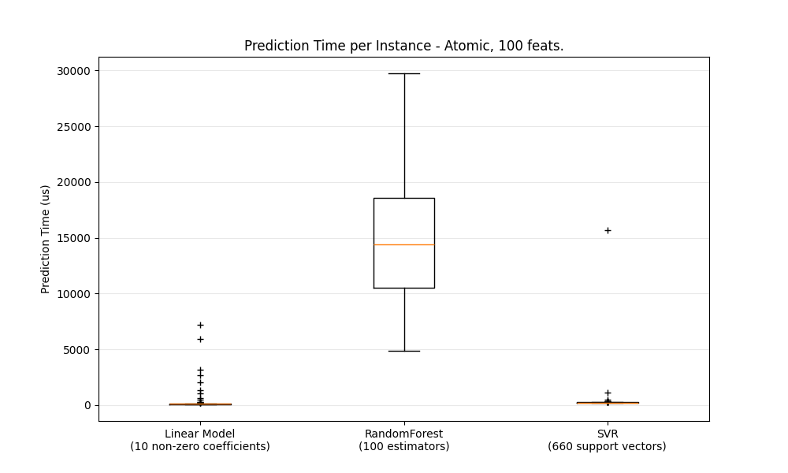
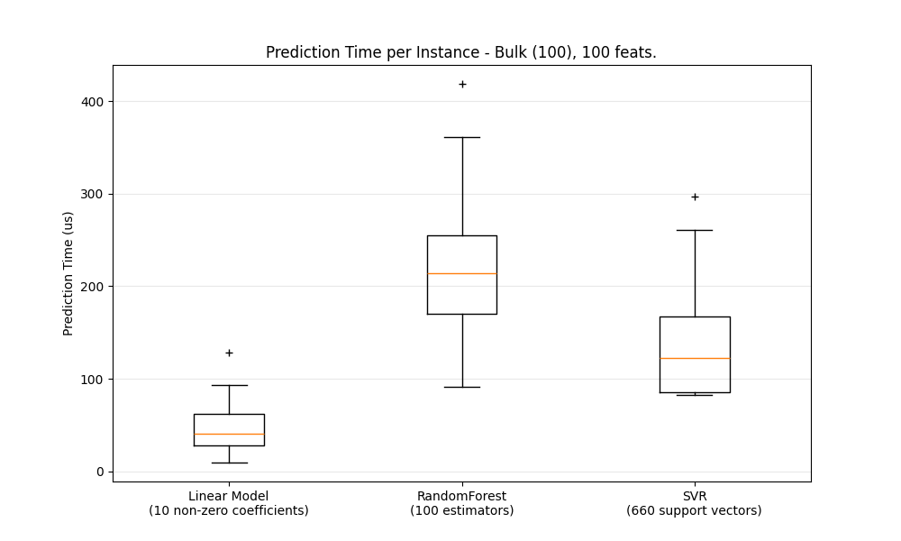
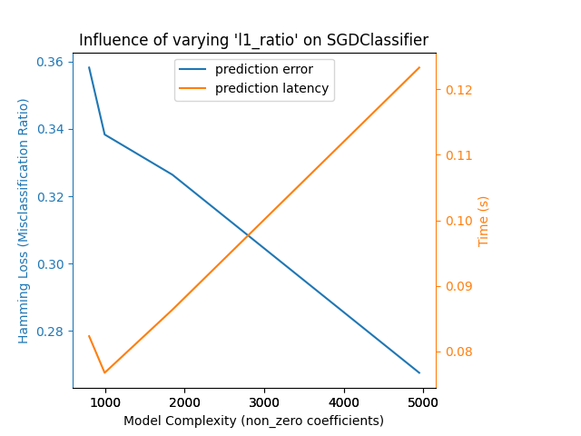
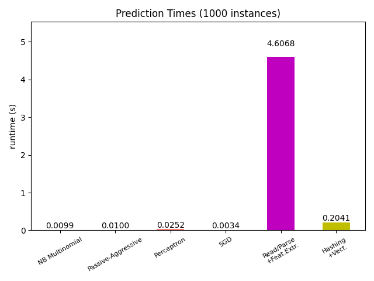
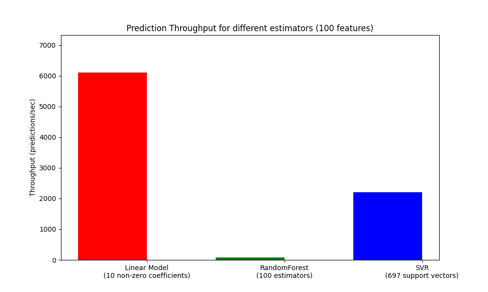

:ref: :mod: :term: الأداء الحسابي لـ sklearn
بالنسبة لبعض التطبيقات، يعد أداء الخوارزميات (الخاصة بالتعلم الآلي) أمرًا بالغ الأهمية، خاصة سرعة الاستجابة (الزمن اللازم لإتمام عملية التنبؤ) وسعة المعالجة (عدد التنبؤات التي يمكن إجراؤها في وحدة الزمن) أثناء مرحلة التنبؤ. في حين أن سعة المعالجة أثناء التدريب قد تكون أيضًا ذات أهمية، إلا أنها غالبًا ما تكون أقل أهمية في بيئة الإنتاج، حيث يتم التدريب غالبًا خارج الخط (offline).

في هذا القسم، سنستعرض أوامر الحجم التي يمكن توقعها من عدد من خوارزميات "سكيت-ليرن" في سياقات مختلفة، وسنقدم بعض النصائح والحيل للتغلب على الاختناقات المتعلقة بالأداء.

سرعة الاستجابة أثناء التنبؤ
--------------------------

يتم قياس سرعة الاستجابة أثناء التنبؤ على أنها الزمن المنقضي اللازم لإجراء تنبؤ واحد (على سبيل المثال، بالمايكروثانية). وغالبًا ما يُنظر إلى سرعة الاستجابة على أنها توزيع، ويركز مهندسو العمليات غالبًا على سرعة الاستجابة عند نسبة مئوية معينة من هذا التوزيع (على سبيل المثال، المئين 90).

سعة المعالجة أثناء التنبؤ
--------------------------

تُعرَّف سعة المعالجة أثناء التنبؤ على أنها عدد التنبؤات التي يمكن للبرنامج تقديمها في وحدة زمنية معينة (على سبيل المثال، عدد التنبؤات في الثانية).

من الجوانب المهمة لتحسين الأداء أيضًا أنه يمكن أن يؤثر سلبًا على دقة التنبؤ. في الواقع، غالبًا ما تكون النماذج البسيطة (على سبيل المثال، الخطية بدلاً من غير الخطية، أو ذات عدد أقل من المعلمات) أسرع في التنفيذ، ولكنها ليست دائمًا قادرة على مراعاة نفس الخصائص الدقيقة للبيانات مثل النماذج الأكثر تعقيدًا.

عوامل مؤثرة على سرعة الاستجابة أثناء التنبؤ
............................................

أحد أكثر المخاوف المباشرة التي قد تواجهها عند استخدام/اختيار مجموعة أدوات تعلم الآلة هي سرعة الاستجابة التي يمكن بها إجراء التنبؤات في بيئة الإنتاج.

العوامل الرئيسية التي تؤثر على سرعة الاستجابة أثناء التنبؤ هي:

1. عدد الخصائص (features): كلما زاد عدد الخصائص، زاد الوقت اللازم لإجراء عملية التنبؤ.
2. تمثيل البيانات ومدى ندرتها (sparsity): يمكن لتمثيل البيانات ومدى ندرتها أن يؤثرا بشكل كبير على سرعة الاستجابة. على سبيل المثال، إذا كانت البيانات نادرة (أي تحتوي على العديد من القيم الصفرية)، فيمكن استخدام هياكل بيانات متخصصة لتخزينها بكفاءة، مما يحسن سرعة الاستجابة.
3. تعقيد النموذج: النماذج الأكثر تعقيدًا، مثل نماذج الغابات العشوائية أو الشبكات العصبية العميقة، قد تستغرق وقتًا أطول في إجراء التنبؤات مقارنة بالنماذج البسيطة، مثل نماذج الانحدار الخطي.
4. استخراج الخصائص: قد تكون عملية استخراج الخصائص من البيانات الأولية (مثل تحويل نص إلى ناقلات كلمات) مكلفة من حيث الوقت، خاصة إذا كانت البيانات كبيرة.

هناك أيضًا عامل رئيسي آخر وهو إمكانية إجراء التنبؤات بشكل مجمع (bulk) أو بشكل منفرد (one-at-a-time). بشكل عام، فإن إجراء التنبؤات بشكل مجمع (أي إجراء العديد من التنبؤات في نفس الوقت) أكثر كفاءة لعدد من الأسباب (مثل قابلية التفرع، وذاكرة التخزين المؤقت للمعالج، وتحسينات مكتبات الجبر الخطي، وما إلى ذلك).

في المثال التالي، يمكننا رؤية أن إجراء التنبؤات بشكل مجمع يكون دائمًا أسرع، وبفارق يصل إلى مرتبة أو مرتبتين من حيث الحجم، وذلك في حالة وجود عدد قليل من الخصائص:

.. centered:: |atomic_prediction_latency|

.. centered:: |bulk_prediction_latency|

لقياس أداء خوارزميات مختلفة في حالتك الخاصة، يمكنك ببساطة تغيير معلمة "n_features" في هذا المثال: :ref:`sphx_glr_auto_examples_applications_plot_prediction_latency.py`. يجب أن يعطيك هذا تقديرًا لحجم سرعة الاستجابة أثناء التنبؤ.

تكوين "سكيت-ليرن" لتقليل التحميل الزائد للتحقق من الصحة
........................................................

يقوم "سكيت-ليرن" ببعض التحقق من صحة البيانات التي تزيد من التحميل الزائد لكل استدعاء لوظيفة "predict" والوظائف المماثلة. على وجه الخصوص، يتضمن التحقق من أن الخصائص محدودة (ليست NaN أو لا نهائية) تمريرًا كاملاً عبر البيانات. إذا كنت تتأكد من أن بياناتك مقبولة، فيمكنك إلغاء التحقق من المحدودية عن طريق تعيين متغير البيئة "SKLEARN_ASSUME_FINITE" إلى سلسلة غير فارغة قبل استيراد "سكيت-ليرن"، أو تكوينه في بايثون باستخدام الدالة: :func:`set_config`.

لمزيد من التحكم أكثر من هذه الإعدادات العالمية، يسمح السياق التكويني (config context) بتعيين هذا التكوين ضمن سياق محدد::

  >>> import sklearn
  >>> with sklearn.config_context(assume_finite=True):
  ...     pass  # قم بالتعلم/التنبؤ هنا مع تقليل التحقق من الصحة

لاحظ أن هذا سيؤثر على جميع استخدامات :func:`~utils.assert_all_finite` داخل السياق.

تأثير عدد الخصائص
....................

من الواضح أنه عندما يزيد عدد الخصائص، تزداد أيضًا كمية الذاكرة التي تستهلكها كل عينة. في الواقع، بالنسبة لمصفوفة مكونة من M عينة و N خاصية، تكون التعقيد المكاني (space complexity) هو O(NM).

من منظور الحساب، يعني هذا أيضًا أن عدد العمليات الأساسية (مثل الضربات لمنتجات المصفوفة-المتجه في النماذج الخطية) يزيد أيضًا. في الرسم البياني التالي، يمكننا رؤية تطور سرعة الاستجابة أثناء التنبؤ مع زيادة عدد الخصائص:

.. |influence_of_n_features_on_latency| image::  ../auto_examples/applications/images/sphx_glr_plot_prediction_latency_003.png
    :target: ../auto_examples/applications/plot_prediction_latency.html
    :scale: 80

.. centered:: |influence_of_n_features_on_latency|

بشكل عام، يمكنك توقع زيادة وقت التنبؤ بشكل خطي على الأقل مع زيادة عدد الخصائص (قد تحدث حالات غير خطية اعتمادًا على البصمة الذاكرية الإجمالية والخوارزمية).

تأثير تمثيل البيانات المدخلة
...............................

يوفر "سايكوب" (SciPy) هياكل بيانات المصفوفة النادرة (sparse matrix) والتي تم تحسينها لتخزين البيانات النادرة. الميزة الرئيسية لتنسيقات البيانات النادرة هي أنك لا تخزن الأصفار، لذلك إذا كانت بياناتك نادرة، فستستخدم ذاكرة أقل بكثير. لن تأخذ القيمة غير الصفرية في تمثيل نادرة ('CSR' أو 'CSC') في المتوسط سوى موضع 32 بت صحيح واحد + قيمة النقطة العائمة 64 بت + 32 بت إضافية لكل صف أو عمود في المصفوفة.

يؤدي استخدام المدخلات النادرة في نموذج خطي (أو نادر) إلى تسريع التنبؤ بشكل كبير، حيث تؤثر فقط القيم غير الصفرية على الضرب النقطي وبالتالي على تنبؤات النموذج. لذلك، إذا كان لديك 100 قيمة غير صفرية في مساحة أبعادها 1e6، فأنت بحاجة فقط إلى 100 عملية ضرب وجمع بدلاً من 1e6.

ومع ذلك، قد تستفيد الحسابات على التمثيل الكثيف (dense representation) من عمليات المتجهات المُحسّنة بشكل كبير وتعدد الخيوط في "BLAS"، وتميل إلى إعطاء عدد أقل من حالات الإخفاق في ذاكرة التخزين المؤقت للمعالج. لذلك، يجب أن تكون النسبة المئوية للقيم غير الصفرية منخفضة جدًا (10٪ كحد أقصى، اعتمادًا على الأجهزة) ليكون تمثيل الإدخال النادر أسرع من تمثيل الإدخال الكثيف على آلة بها العديد من وحدات المعالجة المركزية (CPUs) وتنفيذ "BLAS" المحسّن.

فيما يلي كود بايثون لاختبار ندرة مدخلاتك::

    def sparsity_ratio(X):
        return 1.0 - np.count_nonzero(X) / float(X.shape[0] * X.shape[1])
    print("نسبة الندرة في الإدخال:", sparsity_ratio(X))

كقاعدة عامة، يمكنك اعتبار أنه إذا كانت نسبة الندرة أكبر من 90٪، فيمكنك الاستفادة من التنسيقات النادرة. راجع وثائق تنسيقات المصفوفة النادرة في "سايكوب" للحصول على مزيد من المعلومات حول كيفية بناء (أو تحويل بياناتك إلى) تنسيقات المصفوفة النادرة. في معظم الأحيان، تعمل تنسيقات "CSR" و "CSC" بشكل أفضل.

تأثير تعقيد النموذج
......................

بشكل عام، عندما يزيد تعقيد النموذج، من المفترض أن تزداد قوة التنبؤ وسرعة الاستجابة. عادة ما يكون زيادة قوة التنبؤ أمرًا مثيرًا للاهتمام، ولكن بالنسبة للعديد من التطبيقات، من الأفضل ألا نزيد كثيرًا من سرعة الاستجابة أثناء التنبؤ. سنستعرض الآن هذه الفكرة لعائلات مختلفة من النماذج المُشرفة.

بالنسبة لـ :mod:`sklearn.linear_model` (على سبيل المثال، "Lasso"، و "ElasticNet"، و "SGDClassifier/Regressor"، و "Ridge" و "RidgeClassifier"، و "PassiveAggressiveClassifier/Regressor"، و "LinearSVC"، و "LogisticRegression"، وما إلى ذلك)، فإن دالة القرار المطبقة أثناء التنبؤ هي نفسها (ضرب نقطي)، لذلك يجب أن تكون سرعة الاستجابة مكافئة.

فيما يلي مثال باستخدام :class:`~linear_model.SGDClassifier` مع عقوبة "elasticnet". يتم التحكم في قوة العقوبة بشكل عام بواسطة معلمة "alpha". باستخدام "alpha" عالية بما يكفي، يمكنك بعد ذلك زيادة معلمة "l1_ratio" لعقوبة "elasticnet" لفرض مستويات مختلفة من الندرة في معاملات النموذج. تُفسر الندرة العالية هنا على أنها تعقيد أقل للنموذج حيث نحتاج إلى عدد أقل من المعاملات لوصفها بالكامل. بالطبع، تؤثر الندرة بدورها على وقت التنبؤ حيث يستغرق الضرب النقطي النادر وقتًا يتناسب تقريبًا مع عدد المعاملات غير الصفرية.

.. centered:: |en_model_complexity|

بالنسبة لعائلة :mod:`sklearn.svm` من الخوارزميات مع نواة غير خطية، ترتبط سرعة الاستجابة بعدد متجهات الدعم (support vectors) (كلما قل العدد، زادت السرعة). يجب أن تنمو سرعة الاستجابة وسعة المعالجة (بشكل أساسي) بشكل خطي مع عدد متجهات الدعم في نموذج "SVC" أو "SVR". ستؤثر النواة أيضًا على سرعة الاستجابة حيث يتم استخدامها لحساب إسقاط متجه الإدخال مرة واحدة لكل متجه دعم. في الرسم البياني التالي، تم استخدام معلمة "nu" من :class:`~svm.NuSVR` للتأثير على عدد متجهات الدعم.

.. |nusvr_model_complexity| image::  ../auto_examples/applications/images/sphx_glr_plot_model_complexity_influence_002.png
    :target: ../auto_examples/applications/plot_model_complexity_influence.html
    :scale: 80

.. centered:: |nusvr_model_complexity|

بالنسبة لـ :mod:`sklearn.ensemble` من الأشجار (مثل "RandomForest"، و "GBT"، و "ExtraTrees"، وما إلى ذلك)، يلعب عدد الأشجار وعمقها أهم دور. يجب أن تتناسب سرعة الاستجابة وسعة المعالجة بشكل خطي مع عدد الأشجار. في هذه الحالة، تم استخدام معلمة "n_estimators" من :class:`~ensemble.GradientBoostingRegressor` مباشرة.

.. |gbt_model_complexity| image::  ../auto_examples/applications/images/sphx_glr_plot_model_complexity_influence_003.png
    :target: ../auto_examples/applications/plot_model_complexity_influence.html
    :scale: 80

.. centered:: |gbt_model_complexity|

في أي حال، يجب أن تكون على علم بأن تقليل تعقيد النموذج يمكن أن يؤثر سلبًا على الدقة، كما ذُكر سابقًا. على سبيل المثال، يمكن التعامل مع مشكلة غير قابلة للفصل الخطي باستخدام نموذج خطي سريع، ولكن من المحتمل أن تتأثر قوة التنبؤ في هذه العملية.

سرعة استجابة استخراج الخصائص
...............................

معظم نماذج "سكيت-ليرن" سريعة جدًا لأنها مُنفذة إما باستخدام امتدادات "Cython" المترجمة أو مكتبات الحوسبة المُحسّنة. من ناحية أخرى، في العديد من تطبيقات العالم الحقيقي، تحكم عملية استخراج الخصائص (أي تحويل البيانات الأولية، مثل صفوف قواعد البيانات أو رزم البيانات الشبكية، إلى مصفوفات "نمبر") وقت التنبؤ الإجمالي. على سبيل المثال، في مهمة تصنيف نص "رويترز"، تستغرق عملية الإعداد بأكملها (قراءة وتهيئة ملفات "SGML"، وتجزئة النص، وهاشه إلى مساحة متجه مشتركة) من 100 إلى 500 ضعف الوقت الذي تستغرقه كود التنبؤ الفعلي، وهذا يتوقف على النموذج المُختار.

.. centered:: |prediction_time|

لذلك، يوصى في العديد من الحالات بقياس وتوصيف كود استخراج الخصائص الخاص بك بعناية، حيث قد يكون هذا مكانًا جيدًا للبدء في التحسين عندما تكون سرعة الاستجابة الإجمالية بطيئة جدًا لتطبيقك.

سعة المعالجة أثناء التنبؤ
--------------------------

مقياس آخر مهم يجب مراعاته عند تحديد حجم أنظمة الإنتاج هو سعة المعالجة، أي عدد التنبؤات التي يمكنك إجراؤها في وحدة زمنية معينة. فيما يلي مقياس للأداء من المثال: :ref:`sphx_glr_auto_examples_applications_plot_prediction_latency.py` الذي يقيس هذه الكمية لعدد من الخوارزميات على بيانات اصطناعية:

.. centered:: |throughput_benchmark|

تم تحقيق هذه السعات على عملية واحدة. إحدى الطرق الواضحة لزيادة سعة المعالجة لتطبيقك هي إنشاء مثيلات إضافية (عادةً ما تكون عمليات في بايثون بسبب "GIL") تشارك نفس النموذج. قد يقوم المرء أيضًا بإضافة آلات لنشر الحمل. ومع ذلك، فإن الشرح المفصل لكيفية تحقيق ذلك يتجاوز نطاق هذه الوثيقة.

نصائح وحيل
...........

يمكن أن يساعد استخدام أجهزة رسومات أفضل (GPU) في تسريع بعض الخوارزميات، خاصة تلك التي تنطوي على عمليات مصفوفة كثيفة، مثل بعض خوارزميات التعلم العميق. يمكن لمكتبات مثل "CuPy" و "TensorFlow" و "PyTorch" الاستفادة من أجهزة "GPU" لأداء الحسابات بشكل أسرع.

يمكن أن يس
مكتبات الجبر الخطي
...................................

نظرًا لأن scikit-learn يعتمد بشكل كبير على Numpy/Scipy والجبر الخطي بشكل عام، فمن المنطقي الاهتمام بشكل صريح بإصدارات هذه المكتبات. بشكل أساسي، يجب التأكد من أن Numpy تم بناؤه باستخدام مكتبة BLAS محسّنة <https://en.wikipedia.org/wiki/Basic_Linear_Algebra_Subprograms> / LAPACK <https://en.wikipedia.org/wiki/LAPACK>.

لا تستفيد جميع النماذج من تنفيذات BLAS وLapack المحسّنة. على سبيل المثال، لا تعتمد النماذج المستندة إلى (randomized) decision trees عادةً على استدعاءات BLAS في حلقاتها الداخلية، وكذلك الأمر بالنسبة لنواة SVMs (SVC وSVR وNuSVC وNuSVR). من ناحية أخرى، فإن النموذج الخطي المنفذ باستخدام استدعاء BLAS DGEMM (عبر numpy.dot) سيستفيد عادةً بشكل كبير من تنفيذ BLAS المحسّن، مما يؤدي إلى تسريع كبير في الأداء مقارنة بـ BLAS غير المحسّن.

يمكنك عرض تنفيذ BLAS / LAPACK الذي تستخدمه تثبيتات NumPy / SciPy / scikit-learn باستخدام الأمر التالي::

    python -c "import sklearn; sklearn.show_versions()"

تشمل تنفيذات BLAS / LAPACK المحسّنة ما يلي:

- أطلس (يحتاج إلى ضبط محدد للأجهزة عن طريق إعادة البناء على الجهاز المستهدف)
- OpenBLAS
- MKL
- Apple Accelerate وvecLib frameworks (لنظام التشغيل OSX فقط)

يمكن العثور على مزيد من المعلومات في صفحة تثبيت NumPy <https://numpy.org/install/> وصفحة المدونة هذه <https://danielnouri.org/notes/2012/12/19/libblas-and-liblapack-issues-and-speed,-with-scipy-and-ubuntu/> من Daniel Nouri والتي تحتوي على تعليمات تثبيت مفصلة لنظامي Debian / Ubuntu.

تحديد الذاكرة العاملة
........................................

عند تنفيذ بعض الحسابات باستخدام عمليات Numpy المتجهة القياسية، يتم استخدام كمية كبيرة من ذاكرة النظام المؤقتة. قد يؤدي هذا إلى استنفاد ذاكرة النظام. حيثما يمكن إجراء الحسابات في قطع ذاكرة ثابتة، نحاول القيام بذلك، والسماح للمستخدم بالإشارة إلى الحد الأقصى لحجم ذاكرة العمل هذه (الافتراضي إلى 1 جيجابايت) باستخدام: func: set_config أو: func: config_context. يقترح ما يلي تحديد ذاكرة العمل المؤقتة إلى 128 ميغا بايت::

    >>> import sklearn
    >>> with sklearn.config_context(working_memory=128):
    ...     pass # قم بالعمل المجزأ هنا

مثال على عملية مجزأة تلتزم بهذا الإعداد هو: func: ~ metrics.pairwise_distances_chunked، والذي يسهل حساب التخفيضات الصفوف لمصفوفة المسافة الزوجية.

ضغط النموذج
..................

في scikit-learn، لا يتعلق ضغط النموذج إلا بالنماذج الخطية في الوقت الحالي. في هذا السياق، يعني ذلك أننا نريد التحكم في ندرة النموذج (أي عدد الإحداثيات غير الصفرية في متجهات النموذج). من الجيد عمومًا الجمع بين ندرة النموذج وتمثيل البيانات النادرة.

هنا عينة من التعليمات البرمجية التي توضح استخدام طريقة "sparsify()"::

    clf = SGDRegressor(penalty='elasticnet', l1_ratio=0.25)
    clf.fit(X_train, y_train).sparsify()
    clf.predict(X_test)

في هذا المثال، نفضل عقوبة "elasticnet" لأنها غالبًا ما تكون حلًا وسطًا جيدًا بين دقة النموذج وسرعته. يمكن أيضًا ضبط معلمة "l1_ratio" بشكل أكبر (بالاشتراك مع قوة التنظيم "alpha") للتحكم في هذا التوازن.

تؤدي "مقارنة قياسية" <https://github.com/scikit-learn/scikit-learn/blob/main/benchmarks/bench_sparsify.py> على بيانات صناعية إلى انخفاض في زمن الوصول بنسبة تزيد عن 30% عندما يكون كل من النموذج والمدخلات نادرة (بنسبة 0.000024 و0.027400 من نسب المعاملات غير الصفرية على التوالي). قد تختلف النتائج حسب ندرة وحجم بياناتك ونموذجك. علاوة على ذلك، يمكن أن يكون الضغط مفيدًا جدًا لتقليل استخدام الذاكرة في النماذج التنبؤية المنشورة على خوادم الإنتاج.

إعادة تشكيل النموذج
.........................

تتكون إعادة تشكيل النموذج من اختيار جزء فقط من الميزات المتاحة لتناسب النموذج. وبعبارة أخرى، إذا تخلى النموذج عن الميزات أثناء مرحلة التعلم، فيمكننا بعد ذلك إزالة تلك الميزات من الإدخال. هذا له فوائد عدة. أولاً، يقلل من النفقات العامة للذاكرة (وبالتالي الوقت) للنموذج نفسه. كما يسمح بإزالة مكونات اختيار الميزات الصريحة في خط الأنابيب بمجرد معرفة الميزات التي يجب الاحتفاظ بها من تشغيل سابق. وأخيرًا، يمكنه المساعدة في تقليل وقت المعالجة واستخدام وحدة الإدخال والإخراج في طبقات الوصول إلى البيانات واستخراج الميزات عن طريق عدم جمع وبناء الميزات التي يتخلص منها النموذج. على سبيل المثال، إذا كانت البيانات الخام تأتي من قاعدة بيانات، فقد يكون من الممكن كتابة استعلامات أبسط وأسرع أو تقليل استخدام وحدة الإدخال والإخراج عن طريق جعل الاستعلامات تعيد سجلات أخف.
في الوقت الحالي، يجب إجراء إعادة التشكيل يدويًا في scikit-learn. في حالة الإدخال النادر (خاصة بتنسيق "CSR")، يكون من الكافي عمومًا عدم إنشاء الميزات ذات الصلة، وترك أعمدتها فارغة.

الروابط
........

- : ref: <performance-howto> توثيق أداء مطور scikit-learn
- تنسيقات مصفوفة scipy النادرة <https://docs.scipy.org/doc/scipy/reference/sparse.html>