.. _clustering:

==========
التجميع
==========

يمكن تنفيذ تجميع البيانات غير الموسومة باستخدام الوحدة النمطية :mod:`sklearn.cluster`.

تأتي كل خوارزمية تجميع في متغيرين: فئة، تقوم بتنفيذ طريقة "التناسب" لتعلم التجميعات على بيانات التدريب، ودالة، تعيد، عند إعطائها بيانات تدريب، مصفوفة من التسميات الصحيحة التي تتوافق مع التجميعات المختلفة. وبالنسبة للفئة، يمكن العثور على التسميات على بيانات التدريب في سمة "التسميات".

.. currentmodule:: sklearn.cluster

.. topic:: بيانات الإدخال

    من المهم ملاحظة أن الخوارزميات المنفذة في هذه الوحدة يمكن أن تأخذ أنواعًا مختلفة من المصفوفات كإدخال. تقبل جميع الطرق مصفوفات البيانات القياسية ذات الشكل ``(n_samples، n_features)``. يمكن الحصول على هذه المصفوفات من الفئات في الوحدة النمطية :mod:`sklearn.feature_extraction`. بالنسبة لـ :class:`AffinityPropagation`، و:class:`SpectralClustering`، و:class:`DBSCAN`، يمكن أيضًا إدخال مصفوفات التشابه ذات الشكل ``(n_samples، n_samples)``. يمكن الحصول على هذه المصفوفات من الدالات في الوحدة النمطية :mod:`sklearn.metrics.pairwise`.

نظرة عامة على طرق التجميع
===============================

.. figure:: ../auto_examples/cluster/images/sphx_glr_plot_cluster_comparison_001.png
   :target: ../auto_examples/cluster/plot_cluster_comparison.html
   :align: center
   :scale: 50

   مقارنة بين خوارزميات التجميع في scikit-learn

.. list-table::
   :header-rows: 1
   :widths: 14 15 19 25 20

   * - اسم الطريقة
     - المعلمات
     - قابلية التوسع
     - حالة الاستخدام
     - الهندسة (المقياس المستخدم)

   * - :ref:`K-Means <k_means>`
     - عدد التجميعات
     - عدد كبير جدًا من ``n_samples``، وعدد متوسط من ``n_clusters`` مع
     :ref:`رمز MiniBatch <mini_batch_kmeans>`
     - الغرض العام، وحجم التجميع متساوٍ، والهندسة المسطحة،
     وعدد قليل من التجميعات، والاستقراء
     - المسافات بين النقاط

   * - :ref:`انتشار التشابه <affinity_propagation>`
     - التخميد، وتفضيل العينة
     - لا يمكن توسيعه باستخدام ``n_samples``
     - العديد من التجميعات، وحجم تجميع غير متساوٍ، والهندسة غير المسطحة، والاستقراء
     - مسافة الرسم البياني (مثل رسم بياني لأقرب الجيران)

   * - :ref:`تحول المتوسط <mean_shift>`
     - عرض النطاق الترددي
     - لا يمكن توسيعه باستخدام ``n_samples``
     - العديد من التجميعات، وحجم التجميع غير متساوٍ، والهندسة غير المسطحة، والاستقراء
     - المسافات بين النقاط

   * - :ref:`التجميع الطيفي <spectral_clustering>`
     - عدد التجميعات
     - متوسط ``n_samples``، وعدد صغير من ``n_clusters``
     - عدد قليل من التجميعات، وحجم التجميع متساوٍ، والهندسة غير المسطحة، والاستنتاج الاستقرائي
     - مسافة الرسم البياني (مثل رسم بياني لأقرب الجيران)

   * - :ref:`التجميع الهرمي لوارد <hierarchical_clustering>`
     - عدد التجميعات أو عتبة المسافة
     - عدد كبير من ``n_samples`` و ``n_clusters``
     - العديد من التجميعات، وقيود الاتصال المحتملة، والاستنتاج الاستقرائي
     - المسافات بين النقاط

   * - :ref:`التجميع التجميعي <hierarchical_clustering>`
     - عدد التجميعات أو عتبة المسافة، ونوع الارتباط، والمسافة
     - عدد كبير من ``n_samples`` و ``n_clusters``
     - العديد من التجميعات، وقيود الاتصال المحتملة، والمسافات غير الإقليدية، والاستنتاج الاستقرائي
     - أي مسافة زوجية

   * - :ref:`DBSCAN <dbscan>`
     - حجم الجوار
     - عدد كبير جدًا من ``n_samples``، وعدد متوسط من ``n_clusters``
     - الهندسة غير المسطحة، وأحجام التجميع غير المتساوية، وإزالة القيم الشاذة،
     والاستنتاج الاستقرائي
     - المسافات بين أقرب النقاط

   * - :ref:`HDBSCAN <hdbscan>`
     - الحد الأدنى لعضوية التجميع، والحد الأدنى لجيران النقطة
     - عدد كبير من ``n_samples``، وعدد متوسط من ``n_clusters``
     - الهندسة غير المسطحة، وأحجام التجميع غير المتساوية، وإزالة القيم الشاذة،
     والاستنتاج الاستقرائي، والتجميع الهرمي، وكثافة التجميع المتغيرة
     - المسافات بين أقرب النقاط

   * - :ref:`OPTICS <optics>`
     - الحد الأدنى لعضوية التجميع
     - عدد كبير جدًا من ``n_samples``، وعدد كبير من ``n_clusters``
     - الهندسة غير المسطحة، وأحجام التجميع غير المتساوية، وكثافة التجميع المتغيرة،
     وإزالة القيم الشاذة، والاستنتاج الاستقرائي
     - المسافات بين النقاط

   * - :ref:`المزيج الغاوسي <mixture>`
     - العديد من المعلمات
     - لا يمكن توسيعه
     - الهندسة المسطحة، جيدة لتقدير الكثافة، والاستقراء
     - مسافات ماهالانوبيس إلى المراكز

   * - :ref:`BIRCH <birch>`
     - عامل التفرع، والعتبة، والمصنف التجميعي العالمي الاختياري.
     - عدد كبير من ``n_clusters`` و ``n_samples``
     - مجموعة بيانات كبيرة، وإزالة القيم الشاذة، وتقليل البيانات، والاستقراء
     - المسافة الإقليدية بين النقاط

   * - :ref:`K-Means ثنائي التفرع <bisect_k_means>`
     - عدد التجميعات
     - عدد كبير جدًا من ``n_samples``، وعدد متوسط من ``n_clusters``
     - الغرض العام، وحجم التجميع متساوٍ، والهندسة المسطحة،
     وعدم وجود تجميعات فارغة، والاستقراء، والتجميع الهرمي
     - المسافات بين النقاط

التجميع ذو الهندسة غير المسطحة مفيد عندما يكون للتجميعات شكل محدد، أي سطح غير مسطح، والمسافة الإقليدية القياسية ليست المقياس الصحيح. تنشأ هذه الحالة في الصفوف العلوية من الشكل أعلاه.

تُوصف نماذج المزيج الغاوسي، المفيدة للتجميع، في :ref:`فصل آخر من الوثائق <mixture>` المخصص لنماذج المزيج. يمكن اعتبار KMeans حالة خاصة من نموذج المزيج الغاوسي مع تساوي التباين لكل مكون.

طرق التجميع :term:`الاستنتاج الاستقرائي <transductive>` (على عكس طرق التجميع :term:`الاستقرائي` ) ليست مصممة لتطبيقها على بيانات جديدة غير معروفة.

.. _k_means:

K-means
خوارزمية :class: 'KMeans' تقوم بتجميع البيانات من خلال محاولة فصل العينات في مجموعات n ذات تباين متساوٍ، وتقليل معيار يعرف باسم "القصور الذاتي" أو مجموع المربعات داخل المجموعة (انظر أدناه). تتطلب هذه الخوارزمية تحديد عدد المجموعات. كما أنها تتناسب جيدًا مع الأعداد الكبيرة من العينات وقد تم استخدامها في مجموعة واسعة من مجالات التطبيق في العديد من المجالات المختلفة.

تقسم خوارزمية k-means مجموعة من N عينة X إلى K مجموعات غير متداخلة C، لكل منها متوسط μj لعينات المجموعة. عادة ما تسمى المتوسطات "مراكز" المجموعات؛ لاحظ أنها ليست، بشكل عام، نقاط من X، على الرغم من أنها موجودة في نفس المساحة.

تهدف خوارزمية K-means إلى اختيار مراكز تقلل من القصور الذاتي أو معيار مجموع المربعات داخل المجموعة:

يمكن التعرف على القصور الذاتي كمقاييس للتماسك الداخلي للمجموعات.

ولكنها تعاني من عدة عيوب:

- يفترض القصور الذاتي أن المجموعات محدبة ومتساوية الخواص، وهو ما لا يكون صحيحًا دائمًا. كما أنها تستجيب بشكل سيء للمجموعات الطويلة أو المنحنيات ذات الأشكال غير المنتظمة.

- القصور الذاتي ليس مقياسًا معياريًا: كل ما نعرفه هو أن القيم الأقل هي الأفضل وأن الصفر هو الوضع الأمثل. ولكن في المساحات عالية الأبعاد جدًا، تميل المسافات الإقليدية إلى الانتفاخ (هذه هي حالة ما يسمى "لعنة الأبعاد"). يمكن التخفيف من هذه المشكلة وتسريع الحسابات من خلال تشغيل خوارزمية تقليل الأبعاد مثل :ref: 'PCA' قبل التجميع باستخدام k-means.

يمكن الاطلاع على أوصاف أكثر تفصيلاً للمشكلات الموضحة أعلاه وكيفية معالجتها في الأمثلة :ref: 'sphx_glr_auto_examples_cluster_plot_kmeans_assumptions.py' و :ref: 'sphx_glr_auto_examples_cluster_plot_kmeans_silhouette_analysis.py'.

يُشار إلى K-means غالبًا باسم خوارزمية Lloyd. وبشكل أساسي، تتكون الخوارزمية من ثلاث خطوات. تختار الخطوة الأولى المراكز الأولية، وتتمثل أبسط طريقة في اختيار k عينة من مجموعة البيانات X. بعد التهيئة، تتكون K-means من التكرار بين الخطوتين الأخريين. تقوم الخطوة الأولى بتعيين كل عينة إلى أقرب مركز لها. تقوم الخطوة الثانية بإنشاء مراكز جديدة عن طريق حساب المتوسط لجميع العينات المعينة لكل مركز سابق. يتم حساب الفرق بين المراكز القديمة والجديدة، وتكرر الخوارزمية هاتين الخطوتين الأخيرتين حتى تكون هذه القيمة أقل من عتبة معينة. وبعبارة أخرى، فإنها تكرر العملية حتى لا تتحرك المراكز بشكل كبير.

K-means مكافئ لخوارزمية التوقع الأقصى مع مصفوفة تباين صغيرة ومتساوية ومتعامدة.

يمكن أيضًا فهم الخوارزمية من خلال مفهوم مخططات Voronoi

يتم أولاً حساب مخطط Voronoi للنقاط باستخدام المراكز الحالية. يصبح كل جزء في مخطط Voronoi مجموعة منفصلة. ثانيًا، يتم تحديث المراكز إلى متوسط كل جزء. ثم تكرر الخوارزمية هذه العملية حتى يتم استيفاء معيار التوقف. عادة ما تتوقف الخوارزمية عندما يكون الانخفاض النسبي في دالة الهدف بين التكرارات أقل من قيمة التحمل المحددة. ولكن هذا ليس هو الحال في هذا التنفيذ: يتوقف التكرار عندما تتحرك المراكز بأقل من قيمة التحمل.

إذا تم منحها وقتًا كافيًا، فستتقارب K-means دائمًا، ولكن قد يكون ذلك عند حد أدنى محلي. يعتمد هذا إلى حد كبير على تهيئة المراكز. ونتيجة لذلك، يتم إجراء الحساب غالبًا عدة مرات، مع تهيئة مختلفة للمراكز. إحدى الطرق للمساعدة في معالجة هذه المشكلة هي مخطط تهيئة k-means++، والذي تم تنفيذه في scikit-learn (استخدم معلمة "init='k-means++'". يقوم هذا بإعداد المراكز لتكون متباعدة بشكل عام، مما يؤدي إلى نتائج أفضل من التهيئة العشوائية، كما هو موضح في المرجع. لمثال مفصل لمقارنة مخططات التهيئة المختلفة، راجع :ref: 'sphx_glr_auto_examples_cluster_plot_kmeans_digits.py'.

يمكن أيضًا استخدام k-means++ بشكل مستقل لاختيار البذور لخوارزميات التجميع الأخرى، راجع :func: 'sklearn.cluster.kmeans_plusplus' للحصول على التفاصيل والاستخدام النموذجي.

تدعم الخوارزمية أوزان العينات، والتي يمكن إعطاؤها بواسطة معلمة "sample_weight". يسمح ذلك بإعطاء وزن أكبر لبعض العينات عند حساب مراكز المجموعات وقيم القصور الذاتي. على سبيل المثال، فإن تعيين وزن 2 لعينة ما يعادل إضافة نسخة مكررة من تلك العينة إلى مجموعة البيانات X.

يمكن استخدام K-means في التكميم المتجه. يتم تحقيق ذلك باستخدام طريقة "التحويل" لنموذج مدرب من :class: 'KMeans'. لمثال على تنفيذ التكميم المتجه على صورة، راجع :ref: 'sphx_glr_auto_examples_cluster_plot_color_quantization.py'.

.. rubric:: الأمثلة

* :ref: 'sphx_glr_auto_examples_cluster_plot_cluster_iris.py': مثال على استخدام :class: 'KMeans' باستخدام مجموعة بيانات Iris

* :ref: 'sphx_glr_auto_examples_text_plot_document_clustering.py': تجميع المستندات باستخدام :class: 'KMeans' و :class: 'MiniBatchKMeans' بناءً على بيانات متفرقة

التوازي منخفض المستوى
---------------------

يستفيد :class: 'KMeans' من التوازي القائم على OpenMP من خلال Cython. يتم معالجة أجزاء صغيرة من البيانات (256 عينة) بالتوازي، مما يؤدي أيضًا إلى تقليل استخدام الذاكرة. لمزيد من التفاصيل حول كيفية التحكم في عدد الخيوط، يرجى الرجوع إلى ملاحظاتنا حول :ref: 'parallelism'.

.. rubric:: الأمثلة

* :ref: 'sphx_glr_auto_examples_cluster_plot_kmeans_assumptions.py': توضيح الحالات التي يؤدي فيها k-means بشكل بديهي والحالات التي لا يؤدي فيها بشكل بديهي

* :ref: 'sphx_glr_auto_examples_cluster_plot_kmeans_digits.py': تجميع الأرقام المكتوبة بخط اليد

.. dropdown:: المراجع

  * "k-means++: مزايا البذر بعناية"
    <http://ilpubs.stanford.edu:8090/778/1/2006-13.pdf>
    آرثر، ديفيد، وسيرجي فاسيلفيتسكي،
    وقائع الندوة السنوية الثامنة عشرة ACM-SIAM حول الخوارزميات المنفصلة، جمعية الرياضيات الصناعية والتطبيقية (2007)

.. _mini_batch_kmeans:

Mini Batch K-Means
------------------

:class: 'MiniBatchKMeans' هو متغير من :class: 'KMeans' خوارزمية

التي تستخدم الدفعات المصغرة لتقليل وقت الحساب، مع محاولة تحسين نفس دالة الهدف. الدفعات المصغرة هي مجموعات فرعية من بيانات الإدخال، يتم أخذ عينات عشوائية منها في كل تكرار تدريبي. تقلل هذه الدفعات المصغرة بشكل كبير من كمية الحسابات اللازمة للتقارب إلى حل محلي. على عكس الخوارزميات الأخرى التي تقلل من وقت التقارب لخوارزمية k-means، فإن mini-batch k-means ينتج نتائج أسوأ قليلاً فقط من الخوارزمية القياسية.

تتناوب الخوارزمية بين خطوتين رئيسيتين، مشابهتين لخوارزمية k-means الأساسية. في الخطوة الأولى، يتم رسم b عينة عشوائيًا من مجموعة البيانات لتشكيل دفعة مصغرة. ثم يتم تعيينها إلى أقرب مركز لها. في الخطوة الثانية، يتم تحديث المراكز. على عكس k-means، يتم ذلك على أساس كل عينة على حدة. بالنسبة لكل عينة في الدفعة المصغرة، يتم تحديث المركز المعين عن طريق أخذ المتوسط المتحرك للعينة وجميع العينات السابقة المعينة لذلك المركز. يؤدي هذا إلى تقليل معدل التغير للمركز بمرور الوقت. يتم تنفيذ هذه الخطوات حتى يتم الوصول إلى التقارب أو عدد محدد مسبقًا من التكرارات.

يتقارب :class: 'MiniBatchKMeans' بشكل أسرع من :class: 'KMeans'، ولكن جودة النتائج أقل. في الممارسة العملية، يمكن أن يكون هذا الاختلاف في الجودة صغيرًا جدًا، كما هو موضح في المثال والمرجع المذكور.

.. figure:: ../auto_examples/cluster/images/sphx_glr_plot_mini_batch_kmeans_001.png
   :target: ../auto_examples/cluster/plot_mini_batch_kmeans.html
   :align: center
   :scale: 100

.. rubric:: الأمثلة

* :ref: 'sphx_glr_auto_examples_cluster_plot_mini_batch_kmeans.py': مقارنة بين :class: 'KMeans' و :class: 'MiniBatchKMeans'

* :ref: 'sphx_glr_auto_examples_text_plot_document_clustering.py': تجميع المستندات باستخدام :class: 'KMeans' و :class: 'MiniBatchKMeans' بناءً على بيانات متفرقة

* :ref: 'sphx_glr_auto_examples_cluster_plot_dict_face_patches.py'

.. dropdown:: المراجع

  * "K-Means التجميع على نطاق الويب"
    <https://www.eecs.tufts.edu/~dsculley/papers/fastkmeans.pdf>
    D. سكولي، وقائع المؤتمر الدولي التاسع عشر على World
    الويب واسع النطاق (2010)

.. _affinity_propagation:

Affinity Propagation
ينشئ :class:`AffinityPropagation` التجمعات عن طريق إرسال الرسائل بين أزواج العينات حتى التقارب. ثم يتم وصف مجموعة البيانات باستخدام عدد صغير من الأمثلة النموذجية، والتي يتم تحديدها على أنها الأكثر تمثيلاً للعينات الأخرى. وتمثل الرسائل المرسلة بين الأزواج ملاءمة عينة واحدة لتكون نموذجًا للآخر، يتم تحديثه استجابة للقيم من الأزواج الأخرى. يحدث هذا التحديث بشكل تكراري حتى يتم الوصول إلى التقارب، وعند هذه النقطة يتم اختيار النماذج النهائية، وبالتالي يتم إعطاء التجميع النهائي.

تقنية Affinity Propagation مثيرة للاهتمام لأنها تختار عدد التجمعات بناءً على البيانات المقدمة. ولهذا الغرض، هناك معياران مهمان هما: "التفضيل"، الذي يتحكم في عدد النماذج المستخدمة، و"معامل التخميد" الذي يقلل من أهمية رسائل المسؤولية والتوفر لتجنب الاهتزازات العددية عند تحديث هذه الرسائل.

الجانب السلبي الرئيسي لتقنية Affinity Propagation هو تعقيدها. فلخوارزمية تعقيد زمني من رتبة :math:`O(N^2 T)`، حيث :math:`N` هو عدد العينات و :math:`T` هو عدد التكرارات حتى التقارب. علاوة على ذلك، فإن التعقيد الذاكري هو من رتبة :math:`O(N^2)` إذا تم استخدام مصفوفة تشابه كثيفة، ولكنه قابل للتخفيض إذا تم استخدام مصفوفة تشابه مبعثرة. وهذا يجعل تقنية Affinity Propagation مناسبة أكثر لمجموعات البيانات الصغيرة والمتوسطة الحجم.

تنتمي الرسائل المرسلة بين النقاط إلى إحدى الفئتين التاليتين. الأولى هي المسؤولية :math:`r(i, k)`، والتي تمثل الأدلة المتراكمة على أن العينة :math:`k` يجب أن تكون نموذجًا للعينة :math:`i`. والثانية هي التوفر :math:`a(i, k)` الذي يمثل الأدلة المتراكمة على أن العينة :math:`i` يجب أن تختار العينة :math:`k` لتكون نموذجها، وتأخذ في الاعتبار القيم لجميع العينات الأخرى التي يجب أن تكون :math:`k` نموذجًا لها. وبهذه الطريقة، يتم اختيار النماذج من قبل العينات إذا كانت (1) مشابهة بما فيه الكفاية للعديد من العينات و (2) اختارها العديد من العينات لتمثيل أنفسهم.

وبشكل أكثر رسمية، فإن مسؤولية عينة :math:`k` لتكون نموذجًا للعينة :math:`i` تعطى بالمعادلة التالية:

.. math::

   r(i, k) \leftarrow s(i, k) - max [ a(i, k') + s(i, k') \forall k' \neq k ]

حيث :math:`s(i, k)` هي درجة التشابه بين العينات :math:`i` و :math:`k`. وتُعطى قابلية العينة :math:`k` لتكون نموذجًا للعينة :math:`i` بالمعادلة التالية:

.. math::

   a(i, k) \leftarrow min [0, r(k, k) + \sum_{i'~s.t.~i' \notin \{i, k\}}{r(i', k)}]

في البداية، يتم تعيين جميع القيم لـ :math:`r` و :math:`a` إلى الصفر، ويتم حساب كل منها حتى التقارب. وكما نوقش سابقًا، لتجنب الاهتزازات العددية عند تحديث الرسائل، يتم تقديم معامل التخميد :math:`\lambda` إلى عملية التكرار على النحو التالي:

.. math:: r_{t+1}(i, k) = \lambda\cdot r_{t}(i, k) + (1-\lambda)\cdot r_{t+1}(i, k)
.. math:: a_{t+Multiplier)(i, k) = \lambda\cdot a_{t}(i, k) + (1-\lambda)\cdot a_{t+1}(i, k)

حيث :math:`t` تشير إلى مرات التكرار.

.. rubric:: أمثلة

* :ref:`sphx_glr_auto_examples_cluster_plot_affinity_propagation.py`: تقنية Affinity Propagation على مجموعة بيانات صناعية ثنائية الأبعاد مع 3 فئات
* :ref:`sphx_glr_auto_examples_applications_plot_stock_market.py`: تقنية Affinity Propagation على السلاسل الزمنية المالية للعثور على مجموعات من الشركات

.. _mean_shift:

Mean Shift
==========
يهدف التجميع باستخدام :class:`MeanShift` إلى اكتشاف "التكتلات" في كثافة سلسة من العينات. إنه خوارزمية تعتمد على المركزيد، تعمل عن طريق تحديث المرشحين لتكون المركزيد المتوسط للنقاط داخل منطقة معينة. يتم بعد ذلك تصفية هؤلاء المرشحين في مرحلة ما بعد المعالجة للقضاء على التكرارات القريبة لتشكيل المجموعة النهائية من المركزيد.

يتم ضبط موضع مرشحي المركزيد بشكل تكراري باستخدام تقنية تسمى "تسلق التل"، والتي تجد القيم القصوى المحلية لتقدير كثافة الاحتمالية. بالنظر إلى مرشح المركزيد :math:`x` للتكرار :math:`t`، يتم تحديث المرشح وفقًا للمعادلة التالية:

.. math::

   x^{t+1} = x^t + m(x^t)

حيث :math:`m` هي متجه "التحول المتوسط" الذي يتم حسابه لكل مركزيد ويشير إلى منطقة الزيادة القصوى في كثافة النقاط. ولحساب :math:`m`، نقوم بتعريف :math:`N(x)` على أنها مجموعة الجوار من العينات ضمن مسافة معينة حول :math:`x`. ثم يتم حساب :math:`m` باستخدام المعادلة التالية، مما يؤدي إلى تحديث المركزيد ليكون متوسط العينات داخل الجوار الخاص به:

.. math::

   m(x) = \frac{1}{|N(x)|} \sum_{x_j \in N(x)}x_j - x

وبشكل عام، تعتمد معادلة :math:`m` على دالة النواة المستخدمة لتقدير الكثافة. والصيغة العامة هي:

.. math::

   m(x) = \frac{\sum_{x_j \in N(x)}K(x_j - x)x_j}{\sum_{x_j \in N(x)}K(x_j - x)} - x

في تنفيذنا، :math:`K(x)` تساوي 1 إذا كانت :math:`x` صغيرة بما فيه الكفاية وتساوي صفرًا في حال العكس. وبشكل فعال، تشير :math:`K(y - x)` ما إذا كانت :math:`y` في جوار :math:`x`.

يحدد الخوارزم تلقائيًا عدد التجمعات، بدلاً من الاعتماد على معلمة "عرض النطاق الترددي"، التي تملي حجم المنطقة التي يجب البحث فيها. يمكن تعيين هذه المعلمة يدويًا، ولكن يمكن تقديرها باستخدام دالة "estimate_bandwidth" المقدمة، والتي يتم استدعاؤها إذا لم يتم تعيين عرض النطاق الترددي.

الخوارزمية ليست قابلة للتطوير بشكل كبير، حيث تتطلب عمليات بحث متعددة عن أقرب جار أثناء تنفيذ الخوارزمية. من المضمون أن تتقارب الخوارزمية، ومع ذلك، فإنها ستتوقف عن التكرار عندما يكون التغيير في المركزيد صغيرًا.

يتم تصنيف عينة جديدة عن طريق العثور على أقرب مركزيد لعينة معينة.

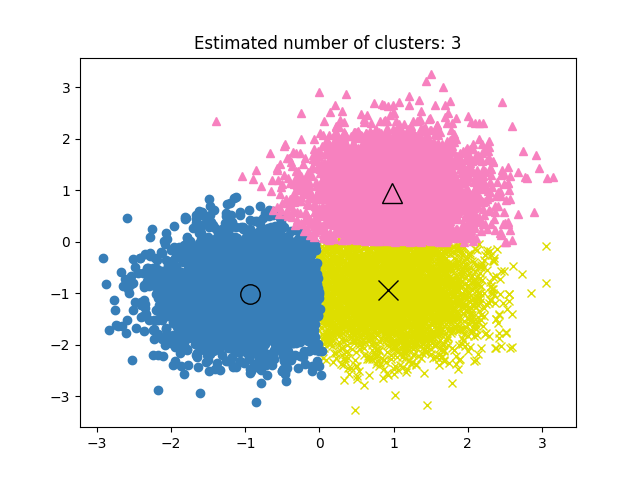

.. rubric:: أمثلة

* :ref:`sphx_glr_auto_examples_cluster_plot_mean_shift.py`: التجميع باستخدام Mean Shift على مجموعة بيانات صناعية ثنائية الأبعاد مع 3 فئات.

.. dropdown:: المراجع

* :doi:`"Mean shift: A robust approach toward feature space analysis" <10.1109/34.1000236>` D. Comaniciu and P. Meer, *IEEE Transactions on Pattern Analysis and Machine Intelligence* (2002)

.. _spectral_clustering:

Spectral clustering
يؤدي :class:`SpectralClustering` إلى تضمين منخفض الأبعاد لمصفوفة التشابه بين العينات، يليه تجميع، على سبيل المثال، بواسطة KMeans، لمكونات المتجهات الذاتية في الفضاء منخفض الأبعاد. إنه فعال بشكل خاص من الناحية الحسابية إذا كانت مصفوفة التشابه متفرقة ويتم استخدام محلل 'amg' لمشكلة القيمة الذاتية (ملاحظة، يتطلب محلل 'amg' تثبيت وحدة 'pyamg <https://github.com/pyamg/pyamg>`_).

يتطلب الإصدار الحالي من SpectralClustering تحديد عدد التجميعات مسبقًا. يعمل بشكل جيد لعدد صغير من المجموعات، ولكن لا يُنصح به للعديد من المجموعات.

بالنسبة لمجموعتين، يحل SpectralClustering استرخاءًا محدبًا لمشكلة "التقطيعات المطبعنة <https://people.eecs.berkeley.edu/~malik/papers/SM-ncut.pdf>`_" على الرسم البياني للتشابه: تقسيم الرسم البياني إلى قسمين بحيث يكون وزن الحواف المقطوعة صغيرًا مقارنة بأوزان الحواف داخل كل مجموعة. هذا المعيار مثير للاهتمام بشكل خاص عند العمل على الصور، حيث تكون عقد الرسم البياني بكسلًا، وتتم حسابات أوزان حواف الرسم البياني للتشابه باستخدام دالة تدرج الصورة.

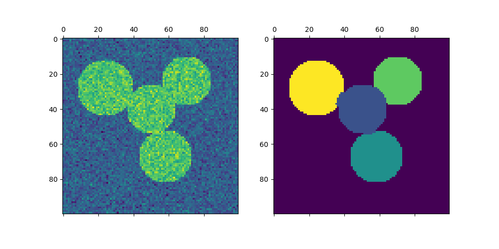

.. |segmented_img| image:: ../auto_examples/cluster/images/sphx_glr_plot_segmentation_toy_002.png
    :target: ../auto_examples/cluster/plot_segmentation_toy.html
    :scale: 50

.. centered:: |noisy_img| |segmented_img|

.. warning:: تحويل المسافة إلى تشابهات جيدة التصرف

    لاحظ أنه إذا لم تكن قيم مصفوفة التشابه الخاصة بك موزعة بشكل جيد، على سبيل المثال، بقيم سلبية أو بمصفوفة مسافة بدلاً من التشابه، فستكون المشكلة الطيفية غير قابلة للحل. في هذه الحالة، يُنصح بتطبيق تحويل على إدخالات المصفوفة. على سبيل المثال، في حالة مصفوفة مسافة موقعة، من الشائع تطبيق نواة حرارية::

        similarity = np.exp(-beta * distance / distance.std())

    راجع الأمثلة لمثل هذا التطبيق.

.. rubric:: أمثلة

* :ref:`sphx_glr_auto_examples_cluster_plot_segmentation_toy.py`: تجزئة الأجسام من خلفية ضبابية باستخدام التجميع الطيفي.
* :ref:`sphx_glr_auto_examples_cluster_plot_coin_segmentation.py`: التجميع الطيفي لتقسيم صورة العملات إلى مناطق.

.. |coin_kmeans| image:: ../auto_examples/cluster/images/sphx_glr_plot_coin_segmentation_001.png
  :target: ../auto_examples/cluster/plot_coin_segmentation.html
  :scale: 35

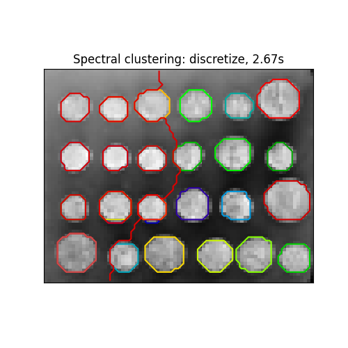

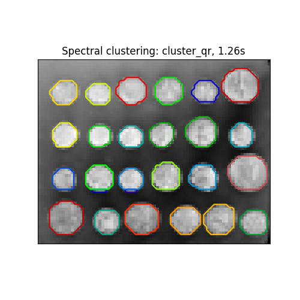

استراتيجيات تعيين التسميات المختلفة
-------------------------------------

يمكن استخدام استراتيجيات مختلفة لتعيين التسميات، والتي تتوافق مع
معلمة "assign_labels" من :class:`SpectralClustering`. يمكن لاستراتيجية "kmeans" أن تتطابق مع التفاصيل الدقيقة، ولكن قد تكون غير مستقرة.

على وجه الخصوص، ما لم تتحكم في "random_state"، فقد لا يكون
قابلاً للتكرار من تشغيل إلى تشغيل، حيث يعتمد على التهيئة العشوائية.
البديل "discretize" استراتيجية قابلة للتكرار 100٪، ولكن يميل
إلى إنشاء قطع من الشكل حتى وجيومتري.
الخيار "cluster_qr" المضافة مؤخرًا هو بديل حتمي يميل إلى إنشاء
أفضل تقسيم مرئي على تطبيق المثال أدناه.

================================  ================================  ================================
 ``assign_labels="kmeans"``        ``assign_labels="discretize"``    ``assign_labels="cluster_qr"``
================================  ================================  ================================
|coin_kmeans|                          |coin_discretize|                  |coin_cluster_qr|
================================  ================================  ================================

.. dropdown:: المراجع

  * `"Multiclass spectral clustering"
    <https://people.eecs.berkeley.edu/~jordan/courses/281B-spring04/readings/yu-shi.pdf>`_
    ستيلا إكس يو، جيانبو شي، 2003

  * :doi:`"Simple, direct, and efficient multi-way spectral clustering"<10.1093/imaiai/iay008>`
    أنيل داملي، فيكتور ميندن، ليكسينج يينج، 2019

.. _spectral_clustering_graph:

رسوم بيانية للتجميع الطيفي
--------------------------

يمكن أيضًا استخدام التجميع الطيفي لتقسيم الرسوم البيانية عبر تضميناتها الطيفية. في هذه الحالة، تكون مصفوفة التشابه هي مصفوفة المجاورة للرسم البياني، ويتم تهيئة SpectralClustering بـ `affinity='precomputed'`::

    >>> from sklearn.cluster import SpectralClustering
    >>> sc = SpectralClustering(3, affinity='precomputed', n_init=100,
    ...                         assign_labels='discretize')
    >>> sc.fit_predict(adjacency_matrix)  # doctest: +SKIP

.. dropdown:: المراجع

  * :doi:`"A Tutorial on Spectral Clustering" <10.1007/s11222-007-9033-z>` Ulrike
    von Luxburg، 2007

  * :doi:`"Normalized cuts and image segmentation" <10.1109/34.868688>` Jianbo
    Shi، Jitendra Malik، 2000

  * `"A Random Walks View of Spectral Segmentation"
    <https://citeseerx.ist.psu.edu/doc_view/pid/84a86a69315e994cfd1e0c7debb86d62d7bd1f44>`_
    مارينا مايلا، جيانبو شي، 2001

  * `"On Spectral Clustering: Analysis and an algorithm"
    <https://citeseerx.ist.psu.edu/doc_view/pid/796c5d6336fc52aa84db575fb821c78918b65f58>`_
    أندرو واي نج، مايكل آي جوردان، يائير وايس، 2001

  * :arxiv:`"Preconditioned Spectral Clustering for Stochastic Block Partition
    Streaming Graph Challenge" <1708.07481>` ديفيد زهوزوناشفيلي، أندرو كنيازيف

.. _hierarchical_clustering:

التجميع الهرمي
التجميع الهرمي هي عائلة عامة من خوارزميات التجميع التي تقوم ببناء تجمعات متداخلة عن طريق دمجها أو تقسيمها بشكل متتالي. يتم تمثيل هذا التسلسل الهرمي للتجمعات على شكل شجرة (أو مخطط شجري). جذر الشجرة هو التجمع الفريد الذي يجمع جميع العينات، والأوراق هي التجمعات التي تحتوي على عينة واحدة فقط. لمزيد من التفاصيل، راجع صفحة ويكيبيديا https://en.wikipedia.org/wiki/Hierarchical_clustering.

تقوم كائن class: 'AgglomerativeClustering' بالتجميع الهرمي باستخدام نهج من الأسفل إلى الأعلى: تبدأ كل ملاحظة في تجمعها الخاص، ويتم دمج التجمعات معًا بشكل متتالي. تحدد معايير الربط المقياس المستخدم لاستراتيجية الدمج:

- **Ward** تقلل من مجموع مربعات الاختلافات داخل جميع التجمعات. إنه نهج لتقليل التباين، وهو بهذا المعنى مشابه لدالة الهدف k-means ولكن تم التعامل معه باستخدام نهج تسلسلي هرمي.

- **Maximum** أو الربط الكامل يقلل المسافة القصوى بين الملاحظات في أزواج من التجمعات.

- **Average linkage** يقلل متوسط المسافات بين جميع الملاحظات في أزواج من التجمعات.

- **Single linkage** تقليل المسافة بين أقرب الملاحظات في أزواج من التجمعات.

يمكن لـ class: 'AgglomerativeClustering' أيضًا أن يتوسع ليشمل عددًا كبيرًا من العينات عند استخدامه بشكل مشترك مع مصفوفة الاتصال، ولكنه مكلف من الناحية الحسابية عندما لا يتم إضافة أي قيود اتصال بين العينات: فهو ينظر في كل خطوة إلى جميع عمليات الدمج الممكنة.

.. topic:: class: 'FeatureAgglomeration'

يستخدم class: 'FeatureAgglomeration' التجميع التسلسلي لدمج الميزات التي تبدو متشابهة جدًا، مما يقلل عدد الميزات. إنه أداة لخفض الأبعاد، راجع ref: 'data_reduction'.

أنواع مختلفة من الروابط: Ward وcomplete وaverage وsingle linkage
-------------------------------------------------------------------

يدعم class: 'AgglomerativeClustering' استراتيجيات الربط Ward وsingle وaverage وcomplete.

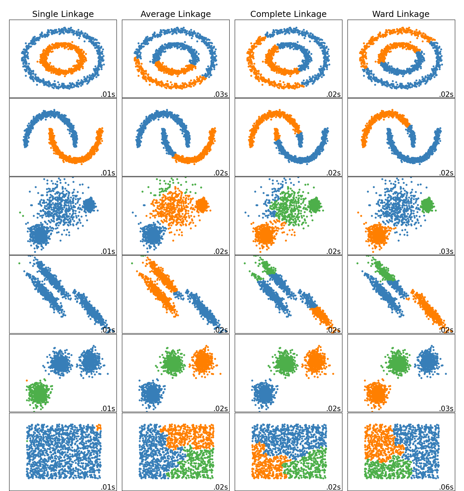

لدى التجميع التسلسلي سلوك "الغني يزداد ثراءً" الذي يؤدي إلى أحجام مجموعات غير متساوية. وفي هذا الصدد، فإن الربط الفردي هو الأسوأ، وWard يعطي أكثر الأحجام انتظامًا. ومع ذلك، لا يمكن تغيير الانجذاب (أو المسافة المستخدمة في التجميع) مع Ward، وبالتالي بالنسبة للمقاييس غير الإقليدية، فإن الربط المتوسط هو بديل جيد. يمكن حساب الربط الفردي، على الرغم من عدم متانته للبيانات الضجيج، بكفاءة كبيرة، وبالتالي يمكن أن يكون مفيدًا لتوفير التجميع الهرمي لمجموعات البيانات الأكبر. يمكن أيضًا أن يؤدي الربط الفردي أداءً جيدًا في البيانات غير الكروية.

.. rubric:: الأمثلة

* ref: 'sphx_glr_auto_examples_cluster_plot_digits_linkage.py': استكشاف استراتيجيات الربط المختلفة في مجموعة بيانات حقيقية.

* ref: 'sphx_glr_auto_examples_cluster_plot_linkage_comparison.py': استكشاف استراتيجيات الربط المختلفة في مجموعات البيانات اللعبة.

تصور تسلسل هرمي للمجموعة
----------------------------------

من الممكن تصور الشجرة التي تمثل الدمج الهرمي للمجموعات على شكل مخطط شجري. غالبًا ما يكون الفحص المرئي مفيدًا لفهم بنية البيانات، خاصة في حالة أحجام العينات الصغيرة.

.. image:: ../auto_examples/cluster/images/sphpx_glr_plot_agglomerative_dendrogram_001.png
    :target: ../auto_examples/cluster/plot_agglomerative_dendrogram.html
    :scale: 42

.. rubric:: الأمثلة

* ref: 'sphx_glr_auto_examples_cluster_plot_agglomerative_dendrogram.py'

إضافة قيود الاتصال
-------------------------------

من الجوانب المهمة في class: 'AgglomerativeClustering' أنه يمكن إضافة قيود الاتصال إلى هذا الخوارزمية (يمكن دمج التجمعات المجاورة فقط معًا)، من خلال مصفوفة اتصال تحدد لكل عينة العينات المجاورة وفقًا لهيكل معين للبيانات. على سبيل المثال، في مثال swiss-roll أدناه، تمنع قيود الاتصال دمج النقاط التي لا تتواجد على swiss roll، وبالتالي تتجنب تكوين مجموعات تمتد عبر طيات متداخلة من swiss roll.

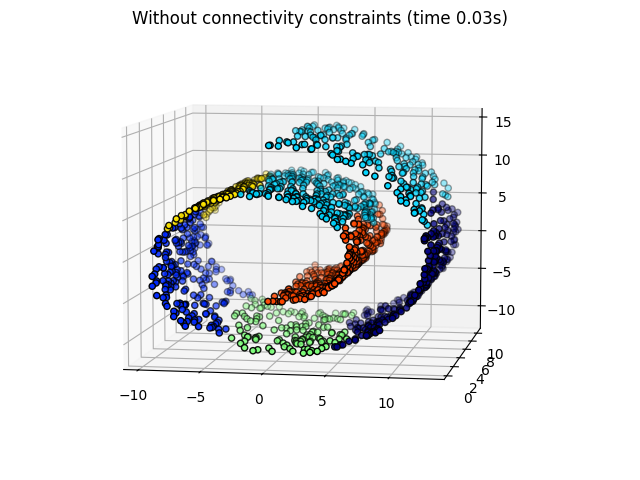

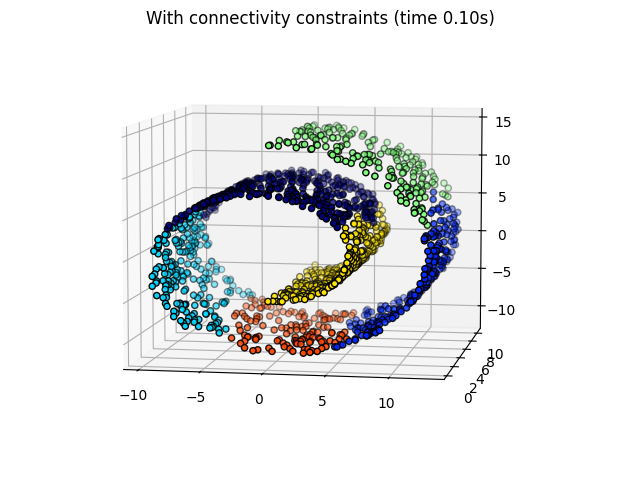

.. centered:: |unstructured| |structured|

هذه القيود مفيدة لفرض بنية محلية معينة، ولكنها أيضًا تجعل الخوارزمية أسرع، خاصة عندما يكون عدد العينات كبيرًا.

يتم فرض قيود الاتصال عبر مصفوفة اتصال: مصفوفة scipy متفرقة تحتوي على عناصر فقط عند تقاطع صف وعمود مع مؤشرات مجموعة البيانات التي يجب أن تكون متصلة. يمكن بناء هذه المصفوفة من معلومات مسبقة: على سبيل المثال، قد ترغب في تجميع صفحات الويب عن طريق دمج الصفحات التي تحتوي على رابط يشير من واحدة إلى أخرى فقط. يمكن أيضًا تعلمه من البيانات، على سبيل المثال باستخدام sklearn.neighbors.kneighbors_graph لتقييد الدمج إلى أقرب جيران كما هو موضح في هذا المثال ref: 'sphx_glr_auto_examples_cluster_plot_agglomerative_clustering.py'، أو باستخدام sklearn.feature_extraction.image.grid_to_graph للسماح فقط بدمج البكسلات المجاورة في صورة، كما هو الحال في مثال العملة ref: 'sphx_glr_auto_examples_cluster_plot_coin_ward_segmentation.py'.

.. warning:: قيود الاتصال مع الربط الفردي والمتوسط والكامل

يمكن أن تعزز قيود الاتصال وربط الربط الفردي أو الكامل أو المتوسط جانب "الغني يزداد ثراءً" في التجميع التسلسلي، خاصة إذا تم بناؤها باستخدام sklearn.neighbors.kneighbors_graph. في حد عدد صغير من التجمعات، فإنها تميل إلى إعطاء عدد قليل من المجموعات المشغولة بشكل كبير ومجموعات فارغة تقريبًا. (انظر المناقشة في ref: 'sphx_glr_auto_examples_cluster_plot_agglomerative_clustering.py'). الربط الفردي هو أكثر خيارات الارتباط هشاشة فيما يتعلق بهذه المسألة.

.. image:: ../auto_examples/cluster/images/sphx_glr_plot_agglomerative_clustering_001.png
    :target: ../auto_examples/cluster/plot_agglomerative_clustering.html
    :scale: 38

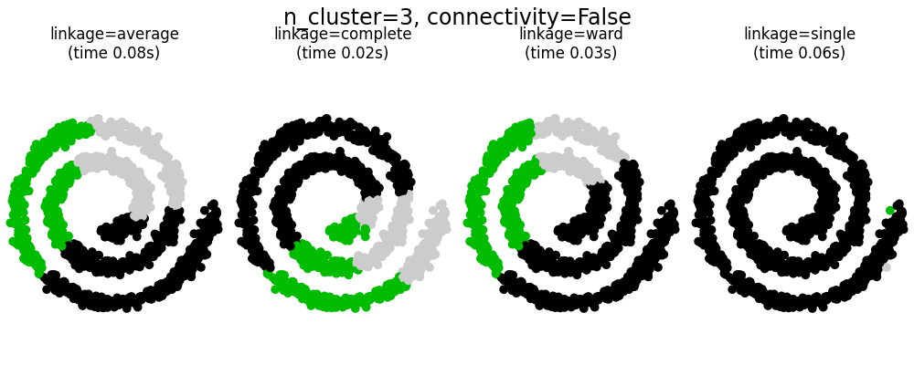

.. image:: ../auto_examples/cluster/images/sphx_glr_plot_agglomerative_clustering_003.png
    :target: ../auto_examples/cluster/plot_agglomerative_clustering.html
    :scale: 38

.. image:: ../auto_examples/cluster/images/sphx_glr_plot_agglomerative_clustering_004.png
    :target: ../auto_examples/cluster/plot_agglomerative_clustering.html
    :scale: 38

.. rubric:: الأمثلة

* ref: 'sphx_glr_auto_examples_cluster_plot_coin_ward_segmentation.py': تجميع Ward لتقسيم صورة العملات إلى مناطق.

* ref: 'sphx_glr_auto_examples_cluster_plot_ward_structured_vs_unstructured.py': مثال على خوارزمية Ward على swiss-roll، ومقارنة النهج المنظمة مقابل غير المنظمة.

* ref: 'sphx_glr_auto_examples_cluster_plot_feature_agglomeration_vs_univariate_selection.py': مثال على تقليل الأبعاد مع تجميع الميزات بناءً على التجميع الهرمي لـ Ward.

* ref: 'sphx_glr_auto_examples_cluster_plot_agglomerative_clustering.py'

تغيير المقياس
-------------------

يمكن استخدام الربط الفردي والمتوسط والكامل مع مجموعة متنوعة من المسافات (أو الانجذابات)، وخاصة المسافة الإقليدية (l2)، ومسافة مانهاتن (أو Cityblock، أو l1)، والمسافة التكوينية، أو أي مصفوفة انجذاب محسوبة مسبقًا.

* غالبًا ما تكون المسافة l1 جيدة للميزات النادرة، أو الضوضاء النادرة: أي أن العديد من الميزات تكون صفرية، كما هو الحال في تعدين النصوص باستخدام تكرارات الكلمات النادرة.

* المسافة التكوينية مثيرة للاهتمام لأنها لا تتأثر بالقياسات العالمية للإشارة.

تتمثل الإرشادات الخاصة باختيار المقياس في استخدام المقياس الذي يزيد المسافة بين العينات في فئات مختلفة، ويقلل ذلك داخل كل فئة.

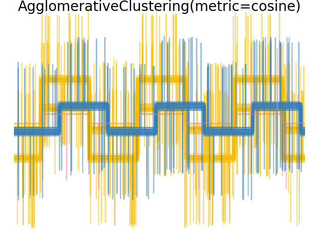

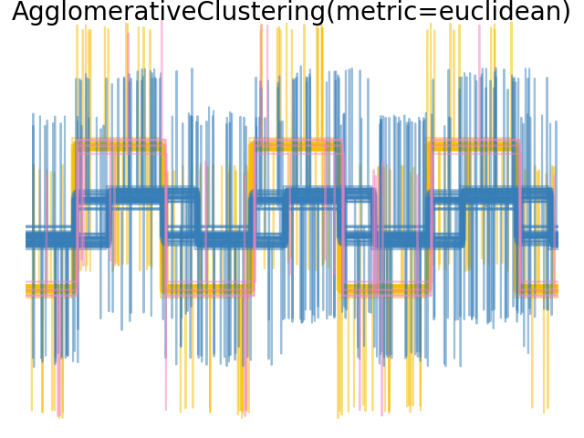

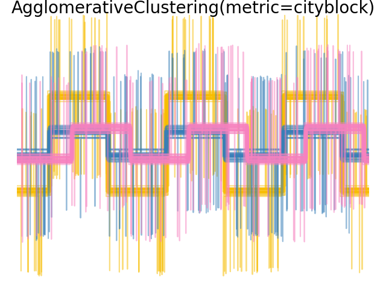

.. rubric:: الأمثلة

* ref: 'sphx_glr_auto_examples_cluster_plot_agglomerative_clustering_metrics.py'

K-Means ثنائي القسمة
-----------------

.. _bisect_k_means:

class: 'BisectingKMeans' هو متغير تكراري من class: 'KMeans'، باستخدام التجميع الهرمي التقسيمي. بدلاً من إنشاء جميع النقط المركزية مرة واحدة، يتم اختيار النقط المركزية تدريجيًا بناءً على تجميع سابق: يتم تقسيم مجموعة إلى مجموعتين جديدتين بشكل متكرر حتى يتم الوصول إلى عدد المجموعات المستهدفة.

class: 'BisectingKMeans' أكثر كفاءة من class: 'KMeans' عندما يكون عدد المجموعات كبيرًا لأنه يعمل فقط على جزء فرعي من البيانات في كل تقسيم بينما يعمل class: 'KMeans' دائمًا على مجموعة البيانات بالكامل.

على الرغم من أن class: 'BisectingKMeans' لا يمكنه الاستفادة من مزايا التهيئة "k-means++" حسب التصميم، إلا أنه سيظل ينتج نتائج مماثلة لـ 'KMeans (init="k-means++")' من حيث الخمول بتكاليف حسابية أقل، ومن المحتمل أن ينتج نتائج أفضل من 'KMeans' مع تهيئة عشوائية.

هذا المتغير أكثر كفاءة من التجميع التسلسلي إذا كان عدد المجموعات صغيرًا مقارنة بعدد نقاط البيانات.

هذا المتغير لا ينتج أيضًا مجموعات فارغة.

هناك استراتيجيتان لاختيار المجموعة التي سيتم تقسيمها:
 - "bisecting_strategy="largest_cluster"" يحدد المجموعة التي تحتوي على أكبر عدد من النقاط
 - "bisecting_strategy="biggest_inertia"" يحدد المجموعة ذات أكبر عطالة (المجموعة ذات أكبر خطأ مربع داخلها)

يؤدي الاختيار حسب أكبر عدد من نقاط البيانات في معظم الحالات إلى نتائج دقيقة مثل الاختيار حسب العطالة وهو أسرع (خاصة بالنسبة لعدد أكبر من نقاط البيانات، حيث قد يكون حساب الخطأ مكلفًا).

سيؤدي الاختيار حسب أكبر عدد من نقاط البيانات أيضًا إلى إنتاج مجموعات ذات أحجام متشابهة في حين أن K-Means معروف بإنتاج مجموعات ذات أحجام مختلفة.

يمكن رؤية الفرق بين K-Means ثنائي القسمة وK-Means العادي في المثال ref: 'sphx_glr_auto_examples_cluster_plot_bisect_kmeans.py'.
بينما يميل خوارزم K-Means العادي إلى إنشاء مجموعات غير مرتبطة، فإن المجموعات من K-Means ثنائي القسمة منظمة جيدًا وتخلق تسلسل هرمي واضح.

.. dropdown:: المراجع

  * "مقارنة بين تقنيات تجميع المستندات"
    http://www.philippe-fournier-viger.com/spmf/bisectingkmeans.pdf مايكل
    شتاينباخ، جورج كاريبيس وفيبين كومار، قسم علوم الكمبيوتر والهندسة، جامعة مينيسوتا (يونيو 2000)
  * "تحليل أداء خوارزميات K-Means وBisecting K-Means في بيانات سجل الويب"
    https://ijeter.everscience.org/Manuscripts/Volume-4/Issue-8/Vol-4-issue-8-M-23.pdf
    K.Abirami and Dr.P.Mayilvahanan، المجلة الدولية لتقنيات الاختراق (IJETER) المجلد 4، العدد 8، (أغسطس 2016)
  * "خوارزمية Bisecting K-means استنادًا إلى K-valued Self-determining و
    تحسين مركز التجميع "
    http://www.jcomputers.us/vol13/jcp1306-01.pdf جيان دي، شينيو جو مدرسة
    التحكم في الكمبيوتر وهندسة الكمبيوتر، جامعة شمال الصين للكهرباء،
    باودينغ، خبي، الصين (أغسطس 2017)

.. _dbscan:

DBSCAN
يرى خوارزم :class:`DBSCAN` التجمعات على أنها مناطق ذات كثافة عالية تفصلها مناطق ذات كثافة منخفضة. وبسبب هذا الرأي العام إلى حد ما، يمكن أن تكون التجمعات التي يجدُها DBSCAN ذات أشكال مختلفة، على عكس k-means الذي يفترض أن التجمعات ذات شكل محدب. والمكون المركزي لخوارزم DBSCAN هو مفهوم *العينات الأساسية*، والتي هي عينات موجودة في مناطق ذات كثافة عالية. وبالتالي، فإن التجمع هو مجموعة من العينات الأساسية، وكل منها قريب من الآخر (يتم قياسه بواسطة بعض مقاييس المسافة) ومجموعة من العينات غير الأساسية القريبة من عينة أساسية (ولكنها ليست عينات أساسية بنفسها). هناك معياران للخوارزمية، وهما ``min_samples`` و ``eps``، اللذان يحددان رسميًا ما نعنيه عندما نقول *كثيف*. تشير القيمة الأعلى لـ ``min_samples`` أو القيمة الأدنى لـ ``eps`` إلى كثافة أعلى ضرورية لتشكيل تجمع.

وبشكل أكثر رسمية، نُعرِّف العينة الأساسية على أنها عينة في مجموعة البيانات بحيث يوجد ``min_samples`` من العينات الأخرى ضمن مسافة ``eps``، والتي يتم تعريفها على أنها *جيران* العينة الأساسية. وهذا يخبرنا بأن العينة الأساسية موجودة في منطقة كثيفة من فضاء المتجهات. والتجمع هو مجموعة من العينات الأساسية التي يمكن بناؤها عن طريق أخذ عينة أساسية بشكل متكرر، وإيجاد جميع جيرانها من العينات الأساسية، وإيجاد جميع جيران تلك العينات الأساسية، وهكذا. كما أن للتجمع مجموعة من العينات غير الأساسية، والتي هي عينات مجاورة لعينة أساسية في التجمع ولكنها ليست عينات أساسية بنفسها. وبداهةً، توجد هذه العينات على أطراف التجمع.

أي عينة أساسية هي جزء من تجمع، بحكم التعريف. وأي عينة ليست عينة أساسية، وتبعد مسافة لا تقل عن ``eps`` عن أي عينة أساسية، تعتبر من قبل الخوارزمية قيمة شاذة.

في حين أن معيار ``min_samples`` يتحكم بشكل أساسي في مدى تسامح الخوارزمية مع الضوضاء (قد يكون من المستحسن زيادة هذا المعيار في مجموعات البيانات الضخمة والمليئة بالضوضاء)، فإن معيار ``eps`` *حاسم لاختيار القيمة المناسبة* لمجموعة البيانات ووظيفة المسافة ولا يمكن عادةً تركه بالقيمة الافتراضية. فهو يتحكم في الجوار المحلي للنقاط. فعندما تكون القيمة المختارة صغيرة جدًا، لن يتم تجميع معظم البيانات على الإطلاق (وسيتم تصنيفها على أنها "-1" للضوضاء). وعندما تكون القيمة المختارة كبيرة جدًا، فإنها تتسبب في دمج التجمعات القريبة في تجمع واحد، وفي النهاية يتم إرجاع مجموعة البيانات بأكملها كتجمع واحد. وقد نوقشت بعض قواعد الاختيار لهذا المعيار في الأدبيات، على سبيل المثال، استنادًا إلى انحناء في رسم المسافات الأقرب للجيران (كما هو موضح في المراجع أدناه).

في الشكل أدناه، يشير اللون إلى عضوية التجمع، مع وجود دوائر كبيرة تشير إلى العينات الأساسية التي وجدتها الخوارزمية. والدوائر الصغيرة هي عينات غير أساسية لا تزال جزءًا من تجمع. علاوة على ذلك، يتم الإشارة إلى القيم الشاذة بالنقاط السوداء أدناه.

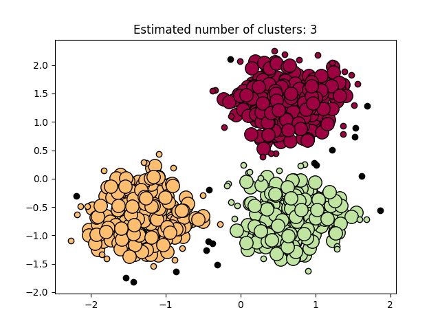

.. centered:: |dbscan_results|

.. rubric:: الأمثلة

* :ref:`sphx_glr_auto_examples_cluster_plot_dbscan.py`

.. dropdown:: التنفيذ

خوارزمية DBSCAN حتمية، وتولد دائمًا نفس التجمعات عندما يتم إعطاؤها نفس البيانات بنفس الترتيب. ومع ذلك، قد تختلف النتائج عندما يتم تقديم البيانات بترتيب مختلف. أولاً، على الرغم من أن العينات الأساسية ستُعين دائمًا في نفس التجمعات، إلا أن تسميات تلك التجمعات ستعتمد على الترتيب الذي يتم فيه العثور على تلك العينات في البيانات. ثانيًا والأهم من ذلك، أن التجمعات التي يتم تعيين العينات غير الأساسية لها قد تختلف اعتمادًا على ترتيب البيانات. وهذا يحدث عندما تكون المسافة بين عينة غير أساسية وعينتين أساسيتين في تجمعين مختلفين أقل من ``eps``. وبحسب عدم المساواة المثلثية، يجب أن تكون هاتان العينتان الأساسيتان متباعدتين بمسافة أكبر من ``eps``، أو ستكونان في نفس التجمع. ويتم تعيين العينة غير الأساسية إلى التجمع الذي يتم إنشاؤه أولاً في تمرير عبر البيانات، وبالتالي ستعتمد النتائج على ترتيب البيانات.

يستخدم التنفيذ الحالي أشجار الكرة والأشجار kd لتحديد جوار النقاط، مما يتجنب حساب مصفوفة المسافة الكاملة (كما كان يتم في إصدارات scikit-learn السابقة للإصدار 0.14). ويتم الاحتفاظ بإمكانية استخدام المقاييس المخصصة؛ للتفاصيل، راجع :class:`NearestNeighbors`.

.. dropdown:: استهلاك الذاكرة لأحجام العينات الكبيرة

هذا التنفيذ غير فعال في استخدام الذاكرة بشكل افتراضي لأنه يقوم ببناء مصفوفة تشابه ثنائية كاملة في حالة عدم إمكانية استخدام الأشجار kd أو أشجار الكرة (على سبيل المثال، مع المصفوفات المتناثرة). وستستهلك هذه المصفوفة :math:`n^2` من الفاصلات العائمة. وهناك آليتان للالتفاف حول هذا الأمر:

- استخدام تجميع :ref:`OPTICS <optics>` بالاقتران مع طريقة ``extract_dbscan``. يحسب تجميع OPTICS أيضًا مصفوفة ثنائية كاملة، ولكنه يحتفظ بصف واحد فقط في الذاكرة في كل مرة (تعقيد الذاكرة n).

- يمكن حساب مخطط الجوار الإشعاعي المتناثر مسبقًا بطريقة فعالة من حيث الذاكرة، ويمكن تشغيل DBSCAN فوق هذا المخطط باستخدام ``metric='precomputed'``. راجع :meth:`sklearn.neighbors.NearestNeighbors.radius_neighbors_graph`.

- يمكن ضغط مجموعة البيانات، إما عن طريق إزالة المكررات الدقيقة إذا كانت موجودة في بياناتك، أو عن طريق استخدام BIRCH. بعد ذلك، سيكون لديك عدد صغير نسبيًا من الممثلين لعدد كبير من النقاط. يمكنك بعد ذلك توفير ``sample_weight`` عند ملاءمة DBSCAN.

.. dropdown:: المراجع

* `A Density-Based Algorithm for Discovering Clusters in Large Spatial
  Databases with Noise <https://www.aaai.org/Papers/KDD/1996/KDD96-037.pdf>`_
  Ester, M., H. P. Kriegel, J. Sander, and X. Xu, In Proceedings of the 2nd
  International Conference on Knowledge Discovery and Data Mining, Portland, OR,
  AAAI Press, pp. 226-231. 1996

* :doi:`DBSCAN revisited, revisited: why and how you should (still) use DBSCAN.
  <10.1145/3068335>` Schubert, E., Sander, J., Ester, M., Kriegel, H. P., & Xu,
  X. (2017). In ACM Transactions on Database Systems (TODS), 42(3), 19.

.. _hdbscan:

HDBSCAN
=======

يمكن اعتبار خوارزم :class:`HDBSCAN` امتدادًا لخوارزم :class:`DBSCAN` و :class:`OPTICS`. وعلى وجه التحديد، يفترض :class:`DBSCAN` أن معيار التجميع (أي متطلبات الكثافة) *متجانس عالميًا*. وبعبارة أخرى، قد يجد :class:`DBSCAN` صعوبة في التقاط التجمعات ذات الكثافات المختلفة بنجاح. ويخفف :class:`HDBSCAN` من هذا الافتراض ويستكشف جميع مقاييس الكثافة الممكنة عن طريق بناء تمثيل بديل لمشكلة التجميع.

.. note::

  تم تكييف هذا التنفيذ من التنفيذ الأصلي لخوارزمية HDBSCAN، `scikit-learn-contrib/hdbscan <https://github.com/scikit-learn-contrib/hdbscan>`_ استنادًا إلى [LJ2017]_.

.. rubric:: الأمثلة

* :ref:`sphx_glr_auto_examples_cluster_plot_hdbscan.py`

مخطط إمكانية الوصول المتبادل
-------------------------

يحدد HDBSCAN أولاً :math:`d_c(x_p)`، *المسافة الأساسية* لعينة :math:`x_p`، على أنها المسافة إلى أقرب جار ``min_samples`` لها، بما في ذلك نفسها. على سبيل المثال، إذا كان ``min_samples=5`` وكانت :math:`x_*` هي أقرب جار خامس لـ :math:`x_p`، فإن المسافة الأساسية هي:

.. math:: d_c(x_p)=d(x_p, x_*).

بعد ذلك، يحدد :math:`d_m(x_p, x_q)`، *المسافة القابلة للوصول المتبادلة* لنقطتين :math:`x_p, x_q`، على النحو التالي:

.. math:: d_m(x_p, x_q) = \max\{d_c(x_p), d_c(x_q), d(x_p, x_q)\}

يسمح لنا هذان المفهومان ببناء *مخطط إمكانية الوصول المتبادل* :math:`G_{ms}` المحدد لاختيار ثابت من ``min_samples`` عن طريق ربط كل عينة :math:`x_p` مع رأس من المخطط، وبالتالي تكون الحواف بين النقطتين :math:`x_p, x_q` هي المسافة القابلة للوصول المتبادل :math:`d_m(x_p, x_q)` بينهما. ويمكننا بناء مجموعات فرعية من هذا المخطط، والتي يُشار إليها بالرمز :math:`G_{ms,\varepsilon}`، عن طريق إزالة أي حواف ذات قيمة أكبر من :math:`\varepsilon`: من المخطط الأصلي. يتم في هذه المرحلة وضع علامة على أي نقاط تكون مسافتها الأساسية أقل من :math:`\varepsilon`: على أنها ضوضاء. بعد ذلك، يتم تجميع النقاط المتبقية عن طريق إيجاد المكونات المتصلة لهذا المخطط المُقَلَّم.

.. note::

  إن إيجاد المكونات المتصلة لمخطط مُقَلَّم :math:`G_{ms,\varepsilon}` يعادل تشغيل DBSCAN* مع ``min_samples`` و :math:`\varepsilon`. DBSCAN* هو نسخة معدلة قليلاً من DBSCAN مذكورة في [CM2013]_.

التجميع الهرمي
-----------------------
يمكن اعتبار HDBSCAN خوارزمية تقوم بتنفيذ التجميع DBSCAN* عبر جميع القيم :math:`\varepsilon`. وكما ذُكر سابقًا، فإن هذا يعادل إيجاد المكونات المتصلة لمخططات إمكانية الوصول المتبادل لجميع قيم :math:`\varepsilon`. وللقيام بذلك بكفاءة، يستخرج HDBSCAN أولاً شجرة تغطية دنيا (MST) من مخطط إمكانية الوصول المتبادل المتصل بالكامل، ثم يقطع حواف الشجرة ذات الأوزان الأعلى بشكل جشع. وفيما يلي مخطط عام لخوارزمية HDBSCAN:

1. استخراج شجرة تغطية دنيا (MST) من :math:`G_{ms}`.
2. توسيع شجرة التغطية الدنيا عن طريق إضافة "حافة ذاتية" لكل رأس، مع وزن يساوي المسافة الأساسية للعينة الأساسية.
3. قم بتطبيق تسمية تجمع واحدة على شجرة التغطية الدنيا.
4. إزالة الحافة ذات الوزن الأكبر من شجرة التغطية الدنيا (يتم إزالة التعادل في نفس الوقت).
5. قم بتعيين تسميات التجمعات للمكونات المتصلة التي تحتوي على نقاط نهاية الحافة التي تمت إزالتها الآن. إذا لم يكن للمكون أي حواف على الأقل، يتم بدلاً من ذلك تعيين تسمية "null" له لوضع علامة عليه على أنه ضوضاء.
6. كرر الخطوتين 4 و5 حتى لا تكون هناك مكونات متصلة متبقية.

وبالتالي، فإن HDBSCAN قادر على الحصول على جميع التقسيمات الممكنة التي يمكن تحقيقها بواسطة DBSCAN* لقيمة ثابتة من ``min_samples`` بطريقة هرمية. وهذا يسمح لـ HDBSCAN بإجراء التجميع عبر كثافات متعددة، وبالتالي لم يعد بحاجة إلى إعطاء :math:`\varepsilon` كمعيار. وبدلاً من ذلك، فإنه يعتمد فقط على اختيار ``min_samples``، والذي يميل إلى أن يكون معيارًا أكثر متانة.

.. |hdbscan_ground_truth| image:: ../auto_examples/cluster/images/sphx_glr_plot_hdbscan_005.png
    :target: ../auto_examples/cluster/plot_hdbscan.html
    :scale: 75
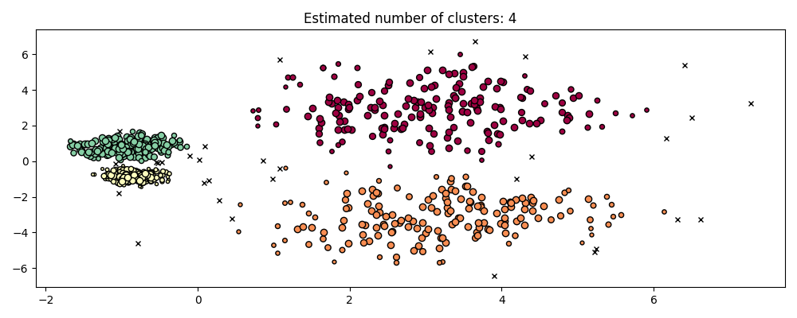
    :target, ../auto_examples/cluster/plot_hdbscan.html
    :scale: 75

.. centered:: |hdbscan_ground_truth|
.. centered:: |hdbscan_results|

يمكن تحسين HDBSCAN بمعيار إضافي هو `min_cluster_size` الذي يحدد أنه أثناء التجميع الهرمي، يتم اعتبار المكونات التي تحتوي على عدد من العينات أقل من ``minimum_cluster_size`` على أنها ضوضاء. وفي الممارسة العملية، يمكن تعيين ``minimum_cluster_size = min_samples`` لربط المعيارين وتبسيط مساحة المعايير.

.. rubric:: المراجع

.. [CM2013] Campello, R.J.G.B., Moulavi, D., Sander, J. (2013). Density-Based
  Clustering Based on Hierarchical Density Estimates. In: Pei, J., Tseng, V.S.,
  Cao, L., Motoda, H., Xu, G. (eds) Advances in Knowledge Discovery and Data
  Mining. PAKDD 2013. Lecture Notes in Computer Science(), vol 7819. Springer,
  Berlin, Heidelberg. :doi:`Density-Based Clustering Based on Hierarchical
  Density Estimates <10.1007/978-3-642-37456-2_14>`

.. [LJ2017] L. McInnes and J. Healy, (2017). Accelerated Hierarchical Density
  Based Clustering. In: IEEE International Conference on Data Mining Workshops
  (ICDMW), 2017, pp. 33-42. :doi:`Accelerated Hierarchical Density Based
  Clustering <10.1109/ICDMW.2017.12>`

.. _optics:

OPTICS
ترجمة النص المنسق بتنسيق RST إلى اللغة العربية:

خوارزمية OPTICS :class:`OPTICS` تشترك في العديد من أوجه التشابه مع خوارزمية :class:`DBSCAN`، ويمكن اعتبارها تعميما لخوارزمية DBSCAN التي تُرخي متطلب "إبسيلون - epsilon" من قيمة واحدة إلى نطاق من القيم. والفرق الرئيسي بين DBSCAN وOPTICS هو أن خوارزمية OPTICS تبني مخطط "الوصول - reachability" reachability، والذي يعيّن لكل عينة مسافة "الوصول - reachability" وقيمة ضمن خاصية "ترتيب - ordering" للعنقود؛ ويتم تعيين هاتين الخاصيتين عندما يتم ضبط النموذج، ويتم استخدامهما لتحديد عضوية العنقود. إذا تم تشغيل خوارزمية OPTICS بالقيمة الافتراضية "غير المنتهية - infinity" المحددة لبارامتر "ماكس إبسيلون - max_eps"، فيمكن حينها إجراء استخراج العنقود على طريقة DBSCAN بشكل متكرر في زمن خطي لأي قيمة "إبسيلون - epsilon" باستخدام طريقة "كلستر أوبتكس دي بي سكان - cluster_optics_dbscan". ويؤدي تعيين "ماكس إبسيلون - max_eps" إلى قيمة أقل إلى الحصول على أزمنة تشغيل أقصر، ويمكن اعتبارها نصف القطر الأقصى للجوار من كل نقطة للعثور على نقاط أخرى يمكن الوصول إليها.

تسمح مسافات "الوصول - reachability" التي تولدها خوارزمية OPTICS باستخراج العنقود متغير الكثافة ضمن مجموعة بيانات واحدة. وكما هو موضح في المخطط أعلاه، فإن الجمع بين مسافات "الوصول - reachability" وترتيب مجموعة البيانات ينتج مخطط "الوصول - reachability"، حيث يمثل المحور Y كثافة النقاط، ويتم ترتيب النقاط بحيث تكون النقاط القريبة متجاورة. وتنتج عملية "قطع" مخطط "الوصول - reachability" عند قيمة واحدة نتائج مشابهة لخوارزمية DBSCAN؛ حيث يتم تصنيف جميع النقاط أعلى "القطع - cut" كضجيج، وكل مرة يكون فيها انقطاع عند القراءة من اليسار إلى اليمين تشير إلى عنقود جديد. وتنظر عملية استخراج العنقود الافتراضية في خوارزمية OPTICS إلى المنحدرات الحادة داخل المخطط للعثور على العناقيد، ويمكن للمستخدم تحديد ما يعتبر منحدرًا حادًا باستخدام بارامتر "كسي - xi". وهناك أيضًا إمكانيات أخرى للتحليل على المخطط نفسه، مثل إنشاء تمثيلات هرمية للبيانات من خلال مخططات "الوصول - reachability" الشجرية، ويمكن الوصول إلى تسلسل العناقيد الذي تكشفه الخوارزمية من خلال بارامتر "كلستر هايراركي - cluster_hierarchy". وقد تم تلوين المخطط أعلاه برموز لونية بحيث تتطابق ألوان العنقود في الفضاء ثنائي الأبعاد مع عناقيد المقاطع الخطية في مخطط "الوصول - reachability". لاحظ أن العنقودين الأزرق والأحمر متجاورين في مخطط "الوصول - reachability"، ويمكن تمثيلهما هرميًا كأطفال لعنقود أبوي أكبر.

الأمثلة:

* :ref:`sphx_glr_auto_examples_cluster_plot_optics.py`

المقارنة مع DBSCAN:

النتائج من طريقة "كلستر أوبتكس دي بي سكان - cluster_optics_dbscan" في خوارزمية OPTICS وخوارزمية DBSCAN متشابهة جدًا، ولكنها ليست متطابقة دائمًا؛ وتحديدًا، في تسمية نقاط المحيط والضجيج. ويرجع ذلك جزئيًا إلى أن أولى العينات من كل منطقة كثيفة تتم معالجتها بواسطة خوارزمية OPTICS يكون لها قيمة "وصول - reachability" كبيرة بينما تكون قريبة من نقاط أخرى في منطقتها، وبالتالي يتم تصنيفها في بعض الأحيان كضجيج بدلاً من نقاط محيطية. ويؤثر ذلك على النقاط المجاورة عندما يتم اعتبارها مرشحة ليتم تصنيفها كنقاط محيطية أو ضجيج.

لاحظ أنه بالنسبة لأي قيمة واحدة من "إبسيلون - epsilon"، فإن خوارزمية DBSCAN تميل إلى أن يكون لها زمن تشغيل أقصر من خوارزمية OPTICS؛ ومع ذلك، بالنسبة للتشغيلات المتكررة عند قيم "إبسيلون - epsilon" المتغيرة، فقد يتطلب تشغيل واحد من خوارزمية OPTICS وقت تشغيل تراكمي أقل من خوارزمية DBSCAN. ومن المهم أيضًا ملاحظة أن إخراج خوارزمية OPTICS يكون قريبًا من خوارزمية DBSCAN فقط إذا كانت قيمتا "إبسيلون - epsilon" و"ماكس إبسيلون - max_eps" قريبتين.

التعقيد الحسابي:

تُستخدم أشجار الفهرسة المكانية لتجنب حساب مصفوفة المسافة الكاملة، والسماح باستخدام الذاكرة بكفاءة على مجموعات كبيرة من العينات. ويمكن توفير مقاييس المسافة المختلفة عبر كلمة "متريك - metric".

بالنسبة لمجموعات البيانات الكبيرة، يمكن الحصول على نتائج مماثلة (ولكنها ليست متطابقة) عبر :class:`HDBSCAN`. ويتم تنفيذ خوارزمية HDBSCAN على عدة خيوط، ولديها تعقيد زمني أفضل من خوارزمية OPTICS، على حساب أسوأ في مقياس الذاكرة. وبالنسبة لمجموعات البيانات الكبيرة للغاية التي تستنفد ذاكرة النظام باستخدام خوارزمية HDBSCAN، فإن خوارزمية OPTICS ستحافظ على مقياس ذاكرة :math:`n` (على عكس :math:`n^2`)؛ ومع ذلك، فمن المحتمل أن تكون هناك حاجة لضبط بارامتر "ماكس إبسيلون - max_eps" لتقديم حل في وقت معقول.

المرجع:

* "OPTICS: ordering points to identify the clustering structure." Ankerst, Mihael, Markus M. Breunig, Hans-Peter Kriegel, and Jörg Sander. In ACM Sigmod Record, vol. 28, no. 2, pp. 49-60. ACM, 1999.

BIRCH:

تبني خوارزمية :class:`Birch` شجرة تسمى شجرة ميزات التجميع Clustering Feature Tree (CFT) للبيانات المعطاة. ويتم بشكل أساسي ضغط البيانات إلى مجموعة من عقد ميزات التجميع Clustering Feature nodes (CF Nodes). ولعقد CF عدد من العناقيد الفرعية تسمى عناقيد ميزات التجميع الفرعية Clustering Feature subclusters (CF Subclusters)، ويمكن أن يكون لعناقيد CF الفرعية هذه الموجودة في عقد CF غير الطرفية عقد CF كأطفال.

تحتفظ عناقيد CF الفرعية بالمعلومات الضرورية للتجميع والتي تمنع الحاجة إلى الاحتفاظ بمجموعة البيانات الكاملة في الذاكرة. وتشمل هذه المعلومات:

- عدد العينات في العناقيد الفرعية.
- المجموع الخطي - وهو متجه متعدد الأبعاد يحمل مجموع جميع العينات.
- مجموع المربعات - مجموع القيم مربعة للمعيار L2 لجميع العينات.
- المركز - لتجنب إعادة حساب المجموع الخطري / عدد العينات.
- القيمة مربعة للمعيار لمراكز العناقيد الفرعية.

لدى خوارزمية BIRCH معاملان، العتبة وعامل التفرع. ويحد عامل التفرع من عدد العناقيد الفرعية في العقدة، وتحد العتبة من المسافة بين العينة الداخلة والعناقيد الفرعية الموجودة.

يمكن اعتبار هذه الخوارزمية مثالاً على طريقة تقليل البيانات، حيث تقلل البيانات المدخلة إلى مجموعة من العناقيد الفرعية التي يتم الحصول عليها مباشرة من أوراق شجرة CFT. ويمكن معالجة هذه البيانات المخفضة بشكل أكبر من خلال تغذيتها في مجمع عناقيد عالمي. ويمكن تعيين هذا المجمع العنقودي العالمي بواسطة "إن كلسترز - n_clusters". إذا تم تعيين "إن كلسترز - n_clusters" إلى None، فسيتم قراءة العناقيد الفرعية من الأوراق مباشرة، وإلا فإن خطوة التجميع العنقودي العالمي تقوم بتسمية هذه العناقيد الفرعية إلى عناقيد عالمية (تسميات)، ويتم تعيين العينات إلى التسمية العالمية لأقرب عنقود فرعي.

وصف الخوارزمية:

- يتم إدخال عينة جديدة في جذر شجرة CF والتي هي عقدة CF. ثم يتم دمجها مع العناقيد الفرعية لجذر الشجرة، والتي يكون لها أصغر نصف قطر بعد الدمج، مع مراعاة شروط العتبة وعامل التفرع. إذا كان للعنقود الفرعي أي عقدة طفل، فيتم تكرار ذلك حتى يصل إلى ورقة. بعد العثور على أقرب عنقود فرعي في الورقة، يتم تحديث خصائص هذا العنقود الفرعي والعنقود الفرعي الأبوي بشكل متكرر.

- إذا كان نصف قطر العنقود الفرعي الناتج عن دمج العينة الجديدة وأقرب عنقود فرعي أكبر من مربع العتبة وإذا كان عدد العناقيد الفرعية أكبر من عامل التفرع، فيتم تخصيص مساحة مؤقتة لهذه العينة الجديدة. ويتم أخذ أبعد عنقودين فرعيين وتقسيم العناقيد الفرعية إلى مجموعتين على أساس المسافة بين هاتين العنقودين الفرعيين.

- إذا كانت لعقدة الانقسام الفرعي هذه عنقود فرعي أبوي وكان هناك مجال لعنقود فرعي جديد، فيتم تقسيم الأب إلى اثنين. إذا لم يكن هناك مجال، فيتم تقسيم هذه العقدة مرة أخرى إلى اثنين وتستمر العملية بشكل متكرر حتى تصل إلى الجذر.

BIRCH أو MiniBatchKMeans:

- لا تتوسع خوارزمية BIRCH جيدًا إلى البيانات عالية الأبعاد. وكقاعدة عامة، إذا كان "إن فيجاز - n_features" أكبر من عشرين، فمن الأفضل عمومًا استخدام MiniBatchKMeans.
- إذا كان عدد مثيلات البيانات بحاجة إلى التخفيض، أو إذا كان المرء يريد عددًا كبيرًا من العناقيد الفرعية كخطوة ما قبل المعالجة أو خلاف ذلك، فإن خوارزمية BIRCH أكثر فائدة من MiniBatchKMeans.

كيفية استخدام "بارشال فيت - partial_fit":

لتجنب حساب التجميع العالمي، يُنصح المستخدم بما يلي لكل مكالمة من "بارشال فيت - partial_fit":

1. قم بتعيين "إن كلسترز - n_clusters" إلى None في البداية.
2. قم بتدريب جميع البيانات من خلال عدة مكالمات إلى "بارشال فيت - partial_fit".
3. قم بتعيين "إن كلسترز - n_clusters" إلى قيمة مطلوبة باستخدام "برك.سيت بارامز(إن كلسترز=إن كلسترز)".
4. قم أخيرًا بمكالمة "بارشال فيت - partial_fit" بدون وسائط، أي "برك.بارشال فيت()" والتي تقوم بالتجميع العنقودي العالمي.

المراجع:

* Tian Zhang, Raghu Ramakrishnan, Maron Livny BIRCH: An efficient data clustering method for large databases. https://www.cs.sfu.ca/CourseCentral/459/han/papers/zhang96.pdf

* Roberto Perdisci JBirch - Java implementation of BIRCH clustering algorithm https://code.google.com/archive/p/jbirch

تقييم أداء التجميع:
تقييم أداء خوارزمية التجميع ليس بسيطًا مثل عد الأخطاء أو الدقة والاستدعاء لخوارزمية تصنيف إشرافية. على وجه الخصوص، يجب ألا يأخذ أي مقياس تقييم القيم المطلقة لعلامات التجميع في الاعتبار، ولكن بدلاً من ذلك، ما إذا كان هذا التجميع يحدد عمليات فصل البيانات المشابهة لبعض مجموعات الفئات الأساسية أو التي تفي ببعض الافتراضات بحيث يكون الأعضاء الذين ينتمون إلى نفس الفئة أكثر تشابهاً من أعضاء الفئات المختلفة وفقًا لبعض مقاييس التشابه.

**مؤشر راند**

نظرًا لمعرفة تعيينات الفئات الأساسية "labels_true" وتعيينات خوارزمية التجميع الخاصة بنا لنفس العينات "labels_pred"، فإن مؤشر راند (المعدل أو غير المعدل) هو دالة تقيس تشابه التعيينين، مع تجاهل التباديل::

  >>> from sklearn import metrics
  >>> labels_true = [0, 0, 0, 1, 1, 1]
  >>> labels_pred = [0, 0, 1, 1, 2, 2]
  >>> metrics.rand_score(labels_true, labels_pred)
  0.66...

لا يضمن مؤشر راند الحصول على قيمة قريبة من 0.0 لعملية تسمية عشوائية. ويصحح مؤشر راند المعدل هذا الاحتمال ويعطي خط الأساس هذا.

  >>> metrics.adjusted_rand_score(labels_true, labels_pred)
  0.24...

كما هو الحال مع جميع مقاييس التجميع، يمكنك تبديل 0 و1 في التسميات المتوقعة، وإعادة تسمية 2 إلى 3، والحصول على نفس النتيجة::

  >>> labels_pred = [1, 1, 0, 0, 3, 3]
  >>> metrics.rand_score(labels_true, labels_pred)
  0.66...
  >>> metrics.adjusted_rand_score(labels_true, labels_pred)
  0.24...

علاوة على ذلك، كل من rand_score و adjusted_rand_score **متناظران**: لا يؤدي تبديل الحجة إلى تغيير النتائج. وبالتالي يمكن استخدامها كإجراءات **توافقية**::

  >>> metrics.rand_score(labels_pred, labels_true)
  0.66...
  >>> metrics.adjusted_rand_score(labels_pred, labels_true)
  0.24...

يتم تسجيل التسمية المثالية على أنها 1.0::

  >>> labels_pred = labels_true[:]
  >>> metrics.rand_score(labels_true, labels_pred)
  1.0
  >>> metrics.adjusted_rand_score(labels_true, labels_pred)
  1.0

يكون للعلامات التي تتفق بشكل ضعيف (على سبيل المثال، التسميات المستقلة) درجات أقل، وبالنسبة لمؤشر راند المعدل، ستكون النتيجة سلبية أو قريبة من الصفر. ومع ذلك، بالنسبة لمؤشر راند غير المعدل، ستكون النتيجة أقل، ولكنها لن تكون بالضرورة قريبة من الصفر.::

  >>> labels_true = [0, 0, 0, 0, 0, 0, 1, 1]
  >>> labels_pred = [0, 1, 2, 3, 4, 5, 5, 6]
  >>> metrics.rand_score(labels_true, labels_pred)
  0.39...
  >>> metrics.adjusted_rand_score(labels_true, labels_pred)
  -0.07...

**المزايا:**

- **قابلية التفسير**: يتناسب مؤشر راند غير المعدل مع عدد أزواج العينات التي تحمل نفس التسميات في كل من "labels_pred" و"labels_true"، أو تكون مختلفة في كليهما.

- **يحصل تعيين التسميات العشوائية (الموحدة) على مؤشر راند معدل قريب من 0.0** لأي قيمة من "n_clusters" و"n_samples" (وهو ما لا يحدث مع مؤشر راند غير المعدل أو مقياس V، على سبيل المثال).

- **النطاق المحدد**: تشير القيم المنخفضة إلى التسميات المختلفة، وتشير مؤشرات التجميع المتشابهة إلى مؤشر راند مرتفع (معدل أو غير معدل)، و1.0 هو نتيجة التطابق المثالي. ويتراوح النطاق من [0، 1] لمؤشر راند غير المعدل ومن [-0.5، 1] لمؤشر راند المعدل.

- **لا يتم إجراء أي افتراض حول بنية التجميع**: يمكن استخدام مؤشر راند (المعدل أو غير المعدل) لمقارنة جميع أنواع خوارزميات التجميع، ويمكن استخدامه لمقارنة خوارزميات التجميع مثل k-means التي تفترض أشكال كتل متساوية الخواص مع نتائج خوارزميات التجميع الطيفي التي يمكنها العثور على مجموعات ذات أشكال "مطوية".

**العيوب:**

- على عكس القصور الذاتي، يتطلب مؤشر راند (المعدل أو غير المعدل) **معرفة الفئات الأساسية** التي نادرًا ما تكون متاحة في الممارسة العملية أو تتطلب تعيينًا يدويًا بواسطة معلّمي البيانات (كما هو الحال في إعداد التعلم الخاضع للإشراف).

  ومع ذلك، يمكن أيضًا استخدام مؤشر راند (المعدل أو غير المعدل) ككتلة بناء في إعداد غير خاضع للإشراف لمؤشر توافقي يمكن استخدامه لاختيار نموذج التجميع (TODO).

- **يكون مؤشر راند غير المعدل قريبًا من 1.0** حتى إذا اختلفت التجميعات نفسها بشكل كبير. ويمكن فهم ذلك عند تفسير مؤشر راند على أنه دقة تسمية أزواج العناصر الناتجة عن التجميعات: في الممارسة العملية، غالبًا ما تكون هناك أغلبية من أزواج العناصر التي يتم تعيينها لعلامة "مختلفة" في كل من التجميع المتوقع والتجميع الأساسي، مما يؤدي إلى نسبة عالية من علامات الأزواج المتفقة، والتي تؤدي بعد ذلك إلى نتيجة عالية.

**أمثلة:**

* :ref:`sphx_glr_auto_examples_cluster_plot_adjusted_for_chance_measures.py`: تحليل تأثير حجم مجموعة البيانات على قيمة مقاييس التجميع للتعيينات العشوائية.

**الصيغة الرياضية:**

إذا كانت C هي تعيين فئة أساسية وK هي التجميع، دعنا نحدد a وb كما يلي:

- a، عدد أزواج العناصر الموجودة في نفس المجموعة في C وفي نفس المجموعة في K

- b، عدد أزواج العناصر الموجودة في مجموعات مختلفة في C وفي مجموعات مختلفة في K

يعطى مؤشر راند غير المعدل بعد ذلك بما يلي:

.. math:: \text{RI} = \frac{a + b}{C_2^{n_{samples}}}

حيث :math:`C_2^{n_{samples}}` هو العدد الإجمالي لأزواج العناصر الممكنة في مجموعة البيانات. لا يهم إذا تم إجراء الحساب على أزواج مرتبة أو غير مرتبة طالما تم إجراء الحساب بشكل متسق.

ومع ذلك، لا يضمن مؤشر راند أن التعيينات العشوائية للتسميات ستحصل على قيمة قريبة من الصفر (خاصة إذا كان عدد التجميعات بنفس ترتيب الحجم مثل عدد العينات).

للتخفيف من هذا التأثير، يمكننا خصم القيمة المتوقعة لـ RI :math:`E[\text{RI}]` لتعيينات التسميات العشوائية من خلال تعريف مؤشر راند المعدل كما يلي:

.. math:: \text{ARI} = \frac{\text{RI} - E[\text{RI}]}{\max(\text{RI}) - E[\text{RI}]}

**المراجع:**

* `مقارنة التقسيمات <https://link.springer.com/article/10.1007%2FBF01908075>`_ L. Hubert and P.
  Arabie، مجلة التصنيف 1985

* `خصائص مؤشر راند المعدل لهبرت-أرابيا
  <https://psycnet.apa.org/record/2004-17801-007>`_ D. Steinley، الأساليب النفسية 2004

* `صفحة ويكيبيديا لمؤشر راند
  <https://en.wikipedia.org/wiki/Rand_index#Adjusted_Rand_index>`_

* :doi:`مؤشر راند المعدل الأدنى لتجميعين بحجم معين، 2022، J. E. Chacón and A. I. Rastrojo <10.1007/s11634-022-00491-w>`

**الدرجات المستندة إلى معلومات متبادلة**
فيما يلي ترجمة لنص RST باللغة العربية مع اتباع التعليمات المذكورة: 

نظرًا لمعرفة تعيينات فئة الحقيقة الأرضية ``labels_true`` وتعيينات خوارزمية التجميع الخاصة بنا لنفس العينات ``labels_pred``، فإن **معلومات التبادل** هي دالة تقيس **الاتفاق** بين التعيينين، مع تجاهل التباديل. هناك نسختان معيّرتان مختلفتان من هذا المقياس، **معلومات التبادل المطبعي (NMI)** و **معلومات التبادل المعدلة (AMI)**. غالبًا ما يتم استخدام NMI في الأدبيات، بينما تم اقتراح AMI مؤخرًا وهو **معياري ضد الصدفة**:

  >>> from sklearn import metrics
  >>> labels_true = [0, 0, 0, 1, 1, 1]
  >>> labels_pred = [0, 0, 1, 1, 2, 2]

  >>> metrics.adjusted_mutual_info_score(labels_true, labels_pred)  # doctest: +SKIP
  0.22504...

يمكنك تبديل 0 و 1 في التسميات المتوقعة، وإعادة تسمية 2 إلى 3 والحصول على نفس النتيجة::

  >>> labels_pred = [1, 1, 0, 0, 3, 3]
  >>> metrics.adjusted_mutual_info_score(labels_true, labels_pred)  # doctest: +SKIP
  0.22504...

جميع الدوال :func:`mutual_info_score`، و :func:`adjusted_mutual_info_score`، و :func:`normalized_mutual_info_score` متماثلة: لا يؤدي تبديل الحجة إلى تغيير النتيجة. وبالتالي، يمكن استخدامها كـ **إجراء توافقي**::

  >>> metrics.adjusted_mutual_info_score(labels_pred, labels_true)  # doctest: +SKIP
  0.22504...

يتم تسجيل التسمية المثالية على أنها 1.0::

  >>> labels_pred = labels_true[:]
  >>> metrics.adjusted_mutual_info_score(labels_true, labels_pred)  # doctest: +SKIP
  1.0

  >>> metrics.normalized_mutual_info_score(labels_true, labels_pred)  # doctest: +SKIP
  1.0

هذا لا ينطبق على ``mutual_info_score``، مما يجعل الحكم عليه أكثر صعوبة::

  >>> metrics.mutual_info_score(labels_true, labels_pred)  # doctest: +SKIP
  0.69...

تكون التسميات السيئة (على سبيل المثال، التسميات المستقلة) ذات درجات غير موجبة::

  >>> labels_true = [0, 1, 2, 0, 3, 4, 5, 1]
  >>> labels_pred = [1, 1, 0, 0, 2, 2, 2, 2]
  >>> metrics.adjusted_mutual_info_score(labels_true, labels_pred)  # doctest: +SKIP
  -0.10526...

.. topic:: المزايا:

  - **تعيينات التسميات العشوائية (الموحدة) لها نتيجة AMI قريبة من 0.0** لأي
    قيمة من ``n_clusters`` و ``n_samples`` (وهو ما لا يحدث في حالة معلومات التبادل الخام أو مقياس V على سبيل المثال).

  - **الحد الأعلى 1**: تشير القيم القريبة من الصفر إلى أن تعييني التسمية مستقلان إلى حد كبير، في حين تشير القيم القريبة من واحد إلى وجود اتفاق كبير. علاوة على ذلك، تشير AMI التي تساوي 1 بالضبط إلى أن تعييني التسمية متساويان (مع أو بدون تبديل).

.. topic:: العيوب:

  - على عكس القصور الذاتي، **تتطلب المقاييس المستندة إلى معلومات التبادل معرفة** بفئات الحقيقة الأرضية في حين أنها غير متوفرة عمليًا أو تتطلب تعيينًا يدويًا بواسطة الملاحظين البشريين (كما هو الحال في إعداد التعلم الخاضع للإشراف).

    ومع ذلك، يمكن أيضًا أن تكون المقاييس المستندة إلى معلومات التبادل مفيدة في الإعداد غير الخاضع للإشراف ككتلة بناء لمؤشر توافقي يمكن استخدامه لاختيار نموذج التجميع.

  - NMI و MI غير معدلين ضد الصدفة.

.. rubric:: أمثلة

* :ref:`sphx_glr_auto_examples_cluster_plot_adjusted_for_chance_measures.py`: تحليل
  تأثير حجم مجموعة البيانات على قيمة مقاييس التجميع لتعيينات عشوائية. يتضمن هذا المثال أيضًا مؤشر Rand المعدل.

.. dropdown:: الصيغة الرياضية

  لنفترض تعييني تسمية (لنفس الأشياء N)، :math:`U` و :math:`V`. إن إنتروبيا الخاصة بهما هي مقدار عدم اليقين لمجموعة التقسيم، والتي يتم تحديدها على النحو التالي:

  .. math:: H(U) = - \sum_{i=1}^{|U|}P(i)\log(P(i))

  حيث :math:`P(i) = |U_i| / N` هو احتمال أن يقع كائن تم اختياره عشوائيًا من :math:`U` في الفئة :math:`U_i`. وبالمثل بالنسبة لـ :math:`V`:

  .. math:: H(V) = - \sum_{j=1}^{|V|}P'(j)\log(P'(j))

  مع :math:`P'(j) = |V_j| / N`. يتم حساب معلومات التبادل (MI) بين :math:`U`
  و :math:`V` على النحو التالي:

  .. math:: \text{MI}(U, V) = \sum_{i=1}^{|U|}\sum_{j=1}^{|V|}P(i, j)\log\left(\frac{P(i,j)}{P(i)P'(j)}\right)

  حيث :math:`P(i, j) = |U_i \cap V_j| / N` هو احتمال أن يقع كائن
  تم اختياره عشوائيًا في كل من الفئتين :math:`U_i` و :math:`V_j`.

  ويمكن التعبير عنه أيضًا بصيغة عدد عناصر المجموعة:

  .. math:: \text{MI}(U, V) = \sum_{i=1}^{|U|} \sum_{j=1}^{|V|} \frac{|U_i \cap V_j|}{N}\log\left(\frac{N|U_i \cap V_j|}{|U_i||V_j|}\right)

  يتم تعريف معلومات التبادل المطبعي على النحو التالي:

  .. math:: \text{NMI}(U, V) = \frac{\text{MI}(U, V)}{\text{mean}(H(U), H(V))}

  هذه القيمة من معلومات التبادل والمتغير المطبعي أيضًا غير معدلة للصدفة، ومن المحتمل أن تزيد مع زيادة عدد التسميات المختلفة
  (التجمعات)، بغض النظر عن الكمية الفعلية "معلومات التبادل" بين تعيينات التسمية.

  يمكن حساب القيمة المتوقعة لمعلومات التبادل باستخدام المعادلة التالية [VEB2009]_. في هذه المعادلة، :math:`a_i = |U_i|` (عدد
  العناصر في :math:`U_i`) و :math:`b_j = |V_j|` (عدد العناصر في
  :math:`V_j`).

  .. math:: E[\text{MI}(U,V)]=\sum_{i=1}^{|U|} \sum_{j=1}^{|V|} \sum_{n_{ij}=(a_i+b_j-N)^+
    }^{\min(a_i, b_j)} \frac{n_{ij}}{N}\log \left( \frac{ N.n_{ij}}{a_i b_j}\right)
    \frac{a_i!b_j!(N-a_i)!(N-b_j)!}{N!n_{ij}!(a_i-n_{ij})!(b_j-n_{ij})!
    (N-a_i-b_j+n_{ij})!}

  باستخدام القيمة المتوقعة، يمكن بعد ذلك حساب معلومات التبادل المعدلة باستخدام صيغة مشابهة لتلك الخاصة بمؤشر Rand المعدل:

  .. math:: \text{AMI} = \frac{\text{MI} - E[\text{MI}]}{\text{mean}(H(U), H(V)) - E[\text{MI}]}

  بالنسبة لمعلومات التبادل المطبعي ومعلومات التبادل المعدلة، تكون القيمة المعيارية عادةً عبارة عن متوسط *عام* لإنتروبيا كل تجميع. توجد العديد من المتوسطات العامة، ولا توجد قواعد صارمة لتفضيل أحدها على الآخر. يتم اتخاذ القرار أساسًا على أساس كل مجال على حدة؛ على سبيل المثال، في اكتشاف المجتمع، يكون المتوسط الحسابي هو الأكثر شيوعًا. يوفر كل أسلوب معياري "سلوكيات مماثلة نوعيًا" [YAT2016]_. في تنفيذنا، يتم التحكم في ذلك بواسطة معلمة ``average_method``.

  أطلق فينه وآخرون. (2010) أسماءً على المتغيرات NMI و AMI حسب طريقة المتوسط المستخدمة [VEB2010]_. إن متوسطي 'sqrt' و 'sum' هما المتوسطان الهندسي والعددي؛ نستخدم هذه الأسماء الأكثر شيوعًا.

  .. rubric:: المراجع

  * Strehl, Alexander, and Joydeep Ghosh (2002). "Cluster ensembles - a
    knowledge reuse framework for combining multiple partitions". Journal of
    Machine Learning Research 3: 583-617. `doi:10.1162/153244303321897735
    <http://strehl.com/download/strehl-jmlr02.pdf>`_.

  * `Wikipedia entry for the (normalized) Mutual Information
    <https://en.wikipedia.org/wiki/Mutual_Information>`_

  * `Wikipedia entry for the Adjusted Mutual Information
    <https://en.wikipedia.org/wiki/Adjusted_Mutual_Information>`_

  .. [VEB2009] Vinh, Epps, and Bailey, (2009). "Information theoretic measures
    for clusterings comparison". Proceedings of the 26th Annual International
    Conference on Machine Learning - ICML '09. `doi:10.1145/1553374.1553511
    <https://dl.acm.org/citation.cfm?doid=1553374.1553511>`_. ISBN
    9781605585161.

  .. [VEB2010] Vinh, Epps, and Bailey, (2010). "Information Theoretic Measures
    for Clusterings Comparison: Variants, Properties, Normalization and
    Correction for Chance". JMLR
    <https://jmlr.csail.mit.edu/papers/volume11/vinh10a/vinh10a.pdf>

  .. [YAT2016] Yang, Algesheimer, and Tessone, (2016). "A comparative analysis
    of community detection algorithms on artificial networks". Scientific
    Reports 6: 30750. `doi:10.1038/srep30750
    <https://www.nature.com/articles/srep30750>`_.

.. _homogeneity_completeness:

Homogeneity, completeness and V-measure
بالنظر إلى معرفة تعيينات فئة الحقيقة الأرضية للعينات، من الممكن تحديد بعض المقاييس البديهية باستخدام تحليل الإنتروبيا الشرطي.

على وجه الخصوص، يحدد روزنبرغ وهيرشبرغ (2007) الهدفين المرغوبين التاليين لأي تعيين عنقودي:

- **التجانس**: تحتوي كل عنقود على أعضاء من فئة واحدة فقط.

- **الاكتمال**: يتم تعيين جميع أعضاء فئة معينة إلى نفس العنقود.

يمكننا تحويل هذين المفهومين إلى درجات: "درجة التجانس" و"درجة الاكتمال". كلاهما محدود من الأسفل بـ 0.0 ومن الأعلى بـ 1.0 (الأعلى أفضل)::

  >>> from sklearn import metrics
  >>> labels_true = [0, 0, 0, 1, 1, 1]
  >>> labels_pred = [0, 0, 1, 1, 2, 2]

  >>> metrics.homogeneity_score(labels_true, labels_pred)
  0.66...

  >>> metrics.completeness_score(labels_true, labels_pred)
  0.42...

متوسطهما التوافقي يسمى **V-measure** يتم حسابه بواسطة:func:`v_measure_score`::

  >>> metrics.v_measure_score(labels_true, labels_pred)
  0.51...

صيغة هذه الدالة هي كما يلي:

.. math:: v = \frac{(1 + \beta) \times \text{homogeneity} \times \text{completeness}}{(\beta \times \text{homogeneity} + \text{completeness})}

القيمة الافتراضية لـ `beta` هي 1.0، ولكن لاستخدام قيمة أقل من 1 لـ beta::

  >>> metrics.v_measure_score(labels_true, labels_pred, beta=0.6)
  0.54...

سيتم إعطاء وزن أكبر للتجانس، واستخدام قيمة أكبر من 1::

  >>> metrics.v_measure_score(labels_true, labels_pred, beta=1.8)
  0.48...

سيتم إعطاء وزن أكبر للاكتمال.

في الواقع، V-measure مكافئ لمعلومات التماثل (NMI)
نوقش أعلاه، مع كون دالة التجميع هي المتوسط الحسابي [B2011]_.

يمكن حساب التجانس والاكتمال وV-measure في نفس الوقت باستخدام:func:`homogeneity_completeness_v_measure` كما يلي::

  >>> metrics.homogeneity_completeness_v_measure(labels_true, labels_pred)
  (0.66..., 0.42..., 0.51...)

تعيين التجميع التالي أفضل قليلاً، لأنه
متجانس ولكنه غير مكتمل::

  >>> labels_pred = [0, 0, 0, 1, 2, 2]
  >>> metrics.homogeneity_completeness_v_measure(labels_true, labels_pred)
  (1.0, 0.68..., 0.81...)

.. note::

  :func:`v_measure_score` هو **متناظر**: يمكن استخدامه لتقييم
  **الاتفاق** بين تعيينين مستقلين على نفس مجموعة البيانات.

  هذه ليست الحالة:func:`completeness_score` و:func:`homogeneity_score`: كلاهما محدودان بالعلاقة::

    homogeneity_score(a, b) == completeness_score(b, a)

.. topic:: المزايا:

  - **الدرجات المحدودة**: 0.0 هو الأسوأ، 1.0 هو الدرجة الكاملة.

  - التفسير البديهي: يمكن تحليل التجميع بدرجة V-measure سيئة
    **من الناحية النوعية من حيث التجانس والاكتمال** ليشعر بشكل أفضل بنوع 'الأخطاء' التي يرتكبها التعيين.

  - **لا يتم إجراء أي افتراض بشأن بنية العنقود**: يمكن استخدامه لمقارنة
    خوارزميات التجميع مثل k-means والتي تفترض أشكال كتل متساوية الخواص
    مع نتائج خوارزميات التجميع الطيفي التي يمكنها العثور على عنقود مع
    الأشكال "المطوية".

.. topic:: العيوب:

  - المقاييس المقدمة سابقًا **غير معيارية فيما يتعلق
    التسمية العشوائية**: وهذا يعني أنه اعتمادًا على عدد العينات،
    العنقوديات وفئات الحقيقة الأرضية، لن يؤدي التسمية العشوائية تمامًا إلى
    دائمًا نفس القيم للتجانس والاكتمال وبالتالي V-measure. على وجه الخصوص **لن يؤدي التسمية العشوائية إلى درجات صفر خاصة عندما يكون عدد العنقود كبيرًا**.

    يمكن تجاهل هذه المشكلة بأمان عندما يكون عدد العينات أكثر من ألف
    وعدد العنقود أقل من 10. **بالنسبة لأحجام العينات الأصغر أو عدد أكبر من العنقود، من الآمن استخدام مؤشر معدّل مثل مؤشر Rand المعدل (ARI)**.

  .. figure:: ../auto_examples/cluster/images/sphx_glr_plot_adjusted_for_chance_measures_001.png
    :target: ../auto_examples/cluster/plot_adjusted_for_chance_measures.html
    :align: center
    :scale: 100

  - هذه المقاييس **تتطلب معرفة الفئات الحقيقية**
    في حين أنها غير متوفرة عملياً على الإطلاق أو تتطلب تعيينًا يدويًا بواسطة الملاحظين البشريين (كما هو الحال في إعداد التعلم الخاضع للإشراف).

.. rubric:: أمثلة

* :ref:`sphx_glr_auto_examples_cluster_plot_adjusted_for_chance_measures.py`: تحليل
  تأثير حجم مجموعة البيانات على قيمة مقاييس التجميع لل
  التعيينات العشوائية.

.. dropdown:: الصيغة الرياضية

  يتم إعطاء درجات التجانس والاكتمال رسميًا بواسطة:

  .. math:: h = 1 - \frac{H(C|K)}{H(C)}

  .. math:: c = 1 - \frac{H(K|C)}{H(K)}

  حيث :math:`H(C|K)` هو **إنتروبيا شرطي للفئات بالنظر إلى
  تعيينات العنقود** وهو معطى بواسطة:

  .. math:: H(C|K) = - \sum_{c=1}^{|C|} \sum_{k=1}^{|K|} \frac{n_{c,k}}{n}
            \cdot \log\left(\frac{n_{c,k}}{n_k}\right)

  و:math:`H(C)` هو **إنتروبيا الفئات** وهو معطى بواسطة:

  .. math:: H(C) = - \sum_{c=1}^{|C|} \frac{n_c}{n} \cdot \log\left(\frac{n_c}{n}\right)

  مع:math:`n` هو العدد الإجمالي للعينات،:math:`n_c` و:math:`n_k` عدد
  العينات التي تنتمي على التوالي إلى الفئة:math:`c` والمجموعة
  :math:`k`، وأخيرًا:math:`n_{c،k}` عدد العينات من الفئة
  :math:`c` المعينة للمجموعة:math:`k`.

  يتم تحديد **إنتروبيا شرطي للعنقود بالنظر إلى الفئة** :math:`H(K|C)` و
  **إنتروبيا العنقود**:math:`H(K)` يتم تعريفها بطريقة متماثلة.

  عرّف روزنبرغ وهيرشبرغ كذلك **V-measure** على أنه **متوسط التوافقي
  من التجانس والاكتمال**:

  .. math:: v = 2 \cdot \frac{h \cdot c}{h + c}

.. rubric:: المراجع

* `V-Measure: A conditional entropy-based external cluster evaluation measure
  <https://aclweb.org/anthology/D/D07/D07-1043.pdf>`_ Andrew Rosenberg and Julia
  Hirschberg, 2007

.. [B2011] `Identification and Characterization of Events in Social Media
  <http://www.cs.columbia.edu/~hila/hila-thesis-distributed.pdf>`_, Hila
  Becker, PhD Thesis.

.. _fowlkes_mallows_scores:

Fowlkes-Mallows scores
----------------------

يمكن استخدام مؤشر Fowlkes-Mallows (:func:`sklearn.metrics.fowlkes_mallows_score`) عندما تكون فئة الحقيقة الأرضية
تعيينات العينات معروفة. يتم تعريف Fowlkes-Mallows score FMI على أنه المتوسط الهندسي
الدقة والاستدعاء الزوجي:

.. math:: \text{FMI} = \frac{\text{TP}}{\sqrt{(\text{TP} + \text{FP}) (\text{TP} + \text{FN})}}

حيث "TP" هو عدد **الإيجابيات الحقيقية** (أي عدد
أزواج النقاط التي تنتمي إلى نفس العنقود في كل من التسميات الحقيقية والمتوقعة)، "FP" هو عدد
**الإيجابيات الخاطئة** (أي عدد أزواج النقاط التي تنتمي إلى نفس العنقود في التسميات الحقيقية وليس
في التسميات المتوقعة) و "FN" هو عدد **السلبيات الخاطئة** (أي عدد
أزواج النقاط التي تنتمي إلى نفس العنقود في التسميات المتوقعة وليس في التسميات الحقيقية).

يتراوح الدرجات من 0 إلى 1. تشير القيمة المرتفعة إلى تشابه جيد
بين عنقودين.

  >>> from sklearn import metrics
  >>> labels_true = [0, 0, 0, 1, 1, 1]
  >>> labels_pred = [0, 0, 1, 1, 2, 2]

  >>> metrics.fowlkes_mallows_score(labels_true, labels_pred)
  0.47140...

يمكنك تبديل 0 و 1 في التسميات المتوقعة، وإعادة تسمية 2 إلى 3 والحصول
نفس النتيجة::

  >>> labels_pred = [1, 1, 0, 0, 3, 3]

  >>> metrics.fowlkes_mallows_score(labels_true, labels_pred)
  0.47140...

يتم تقييم التسمية المثالية بـ 1.0::

  >>> labels_pred = labels_true[:]
  >>> metrics.fowlkes_mallows_score(labels_true, labels_pred)
  1.0

التسميات السيئة (على سبيل المثال، التسميات المستقلة) لها درجات صفرية::

  >>> labels_true = [0, 1, 2, 0, 3, 4, 5, 1]
  >>> labels_pred = [1, 1, 0, 0, 2, 2, 2, 2]
  >>> metrics.fowlkes_mallows_score(labels_true, labels_pred)
  0.0

.. topic:: المزايا:

  - **تعيينات التسميات العشوائية (المتساوية) لها درجة FMI قريبة من 0.0** ل أي
    قيمة لـ "n_clusters" و "n_samples" (وهو ما لا يحدث مع معلومات التماثل الخام أو V-measure على سبيل المثال).

  - **محدد أعلى عند 1**: تشير القيم القريبة من الصفر إلى أن تعييني التسمية
    مستقلان إلى حد كبير، في حين تشير القيم القريبة من واحد إلى وجود اتفاق كبير. علاوة على ذلك، تشير قيم FMI التي تساوي 0 بالضبط إلى أن تعييني التسمية
    مستقلة تمامًا، وتشير FMI التي تساوي 1 بالضبط إلى أن تعييني التسمية متساويان (مع أو بدون تبديل).

  - **لا يتم إجراء أي افتراض بشأن بنية العنقود**: يمكن استخدامه لمقارنة
    خوارزميات التجميع مثل k-means والتي تفترض أشكال كتل متساوية الخواص
    مع نتائج خوارزميات التجميع الطيفي التي يمكنها العثور على عنقود مع
    الأشكال "المطوية".

.. topic:: العيوب:

  - على عكس القصور الذاتي، **تتطلب المقاييس المستندة إلى FMI معرفة
    الفئات الحقيقية** في حين أنها غير متوفرة عملياً على الإطلاق أو تتطلب
    تعيينًا يدويًا بواسطة الملاحظين البشريين (كما هو الحال في إعداد التعلم الخاضع للإشراف).

.. dropdown:: المراجع

  * E. B. Fowkles and C. L. Mallows, 1983. "A method for comparing two
    hierarchical clusterings". Journal of the American Statistical Association.
    https://www.tandfonline.com/doi/abs/10.1080/01621459.1983.10478008

  * `Wikipedia entry for the Fowlkes-Mallows Index
    <https://en.wikipedia.org/wiki/Fowlkes-Mallows_index>`_

.. _silhouette_coefficient:

معامل التشابه
----------------------

إذا كانت التسميات الحقيقية غير معروفة، يجب إجراء التقييم باستخدام
النموذج نفسه. معامل التشابه
(:func:`sklearn.metrics.silhouette_score`)
هو مثال على هذا التقييم، حيث درجة أعلى من معامل التشابه
يرتبط بنموذج مع عنقود محددة بشكل أفضل. يتكون معامل التشابه من
درجتان:

- **أ**: متوسط المسافة بين عينة وجميع النقاط الأخرى في نفس
  الفئة.

- **ب**: متوسط المسافة بين عينة وجميع النقاط الأخرى في
  *العنقود التالي الأقرب*.

معامل التشابه *s* لعينة واحدة هو ثم يعطى كما يلي:

.. math:: s = \frac{b - a}{max(a، b)}

معامل التشابه لمجموعة من العينات هو متوسط معامل التشابه لكل عينة.

  >>> from sklearn import metrics
  >>> from sklearn.metrics import pairwise_distances
  >>> from sklearn import datasets
  >>> X, y = datasets.load_iris(return_X_y=True)

في الاستخدام العادي، يتم تطبيق معامل التشابه على نتائج
تحليل التجميع.

  >>> import numpy as np
  >>> from sklearn.cluster import KMeans
  >>> kmeans_model = KMeans(n_clusters=3, random_state=1).fit(X)
  >>> labels = kmeans_model.labels_
  >>> metrics.silhouette_score(X, labels, metric='euclidean')
  0.55...

.. topic:: المزايا:

  - الدرجة محددة بين -1 لعنقود غير صحيحة و +1 لعنقود كثيفة للغاية. تشير الدرجات القريبة من الصفر إلى تداخل العنقود.

  - تكون الدرجة أعلى عندما تكون العنقود كثيفة ومتباعدة بشكل جيد، وهو ما
  يرتبط بالمفهوم القياسي للعنقود.

.. topic:: العيوب:

  - معامل التشابه أعلى عمومًا للعنقود محدبة الشكل أكثر من مفاهيم العنقود الأخرى، مثل
  العنقود المستندة إلى الكثافة مثل تلك
  التي تم الحصول عليها من خلال DBSCAN.

.. rubric:: أمثلة

* :ref:`sphx_glr_auto_examples_cluster_plot_kmeans_silhouette_analysis.py` : في
  يتم استخدام تحليل التشابه في هذا المثال لاختيار قيمة مثالية
  لـ n_clusters.

.. dropdown:: المراجع

  * Peter J. Rousseeuw (1987). :doi:`"Silhouettes: a Graphical Aid to the
    Interpretation and Validation of Cluster Analysis"<10.1016/0377-0427(87)90125-7>`.
    الرياضيات الحاسوبية والتطبيقية 20: 53-65.

.. _calinski_harabasz_index:
إذا لم تكن علامات الحقيقة الأرضية معروفة، فيمكن استخدام مؤشر Calinski-Harabasz (sklearn.metrics.calinski_harabasz_score) - المعروف أيضًا باسم معيار نسبة التباين - لتقييم النموذج، حيث تشير درجة Calinski-Harabasz الأعلى إلى نموذج بمجموعات محددة بشكل أفضل.

المؤشر هو نسبة مجموع التشتت بين المجموعات والتشتت داخل المجموعة لجميع المجموعات (حيث يُعرَّف التشتت على أنه مجموع المسافات المربعة):

  >>> from sklearn import metrics
  >>> from sklearn.metrics import pairwise_distances
  >>> from sklearn import datasets
  >>> X, y = datasets.load_iris(return_X_y=True)

في الاستخدام العادي، يتم تطبيق مؤشر Calinski-Harabasz على نتائج تحليل التجميع:

  >>> import numpy as np
  >>> from sklearn.cluster import KMeans
  >>> kmeans_model = KMeans(n_clusters=3, random_state=1).fit(X)
  >>> labels = kmeans_model.labels_
  >>> metrics.calinski_harabasz_score(X, labels)
  561.59...

.. topic:: المزايا:

  - تكون النتيجة أعلى عندما تكون المجموعات كثيفة ومتباعدة بشكل جيد، وهو ما يتعلق بالمفهوم القياسي للمجموعة.

  - النتيجة سريعة الحساب.

.. topic:: العيوب:

  - مؤشر Calinski-Harabasz أعلى بشكل عام للمجموعات المحدبة من مفاهيم المجموعات الأخرى، مثل المجموعات المستندة إلى الكثافة مثل تلك التي تم الحصول عليها من خلال DBSCAN.

.. dropdown:: الصيغة الرياضية

  لمجموعة من البيانات E بحجم n_E والتي تم تجميعها في k مجموعات، يتم تعريف نتيجة Calinski-Harabasz s على أنها نسبة متوسط التشتت بين المجموعات والتشتت داخل المجموعة:

  .. math::
    s = \frac{\mathrm{tr}(B_k)}{\mathrm{tr}(W_k)} \times \frac{n_E - k}{k - 1}

  حيث mathrm{tr} (B_k) هو أثر مصفوفة التشتت بين المجموعات و mathrm{tr} (W_k) هو أثر مصفوفة التشتت داخل المجموعة المحددة بواسطة:

  .. math:: W_k = \sum_{q=1}^k \sum_{x \in C_q} (x - c_q) (x - c_q)^T

  .. math:: B_k = \sum_{q=1}^k n_q (c_q - c_E) (c_q - c_E)^T

  مع C_q مجموعة من النقاط في المجموعة q، c_q مركز المجموعة q، c_E مركز E، و n_q عدد النقاط في المجموعة q.

.. dropdown:: المراجع

  * Caliński، T.، وHarabasz، J. (1974). "طريقة الشجيرات لتحليل التجميع".
    :doi:`اتصالات في Statistics-theory and Methods 3: 1-27
    <10.1080/03610927408827101>`.

.. _davies-bouldin_index:

مؤشر ديفيز-بولدين
--------------------

إذا لم تكن علامات الحقيقة الأرضية معروفة، فيمكن استخدام مؤشر ديفيز-بولدين (sklearn.metrics.davies_bouldin_score) لتقييم النموذج، حيث تشير قيمة مؤشر ديفيز-بولدين الأقل إلى نموذج بفصل أفضل بين المجموعات.

يشير هذا المؤشر إلى "التشابه" المتوسط بين المجموعات، حيث يكون التشابه مقياسًا يقارن المسافة بين المجموعات بحجم المجموعات نفسها.

الصفر هو أقل نتيجة ممكنة. تشير القيم الأقرب إلى الصفر إلى تقسيم أفضل.

في الاستخدام العادي، يتم تطبيق مؤشر ديفيز-بولدين على نتائج تحليل التجميع على النحو التالي:

  >>> from sklearn import datasets
  >>> iris = datasets.load_iris()
  >>> X = iris.data
  >>> from sklearn.cluster import KMeans
  >>> from sklearn.metrics import davies_bouldin_score
  >>> kmeans = KMeans(n_clusters=3, random_state=1).fit(X)
  >>> labels = kmeans.labels_
  >>> davies_bouldin_score(X, labels)
  0.666...

.. topic:: المزايا:

  - حساب ديفيز-بولدين أبسط من حساب نتائج Silhouette.
  - يعتمد المؤشر فقط على الكميات والسمات المتأصلة في مجموعة البيانات حيث يستخدم حسابه فقط المسافات النقطية.

.. topic:: العيوب:

  - مؤشر ديفيز-بولدين أعلى بشكل عام للمجموعات المحدبة من مفاهيم المجموعات الأخرى، مثل المجموعات المستندة إلى الكثافة مثل تلك التي تم الحصول عليها من DBSCAN.
  - يقتصر استخدام مسافة المركز النصفي مقياس المسافة على الفضاء الإقليدي.

.. dropdown:: الصيغة الرياضية

  يتم تعريف المؤشر على أنه متوسط التشابه بين كل مجموعة C_i لـ i=1، ...، k وأكثرها تشابهاً C_j. في سياق هذا المؤشر، يتم تعريف التشابه على أنه مقياس R_ {ij} الذي يوازن بين:

  - s_i، المسافة المتوسطة بين كل نقطة من المجموعة i ومركز المجموعة - المعروف أيضًا باسم قطر المجموعة.
  - d_ {ij}، المسافة بين مراكز المجموعات i وj.

  يمكن إجراء اختيار بسيط لبناء R_ {ij} بحيث يكون غير سالب ومتناظر:

  .. math::
    R_{ij} = \frac{s_i + s_j}{d_{ij}}

  ثم يتم تعريف مؤشر ديفيز-بولدين على النحو التالي:

  .. math::
    DB = \frac{1}{k} \sum_{i=1}^k \max_{i \neq j} R_{ij}

.. dropdown:: المراجع

  * ديفيز، ديفيد إل؛ بولدين، دونالد دبليو (1979). :doi:`"مقياس فصل المجموعة" <10.1109/TPAMI.1979.4766909>` معاملات IEEE على أنماط التحليل والذكاء الآلي. PAMI-1 (2): 224-227.

  * Halkidi، Maria؛ Batistakis، Yannis؛ Vazirgiannis، Michalis (2001). :doi:`"On
    تقنيات التحقق من صحة التجميع " <10.1023/A:1012801612483>` مجلة أنظمة المعلومات الذكية، 17 (2-3)، 107-145.

  * `إدخال ويكيبيديا لمؤشر ديفيز-بولدين
    <https://en.wikipedia.org/wiki/Davies-Bouldin_index>`_.

.. _contingency_matrix:

مصفوفة الاحتمالية
------------------

تقدم مصفوفة الاحتمالية (sklearn.metrics.cluster.contingency_matrix) تقارير عن تقاطع التوافقية لكل زوج من المجموعات الحقيقية/المتوقعة.
توفر مصفوفة الاحتمالية إحصائيات كافية لجميع مقاييس التجميع حيث تكون العينات مستقلة ومتطابقة التوزيع ولا تحتاج إلى حساب بعض الحالات غير المجمّعة.

فيما يلي مثال::

   >>> from sklearn.metrics.cluster import contingency_matrix
   >>> x = ["a", "a", "a", "b", "b", "b"]
   >>> y = [0, 0, 1, 1, 2, 2]
   >>> contingency_matrix(x, y)
   array([[2, 1, 0],
          [0, 1, 2]])

يشير الصف الأول من مصفوفة الإخراج إلى وجود ثلاث عينات تكون المجموعة الحقيقية لها هي "a". منهم، اثنان في المجموعة المتوقعة 0، واحدة في 1، ولا شيء في 2. ويشير الصف الثاني إلى وجود ثلاث عينات تكون مجموعتها الحقيقية هي "b". منهم، لا يوجد شيء في المجموعة المتوقعة 0، واحدة في 1 واثنتان في 2.

تعد مصفوفة الارتباك للتصنيف (:ref:`confusion_matrix <confusion_matrix>`) مصفوفة احتمالية مربعة حيث يتوافق ترتيب الصفوف والأعمدة مع قائمة الفئات.

.. topic:: المزايا:

  - يسمح بفحص انتشار كل مجموعة حقيقية عبر المجموعات المتوقعة والعكس بالعكس.

  - يتم استخدام جدول الاحتمالية المحسوب عادةً في حساب إحصائية التشابه (مثل الآخرين المدرجة في هذه الوثيقة) بين التجميعين.

.. topic:: العيوب:

  - من السهل تفسير مصفوفة الاحتمالية لعدد صغير من المجموعات، ولكن يصبح من الصعب تفسيرها لعدد كبير من المجموعات.

  - لا يوفر مقياسًا واحدًا لاستخدامه كهدف لتحسين التجميع.

.. dropdown:: المراجع

  * `إدخال ويكيبيديا لمصفوفة الاحتمالية
    <https://en.wikipedia.org/wiki/Contingency_table>`_

.. _pair_confusion_matrix:

مصفوفة الارتباك الزوجي
---------------------

مصفوفة الارتباك الزوجي
(:func:`sklearn.metrics.cluster.pair_confusion_matrix`) هي مصفوفة تشابه 2x2

.. math::
   C = \left[\begin{matrix}
   C_{00} & C_{01} \\
   C_{10} & C_{11}
   \end{matrix}\right]

بين تجميعين يتم حسابهما عن طريق مراعاة جميع أزواج العينات وعد الأزواج التي يتم تعيينها في نفس المجموعة أو في مجموعات مختلفة
في التجميعات الحقيقية والمتوقعة.

يحتوي على الإدخالات التالية:

:math:`C_{00}` : عدد الأزواج الذين لا تجمعهم كل من التجميعات معًا

:math:`C_{10}` : عدد الأزواج الذين تجمعهم التسمية الحقيقية للتجميع معًا ولكن التجميع الآخر لا يجمعهم معًا

:math:`C_{01}` : عدد الأزواج الذين لا تجمعهم التسمية الحقيقية للتجميع معًا ولكن التجميع الآخر يجمعهم معًا

:math:`C_{11}` : عدد الأزواج الذين تجمعهم كل من التجميعات معًا

مع مراعاة زوج من العينات التي يتم تجميعها معًا إيجابية، ثم كما هو الحال في التصنيف الثنائي، يكون عدد السلبيات الحقيقية هو
:math:`C_{00}`، والسلبيات الخاطئة هي :math:`C_{10}`، والإيجابيات الحقيقية هي :math:`C_{11}` والإيجابيات الخاطئة هي :math:`C_{01}`.

تكون التسميات المطابقة تمامًا لها جميع الإدخالات غير الصفرية على
التشخيص بغض النظر عن قيم التسميات الفعلية::

   >>> from sklearn.metrics.cluster import pair_confusion_matrix
   >>> pair_confusion_matrix([0, 0, 1, 1], [0, 0, 1, 1])
   array([[8, 0],
          [0, 4]])

::

   >>> pair_confusion_matrix([0, 0, 1, 1], [1, 1, 0, 0])
   array([[8, 0],
          [0, 4]])

قد تكون التسميات التي تقوم بتعيين جميع أعضاء الفصل إلى نفس المجموعات
مكتملة ولكنها قد لا تكون دائمًا نقية، وبالتالي يتم معاقبتها، ولديها بعض الإدخالات غير الصفرية خارج القطر::

   >>> pair_confusion_matrix([0, 0, 1, 2], [0, 0, 1, 1])
   array([[8, 2],
          [0, 2]])

المصفوفة غير متماثلة::

   >>> pair_confusion_matrix([0, 0, 1, 1], [0, 0, 1, 2])
   array([[8, 0],
          [2, 2]])

إذا تم تقسيم أعضاء الفصل تمامًا عبر مجموعات مختلفة، فإن
التعيين غير مكتمل تمامًا، وبالتالي فإن المصفوفة لها جميع الإدخالات القطري
الصفر::

   >>> pair_confusion_matrix([0, 0, 0, 0], [0, 1, 2, 3])
   array([[ 0,  0],
          [12,  0]])

.. dropdown:: المراجع

  * :doi:`"مقارنة التقسيمات" <10.1007/BF01908075>` L. Hubert and P. Arabie،
    مجلة التصنيف 1985