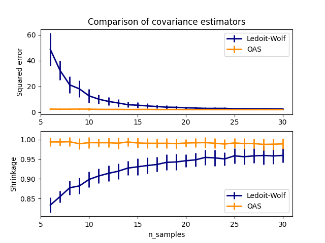

تقدير التغاير 

===================================================

.. currentmodule:: sklearn.covariance

يتطلب العديد من المشكلات الإحصائية تقدير مصفوفة التغاير لسكان، والتي يمكن اعتبارها تقديرًا لشكل مخطط التشتت لمجموعة البيانات. وفي معظم الأحيان، يجب إجراء هذا التقدير على عينة يكون لخصائصها (الحجم، والبنية، والتماثل) تأثير كبير على جودة التقدير. توفر حزمة :mod:`sklearn.covariance` أدوات لتقدير مصفوفة التغاير للسكان بدقة في ظل إعدادات مختلفة.

نفترض أن الملاحظات مستقلة ومتطابقة التوزيع (i.i.d.).

التغاير التجريبي
====================

من المعروف أن مصفوفة التغاير لمجموعة بيانات تقترب جيدًا من *المقدر الأقصى الاحتمالي* الكلاسيكي (أو "التغاير التجريبي")، بشرط أن يكون عدد الملاحظات كبيرًا بما يكفي مقارنة بعدد الخصائص (المتغيرات التي تصف الملاحظات). وبشكل أكثر دقة، فإن المقدر الأقصى الاحتمالي لعينة ما هو مقدر غير متحيز تقاربيًا لمصفوفة التغاير المقابلة للسكان.

يمكن حساب مصفوفة التغاير التجريبية لعينة ما باستخدام دالة :func:`empirical_covariance` في الحزمة، أو عن طريق ملاءمة كائن :class:`EmpiricalCovariance` إلى عينة البيانات باستخدام طريقة :meth:`EmpiricalCovariance.fit`. كن حذرًا لأن النتائج تعتمد على ما إذا كانت البيانات مركزة، لذا قد يرغب المستخدم في استخدام معلمة ``assume_centered`` بدقة. وبشكل أكثر تحديدًا، إذا كان ``assume_centered=False``، فمن المفترض أن يكون لمجموعة الاختبار نفس متجه المتوسط مثل مجموعة التدريب. إذا لم يكن الأمر كذلك، فيجب على المستخدم أن يقوم بمركزة كل من المجموعتين، واستخدام ``assume_centered=True``.

.. rubric:: الأمثلة

* راجع :ref:`sphx_glr_auto_examples_covariance_plot_covariance_estimation.py` للحصول
  على مثال حول كيفية ملاءمة كائن :class:`EmpiricalCovariance` إلى البيانات.

التغاير المنكمش
=================

الانكماش الأساسي
---------------

على الرغم من أن المقدر الأقصى الاحتمالي هو مقدر غير متحيز تقاربيًا لمصفوفة التغاير، إلا أنه ليس مقدرًا جيدًا للقيم الذاتية لمصفوفة التغاير، لذلك فإن مصفوفة الدقة الناتجة عن معكوسها غير دقيقة. وفي بعض الأحيان، يحدث حتى أن مصفوفة التغاير التجريبية لا يمكن عكسها لأسباب رقمية. ولتجنب مشكلة العكس هذه، تم تقديم تحويل لمصفوفة التغاير التجريبية: "الانكماش".

في سكيت-ليرن، يمكن تطبيق هذا التحويل (مع معامل انكماش يحدده المستخدم) مباشرة على مصفوفة تغاير محسوبة مسبقًا باستخدام طريقة :func:`shrunk_covariance`. أيضًا، يمكن ملاءمة مقدر منكمش لمصفوفة التغاير إلى البيانات باستخدام كائن :class:`ShrunkCovariance` وطريقته :meth:`ShrunkCovariance.fit`. مرة أخرى، تعتمد النتائج على ما إذا كانت البيانات مركزة، لذا قد يرغب المستخدم في استخدام معلمة ``assume_centered`` بدقة.

رياضيًا، يتكون هذا الانكماش من تقليل نسبة القيمة الذاتية الصغرى إلى القيمة الذاتية الكبرى لمصفوفة التغاير التجريبية. ويمكن القيام بذلك عن طريق تحويل كل قيمة ذاتية وفقًا لتعويض معين، وهو ما يعادل إيجاد المقدر الأقصى الاحتمالي المعاقب وفقًا للمعيار :math:`\ell_2` لمصفوفة التغاير. وفي الممارسة العملية، ينطوي الانكماش على تحويل محدب بسيط : :math:`\Sigma_{\rm shrunk} = (1-\alpha)\hat{\Sigma} + \alpha\frac{{\rm Tr}\hat{\Sigma}}{p}\rm Id`.

إن اختيار مقدار الانكماش، :math:`\alpha`، يعادل تحديد مفاضلة بين الانحياز والتباين، وسيتم مناقشته أدناه.

.. rubric:: الأمثلة

* راجع :ref:`sphx_glr_auto_examples_covariance_plot_covariance_estimation.py` للحصول
  على مثال حول كيفية ملاءمة كائن :class:`ShrunkCovariance` إلى البيانات.

انكماش ليدويت-وولف
---------------------

في ورقتهم البحثية لعام 2004 [1]_، اقترح O. Ledoit وM. Wolf صيغة لحساب معامل الانكماش الأمثل :math:`\alpha` الذي يقلل من متوسط مربعات الخطأ بين مصفوفة التغاير المقدرة والمصفوفة الحقيقية.

يمكن حساب مقدر ليدويت-وولف لمصفوفة التغاير على عينة باستخدام دالة :meth:`ledoit_wolf` في الحزمة :mod:`sklearn.covariance`، أو يمكن الحصول عليه بخلاف ذلك عن طريق ملاءمة كائن :class:`LedoitWolf` إلى نفس العينة.

.. note:: **الحالة عندما تكون مصفوفة التغاير السكانية متسقة الخواص**

    من المهم ملاحظة أنه عندما يكون عدد العينات أكبر بكثير من عدد الخصائص، من المتوقع ألا تكون هناك حاجة إلى أي انكماش. والحدس وراء هذا هو أنه إذا كانت مصفوفة التغاير السكانية ذات رتبة كاملة، فعندما يزداد عدد العينات، ستصبح مصفوفة التغاير للعينة أيضًا موجبة التأكيد. ونتيجة لذلك، لن يكون الانكماش ضروريًا، وينبغي أن تقوم الطريقة بذلك تلقائيًا.

    ومع ذلك، فإن هذا ليس هو الحال في إجراء ليدويت-وولف عندما تكون مصفوفة التغاير السكانية مضاعفًا لمصفوفة الهوية. في هذه الحالة، يقترب تقدير الانكماش ليدويت-وولف من 1 مع زيادة عدد العينات. ويشير هذا إلى أن التقدير الأمثل لمصفوفة التغاير وفقًا لطريقة ليدويت-وولف هو مضاعف لمصفوفة الهوية. وبما أن مصفوفة التغاير السكانية هي بالفعل مضاعف لمصفوفة الهوية، فإن حل ليدويت-وولف هو بالفعل تقدير معقول.

.. rubric:: الأمثلة

* راجع :ref:`sphx_glr_auto_examples_covariance_plot_covariance_estimation.py` للحصول
  على مثال حول كيفية ملاءمة كائن :class:`LedoitWolf` إلى البيانات ولتصور أداء مقدر ليدويت-وولف
  من حيث الاحتمالية.

.. rubric:: المراجع

.. [1] O. Ledoit and M. Wolf, "A Well-Conditioned Estimator for Large-Dimensional
       Covariance Matrices", Journal of Multivariate Analysis, Volume 88, Issue 2,
       February 2004, pages 365-411.

.. _oracle_approximating_shrinkage:

انكماش التقريب الأمثل
------------------------------

بافتراض أن البيانات موزعة وفقًا لتوزيع غاوسي، اشتق تشين وآخرون. [2]_ صيغة تهدف إلى اختيار معامل انكماش يعطي متوسط مربعات خطأ أصغر من ذلك الذي تعطيه صيغة ليدويت ووولف. ويعرف المقدر الناتج باسم مقدر الانكماش التقريبي الأمثل لمصفوفة التغاير.

يمكن حساب مقدر OAS لمصفوفة التغاير على عينة باستخدام دالة :meth:`oas` في الحزمة :mod:`sklearn.covariance`، أو يمكن الحصول عليه بخلاف ذلك عن طريق ملاءمة كائن :class:`OAS` إلى نفس العينة.

.. figure:: ../auto_examples/covariance/images/sphx_glr_plot_covariance_estimation_001.png
   :target: ../auto_examples/covariance/plot_covariance_estimation.html
   :align: center
   :scale: 65%

   المفاضلة بين الانحياز والتباين عند تحديد الانكماش: مقارنة اختيارات مقدري ليدويت-وولف وOAS

.. rubric:: المراجع

.. [2] :arxiv:`"Shrinkage algorithms for MMSE covariance estimation.",
       Chen, Y., Wiesel, A., Eldar, Y. C., & Hero, A. O.
       IEEE Transactions on Signal Processing, 58(10), 5016-5029, 2010.
       <0907.4698>`

.. rubric:: الأمثلة

* راجع :ref:`sphx_glr_auto_examples_covariance_plot_covariance_estimation.py` للحصول
  على مثال حول كيفية ملاءمة كائن :class:`OAS` إلى البيانات.

* راجع :ref:`sphx_glr_auto_examples_covariance_plot_lw_vs_oas.py` لتصور الفرق في متوسط
  مربعات الخطأ بين مقدري :class:`LedoitWolf` و:class:`OAS` لمصفوفة التغاير.

.. _sparse_inverse_covariance:

مصفوفة الدقة المتناثرة
==========================

إن معكوس مصفوفة التغاير، والذي يُطلق عليه غالبًا مصفوفة الدقة، يتناسب مع مصفوفة الارتباط الجزئي. فهو يعطي علاقة الاستقلال الجزئي. وبعبارة أخرى، إذا كان الميزتان مستقلتين شرطيًا على الميزات الأخرى، فإن المعامل المقابل في مصفوفة الدقة سيكون صفرًا. وهذا هو السبب في أن تقدير مصفوفة دقة متناثرة له معنى: يكون تقدير مصفوفة التغاير مشروطًا بشكل أفضل عن طريق تعلم علاقات الاستقلال من البيانات. وهذا ما يعرف باسم *اختيار التغاير*.

في حالة العينات الصغيرة، حيث يكون ``n_samples`` بنفس ترتيب ``n_features`` أو أصغر، يميل مقدرو مصفوفة الدقة المتناثرة إلى العمل بشكل أفضل من مقدري التغاير المنكمش. ومع ذلك، في الحالة المعاكسة، أو بالنسبة للبيانات عالية الارتباط، يمكن أن تكون غير مستقرة من الناحية العددية. بالإضافة إلى ذلك، على عكس مقدرات الانكماش، يمكن لمقدرات التفرق المتناثرة استرداد البنية غير القطرية.

يستخدم مقدر :class:`GraphicalLasso` معاقبة :math:`\ell_1` لفرض التفرق على مصفوفة الدقة: فكلما زادت معلمة ``alpha``، زاد تفرق مصفوفة الدقة. ويستخدم الكائن المقابل :class:`GraphicalLassoCV` التحقق من الصلاحية المتقاطع لضبط معلمة ``alpha`` تلقائيًا.

.. figure:: ../auto_examples/covariance/images/sphx_glr_plot_sparse_cov_001.png
   :target: ../auto_examples/covariance/plot_sparse_cov.html
   :align: center
   :scale: 60%

   *مقارنة بين التقديرات الأقصى الاحتمالية والمنكمشة والمتناثرة لمصفوفة التغاير ومصفوفة الدقة في حالة العينات الصغيرة جدًا.*

.. note:: **استرداد البنية**

   إن استرداد بنية رسومية من الارتباطات في البيانات أمر صعب. إذا كنت مهتمًا بمثل هذا الاسترداد، فضع في اعتبارك ما يلي:

   * من الأسهل استرداد بنية من مصفوفة ارتباط بدلاً من مصفوفة تغاير: قم بتوحيد ملاحظاتك قبل تشغيل :class:`GraphicalLasso`

   * إذا كانت البنية الأساسية للرسم البياني تحتوي على عقد بها اتصالات أكثر بكثير من العقدة المتوسطة، فسوف تفقد الخوارزمية بعض هذه الاتصالات.

   * إذا لم يكن عدد ملاحظاتك كبيرًا مقارنة بعدد الحواف في رسمك البياني الأساسي، فلن تسترد الرسم البياني.

   * حتى إذا كنت في ظروف استرداد مواتية، فإن معلمة alpha التي يختارها التحقق من الصلاحية المتقاطع (على سبيل المثال، باستخدام كائن :class:`GraphicalLassoCV`) ستؤدي إلى تحديد حواف كثيرة جدًا. ومع ذلك، سيكون للحواف ذات الصلة أوزان أثقل من الحواف غير ذات الصلة.

الصيغة الرياضية هي كما يلي:

.. math::

    \hat{K} = \mathrm{argmin}_K \big(
                \mathrm{tr} S K - \mathrm{log} \mathrm{det} K
                + \alpha \|K\|_1
                \big)

حيث :math:`K` هي مصفوفة الدقة التي سيتم تقديرها، و:math:`S` هي مصفوفة التغاير للعينة. :math:`\|K\|_1` هو مجموع القيم المطلقة للمعاملات غير القطرية لـ :math:`K`. والخوارزمية المستخدمة لحل هذه المشكلة هي خوارزمية GLasso، من ورقة فريدمان لعام 2008 في علم الإحصاء الحيوي. وهي نفس الخوارزمية المستخدمة في حزمة ``glasso`` في R.

.. rubric:: الأمثلة

* :ref:`sphx_glr_auto_examples_covariance_plot_sparse_cov.py`: مثال على بيانات اصطناعية توضح بعض استرداد البنية، ومقارنتها بمقدرات التغاير الأخرى.

* :ref:`sphx_glr_auto_examples_applications_plot_stock_market.py`: مثال على بيانات سوق الأوراق المالية الحقيقية، لمعرفة الرموز الأكثر ارتباطًا.

.. rubric:: المراجع

* Friedman et al, `"Sparse inverse covariance estimation with the
  graphical lasso" <https://biostatistics.oxfordjournals.org/content/9/3/432.short>`_,
  Biostatistics 9, pp 432, 2008

.. _robust_covariance:

تقدير التغاير المتين
فيما يلي ترجمة للنص المحدد بتنسيق RST إلى اللغة العربية مع اتباع التعليمات المذكورة:

غالبًا ما تخضع مجموعات البيانات الفعلية لأخطاء القياس أو التسجيل. وقد تظهر الملاحظات المنتظمة ولكن غير الشائعة أيضًا لعدة أسباب. وتسمى الملاحظات غير الشائعة جدًا بالشذوذ.

إن تقدير التغاير التجريبي ومقدّرات التغاير المنكمشة المذكورة أعلاه حساسة جدًا لوجود الشواذ في البيانات. لذلك، يجب استخدام تقديرات التغاير القوية لتقدير التغاير في مجموعات البيانات الفعلية. أو بدلاً من ذلك، يمكن استخدام تقديرات التغاير القوية للكشف عن الشواذ واستبعاد/تخفيض بعض الملاحظات وفقًا للمعالجة الإضافية للبيانات.

تنفذ حزمة "sklearn.covariance" تقديرًا قويًا للتغاير، وهو الحد الأدنى لمحدد التغاير [3] _.

الحد الأدنى لمحدد التغاير

تقدير الحد الأدنى لمحدد التغاير هو تقدير قوي لتغاير مجموعة البيانات قدمه P.J. Rousseeuw في [3] _. والفكرة هي إيجاد نسبة معينة (ح) من الملاحظات "الجيدة" التي ليست شاذة وحساب مصفوفة التغاير التجريبية الخاصة بها. ثم يتم إعادة تحجيم مصفوفة التغاير التجريبية هذه للتعويض عن اختيار الملاحظات الذي تم إجراؤه ("خطوة الاتساق"). وبمجرد حساب تقدير الحد الأدنى لمحدد التغاير، يمكن إعطاء أوزان للملاحظات وفقًا لبعد ماهالانوبيس، مما يؤدي إلى تقدير معيد الوزن لمصفوفة التغاير الخاصة بمجموعة البيانات ("خطوة إعادة الوزن").

قام Rousseeuw و Van Driessen [4] _ بتطوير خوارزمية FastMCD لحساب الحد الأدنى لمحدد التغاير. ويستخدم هذا الخوارزم في Scikit-learn عند ملاءمة كائن MCD للبيانات. كما تحسب خوارزمية FastMCD تقديرًا قويًا لموقع مجموعة البيانات في نفس الوقت.

يمكن الوصول إلى التقديرات الخام على أنها سمات "raw_location_" و "raw_covariance_" لكائن "MinCovDet" لتقدير التغاير القوي.

المراجع

[3] P. J. Rousseeuw. أقل الانحدار الوسيط للمربعات. مجلة آم ستات أس، 79:871، 1984.
[4] خوارزمية سريعة لمقدّر الحد الأدنى لمحدد التغاير، 1999، الجمعية الإحصائية الأمريكية والجمعية الأمريكية للجودة، تكنوميتريكس.

الأمثلة

* راجع: :ref:`sphx_glr_auto_examples_covariance_plot_robust_vs_empirical_covariance.py` للحصول على مثال حول كيفية ملاءمة كائن "MinCovDet" للبيانات ورؤية كيف يظل التقدير دقيقًا على الرغم من وجود الشواذ.

* راجع: :ref:`sphx_glr_auto_examples_covariance_plot_mahalanobis_distances.py` لتصور الفرق بين تقدير التغاير "EmpiricalCovariance" و "MinCovDet" من حيث مسافة ماهالانوبيس (حتى نحصل على تقدير أفضل لمصفوفة الدقة أيضًا).

| | |
|---|---|
| تأثير الشواذ على تقديرات الموقع والتغاير | فصل الملاحظات الداخلية عن الشواذ باستخدام مسافة ماهالانوبيس |
| | |