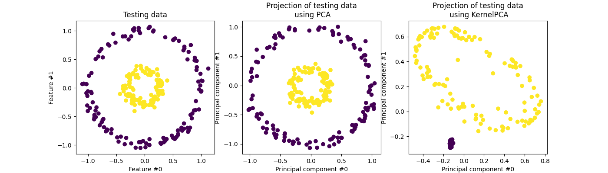
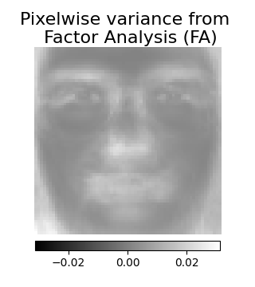

تفكيك الإشارات إلى مكونات (مشاكل تحليل المصفوفة)
=================================================================

يُستخدم تحليل المكونات الرئيسية (PCA) لتفكيك مجموعة بيانات متعددة المتغيرات إلى مجموعة من المكونات المتعامدة المتتالية التي تفسر الحد الأقصى من التباين. في سكيت-ليرن، يتم تنفيذ PCA ككائن محول يتعلم n مكونًا في طريقة التجهيز الخاصة به، ويمكن استخدامه على بيانات جديدة لمشروعها على هذه المكونات.

يقوم PCA بمركزة بيانات الإدخال ولكنه لا يقوم بمقياسها لكل ميزة قبل تطبيق SVD. تسمح المعلمة الاختيارية "whiten=True" بإسقاط البيانات على مساحة المميز مع قياس كل مكون إلى تباين الوحدة. غالبًا ما يكون هذا مفيدًا إذا كانت النماذج أسفل البث تضع افتراضات قوية بشأن توزيع الإشارة: هذا هو الحال، على سبيل المثال، بالنسبة لآلات المتجهات الداعمة مع نواة RBF وخوارزمية التجميع K-Means.

فيما يلي مثال لمجموعة بيانات Iris، والتي تتكون من 4 ميزات، يتم إسقاطها على البعدين اللذين يفسران معظم التباين:

توفر كائن PCA أيضًا تفسيرًا احتماليًا لـ PCA يمكن أن يعطي احتمالية للبيانات بناءً على مقدار التباين الذي تفسره. على هذا النحو، فإنه ينفذ طريقة "التسجيل" التي يمكن استخدامها في التحقق من الصلاحية:

PCA باستخدام SVD العشوائي
------------------------

غالبًا ما يكون من المثير للاهتمام إسقاط البيانات إلى مساحة ذات أبعاد أقل تحافظ على معظم التباين، عن طريق إسقاط متجه المميز للمكونات المرتبط بقيم مميزة أقل.

على سبيل المثال، إذا كنا نعمل مع صور رمادية بمقياس 64x64 بكسل للتعرف على الوجه، فإن أبعاد البيانات هي 4096 ومن البطيء تدريب آلة المتجهات الداعمة RBF على مثل هذه البيانات العريضة. علاوة على ذلك، نحن نعلم أن البعد الجوهري للبيانات أقل بكثير من 4096 لأن جميع صور الوجوه البشرية تبدو متشابهة إلى حد ما.

توجد عينات على متعدد شعب ذو أبعاد أقل بكثير (حوالي 200 على سبيل المثال). يمكن استخدام خوارزمية PCA لتحويل البيانات الخطي مع تقليل الأبعاد والحفاظ على معظم التباين الموضح في نفس الوقت.

تعد فئة PCA المستخدمة مع المعلمة الاختيارية "svd_solver='randomized'" مفيدة جدًا في هذه الحالة: نظرًا لأننا سنقوم بإسقاط معظم متجهات المميز، فمن الأكثر كفاءة الحد من الحساب إلى تقدير تقريبي لمتجهات المميز التي سنحتفظ بها لأداء التحويل بالفعل.

على سبيل المثال، يُظهر ما يلي 16 صورة شخصية عينة (مركزة حول 0.0) من مجموعة بيانات Olivetti. على الجانب الأيمن، توجد المتجهات المميزة الأولى التي تمت إعادة تشكيلها على شكل صور شخصية. نظرًا لأننا نحتاج فقط إلى المتجهات المميزة العليا لمجموعة بيانات بحجم n_samples = 400 وn_features = 64 × 64 = 4096، فإن وقت الحساب أقل من 1 ثانية:

يُظهر المثال التالي 16 مكونًا مستخرجًا باستخدام PCA غير المتناظر من مجموعة بيانات وجوه Olivetti. يمكن ملاحظة كيفية قيام مصطلح الانتظام بإحداث العديد من الأصفار. علاوة على ذلك، يتسبب الهيكل الطبيعي للبيانات في أن تكون المعاملات غير الصفرية متجاورة عموديًا. لا يفرض النموذج هذا رياضيًا: كل مكون هو متجه h ∈ R^4096، ولا يوجد مفهوم للتجاور الرأسي باستثناء التصور الودي للبشر كصور 64x64 بكسل. إن حقيقة أن المكونات الموضحة أدناه تبدو محلية هي تأثير الهيكل المتأصل للبيانات، والذي يجعل مثل هذه الأنماط المحلية تقلل من خطأ إعادة البناء. هناك قواعد ل-1 تحفيز تأخذ في الاعتبار التجاورة وأنواع مختلفة من الهياكل؛ راجع [Jen09] _ لمحة عامة عن هذه الأساليب.

توجد صيغ مختلفة لمشكلة PCA غير المتناظرة. يعتمد التنفيذ هنا على [Mrl09] _. مشكلة التحسين التي تم حلها هي مشكلة PCA (تعلم القاموس) مع عقوبة l1 على المكونات:

حيث || . ||_Fro يمثل المعيار فروبينيوس و||. ||_1،1 يمثل معيار المصفوفة القائم على الإدخال والذي هو مجموع القيم المطلقة لجميع الإدخالات في المصفوفة.

تمنع قاعدة L1 المُحفِّزة للمصفوفة أيضًا تعلم المكونات من الضوضاء عند توفر عدد قليل من عينات التدريب. يمكن ضبط درجة العقوبة (وبالتالي التجزئة) من خلال معلمة "ألفا" الفرط. تؤدي القيم الصغيرة إلى تفكيك معتدل، في حين أن القيم الأكبر حجمًا تقلص العديد من المعاملات إلى الصفر.

ملاحظة: على الرغم من أنها في روح خوارزمية عبر الإنترنت، فإن فئة MiniBatchSparsePCA لا تنفذ "partial_fit" لأن الخوارزمية عبر الإنترنت على اتجاه الميزات، وليس اتجاه العينات.

مراجع
------

- خوارزمية 4.3 في "إيجاد البنية باستخدام العشوائية: خوارزميات احتمالية لبناء تقريبي لتفكيك المصفوفة" Halko، وآخرون، 2009

- "تنفيذ خوارزمية عشوائية لتحليل المكونات الرئيسية" A. Szlam et al. 2014

PCA غير المتناظرة (SparsePCA وMiniBatchSparsePCA)
-----------------------------------------------------------------------

PCA غير المتناظرة هو متغير من PCA، بهدف استخراج مجموعة من المكونات غير المتناظرة التي تعيد بناء البيانات بشكل أفضل.

Mini-batch Sparse PCA (MiniBatchSparsePCA) هو متغير من SparsePCA الذي يكون أسرع ولكنه أقل دقة. تتم زيادة السرعة عن طريق التكرار فوق أجزاء صغيرة من مجموعة الميزات، لعدد معين من التكرارات.

يتمثل عيب تحليل المكونات الرئيسية (PCA) في أن المكونات المستخرجة بواسطة هذه الطريقة لها تعبيرات كثيفة بشكل حصري، أي أن لها معاملات غير صفرية عند التعبير عنها كمزيج خطي من المتغيرات الأصلية. يمكن أن يجعل هذا التفسير صعبًا. في كثير من الحالات، يمكن تصور المكونات الأساسية الفعلية بشكل أكثر طبيعية كمؤشرات غير متناظرة؛ على سبيل المثال في التعرف على الوجه، قد ترتبط المكونات بشكل طبيعي بأجزاء من الوجوه.

يؤدي PCA غير المتناظر إلى تمثيل أكثر إيجازًا وقابلية للفهم، مما يؤكد بوضوح أي من الميزات الأصلية تساهم في الاختلافات بين العينات.

يوضح المثال التالي 16 مكونًا مستخرجًا باستخدام PCA غير المتناظر من مجموعة بيانات وجوه Olivetti. يمكن ملاحظة كيفية قيام مصطلح الانتظام بإحداث العديد من الأصفار. علاوة على ذلك، يتسبب الهيكل الطبيعي للبيانات في أن تكون المعاملات غير الصفرية متجاورة عموديًا. لا يفرض النموذج هذا رياضيًا: كل مكون هو متجه h ∈ R^4096، ولا يوجد مفهوم للتجاور الرأسي باستثناء التصور الودي للبشر كصور 64x64 بكسل. إن حقيقة أن المكونات الموضحة أدناه تبدو محلية هي تأثير الهيكل المتأصل للبيانات، والذي يجعل مثل هذه الأنماط المحلية تقلل من خطأ إعادة البناء. هناك قواعد ل-1 تحفيز تأخذ في الاعتبار التجاورة وأنواع مختلفة من الهياكل؛ راجع [Jen09] _ لمحة عامة عن هذه الأساليب.

لاحظ أن هناك صيغًا مختلفة لمشكلة PCA غير المتناظرة. يعتمد التنفيذ هنا على [Mrl09] _. مشكلة التحسين التي تم حلها هي مشكلة PCA (تعلم القاموس) مع عقوبة l1 على المكونات:

حيث || . ||_Fro يمثل معيار فروبينيوس و||. ||_1،1 يمثل معيار المصفوفة القائم على الإدخال والذي هو مجموع القيم المطلقة لجميع الإدخالات في المصفوفة.

تمنع قاعدة L1 المُحفِّزة للمصفوفة أيضًا تعلم المكونات من الضوضاء عند توفر عدد قليل من عينات التدريب. يمكن ضبط درجة العقوبة (وبالتالي التجزئة) من خلال معلمة "ألفا" الفرط. تؤدي القيم الصغيرة إلى تفكيك معتدل، في حين أن القيم الأكبر حجمًا تقلص العديد من المعاملات إلى الصفر.

تحليل المكونات الرئيسية للنواة (kPCA)
Kernel PCA الدقيق
----------------

: class: 'KernelPCA' هو امتداد لPCA يحقق تقليل الأبعاد غير الخطية من خلال استخدام النواة (راجع: ref: 'metrics') [Scholkopf1997] _. ولديه العديد من التطبيقات بما في ذلك إزالة الضوضاء والضغط والتنبؤ المنظم (تقدير اعتماد النواة). يدعم: class: 'KernelPCA' كل من "التحويل" و "inverse_transform".

.. note::
    : meth: 'KernelPCA.inverse_transform' يعتمد على ريدج النواة لتعلم
    وظيفة رسم الخرائط للعينات من أساس PCA إلى مساحة الميزة الأصلية [Bakir2003] _. وبالتالي، فإن إعادة البناء التي تم الحصول عليها مع
    : meth: 'KernelPCA.inverse_transform' هو تقريب. راجع المثال
    أدناه للحصول على مزيد من التفاصيل.

.. rubric:: أمثلة

* : ref: 'sphx_glr_auto_examples_decomposition_plot_kernel_pca.py'
* : ref: 'sphx_glr_auto_examples_applications_plot_digits_denoising.py'

.. rubric:: المراجع

.. [Scholkopf1997] شولكوف، برنارد، ألكسندر سمولا، وكلاوس روبرت مولر.
   "تحليل المكونات الأساسية للنواة".
   <https://people.eecs.berkeley.edu/~wainwrig/stat241b/scholkopf_kernel.pdf>'
   المؤتمر الدولي للشبكات العصبية الاصطناعية.
   سبرينغر، برلين، هايدلبرغ، 1997.

.. [Bakir2003] باكير، جوهان ح، جيسون ويستون، وبرنارد شولكوف.
   "التعلم للعثور على الصور المسبقة".
   <https://papers.nips.cc/paper/2003/file/ac1ad983e08ad3304a97e147f522747e-Paper.pdf>'
   تقدم في معالجة المعلومات العصبية 16 (2003): 449-456.

.. _kPCA_Solvers:

خيار المحلل لـ Kernel PCA
-------------------------------

في حين أن: class: 'PCA' عدد المكونات محدود بعدد الميزات، في: class: 'KernelPCA' عدد المكونات محدود بعدد
العينات. تحتوي العديد من مجموعات البيانات الواقعية على عدد كبير من العينات! في
هذه الحالات، يعد العثور على *جميع* المكونات باستخدام kPCA الكامل مضيعة لوقت الحساب، حيث يتم وصف البيانات بشكل أساسي بواسطة المكونات القليلة الأولى
(على سبيل المثال، "n_components<=100"). وبعبارة أخرى، فإن مصفوفة غرام المركزة التي
يتم تحليلها ذاتيًا في عملية التجهيز لـ Kernel PCA لها مرتبة فعالة
أصغر بكثير من حجمها. هذا هو موقف حيث يمكن لمحللات القيمة الذاتية التقريبية توفير تسريع مع فقدان دقة منخفض جدًا.

.. dropdown:: Eigensolvers

    يمكن استخدام المعلمة الاختيارية "eigen_solver='randomized'" ل
    الحد بشكل كبير من وقت الحساب عندما يكون عدد "n_components" المطلوب
    صغيرًا مقارنة بعدد العينات. يعتمد على طرق التحليل العشوائي للعثور على
    حل تقريبي في وقت أقصر.

    تبلغ التعقيد الزمني لـ KernelPCA العشوائي: math: 'O (n_ {samples} ^ 2 \ cdot n_ {components})'
    بدلاً من: math: 'O (n_ {samples} ^ 3)' للطريقة الدقيقة
    التي تم تنفيذها باستخدام "eigen_solver='dense'".

    بصمة الذاكرة لـ KernelPCA العشوائي تتناسب أيضًا مع:
    math: '2 \ cdot n_ {samples} \ cdot n_ {components}` بدلاً من
    : math: 'n_ {samples} ^ 2` للطريقة الدقيقة.

    ملاحظة: هذه التقنية هي نفسها كما في: ref: 'RandomizedPCA'.

    بالإضافة إلى المحللين أعلاه، يمكن استخدام "eigen_solver='arpack'" ك
    طريقة بديلة للحصول على تحليل تقريبي. في الممارسة العملية، توفر هذه الطريقة فقط أوقات تنفيذ معقولة عندما يكون عدد المكونات التي سيتم العثور عليها
    صغيرًا جدًا. يتم تمكينه بشكل افتراضي عندما يكون عدد المكونات المطلوبة أقل من 10 (صارم) وعدد العينات أكبر من 200
    (صارم). راجع: class: 'KernelPCA' للحصول على التفاصيل.

    .. rubric:: المراجع

    * المحلل *الكثيف*:
      `scipy.linalg.eigh documentation
      <https://docs.scipy.org/doc/scipy/reference/generated/scipy.linalg.eigh.html>`_

    * المحلل *العشوائي*:

      * الخوارزمية 4.3 في
        :arxiv: "العثور على البنية باستخدام العشوائية: خوارزميات عشوائية
        لبناء التحليلات التقريبية للمصفوفة <0909.4061>`
        Halko، et al. (2009)

      * :arxiv: "تنفيذ خوارزمية عشوائية
        لتحليل المكونات الأساسية <1412.3510>`
        أ. Szlam et al. (2014)

    * محلل *arpack*:
      `scipy.sparse.linalg.eigsh documentation
      <https://docs.scipy.org/doc/scipy/reference/generated/scipy.sparse.linalg.eigsh.html>`_
      R. B. Lehoucq، D. C. سورينسن، و C. يانغ، (1998)

.. _LSA:

تحليل القيمة المفردة المبتورة وتحليل المعنى الكامن
===================================================================

: class: 'TruncatedSVD' ينفذ متغيرًا من تحليل القيمة الفردية
(SVD) الذي يحسب فقط: math: 'k' أكبر القيم الفردية،
حيث: math: 'k' هو معلمة يحددها المستخدم.

: class: 'TruncatedSVD' مشابه جدًا لـ: class: 'PCA'، ولكنه يختلف
في أن المصفوفة: math: 'X' لا تحتاج إلى أن تكون مركزة.
عندما يتم طرح الوسائل العمودية (لكل ميزة) من: math: 'X'
من قيم الميزة، فإن SVD المبتور للمصفوفة الناتجة يعادل PCA.

.. dropdown:: حول SVD المبتور وتحليل المعنى الكامن (LSA)

    عندما يتم تطبيق SVD المبتور على مصفوفات المصطلحات والمستندات
    (كما هو موضح بواسطة: class: '~sklearn.feature_extraction.text.CountVectorizer` أو
    : class: '~sklearn.feature_extraction.text.TfidfVectorizer`)،
    يُعرف هذا التحول باسم
    `تحليل المعنى الكامن <https://nlp.stanford.edu/IR-book/pdf/18lsi.pdf>`_
    (LSA)، لأنه يحول هذه المصفوفات
    إلى مساحة "معنوية" ذات أبعاد منخفضة.
    على وجه الخصوص، من المعروف أن LSA تكافح آثار الترادف وتعدد المعاني
    (كلاهما يعني تقريبًا وجود معانٍ متعددة لكل كلمة)،
    مما يتسبب في أن تكون مصفوفات المصطلحات والمستندات متباعدة جدًا
    وتظهر تشابهًا سيئًا وفقًا لتدابير مثل تشابه جيب التمام.

    .. note::
        LSA معروف أيضًا باسم الفهرسة الدلالية الكامنة، LSI،
        على الرغم من أن هذا يشير بشكل صارم إلى استخدامه في الفهارس الدائمة
        لأغراض استرجاع المعلومات.

    من الناحية الرياضية، ينتج SVD المبتور المطبق على عينات التدريب: math: 'X'
    تقريبًا منخفض الرتبة: math: 'X':

    .. math::
        X \ approx X_k = U_k \ Sigma_k V_k ^ \ top

    بعد هذه العملية،: math: 'U_k \ Sigma_k'
    هي مجموعة بيانات التدريب المحولة مع: math: 'k' ميزات
    (تسمى "n_components" في واجهة برمجة التطبيقات).

    لتحويل مجموعة اختبار: math: 'X' أيضًا، نقوم بضربها في: math: 'V_k':

    .. math::
        X' = X V_k

    .. note::
        تتبادل معظم معالجات LSA في أدبيات معالجة اللغات الطبيعية (NLP)
        واسترجاع المعلومات (IR) محاور المصفوفة: math: 'X' بحيث يكون لها شكل
        "(n_features، n_samples)".
        نقدم LSA بطريقة مختلفة تتوافق بشكل أفضل مع واجهة برمجة تطبيقات scikit-learn،
        ولكن القيم الفردية التي تم العثور عليها هي نفسها.

    في حين أن محول: class: 'TruncatedSVD'
    يعمل مع أي مصفوفة ميزات،
    يوصى باستخدامه على مصفوفات tf-idf بدلاً من عدات التردد الخام
    في إعداد LSA/معالجة المستندات.
    على وجه الخصوص، يجب تشغيل التوسيع تحت الخطي والتردد العكسي للمستند
    (sublinear_tf=True، use_idf=True)
    لجعل قيم الميزة أقرب إلى التوزيع الطبيعي،
    للتعويض عن الافتراضات الخاطئة لـ LSA حول البيانات النصية.

.. rubric:: أمثلة

* : ref: 'sphx_glr_auto_examples_text_plot_document_clustering.py'

.. rubric:: المراجع

* كريستوفر د. مانينج، برابهاكار راغافان وهينريش شوتزي (2008)،
  *مقدمة في استرجاع المعلومات*، مطبعة جامعة كامبريدج،
  الفصل 18: "تحليل المصفوفة والفهرسة الدلالية الكامنة
  <https://nlp.stanford.edu/IR-book/pdf/18lsi.pdf>`_

.. _DictionaryLearning:

تعلم القاموس
الترميز المُقَشَّع باستخدام قاموس مُحَسَّب مُسْبَقًا
----------------------------------------------------------

يُعد كائن :class:`SparseCoder` مُقَدِّرًا يمكن استخدامه لتحويل الإشارات إلى تركيبة خطية مُقَشَّعة من الذرات المُستخرجة من قاموس ثابت مُحَسَّب مُسْبَقًا مثل أساس موجة متقطعة. لذلك، فإن هذا الكائن لا ينفذ طريقة ``fit``. ويبلغ مقدار التحويل إلى مشكلة ترميز مُقَشَّع: العثور على تمثيل للبيانات كتركيبة خطية لأقل عدد ممكن من ذرات القاموس. وتنفذ جميع تنويعات تعلم القاموس طرق التحويل التالية، والتي يمكن التحكم فيها عبر معامل ``transform_method`` عند تهيئة المعلمة:

* مطاردة المطابقة المتعامدة (:ref:`omp`)

* الانحدار ذو الزاوية الصغرى (:ref:`least_angle_regression`)

* لسو باستخدام الانحدار ذو الزاوية الصغرى

* لسو باستخدام الانحدار التنسيقي (:ref:`lasso`)

* العتبات

إن العتبات سريعة للغاية ولكنها لا تُنتج ترميمات دقيقة. وقد ثبت أنها مفيدة في الأدبيات لمهام التصنيف. وبالنسبة لمهام ترميم الصور، فإن مطاردة المطابقة المتعامدة تُنتج أكثر الترميمات دقة وحيادية.

توفر كائنات تعلم القاموس، عبر معامل ``split_code``، إمكانية فصل القيم الموجبة والسالبة في نتائج الترميز المُقَشَّع. وهذا مفيد عندما يُستخدم تعلم القاموس لاستخراج ميزات ستُستخدم للتعلم المُشرف، لأنه يسمح لخوارزمية التعلم بتعيين أوزان مختلفة لتحميلات سالبة لذرة معينة، مُقارنة بالتحميل الموجب المُقابل.

يكون للرمز المُقسَّم لعينة واحدة طول ``2 * n_components``، ويتم بناؤه باستخدام القاعدة التالية: أولاً، يتم حساب الرمز العادي بطول ``n_components``. بعد ذلك، يتم ملء الإدخالات الأولى لـ ``n_components`` من ``split_code`` بالجزء الموجب من متجه الرمز العادي. ويتم ملء النصف الثاني من الرمز المُقسَّم بالجزء السالب من متجه الرمز، ولكن بإشارة موجبة. وبالتالي، يكون ``split_code`` غير سالب.

.. rubric:: الأمثلة

* :ref:`sphx_glr_auto_examples_decomposition_plot_sparse_coding.py`

تعلم القاموس العام
---------------------------

يُعد تعلم القاموس (:class:`DictionaryLearning`) مشكلة تحليل إلى عوامل تُعادل إيجاد قاموس (عادة ما يكون مكتملًا) سيؤدي أداءً جيدًا في الترميز المُقَشَّع للبيانات المُلائمة.

ويُقترح أن تمثيل البيانات كتركيبات مُقَشَّعة من ذرات مُستخرجة من قاموس مكتمل هو الطريقة التي تعمل بها القشرة البصرية الأولية للثدييات. ونتيجة لذلك، فقد ثبت أن تعلم القاموس المُطبق على رقع الصور يُعطي نتائج جيدة في مهام معالجة الصور مثل استكمال الصور، والرسم على اللوحات، وإزالة التشويش، بالإضافة إلى مهام التعرف الخاضعة للإشراف.

إن تعلم القاموس هو مشكلة تحسين يتم حلها عن طريق تحديث الرمز المُقَشَّع بشكل مُتكرر، كحل لمشكلات لسو المُتعددة، مع اعتبار القاموس ثابتًا، ثم تحديث القاموس ليتناسب بشكل أفضل مع الرمز المُقَشَّع.

.. math::
   (U^*, V^*) = \underset{U, V}{\operatorname{arg\,min\,}} & \frac{1}{2}
                ||X-UV||_{\text{Fro}}^2+\alpha||U||_{1,1} \\
                \text{subject to } & ||V_k||_2 <= 1 \text{ for all }
                0 \leq k < n_{\mathrm{atoms}}

.. |pca_img2| image:: ../auto_examples/decomposition/images/sphx_glr_plot_faces_decomposition_002.png
   :target: ../auto_examples/decomposition/plot_faces_decomposition.html
   :scale: 60%

.. |dict_img2| image:: ../auto_examples/decomposition/images/sphx_glr_plot_faces_decomposition_007.png
   :target: ../auto_examples/decomposition/plot_faces_decomposition.html
   :scale: 60%

.. centered:: |pca_img2| |dict_img2|

يرمز :math:`||.||_{\text{Fro}}` إلى معيار فروبينيوس، ويرمز :math:`||.||_{1,1}` إلى معيار المصفوفة حسب العنصر، وهو مجموع القيم المطلقة لجميع الإدخالات في المصفوفة.
وبعد استخدام مثل هذا الإجراء لملاءمة القاموس، يكون التحويل ببساطة عبارة عن خطوة ترميز مُقَشَّع تتشارك في نفس التنفيذ مع جميع كائنات تعلم القاموس (انظر :ref:`SparseCoder`).

ومن الممكن أيضًا تقييد القاموس و/أو الرمز ليكون موجبًا لمطابقة القيود التي قد تكون موجودة في البيانات. وفيما يلي الوجوه مع قيود الموجبة المُختلفة المُطبقة. يشير اللون الأحمر إلى القيم السالبة، ويشير اللون الأزرق إلى القيم الموجبة، ويمثل اللون الأبيض الأصفار.

.. |dict_img_pos1| image:: ../auto_examples/decomposition/images/sphx_glr_plot_faces_decomposition_010.png
    :target: ../auto_examples/decomposition/plot_image_denoising.html
    :scale: 60%

.. |dict_img_pos3| image:: ../auto_examples/decomposition/images/sphx_glr_plot_faces_decomposition_012.png
    :target: ../auto_examples/decomposition/plot_image_denoising.html
    :scale: 60%

.. |dict_img_pos4| image:: ../auto_examples/decomposition/images/sphx_glr_plot_faces_decomposition_013.png
    :target: ../auto_examples/decomposition/plot_image_denoising.html
    :scale: 60%

.. centered:: |dict_img_pos1| |dict_img_pos2|
.. centered:: |dict_img_pos3| |dict_img_pos4|

وتُظهر الصورة التالية كيف يبدو القاموس المُتعلم من رقع صور 4x4 بكسل المُستخرجة من جزء من صورة وجه الراكون.

.. rubric:: الأمثلة

* :ref:`sphx_glr_auto_examples_decomposition_plot_image_denoising.py`

.. rubric:: المراجع

* `"Online dictionary learning for sparse coding"
  <https://www.di.ens.fr/sierra/pdfs/icml09.pdf>`_
  J. Mairal, F. Bach, J. Ponce, G. Sapiro, 2009

.. _MiniBatchDictionaryLearning:

تعلم القاموس بالدفعات الصغرى
------------------------------

ينفذ :class:`MiniBatchDictionaryLearning` إصدارًا أسرع، ولكن أقل دقة من خوارزمية تعلم القاموس، وهو أكثر ملاءمة للمجموعات الضخمة من البيانات.

يقوم :class:`MiniBatchDictionaryLearning` بشكل افتراضي بتقسيم البيانات إلى دفعات صغرى ويحسنها بطريقة عبر الإنترنت عن طريق الدوران عبر الدفعات الصغرى للعدد المحدد من التكرارات. ومع ذلك، ففي الوقت الحالي، لا ينفذ شرط التوقف.

ينفذ المُقَدِّر أيضًا طريقة ``partial_fit``، والتي تُحدِّث القاموس عن طريق التكرار مرة واحدة فقط عبر دفعة صغرى. ويمكن استخدام ذلك للتعلم عبر الإنترنت عندما لا تكون البيانات مُتاحة بسهولة من البداية، أو عندما لا تتناسب البيانات مع الذاكرة.

.. currentmodule:: sklearn.cluster

.. image:: ../auto_examples/cluster/images/sphx_glr_plot_dict_face_patches_001.png
    :target: ../auto_examples/cluster/plot_dict_face_patches.html
    :scale: 50%
    :align: right

.. topic:: **التجميع لتعلم القاموس**

   لاحظ أنه عند استخدام تعلم القاموس لاستخراج تمثيل (على سبيل المثال، للترميز المُقَشَّع) يمكن أن يكون التجميع بديلاً جيدًا لتعلم القاموس. على سبيل المثال، فإن مُقَدِّر :class:`MiniBatchKMeans` فعال من حيث الكفاءة الحسابية وينفذ التعلم عبر الإنترنت بطريقة ``partial_fit``.

   مثال: :ref:`sphx_glr_auto_examples_cluster_plot_dict_face_patches.py`

.. currentmodule:: sklearn.decomposition

.. _FA:

التحليل العاملي
===============

في التعلم غير المُشرف، لا نمتلك سوى مجموعة بيانات :math:`X = \{x_1, x_2, \dots, x_n \}`. كيف يمكن وصف هذه المجموعة من البيانات رياضياً؟ إن أبسط نموذج `المتغيرات الكامنة المستمرة` لـ :math:`X` هو

.. math:: x_i = W h_i + \mu + \epsilon

يُطلق على المتجه :math:`h_i` اسم "كامن" لأنه غير مرئي. ويُعتبر :math:`\epsilon` مصطلحًا عشوائيًا موزعًا وفقًا لتوزيع غاوسي بمتوسط 0 وانحراف معياري :math:`\Psi` (أي :math:`\epsilon \sim \mathcal{N}(0, \Psi)`)، و:math:`\mu` هو متجه إزاحة عشوائي. ويُطلق على هذا النموذج اسم "التوليدي" لأنه يصف كيفية توليد :math:`x_i` من :math:`h_i`. وإذا استخدمنا جميع :math:`x_i`'s كأعمدة لتشكيل مصفوفة :math:`\mathbf{X}` وجميع :math:`h_i`'s كأعمدة لمصفوفة :math:`\mathbf{H}`، فيمكننا أن نكتب (مع تعريف :math:`\mathbf{M}` و:math:`\mathbf{E}` بشكل مناسب):

.. math::
    \mathbf{X} = W \mathbf{H} + \mathbf{M} + \mathbf{E}

بعبارة أخرى، فقد *فَكَكنا* المصفوفة :math:`\mathbf{X}`.

إذا كانت :math:`h_i` مُعطاة، فإن المعادلة السابقة تعني ضمنيًا التفسير الاحتمالي التالي:

.. math:: p(x_i|h_i) = \mathcal{N}(Wh_i + \mu, \Psi)

وللحصول على نموذج احتمالي كامل، نحتاج أيضًا إلى توزيع سابق للمتغير الكامن :math:`h`. وافتراض الأكثر مباشرة (بناءً على الخصائص الجيدة لتوزيع غاوسي) هو :math:`h \sim \mathcal{N}(0, \mathbf{I})`. وينتج عن هذا توزيع غاوسي كاحتمال هامشي لـ :math:`x`:

.. math:: p(x) = \mathcal{N}(\mu, WW^T + \Psi)

والآن، بدون أي افتراضات إضافية، ستكون فكرة وجود متغير كامن :math:`h` غير ضرورية - يمكن نمذجة :math:`x` بالكامل باستخدام المتوسط والانحراف المعياري. نحتاج إلى فرض بعض الهياكل الأكثر تحديدًا على أحد هذين المعلمين. ويتمثل أحد الافتراضات الإضافية البسيطة في هيكل مصفوفة الانحراف المعياري للعشوائية :math:`\Psi`:

* :math:`\Psi = \sigma^2 \mathbf{I}`: يؤدي هذا الافتراض إلى
  نموذج احتمالي لـ :class:`PCA`.

* :math:`\Psi = \mathrm{diag}(\psi_1, \psi_2, \dots, \psi_n)`: يُطلق على هذا النموذج اسم
  :class:`التحليل العاملي`، وهو نموذج إحصائي كلاسيكي. وتُسمى المصفوفة W أحيانًا "مصفوفة التحميل العاملي".

ويُقدر كلا النموذجين بشكل أساسي توزيع غاوسي بانحراف معياري منخفض الترتيب.
وبما أن كلا النموذجين هما نموذجان احتماليان، فيمكن دمجهما في نماذج أكثر تعقيدًا، على سبيل المثال، مزيج من محللات العوامل. وسينتج عن ذلك نماذج مختلفة جدًا (على سبيل المثال، :class:`FastICA`) إذا افترضنا توزيعات غير غاوسية للمتغيرات الكامنة.

يمكن أن ينتج التحليل العاملي مكونات مُشابهة (أعمدة مصفوفة التحميل الخاصة به) لـ :class:`PCA`. ومع ذلك، لا يمكن إجراء أي تصريحات عامة حول هذه المكونات (على سبيل المثال، ما إذا كانت متعامدة):

.. |pca_img3| image:: ../auto_examples/decomposition/images/sphx_glr_plot_faces_decomposition_002.png
    :target: ../auto_examples/decomposition/plot_faces_decomposition.html
    :scale: 60%

.. centered:: |pca_img3| |fa_img3|

وتتمثل الميزة الرئيسية للتحليل العاملي على :class:`PCA` في أنه يمكنه نمذجة التباين في كل اتجاه من اتجاهات فضاء الإدخال بشكل مستقل
(الضوضاء غير المتسقة):

ويسمح ذلك بتحسين اختيار النموذج عن :class:`PCA` الاحتمالي في وجود ضوضاء غير متسقة:

.. figure:: ../auto_examples/decomposition/images/sphx_glr_plot_pca_vs_fa_model_selection_002.png
    :target: ../auto_examples/decomposition/plot_pca_vs_fa_model_selection.html
    :align: center
    :scale: 75%

وعادة ما يتبع التحليل العاملي عملية تدوير للعوامل (باستخدام معامل `rotation`)، وعادة ما يكون ذلك لتحسين قابلية التفسير. على سبيل المثال، تُعظم عملية التدوير Varimax مجموع انحرافات التقديرات التربيعية، أي أنها تميل إلى إنتاج عوامل أكثر ندرة، والتي تتأثر بعدد قليل من الميزات في كل مرة (الهيكل البسيط). راجع على سبيل المثال، المثال الأول أدناه.

.. rubric:: الأمثلة

* :ref:`sphx_glr_auto_examples_decomposition_plot_varimax_fa.py`
* :ref:`sphx_glr_auto_examples_decomposition_plot_pca_vs_fa_model_selection.py`

.. _ICA:

التحليل التمييزي للمكونات المستقلة (ICA)
التحليل المكون المستقل يفصل إشارة متعددة المتغيرات إلى مكونات فرعية إضافية مستقلة بحد أقصى. يتم تنفيذه في scikit-learn باستخدام خوارزمية Fast ICA. عادةً ما لا يتم استخدام ICA لخفض الأبعاد ولكن لفصل الإشارات المتداخلة. نظرًا لأن نموذج ICA لا يتضمن مصطلح ضوضاء، يجب تطبيق التبييض ليكون النموذج صحيحًا. يمكن القيام بذلك داخليًا باستخدام حجة التبييض أو يدويًا باستخدام أحد متغيرات PCA.

يتم استخدامه بشكل كلاسيكي لفصل الإشارات المختلطة (وهي مشكلة تُعرف باسم الفصل الأعمى للمصدر)، كما هو موضح في المثال أدناه:

يستخدم ICA أيضًا كطريقة أخرى للتحليل غير الخطي الذي يجد المكونات مع بعض الندرة:

|pca_img4| |ica_img4|

أمثلة:

- sphx_glr_auto_examples_decomposition_plot_ica_blind_source_separation.py
- sphx_glr_auto_examples_decomposition_plot_ica_vs_pca.py
- sphx_glr_auto_examples_decomposition_plot_faces_decomposition.py

التحليل العاملي للصفوف غير السالبة (NMF أو NNMF)

NMF مع معيار فروبنيويس

NMF [1] _ هو نهج بديل للتحليل يفترض أن البيانات والمكونات غير سالبة. يمكن استخدام NMF بدلاً من PCA أو متغيراته، في الحالات التي لا تحتوي فيها مصفوفة البيانات على قيم سلبية. فهو يجد تحليلًا للعينات X إلى مصفوفتين W و H من العناصر غير السالبة، عن طريق تحسين المسافة d بين X ومُنتج المصفوفة WH. دالة المسافة الأكثر استخدامًا على نطاق واسع هي معيار Frobenius المربع، والذي يعد امتدادًا واضحًا للمعيار الإقليدي للمصفوفات:

على عكس PCA، يتم الحصول على تمثيل المتجه بطريقة إضافية، عن طريق تراكب المكونات، دون طرح. تعد هذه النماذج الإضافية فعالة لتمثيل الصور والنص.

وقد لوحظ في [Hoyer، 2004] [2] _ أنه عندما يتم تقييد NMF بعناية، يمكنه إنتاج تمثيل قائم على الأجزاء لمجموعة البيانات، مما يؤدي إلى نماذج يمكن تفسيرها. يعرض المثال التالي 16 مكونًا متفرقًا تم العثور عليه بواسطة NMF من الصور في مجموعة بيانات وجوه Olivetti، مقارنة بـ eigenfaces PCA.

|pca_img5| |nmf_img5|

تحدد صفة init طريقة التهيئة المطبقة، والتي يكون لها تأثير كبير على أداء الطريقة. ينفذ NMF طريقة التحلل القيمي المزدوج غير السلبي. تستند NNDSVD [4] _ إلى عمليتي SVD، واحدة تقريب مصفوفة البيانات، والأخرى تقريب الأقسام الإيجابية لعوامل SVD الجزئية الناتجة باستخدام خاصية جبرية لمصفوفات الرتبة الوحيدة. خوارزمية NNDSVD الأساسية مناسبة بشكل أفضل للتحليل المتقطع. يوصى باستخدام متغيراتهما NNDSVDa (حيث يتم تعيين جميع الأصفار إلى متوسط جميع عناصر البيانات)، وNNDSVDar (حيث يتم تعيين الأصفار إلى اضطرابات عشوائية أقل من متوسط البيانات مقسومًا على 100) في الحالة الكثيفة.

لاحظ أن محدد التحديث المضاعف ("mu") لا يمكنه تحديث الأصفار الموجودة في التهيئة، لذا فإنه يؤدي إلى نتائج أسوأ عند استخدامه بشكل مشترك مع خوارزمية NNDSVD الأساسية التي تقدم الكثير من الأصفار؛ في هذه الحالة، يجب تفضيل NNDSVDa أو NNDSVDar.

يمكن أيضًا تهيئة NMF بمصفوفات عشوائية غير سالبة ذات مقياس صحيح عن طريق تعيين "init =" random "". يمكن أيضًا تمرير بذرة صحيحة أو "RandomState" إلى "random_state" للتحكم في إمكانية إعادة الإنتاج.

في NMF، يمكن إضافة L1 وL2 إلى دالة الخسارة من أجل تنظيم النموذج. يستخدم L2 معيار Frobenius، بينما يستخدم L1 معيار L1 عنصرًا. كما هو الحال في sklearn.linear_model.ElasticNet، فإننا نتحكم في مزيج L1 وL2 باستخدام معلمة l1_ratio (:math: rho)، وشدة التنظيم مع معلمات alpha_W وalpha_H (:math: alpha_W و: math: alpha_H). يتم ضبط المقاييس المسبقة بواسطة عدد العينات (:math: n_samples) لـ H وعدد الميزات (:math: n_features) لـ W للحفاظ على توازن تأثيرها مع بعضها البعض ومع مصطلح ملاءمة البيانات قدر الإمكان من حجم مجموعة التدريب. ثم تكون مصطلحات المقاييس المسبقة هي:

والدالة الهدف المنتظمة هي:

NMF مع انحراف بيتا

كما هو موضح سابقًا، فإن دالة المسافة الأكثر استخدامًا على نطاق واسع هي معيار Frobenius المربع، والذي يعد امتدادًا واضحًا للمعيار الإقليدي للمصفوفات:

يمكن استخدام دالات مسافة أخرى في NMF، على سبيل المثال، انحراف (تعميم) كولباك-لايبلر (KL)، والذي يُشار إليه أيضًا باسم I-divergence:

أو انحراف إيتاكورا-سايتو (IS):

هذه المسافات الثلاثة هي حالات خاصة لعائلة انحراف بيتا، مع: math: beta = 2، 1، 0 على التوالي [6] _. يتم تعريف انحرافات بيتا بواسطة:

محللو NMF المنفذون:

ينفذ NMF محددين، باستخدام الانحدار المتدرج ("cd") [5] _، والتحديث المضاعف ("mu") [6] _. يمكن لمحسن "mu" تحسين أي انحراف بيتا، بما في ذلك بالطبع معيار Frobenius (:math: beta = 2)، وانحراف كولباك-لايبلر (:math: beta = 1) وانحراف إيتاكورا-سايتو (:math: beta = 0). لاحظ أنه بالنسبة لـ: math: beta in (1؛ 2)، يكون محسن "mu" أسرع بكثير من القيم الأخرى لـ: math: beta. لاحظ أيضًا أنه باستخدام قيمة سالبة (أو 0، أي "itakura-saito") لـ: math: beta، لا يمكن أن تحتوي مصفوفة الإدخال على قيم صفرية.

يمكن لمحسن "cd" تحسين معيار Frobenius فقط. نظرًا لعدم التحدب الأساسي لـ NMF، قد تتقارب المحاليل المختلفة إلى حد أدنى مختلف، حتى عند تحسين دالة المسافة نفسها.

من الأفضل استخدام NMF مع طريقة "fit_transform"، والتي تعيد مصفوفة W. يتم تخزين المصفوفة H في النموذج المناسب في صفة "components_"؛ ستعمل طريقة "transform" على تحليل مصفوفة X_new جديدة بناءً على هذه المكونات المخزنة:

أمثلة:

- sphx_glr_auto_examples_decomposition_plot_faces_decomposition.py
- sphx_glr_auto_examples_applications_plot_topics_extraction_with_nmf_lda.py

التحليل العاملي للصفوف غير السالبة الدُفعي الصغير

ينفذ MiniBatchNMF [7] _ إصدارًا أسرع، ولكنه أقل دقة من التحليل العاملي للصفوف غير السالبة (أي sklearn.decomposition.NMF)، وهو أكثر ملاءمة لمجموعات البيانات الكبيرة.

يقسم MiniBatchNMF بشكل افتراضي البيانات إلى دفعات صغيرة ويحسن نموذج NMF بطريقة عبر الإنترنت عن طريق الدوران فوق الدفعات الصغيرة للعدد المحدد من التكرارات. تتحكم معلمة "batch_size" في حجم الدفعات.

للتسريع من خوارزمية الدفعات الصغيرة، من الممكن أيضًا قياس الدفعات السابقة، مما يمنحها أهمية أقل من الدفعات الأحدث. يتم ذلك بتقديم ما يسمى بمعامل النسيان الذي يتحكم فيه معلمة "forget_factor".

ينفذ المحلل أيضًا "partial_fit"، والذي يقوم بتحديث "H" عن طريق التكرار مرة واحدة فقط عبر دفعة صغيرة. يمكن استخدام هذا للتعلم عبر الإنترنت عندما لا تكون البيانات متاحة بسهولة من البداية، أو عندما لا تتسع البيانات في الذاكرة.

المراجع:

- "تعلم أجزاء الكائنات بواسطة التحليل العاملي للصفوف غير السالبة" D. Lee، S. Seung، 1999
- "التحليل العاملي للصفوف غير السالبة مع قيود الندرة" P. Hoyer، 2004
- "التحلل القيمي الفردي القائم على التهيئة: بداية جيدة للتحليل العاملي للصفوف غير السالبة" C. Boutsidis، E. Gallopoulos، 2008
- "خوارزميات محلية سريعة للتحليل العاملي للصفوف غير السالبة والمتوترة غير السالبة." A. Cichocki، A. Phan، 2009
- "خوارزميات للتحليل العاملي للصفوف غير السالبة مع انحراف بيتا" C. Fevotte، J. Idier، 2011
- "خوارزميات عبر الإنترنت للتحليل العاملي للصفوف غير السالبة مع انحراف إيتاكورا-سايتو" A. Lefevre، F. Bach، C. Fevotte، 2011

تخصيص ديرييشليت (LDA)
تخصيص ديريتشلي الكامن هو نموذج احتمالي تنموي لمجموعات من مجموعات البيانات المنفصلة مثل مجموعات النصوص. وهو أيضًا نموذج مواضيعي يستخدم لاستكشاف المواضيع المجردة من مجموعة من الوثائق.

نموذج LDA البياني هو نموذج تنبئي ثلاثي المستويات:

.. image:: ../images/lda_model_graph.png
   :align: center

ملاحظة حول الرموز المقدمة في النموذج البياني أعلاه، والتي يمكن العثور عليها في Hoffman et al. (2013):

* المجموعة هي مجموعة من :math:`D` الوثائق.
* الوثيقة هي تسلسل من :math:`N` الكلمات.
* هناك :math:`K` مواضيع في المجموعة.
* تمثل الصناديق تكرار أخذ العينات.

في النموذج البياني، كل عقدة هي متغير عشوائي ولها دور في العملية التنموية. تشير العقدة المظللة إلى متغير مرصود، في حين تشير العقدة غير المظللة إلى متغير مخفي (كامن). في هذه الحالة، الكلمات في المجموعة هي البيانات الوحيدة التي نرصدها. تحدد المتغيرات الكامنة المزيج العشوائي للمواضيع في المجموعة وتوزيع الكلمات في الوثائق.
هدف LDA هو استخدام الكلمات المرصودة لاستنتاج بنية الموضوع المخفية.

.. dropdown:: تفاصيل حول نمذجة مجموعات النصوص

    عند نمذجة مجموعات النصوص، يفترض النموذج العملية التنموية التالية
    لمجموعة بها :math:`D` الوثائق و :math:`K` المواضيع، مع :math:`K`
    المقابلة لـ `n_components` في واجهة برمجة التطبيقات:

    1. لكل موضوع :math:`k \in K`، ارسم :math:`\beta_k \sim
       \mathrm{Dirichlet}(\eta)`. يوفر هذا توزيعًا للكلمات،
       أي احتمال ظهور كلمة في الموضوع :math:`k`.
       :math:`\eta` يقابل `topic_word_prior`.

    2. لكل وثيقة :math:`d \in D`، ارسم نسب الموضوعات
       :math:`\theta_d \sim \mathrm{Dirichlet}(\alpha)`. :math:`\alpha`
       يقابل `doc_topic_prior`.

    3. لكل كلمة :math:`i` في الوثيقة :math:`d`:

       أ. ارسم تعيين الموضوع :math:`z_{di} \sim \mathrm{Multinomial}
          (\theta_d)`
       ب. ارسم الكلمة المرصودة :math:`w_{ij} \sim \mathrm{Multinomial}
          (\beta_{z_{di}})`

    بالنسبة لتقدير المعلمات، يكون التوزيع الاحتمالي اللاحق هو:

    .. math::
        p(z, \theta, \beta |w, \alpha, \eta) =
        \frac{p(z, \theta, \beta|\alpha, \eta)}{p(w|\alpha, \eta)}

    نظرًا لأن التوزيع اللاحق غير قابل للتعامل معه، يستخدم الأسلوب الخلوي البايزي توزيعًا أبسط :math:`q(z,\theta,\beta | \lambda, \phi، \gamma)`
    لتقريبه، ويتم تحسين معلمات التباين هذه :math:`\lambda`،
    :math:`\phi`، :math:`\gamma` لتعظيم حد الأدلة السفلي (ELBO):

    .. math::
        \log\: P(w | \alpha, \eta) \geq L(w,\phi,\gamma,\lambda) \overset{\triangle}{=}
        E_{q}[\log\:p(w,z,\theta,\beta|\alpha,\eta)] - E_{q}[\log\:q(z, \theta, \beta)]

    تعظيم ELBO يعادل تقليل التباعد Kullback-Leibler (KL)
    بين :math:`q(z,\theta,\beta)` والتوزيع اللاحق الحقيقي
    :math:`p(z, \theta, \beta |w, \alpha, \eta)`.

:class:`LatentDirichletAllocation` ينفذ خوارزمية بايز المتغيرة عبر الإنترنت
تدعم كل من أساليب التحديث عبر الإنترنت والدفعات.
في حين أن طريقة الدفعة تحدّث المتغيرات المتغيرة بعد كل مرور كامل بالبيانات،
تقوم الطريقة عبر الإنترنت بتحديث المتغيرات المتغيرة من نقاط بيانات الدفعات الصغيرة.

.. note::

  على الرغم من أن الطريقة عبر الإنترنت تضمن التقارب إلى نقطة مثالية محلية، إلا أن جودة
  نقطة المثالية وسرعة التقارب قد تعتمد على حجم الدفعة الصغيرة والسمات المتعلقة بإعداد معدل التعلم.

عندما يتم تطبيق :class:`LatentDirichletAllocation` على مصفوفة "مصطلح المستند"، يتم تحليل المصفوفة
إلى مصفوفة "مصطلح الموضوع" ومصفوفة "موضوع المستند". في حين
يتم تخزين مصفوفة "مصطلح الموضوع" على أنها `components_` في النموذج، يمكن حساب مصفوفة "موضوع المستند"
من طريقة ``transform``.

:class:`LatentDirichletAllocation` ينفذ أيضًا طريقة ``partial_fit``. يتم استخدام هذا عندما يمكن جلب البيانات بشكل تسلسلي.

.. rubric:: أمثلة

* :ref:`sphx_glr_auto_examples_applications_plot_topics_extraction_with_nmf_lda.py`

.. rubric:: مراجع

* `"Latent Dirichlet Allocation"
  <https://www.jmlr.org/papers/volume3/blei03a/blei03a.pdf>`_
  D. Blei, A. Ng, M. Jordan, 2003

* `"Online Learning for Latent Dirichlet Allocation”
  <https://papers.nips.cc/paper/3902-online-learning-for-latent-dirichlet-allocation.pdf>`_
  M. Hoffman, D. Blei, F. Bach, 2010

* `"Stochastic Variational Inference"
  <https://www.cs.columbia.edu/~blei/papers/HoffmanBleiWangPaisley2013.pdf>`_
  M. Hoffman, D. Blei, C. Wang, J. Paisley, 2013

* `"The varimax criterion for analytic rotation in factor analysis"
  <https://link.springer.com/article/10.1007%2FBF02289233>`_
  H. F. Kaiser, 1958

انظر أيضًا :ref:`nca_dim_reduction` لخفض الأبعاد مع
تحليل مكونات الجوار.