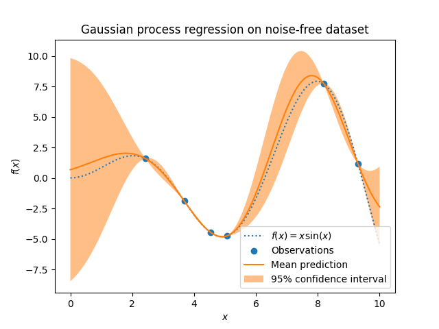
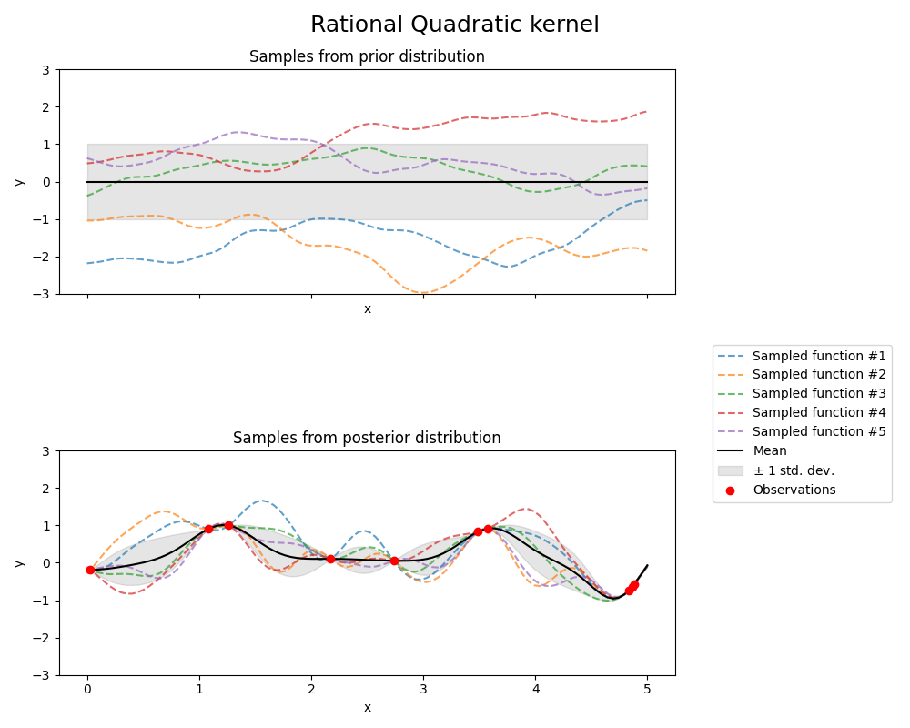
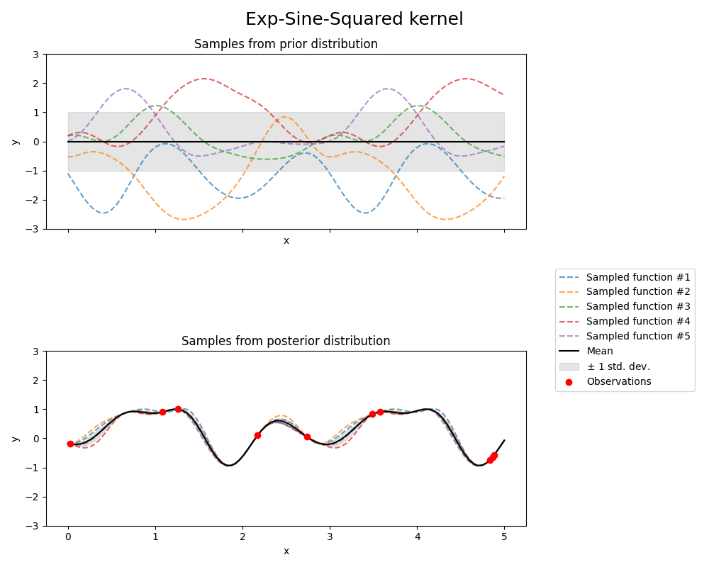
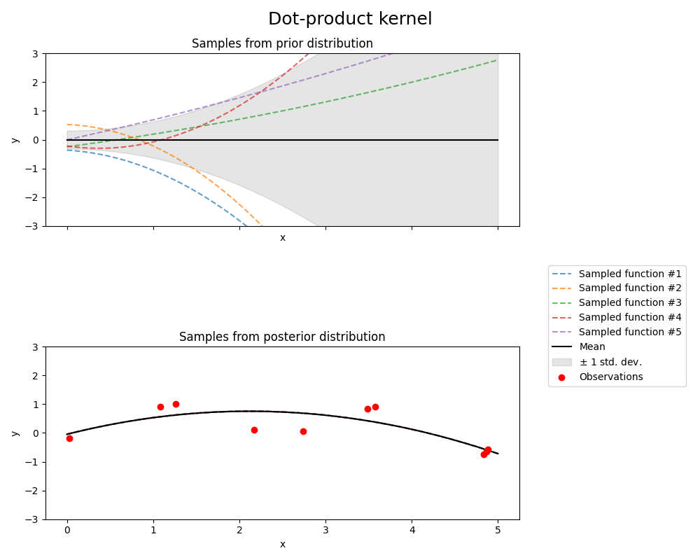

عمليات غاوس
==================

**عمليات غاوس (GP)** هي طريقة تعلم إشرافية غير معلمية تستخدم
لحل مشكلات *الانحدار* و *التصنيف الاحتمالي*.

مزايا عمليات غاوس هي:

- التنبؤ يعترض ملاحظات (على الأقل للنوى العادية).

- التنبؤ احتمالي (غاوسي) بحيث يمكن حساب
فترات الثقة التجريبية والبت على أساسها إذا كان ينبغي
إعادة التثبيت (التثبيت عبر الإنترنت، التثبيت التكيفي) التنبؤ في بعض
منطقة الاهتمام.

- متعدد الاستخدامات: يمكن تحديد نوى مختلفة :ref:`<gp_kernels>`. يتم توفير النواة الشائعة، ولكن
من الممكن أيضًا تحديد نوى مخصصة.

تشمل عيوب عمليات غاوس ما يلي:

- تنفيذنا ليس ضئيلًا، أي أنه يستخدم عينات/معلومات ميزة كاملة
أداء التنبؤ.

- تفقد الكفاءة في المساحات ذات الأبعاد العالية - وبالتحديد عندما يتجاوز عدد
تتجاوز العشرات القليلة من الميزات.

انحدار عملية غاوس
==================

.. currentmodule:: sklearn.gaussian_process

: class: `GaussianProcessRegressor` ينفذ عمليات غاوس (GP) لأغراض الانحدار. لهذا، يجب تحديد سابق لـ GP. سوف
ستجمع GP بين هذه السابقة ودالة الاحتمالية بناءً على عينات التدريب.
إنه يسمح باتباع نهج احتمالي للتنبؤ من خلال إعطاء المتوسط والانحراف المعياري
كإخراج عند التنبؤ.

يُفترض أن متوسط القيمة السابقة ثابتًا وصفرًا (بالنسبة إلى `normalize_y=False`) أو
متوسط بيانات التدريب (بالنسبة إلى `normalize_y=True`). يتم تحديد تغاير القيمة السابقة
من خلال تمرير كائن :ref:`kernel <gp_kernels>`. يتم تحسين فرط معلمات النواة عند تركيب
: class: `GaussianProcessRegressor`
من خلال تعظيم سجل الهامشية-الاحتمالية (LML) بناءً على
`المحسن` الممرّر. نظرًا لأن LML قد يكون له العديد من القيم المثلى المحلية، فيمكن
يمكن بدء المحسن بشكل متكرر عن طريق تحديد `n_restarts_optimizer`. يتم دائمًا إجراء الجريان الأول
بدءًا من قيم فرط المعلمات الأولية للنواة؛
يتم إجراء الجولات اللاحقة من القيم التي تم اختيارها بشكل عشوائي
من نطاق القيم المسموح بها. إذا كان يجب الاحتفاظ بفرط المعلمات الأولية
ثابت، يمكن تمرير `None` كمحسن.

يمكن تحديد مستوى الضوضاء في الأهداف عن طريق تمريره عبر
المعلمة `alpha`، إما على المستوى العالمي كقيمة قياسية أو لكل نقطة بيانات. لاحظ أن مستوى الضوضاء المعتدل
يمكن أن يكون مفيدًا أيضًا في التعامل مع عدم الاستقرار العددي أثناء
التوصيل لأنه يتم تنفيذه بشكل فعال على أنه عادية
الانتظام، أي عن طريق إضافته إلى القطر
مصفوفة النواة. بدلاً من تحديد مستوى الضوضاء بشكل صريح، هو
بديل لإدراج مكون
: class: `sklearn.gaussian_process.kernels.WhiteKernel` في
النواة، والتي يمكنها تقدير مستوى الضوضاء العالمي من البيانات (انظر المثال
أدناه). يوضح الشكل أدناه تأثير الهدف الضبابي الذي تم التعامل معه عن طريق
تعيين المعلمة `alpha`.

.. figure:: ../auto_examples/gaussian_process/images/sphx_glr_plot_gpr_noisy_targets_003.png
   :target: ../auto_examples/gaussian_process/plot_gpr_noisy_targets.html
   :align: center

يستند التنفيذ إلى الخوارزمية 2.1 من [RW2006] _. بالإضافة إلى
واجهة برمجة التطبيقات الخاصة بمقدّري Scikit-learn القياسي، : class: `GaussianProcessRegressor`:

* يسمح بالتنبؤ بدون تركيب مسبق (بناءً على سابق GP)

* يوفر طريقة إضافية ``sample_y(X)``، والتي تقيّم العينات
تم رسمها من GPR (سابق أو لاحق) في إدخالات معينة

* يكشف عن طريقة ``log_marginal_likelihood(theta)``، والتي يمكن استخدامها
خارجيًا لطرق أخرى لاختيار فرط المعلمات، على سبيل المثال، عبر
سلسلة ماركوف مونت كارلو.

.. rubric:: أمثلة

* : ref: `sphx_glr_auto_examples_gaussian_process_plot_gpr_noisy_targets.py <sphx_glr_auto_examples_gaussian_process_plot_gpr_noisy_targets.py>`
* : ref: `sphx_glr_auto_examples_gaussian_process_plot_gpr_noisy.py <sphx_glr_auto_examples_gaussian_process_plot_gpr_noisy.py>`
* : ref: `sphx_glr_auto_examples_gaussian_process_plot_compare_gpr_krr.py <sphx_glr_auto_examples_gaussian_process_plot_compare_gpr_krr.py>`
* : ref: `sphx_glr_auto_examples_gaussian_process_plot_gpr_co2.py <sphx_glr_auto_examples_gaussian_process_plot_gpr_co2.py>`

.. _gpc:

تصنيف عملية غاوس
==================

.. currentmodule:: sklearn.gaussian_process

: class: `GaussianProcessClassifier` ينفذ عمليات غاوس (GP) لأغراض التصنيف، وبالتحديد لأغراض التصنيف الاحتمالي،
حيث تأخذ تنبؤات الاختبار شكل احتمالات الفئات.
يضع GaussianProcessClassifier سابق GP على وظيفة كامنة :math:`f`،
والذي يتم بعد ذلك سحقه من خلال دالة ارتباط للحصول على التصنيف الاحتمالي. الوظيفة الكامنة :math:`f`
هي ما يسمى وظيفة الإزعاج، والتي
القيم غير مرصودة وغير ذات صلة في حد ذاتها.
الغرض منه هو السماح بصياغة ملائمة للنموذج، و :math:`f`
يتم إزالته (دمجه) أثناء التنبؤ. ينفذ GaussianProcessClassifier دالة الارتباط اللوغاريتمية، والتي
لا يمكن حساب التكامل التحليلي لها ولكنه يسهل تقريبه في الحالة الثنائية.

على عكس إعداد الانحدار، فإن اللاحق من
الوظيفة الكامنة :math:`f` ليست غاوسية حتى بالنسبة إلى سابق GP منذ
من غير المناسب استخدام احتمال غاوسي لعلامات تصنيف منفصلة. بدلاً من ذلك، يتم استخدام احتمال غير غاوسي
التي تتوافق مع دالة الارتباط اللوغاريتمية (اللوغاريتم).
يقوم GaussianProcessClassifier بتقريب اللاحق غير الغاوسي باستخدام غاوسي
بناءً على تقريب لابلاس. يمكن العثور على مزيد من التفاصيل في
الفصل 3 من [RW2006] _.

يُفترض أن متوسط القيمة السابقة يساوي الصفر. يتم تحديد تغاير القيمة السابقة
من خلال تمرير كائن :ref:`kernel <gp_kernels>`. يتم تحسين فرط معلمات النواة أثناء تركيب
: class: `GaussianProcessRegressor` عن طريق تعظيم سجل الهامشية
الاحتمالية (LML) بناءً على ``المحسن`` الممرّر. نظرًا لأن LML قد يكون له العديد من القيم المثلى المحلية، فيمكن
يمكن بدء المحسن بشكل متكرر عن طريق تحديد ``n_restarts_optimizer``. يتم دائمًا إجراء الجريان الأول
بدءًا من قيم فرط المعلمات الأولية للنواة؛
يتم إجراء الجولات اللاحقة من القيم التي تم اختيارها بشكل عشوائي
من نطاق القيم المسموح بها. إذا كان يجب الاحتفاظ بفرط المعلمات الأولية
ثابت، يمكن تمرير `None` كمحسن.

يدعم : class: `GaussianProcessClassifier` التصنيف متعدد الفئات
عن طريق إجراء تدريب وتنبؤ إما على أساس واحد مقابل بقية أو واحد مقابل واحد. في "one_vs_rest"،
يتم تركيب مصنف عملية غاوس ثنائي واحد لكل فئة، والذي يتم تدريبه على
فصل هذه الفئة عن بقية الفئات. في "one_vs_one"، يتم تركيب مصنف عملية غاوس ثنائي واحد لكل
زوج من الفئات، والتي يتم تدريبها على فصل هاتين الفئتين. يتم دمج تنبؤات
يتم دمج هذه المتنبئين الثنائيين إلى تنبؤات متعددة الفئات. راجع القسم
: ref: `<multiclass>` لمزيد من التفاصيل.

في حالة تصنيف عملية غاوس، قد يكون "one_vs_one"
أرخص حسابياً لأنه يجب عليه حل العديد من المشكلات التي تتضمن فقط
مجموعة فرعية من مجموعة التدريب بأكملها بدلاً من مشكلات أقل على
مجموعة البيانات بأكملها. نظرًا لأن تصنيف عملية غاوس يتناسب مع مكعب
حجم مجموعة البيانات، فقد يكون هذا أسرع بكثير. ومع ذلك، لاحظ أن
لا يدعم "one_vs_one" تقديرات الاحتمال ولكن فقط التنبؤات العادية. علاوة على ذلك، لاحظ أن : class: `GaussianProcessClassifier`
لا (بعد) تنفيذ تقريب لابلاس متعدد الفئات الحقيقي داخليًا، ولكن
كما نوقش أعلاه، فهو يعتمد على حل العديد من مهام التصنيف الثنائية
داخليا، والتي يتم دمجها باستخدام واحد مقابل بقية أو واحد مقابل واحد.

أمثلة GPC
==========

التنبؤات الاحتمالية مع GPC
---------------------------

يوضح هذا المثال احتمال التنبؤ لـ GPC لنواة RBF
مع خيارات مختلفة لفرط المعلمات. يوضح الشكل الأول
احتمال التنبؤ لـ GPC مع فرط معلمات مختارة بشكل تعسفي ومع
فرط المعلمات المقابلة للاحتمالية الهامشية القصوى (LML).

في حين أن فرط المعلمات التي تم اختيارها عن طريق تحسين LML لها
احتمالية هامشية أكبر بشكل ملحوظ، إلا أنها تؤدي بشكل أسوأ قليلاً وفقًا للخسارة اللوجستية على بيانات الاختبار.
يوضح الشكل أن هذا يرجع إلى أنها تعرض
تغيير حاد في احتمالات الفئات عند حدود الفئة (وهو أمر جيد) ولكن
احتمالات التنبؤ القريبة من 0.5 بعيدًا عن حدود الفئة (وهو أمر سيء)
يحدث هذا التأثير غير المرغوب فيه بسبب تقريب لابلاس المستخدم
داخليًا بواسطة GPC.

يوضح الشكل الثاني الاحتمالية الهامشية للوجستية لاختيارات مختلفة
فرط معلمات النواة، مع تسليط الضوء على اختياري فرط المعلمات المستخدمة في
الشكل الأول بنقطتين سوداوين.

.. figure:: ../auto_examples/gaussian_process/images/sphx_glr_plot_gpc_001.png
   :target: ../auto_examples/gaussian_process/plot_gpc.html
   :align: center

.. figure:: ../auto_examples/gaussian_process/images/sphx_glr_plot_gpc_002.png
   :target: ../auto_examples/gaussian_process/plot_gpc.html
   :align: center

توضيح GPC على مجموعة بيانات XOR
------------------------------

.. currentmodule:: sklearn.gaussian_process.kernels

يوضح هذا المثال GPC على بيانات XOR. تتم مقارنة النواة الثابتة، متساوية الخواص
النواة (: class: `RBF`) ونواة غير ثابتة (: class: `DotProduct`). في
هذه المجموعة من البيانات بالذات، تحصل نواة : class: `DotProduct` على نتائج أفضل بكثير لأن
حدود الفئة خطية وتتزامن مع محاور الإحداثيات. ومع ذلك، في
الممارسة العملية، غالبًا ما تحصل النواة المتساوية الخواص مثل : class: `RBF`
نتائج أفضل.

.. figure:: ../auto_examples/gaussian_process/images/sphx_glr_plot_gpc_xor_001.png
   :target: ../auto_examples/gaussian_process/plot_gpc_xor.html
   :align: center

.. currentmodule:: sklearn.gaussian_process

تصنيف عملية غاوس (GPC) على مجموعة بيانات Iris
------------------------------------------

يوضح هذا المثال احتمال التنبؤ لـ GPC لنواة RBF متساوية الخواص ومتغايرة الخواص
على إصدار ثنائي الأبعاد لمجموعة بيانات Iris. يوضح هذا مثال على قابلية تطبيق GPC على
تصنيف متعدد الفئات غير ثنائي.
تحصل نواة RBF متغايرة الخواص على احتمال هامشي أعلى قليلاً عن طريق
تعيين مقاييس طول مختلفة لبعدي الميزة.

.. figure:: ../auto_examples/gaussian_process/images/sphx_glr_plot_gpc_iris_001.png
   :target: ../auto_examples/gaussian_process/plot_gpc_iris.html
   :align: center

.. _gp_kernels:

نوى لعمليات غاوس
نوى (تسمى أيضًا "دالات الارتباط" في سياق عمليات غاوس) هي مكون أساسي لعمليات غاوس التي تحدد شكل التوزيع السابق والتالي لعملية غاوس. إنها تشفر الافتراضات حول الدالة التي يجري تعلمها من خلال تعريف "التشابه" لنقطتي بيانات مجتمعتين مع الافتراض بأن نقاط البيانات المتشابهة يجب أن يكون لها قيم مستهدفة مماثلة. يمكن تمييز فئتين من النواة: تعتمد النواة الثابتة فقط على مسافة نقطتي بيانات وليس على قيمهما المطلقة :math:k(x_i, x_j)= k(d(x_i, x_j))، وبالتالي فهي لا تتغير بالنسبة للترجمات في مساحة الإدخال، في حين أن النواة غير الثابتة تعتمد أيضًا على القيم المحددة لنقاط البيانات. يمكن تقسيم النواة الثابتة بشكل أكبر إلى نوى متساوية الخواص ونوى غير متساوية الخواص، حيث تكون النواة المتساوية الخواص ثابتة أيضًا بالنسبة للدوران في مساحة الإدخال. لمزيد من التفاصيل، يمكن الرجوع إلى الفصل 4 من [RW2006]_. للحصول على إرشادات حول كيفية الجمع بين النواة المختلفة بشكل أفضل، يمكن الرجوع إلى [Duv2014]_.

.. dropdown:: واجهة برمجة التطبيقات لنواة عملية غاوس

   الاستخدام الرئيسي ل :class: 'Kernel' هو حساب الارتباط المشترك لعملية غاوس بين نقاط البيانات. للقيام بذلك، يمكن استدعاء طريقة ``__call__`` للنواة. يمكن استخدام هذه الطريقة لحساب "الارتباط الذاتي" لجميع أزواج نقاط البيانات في مصفوفة ثنائية الأبعاد X، أو "الارتباط المشترك" لجميع تركيبات نقاط البيانات في مصفوفة ثنائية الأبعاد X مع نقاط البيانات في مصفوفة ثنائية الأبعاد Y. الهوية التالية صحيحة لجميع النواة k (باستثناء :class: 'WhiteKernel'): ``k(X) == K(X, Y=X)``

   إذا تم استخدام القطر فقط للارتباط الذاتي، فيمكن استدعاء طريقة ``diag()`` للنواة، والتي تكون أكثر كفاءة من الناحية الحسابية من المكالمات المكافئة إلى ``__call__``: ``np.diag(k(X, X)) == k.diag(X)``

   يتم معلمجة النواة بواسطة متجه :math: 'theta' من فرط المعلمات. يمكن لهذه المعلمات فائقة التحكم، على سبيل المثال، في مقاييس الطول أو الدورية للنواة (انظر أدناه). تدعم جميع النواة حساب التدرجات التحليلية للارتباط الذاتي للنواة فيما يتعلق بـ :math: 'log(theta)' من خلال تعيين ``eval_gradient=True`` في طريقة ``__call__``.
   أي يتم إرجاع مصفوفة "len(X)، len(X)، len(theta)" حيث يحتوي الإدخال " [i، j، l]" على: :math: '\ partial_ {k_theta} (x_i، x_j) / \ partial_ {log (\ theta_l)} `.
   يستخدم هذا التدرج بواسطة عملية غاوس (كل من المُرجِّع والمُصنِّف) في حساب تدرج سجل الاحتمالية الهامشية، والذي يستخدم بدوره لتحديد قيمة :math: 'theta'، والتي تزيد من سجل الاحتمالية الهامشية، من خلال الصعود التدريجي. بالنسبة لكل معلمة فائقة، يجب تحديد القيمة الأولية والحدود عند إنشاء مثيل للنواة. يمكن الحصول على القيمة الحالية لـ :math: 'theta' وتعيينها عبر خاصية ``theta`` لموضوع النواة. علاوة على ذلك، يمكن الوصول إلى حدود المعلمات الفائقة من خلال خاصية ``bounds`` للنواة. لاحظ أن كلا الخاصيتين (theta وbounds) تعيدان القيم المحولة بواسطة الدالة اللوغاريتمية للقيم المستخدمة داخليًا نظرًا لأنها أكثر ملاءمة للتحسين القائم على التدرج.
   يتم تخزين مواصفات كل معلمة فائقة في شكل مثيل من :class: 'Hyperparameter' في النواة المقابلة. لاحظ أنه يجب أن يكون للنواة التي تستخدم معلمة فائقة باسم "x" السمات self.x وself.x_bounds.

   الفئة الأساسية المجردة لجميع النواة هي :class: 'Kernel'. تقوم النواة بتنفيذ واجهة مماثلة لـ :class: '~sklearn.base.BaseEstimator'، وتوفر الطرق ``get_params()``، و ``set_params()``، و ``clone()``. يسمح ذلك بتعيين قيم النواة أيضًا عبر المُقدرات الفائقة مثل :class: '~sklearn.pipeline.Pipeline' أو :class: '~sklearn.model_selection.GridSearchCV'. لاحظ أنه بسبب البنية المضمنة للنواة (من خلال تطبيق مشغلات النواة، راجع أدناه)، قد تصبح أسماء معلمات النواة معقدة إلى حد ما. بشكل عام، بالنسبة لمشغل النواة الثنائي، يتم إضافة البادئات "k1__" و "k2__" إلى معلمات المشغل الأيسر والأيمن، على التوالي. هناك طريقة راحة إضافية هي ``clone_with_theta(theta)``، والتي تعيد نسخة من النواة ولكن مع المعلمات الفائقة المحددة إلى "theta". مثال توضيحي:

      >>> from sklearn.gaussian_process.kernels import ConstantKernel, RBF
      >>> kernel = ConstantKernel(constant_value=1.0, constant_value_bounds=(0.0, 10.0)) * RBF(length_scale=0.5, length_scale_bounds=(0.0, 10.0)) + RBF(length_scale=2.0, length_scale_bounds=(0.0, 10.0))
      >>> for hyperparameter in kernel.hyperparameters: print(hyperparameter)
      Hyperparameter(name='k1__k1__constant_value', value_type='numeric', bounds=array([[ 0., 10.]]), n_elements=1, fixed=False)
      Hyperparameter(name='k1__k2__length_scale', value_type='numeric', bounds=array([[ 0., 10.]]), n_elements=1, fixed=False)
      Hyperparameter(name='k2__length_scale', value_type='numeric', bounds=array([[ 0., 10.]]), n_elements=1, fixed=False)
      >>> params = kernel.get_params()
      >>> for key in sorted(params): print("%s : %s" % (key, params[key]))
      k1 : 1**2 * RBF(length_scale=0.5)
      k1__k1 : 1**2
      k1__k1__constant_value : 1.0
      k1__k1__constant_value_bounds : (0.0, 10.0)
      k1__k2 : RBF(length_scale=0.5)
      k1__k2__length_scale : 0.5
      k1__k2__length_scale_bounds : (0.0, 10.0)
      k2 : RBF(length_scale=2)
      k2__length_scale : 2.0
      k2__length_scale_bounds : (0.0, 10.0)
      >>> print(kernel.theta)  # لاحظ: محول لوغاريتميًا
      [ 0.         -0.69314718  0.69314718]
      >>> print(kernel.bounds)  # لاحظ: محول لوغاريتميًا
      [[      -inf 2.30258509]
      [      -inf 2.30258509]
      [      -inf 2.30258509]]

   جميع نوى عملية غاوس متوافقة مع :mod: 'sklearn.metrics.pairwise' والعكس صحيح: يمكن تمرير مثيلات الفئات الفرعية لـ :class: 'Kernel' كـ ``metric`` إلى ``pairwise_kernels`` من :mod: 'sklearn.metrics.pairwise'. علاوة على ذلك، يمكن استخدام دالات النواة من pairwise كنوى غاوسية من خلال استخدام فئة الغلاف :class: 'PairwiseKernel'. التحذير الوحيد هو أن تدرج المعلمات الفائقة ليس تحليليًا ولكنه رقمي وأن جميع هذه النواة تدعم فقط المسافات متساوية الخواص. تعتبر المعلمة "gamma" معلمة فائقة ويمكن تحسينها. يتم تعيين معلمات النواة الأخرى مباشرة عند التهيئة ويتم تثبيتها.

النوى الأساسية
-------------
يمكن استخدام نواة :class: 'ConstantKernel' كجزء من نواة :class: 'Product' حيث تقوم بمقياس حجم العامل الآخر (النواة) أو كجزء من نواة :class: 'Sum'، حيث تقوم بتعديل متوسط عملية غاوس. إنه يعتمد على معلمة :math: 'constant_value'. يتم تعريفها على النحو التالي:

.. math::
   k(x_i, x_j) = constant_value \؛ \ forall \؛ x_1، x_2

يتمثل الاستخدام الأساسي لنواة :class: 'WhiteKernel' في كونها جزءًا من نواة الجمع حيث تفسر مكون الضوضاء للإشارة. يتطابق ضبط معلمتها :math: 'noise_level' مع تقدير مستوى الضوضاء. يتم تعريفها على النحو التالي:

.. math::
    k(x_i, x_j) = noise_level \ text {if} x_i == x_j \ text {else} 0

مشغلات النواة
----------------
تأخذ مشغلات النواة نواة أساسية واحدة أو نواتين وتجمعها في نواة جديدة. تأخذ نواة :class: 'Sum' نواتين :math: 'k_1' و :math: 'k_2' وتجمعها عبر: :math: 'k_ {sum} (X، Y) = k_1 (X، Y) + k_2 (X، Y) `.
تأخذ نواة :class: 'Product' نواتين :math: 'k_1' و :math: 'k_2' وتجمعها عبر: :math: 'k_ {product} (X، Y) = k_1 (X، Y) * k_2 (X، Y) `.
تأخذ نواة :class: 'Exponentiation' نواة أساسية واحدة ومعلمة قياسية :math: 'p' وتجمعها عبر
:math: 'k_ {exp} (X، Y) = k (X، Y) ^ p `.
لاحظ أنه يتم تجاوز الأساليب السحرية ``__add__``، و ``__mul___`` و ``__pow__`` على كائنات Kernel، لذا يمكن استخدامها على سبيل المثال ``RBF() + RBF()`` كاختصار لـ ``Sum(RBF()، RBF())``.

نواة الدالة الأسية الجذرية (RBF)
----------------------------------
نواة :class: 'RBF' هي نواة ثابتة. كما أنه يُعرف باسم النواة "المتسارعة التربيعية". يتم معلمجتها بواسطة معلمة مقياس طول :math: 'l>0'، والتي يمكن أن تكون إما قياسية (النسخة متساوية الخواص للنواة) أو متجهًا بنفس عدد الأبعاد مثل المدخلات :math: 'x' (النسخة غير متساوية الخواص للنواة).
النواة هي:

.. math::
   k(x_i, x_j) = \ text {exp} \ left (- \ frac {d (x_i، x_j) ^ 2} {2l ^ 2} \ right)

حيث :math: 'd (،) ' هي المسافة الإقليدية.
هذه النواة قابلة للاشتقاق بشكل لا نهائي، مما يعني أن عمليات غاوس بهذه النواة كدالة ارتباط لها مشتقات تربيعية متوسطة من جميع الأوامر، وبالتالي فهي سلسة جدًا. يتم عرض التوزيع السابق والتالي لعملية غاوس الناتجة عن نواة RBF في الشكل التالي:

.. figure:: ../auto_examples/gaussian_process/images/sphx_glr_plot_gpr_prior_posterior_001.png
   :target: ../auto_examples/gaussian_process/plot_gpr_prior_posterior.html
   :align: center

نواة Matérn
-------------
نواة :class: 'Matern' هي نواة ثابتة وعمومية لنواة :class: 'RBF'. لديها معلمة إضافية :math: 'nu' والتي تتحكم في نعومة الدالة الناتجة. يتم معلمجتها بواسطة معلمة مقياس طول :math: 'l>0'، والتي يمكن أن تكون إما قياسية (النسخة متساوية الخواص للنواة) أو متجهًا بنفس عدد الأبعاد مثل المدخلات :math: 'x' (النسخة غير متساوية الخواص للنواة).

.. dropdown:: التنفيذ الرياضي لنواة Matérn

   تعطى النواة بالصيغة التالية:

   .. math::

      k(x_i, x_j) = \frac{1}{\Gamma(\nu)2^{\nu-1}}\Bigg(\frac{\sqrt{2\nu}}{l} d(x_i , x_j )\Bigg)^\nu K_\nu\Bigg(\frac{\sqrt{2\nu}}{l} d(x_i , x_j )\Bigg)،

   حيث :math: 'd (،) ' هي المسافة الإقليدية، :math: 'K_nu (.) ' هي دالة بيسل المعدلة و :math: 'Gamma (.) ' هي دالة غاما.
   مع :math: 'nu \ rightarrow \ infty`، تتقارب نواة Matérn مع نواة RBF.
   عندما :math: 'nu = 1/2`، تصبح نواة Matérn متطابقة مع النواة الأسية المطلقة، أي

   .. math::
      k(x_i, x_j) = \exp \ Bigg (- \ frac {1} {l} d (x_i ، x_j) \ Bigg) \ quad \ quad \ nu= \ tfrac {1} {2}

   على وجه الخصوص، :math: 'nu = 3/2`:

   .. math::
      k(x_i, x_j) = \ Bigg (1 + \ frac {\ sqrt {3}} {l} d (x_i ، x_j) \ Bigg) \ exp \ Bigg (-\ frac {\ sqrt {3}} {l} d (x_i ، x_j) \ Bigg) \ quad \ quad \ nu= \ tfrac {3} {2}

   و:math: 'nu = 5/2`:

   .. math::
      k(x_i, x_j) = \Bigg(1 + \frac{\sqrt{5}}{l} d(x_i , x_j ) +\frac{5}{3l} d(x_i , x_j )^2 \Bigg) \exp \Bigg(-\frac{\sqrt{5}}{l} d(x_i , x_j ) \Bigg) \quad \quad \nu= \tfrac{5}{2}

   هي خيارات شائعة لتعلم الدوال التي ليست قابلة للاشتقاق بشكل لا نهائي (كما يفترض نواة RBF) ولكنها مشتقة على الأقل مرة واحدة (:math: 'nu = 3/2`) أو مشتقة مرتين (:math: 'nu = 5/2`).

   تسمح مرونة التحكم في نعومة الدالة المكتسبة عبر :math: 'nu` بالتكيف مع خصائص العلاقة الوظيفية الأساسية الحقيقية.

يتم عرض التوزيع السابق والتالي لعملية غاوس الناتجة عن نواة Matérn في الشكل التالي:

.. figure:: ../auto_examples/gaussian_process/images/sphx_glr_plot_gpr_prior_posterior_005.png
   :target: ../auto_examples/gaussian_process/plot_gpr_prior_posterior.html
   :align: center

راجع [RW2006]_، الصفحة 84 لمزيد من التفاصيل حول
الاختلافات المختلفة لنواة Matérn.

نواة تربيعية عقلانية
-------------------------

يمكن اعتبار نواة :class: 'RationalQuadratic' مزيجًا مقياسيًا (مجموعًا لا نهائيًا)
من نوى :class: 'RBF' ذات مقاييس طول مختلفة. يتم معلمجتها بواسطة معلمة مقياس طول :math: 'l>0' ومعلمة مزيج مقياس :math: 'alpha>0'
يتم دعم المتغير متساوي الخواص فقط حيث :math: 'l' عبارة عن قيمة قياسية في الوقت الحالي.
النواة هي:

.. math::
   k(x_i, x_j) = \left(1 + \frac{d(x_i, x_j)^2}{2\alpha l^2}\right)^{-\alpha}

يتم عرض التوزيع السابق والتالي لعملية غاوس الناتجة عن نواة تربيعية عقلانية في الشكل التالي:

   :align
نواة :class: `ExpSineSquared` تسمح بنمذجة الدوال الدورية.
يتم معلمتها بواسطة معلم طول المقياس :math: `l>0` ومعلم الدورية
:math: `p>0`. فقط المتغير اللااتجاهي حيث :math: `l` هو كمية قياسية مدعوم حالياً.
النواة معطاة بالشكل التالي:

.. math::
   k(x_i, x_j) = \text{exp}\left(- \frac{ 2\sin^2(\pi d(x_i, x_j) / p) }{ l^ 2} \right)

التوزيع السابق والتالي لمتغير عشوائي غاوسي الناتج عن نواة ExpSineSquared موضحان في
الشكل التالي:

نواة الضرب النقطي
------------------

نواة :class: `DotProduct` غير ثابتة ويمكن الحصول عليها من الانحدار الخطي
بوضع توزيع :math: `N(0, 1)` سابق على معاملات :math: `x_d (d = 1, . . . , D)` وتوزيع
سابق :math: `N(0, \sigma_0^2)` على الانحدار. نواة :class: `DotProduct` ثابتة بالنسبة لدوران
الإحداثيات حول الأصل، ولكن ليست ثابتة بالنسبة للترجمات.
يتم معلمتها بواسطة معلم :math: `\sigma_0^2`. بالنسبة لـ :math: `\sigma_0^2 = 0`، تسمى النواة
بالنواة الخطية المتجانسة، وإلا فهي غير متجانسة. النواة معطاة بالشكل التالي:

.. math::
   k(x_i, x_j) = \sigma_0 ^ 2 + x_i \cdot x_j

عادة ما يتم دمج نواة :class: `DotProduct` مع أسّة. مثال على الأسّة 2 موضح في
الشكل التالي:

مراجع
----------

.. [RW2006] `Carl E. Rasmussen and Christopher K.I. Williams,
   "Gaussian Processes for Machine Learning",
   MIT Press 2006 <https://www.gaussianprocess.org/gpml/chapters/RW.pdf>`_

.. [Duv2014] `David Duvenaud, "The Kernel Cookbook: Advice on Covariance functions", 2014
   <https://www.cs.toronto.edu/~duvenaud/cookbook/>`_

.. currentmodule:: sklearn.gaussian_process