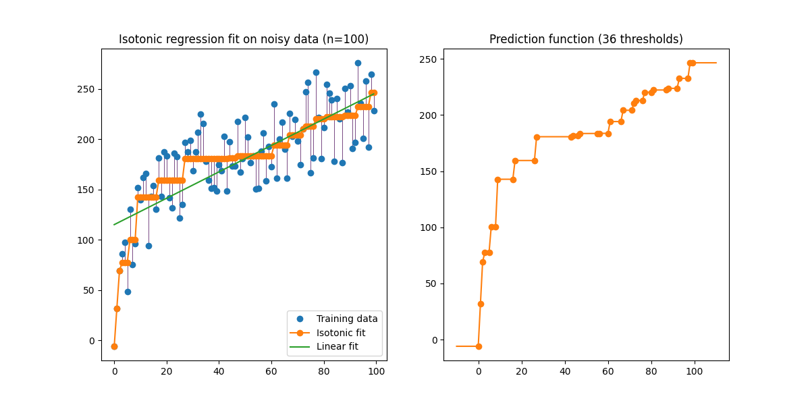

.. _التنظيم-الإسواتوني:

===================
التنظيم الإسواتوني
===================

.. currentmodule:: sklearn.isotonic

تتلاءم فئة :class:`IsotonicRegression` مع دالة حقيقية غير متناقصة
لبيانات أحادية البعد. يحل المشكلة التالية:

.. math::
    \min \sum_i w_i (y_i - \hat{y}_i)^2

رهنا ب:math:`\hat{y}_i \le \hat{y}_j` عندما :math:`X_i \le X_j`،
حيث تكون الأوزان :math:`w_i` موجبة بشكل صارم، وكل من `X` و`y`
كميات حقيقية اختيارية.

يغير معامل 'increasing' القيد إلى
:math:`\hat{y}_i \ge \hat{y}_j` عندما :math:`X_i \le X_j`. يؤدي تعيينه إلى
'auto' إلى اختيار القيد تلقائيًا بناءً على 'معامل ارتباط رتبة Spearman
<https://en.wikipedia.org/wiki/Spearman%27s_rank_correlation_coefficient>`_.

:class:`IsotonicRegression` ينتج سلسلة من التوقعات
:math:`\hat{y}_i` لبيانات التدريب التي هي الأقرب إلى الأهداف
:math:`y` من حيث متوسط خطأ المربعات. يتم استيفاء هذه التوقعات
للتنبؤ بالبيانات غير المرئية. وبالتالي، تشكل تنبؤات :class:`IsotonicRegression`
دالة خطية قطعة:

.. rubric:: أمثلة

* :ref:`sphx_glr_auto_examples_miscellaneous_plot_isotonic_regression.py`