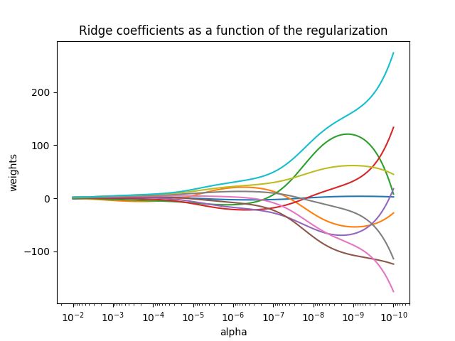
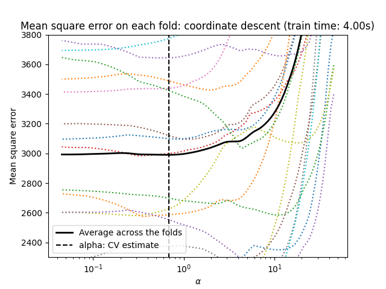
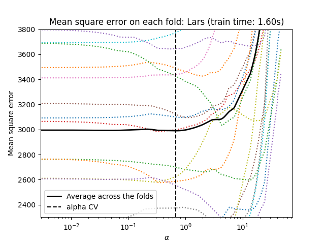
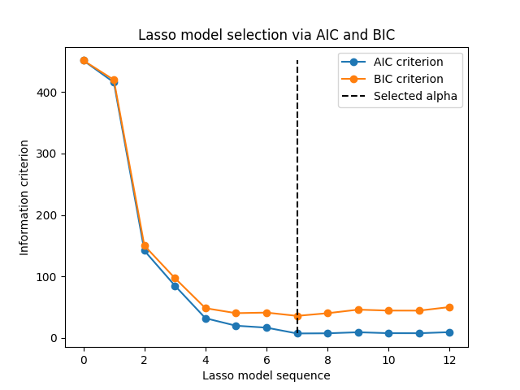
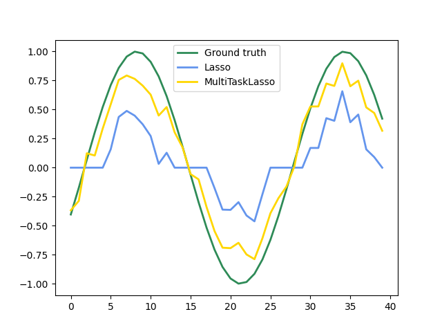
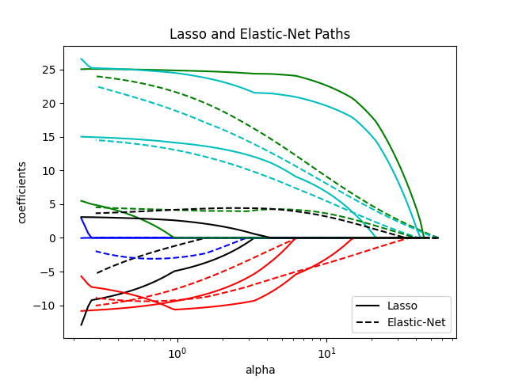

نُظم "Linear Models" الخطية
================================

.. currentmodule:: sklearn.linear_model

المنهجية التالية هي مجموعة من الطرق المُستخدمة في الانحدار، حيث
يُتوقع أن تكون القيمة المُستهدفة مزيجًا خطيًا من الميزات.
في الصيغة الرياضية، إذا كان :math:`\hat{y}` هو القيمة المُتوقعة.

.. math::    \hat{y}(w, x) = w_0 + w_1 x_1 + ... + w_p x_p

في جميع أنحاء الوحدة النمطية، نُشير إلى المتجه :math:`w = (w_1,
..., w_p)` باسم "coef_" و :math:`w_0` باسم "intercept_".

لتنفيذ التصنيف باستخدام النماذج الخطية المعممة، راجع
:ref: `Logistic_regression`.

انحدار المربعات الصغرى العادي
-----------------------------

:class: `LinearRegression` يلائم نموذجًا خطيًا بمعاملات
:math:`w = (w_1, ..., w_p)` لتقليل مجموع مربعات الانحدار بين الأهداف المُلاحظة في مجموعة البيانات،
والأهداف التي يتنبأ بها التقدير الخطي. رياضيا، يحل مشكلة على الشكل:

.. math:: \min_{w} || X w - y||_2^2

.. figure:: ../auto_examples/linear_model/images/sphx_glr_plot_ols_001.png
   :target: ../auto_examples/linear_model/plot_ols.html
   :align: center
   :scale: 50%

سيقبل :class: `LinearRegression` في طريقة "fit" الخاصة به المصفوفات "X"، "y"
وسيخزن معاملات :math:`w` للنموذج الخطي في عضو "coef_" الخاص به::

    >>> from sklearn import linear_model
    >>> reg = linear_model.LinearRegression()
    >>> reg.fit([[0, 0], [1, 1], [2, 2]], [0, 1, 2])
    LinearRegression()
    >>> reg.coef_
    array([0.5, 0.5])

تعتمد تقديرات المعاملات لانحدار المربعات الصغرى العادي على
استقلالية الميزات. عندما تكون الميزات مترابطة وتكون أعمدة مصفوفة التصميم :math:`X`
ذات اعتماد خطي تقريبي، فإن مصفوفة التصميم تقترب من الحالة الفردية
ونتيجة لذلك، يصبح تقدير المربعات الصغرى شديد الحساسية
للأخطاء العشوائية في الهدف المُلاحظ، مما يؤدي إلى تباين كبير.
يمكن أن ينشأ هذا الوضع من "تعدد الارتباط" على سبيل المثال،
عندما تُجمع البيانات بدون تصميم تجريبي.

.. rubric:: الأمثلة

* :ref:`sphx_glr_auto_examples_linear_model_plot_ols.py`

المربعات الصغرى غير السالبة
--------------------------

من الممكن تقييد جميع المعاملات لتكون غير سالبة، والتي قد
تكون مفيدة عندما تمثل بعض الكميات الفيزيائية أو الطبيعية غير السالبة
(على سبيل المثال، ترددات العد أو أسعار السلع).
يقبل :class: `LinearRegression` معلمة منطقية "positive":
عندما يتم تعيينها إلى `True`، يتم تطبيق "المربعات الصغرى غير السالبة
<https://en.wikipedia.org/wiki/Non-negative_least_squares>`_.

.. rubric:: الأمثلة

* :ref:`sphx_glr_auto_examples_linear_model_plot_nnls.py`

تعقيد انحدار المربعات الصغرى العادي
---------------------------------

يتم حساب حل المربعات الصغرى باستخدام التحلل القيمي المنفرد للمصفوفة "X".
إذا كانت "X" مصفوفة ذات شكل `(n_samples، n_features)`
فإن لهذه الطريقة تكلفة تبلغ
:math:`O(n_{\text{samples}} n_{\text{features}}^2)`، بافتراض أن
:math:`n_{\text{samples}} \geq n_{\text{features}}`.

انحدار وتصنيف Ridge
=====================

انحدار
------

يعالج :class: `Ridge` الانحدار بعض مشكلات
:ref: `ordinary_least_squares` من خلال فرض عقوبة على حجم المعاملات.
تقلل معاملات Ridge من مجموع مربعات الانحدار المعاقب عليه:

.. math::

   \min_{w} || X w - y||_2^2 + \alpha ||w||_2^2

تتحكم معلمة التعقيد :math:`\alpha \geq 0` في مقدار
الانكماش: كلما زادت قيمة :math:`\alpha`، زاد مقدار
الانكماش وبالتالي تصبح المعاملات أكثر مرونة للتعدد الخطي.

كما هو الحال مع النماذج الخطية الأخرى، سيقبل :class: `Ridge` في طريقة "fit" الخاصة به
المصفوفات "X"، "y" وسيخزن معاملات :math:`w` للنموذج الخطي في
عضو "coef_" الخاص به::

    >>> from sklearn import linear_model
    >>> reg = linear_model.Ridge(alpha=.5)
    >>> reg.fit([[0, 0], [0, 0], [1, 1]], [0, .1, 1])
    Ridge(alpha=0.5)
    >>> reg.coef_
    array([0.34545455, 0.34545455])
    >>> reg.intercept_
    0.13636...

لاحظ أن الفئة :class: `Ridge` تسمح للمستخدم بتحديد أن
يتم اختيار المُحسن تلقائيًا عن طريق تعيين `solver="auto"`.
عندما يتم تحديد هذا الخيار، سيختار :class: `Ridge` بين محسنات `"lbfgs"`، `"cholesky"`،
و `"sparse_cg"`. سيبدأ :class: `Ridge` في التحقق من الشروط
الموضحة في الجدول التالي من الأعلى إلى الأسفل. إذا كان الشرط صحيحًا،
يتم اختيار المُحسن المُقابل.

+-------------+----------------------------------------------------+
| **المُحسن**  | **الشرط**                                          |
+-------------+----------------------------------------------------+
| 'lbfgs'     | تم تحديد خيار "positive=True".                     |
+-------------+----------------------------------------------------+
| 'cholesky'  | مصفوفة الإدخال "X" ليست مبعثرة.                   |
+-------------+----------------------------------------------------+
| 'sparse_cg' | لم يتم استيفاء أي من الشروط أعلاه.                |
+-------------+----------------------------------------------------+

تصنيف
------

لمعامل الانحدار :class: `Ridge` مُتغير من التصنيف:
:class: `RidgeClassifier`. يحول هذا المُصنف أولاً الأهداف الثنائية إلى
``{-1، 1}`` ثم يتعامل مع المشكلة على أنها مهمة انحدار، ويحسن الهدف نفسه كما هو موضح أعلاه.
تتوافق الفئة المُتوقعة مع علامة تنبؤ المُصنف. بالنسبة للتصنيف متعدد الفئات،
تتم معالجة المشكلة على أنها انحدار متعدد الإخراج، وتتوافق الفئة المُتوقعة مع
الإخراج الذي يحتوي على أعلى قيمة.

قد يبدو من المشكوك فيه استخدام (المعاقب عليه) خسارة المربعات الصغرى الأقل لتناسب نموذج التصنيف
بدلاً من خسائر اللوغاريتم أو المفصل الأكثر تقليدية. ومع ذلك، في الممارسة العملية،
يمكن أن تؤدي جميع هذه النماذج إلى درجات تحقق متشابهة من حيث الدقة أو الدقة/التذكير،
في حين أن خسارة المربعات الصغرى الأقل المعاقب عليها التي يستخدمها :class: `RidgeClassifier`
تسمح بخيار مختلف جدًا لمحسنات الأرقام مع ملفات تعريف الأداء الحسابي المتميزة.

قد يكون :class: `RidgeClassifier` أسرع بكثير من :class: `LogisticRegression`
على سبيل المثال، مع عدد كبير من الفئات لأنه يمكنه حساب مصفوفة الإسقاط :math:`(X^T X)^{-1} X^T` مرة واحدة فقط.

يُشار إلى هذا المُصنف أحيانًا باسم `Least Squares Support Vector
<https://en.wikipedia.org/wiki/Least-squares_support-vector_machine>`_ مع
نواة خطية.

.. rubric:: الأمثلة

* :ref:`sphx_glr_auto_examples_linear_model_plot_ridge_path.py`
* :ref:`sphmin_glr_auto_examples_text_plot_document_classification_20newsgroups.py`
* :ref:`sphx_glr_auto_examples_inspection_plot_linear_model_coefficient_interpretation.py`

تعقيد Ridge
------------

لهذه الطريقة نفس ترتيب التعقيد مثل
:ref:`ordinary_least_squares`.

.. FIXME:
.. ليس صحيحًا تمامًا: يتم حل OLS بواسطة SVD، بينما يتم حل Ridge بواسطة
.. طريقة المعادلات العادية (Cholesky)، هناك فرق كبير في العمليات الحسابية بين هذه الطرق

ضبط معلمة الضبط: التحقق من صحة الاستبعاد
------------------------------------

ينفذ :class: `RidgeCV` و :class: `RidgeClassifierCV` انحدار/تصنيف Ridge
مع التحقق من صحة مدمج لمعلمة alpha.
إنها تعمل بنفس طريقة :class: `~sklearn.model_selection.GridSearchCV` باستثناء
أنه يُفترض أن يكون الافتراضي هو التحقق من صحة الاستبعاد.
عند استخدام التحقق من الصحة الافتراضي، لا يمكن أن يكون alpha 0 بسبب
الصيغة المستخدمة لحساب خطأ الاستبعاد. راجع [RL2007]_ لمزيد من التفاصيل.

مثال الاستخدام::

    >>> import numpy as np
    >>> from sklearn import linear_model
    >>> reg = linear_model.RidgeCV(alphas=np.logspace(-6, 6, 13))
    >>> reg.fit([[0, 0], [0, 0], [1, 1]], [0, .1, 1])
    RidgeCV(alphas=array([1.e-06, 1.e-05, 1.e-04, 1.e-03, 1.e-02, 1.e-01, 1.e+00, 1.e+01,
          1.e+02, 1.e+03, 1.e+04, 1.e+05, 1.e+06]))
    >>> reg.alpha_
    0.01

يؤدي تحديد قيمة خاصية :term: `cv` إلى تشغيل التحقق من الصحة باستخدام :class: `~sklearn.model_selection.GridSearchCV`،
على سبيل المثال `cv=10` للتحقق من الصحة 10-fold، بدلاً من التحقق من صحة الاستبعاد.

.. dropdown:: المراجع

  .. [RL2007] "ملاحظات حول Least Squares العادية المنتظمة"، Rifkin & Lippert (`التقرير الفني
    <http://cbcl.mit.edu/publications/ps/MIT-CSAIL-TR-2007-025.pdf>`_،
    `شرائح الدورة التدريبية <https://www.mit.edu/~9.520/spring07/Classes/rlsslides.pdf>`_).

.. _lasso:

Lasso
=====

الـ :class:`Lasso` هو نموذج خطي يقدر معاملات متفرقة. إنه مفيد في بعض السياقات بسبب ميله إلى تفضيل الحلول ذات معاملات غير صفرية أقل، مما يقلل بشكل فعال من عدد الميزات التي يعتمد عليها الحل المعطى. لهذا السبب، يعتبر الـ Lasso ومتغيراته أساسية في مجال الاستشعار المضغوط. في ظل ظروف معينة، يمكنه استعادة المجموعة الدقيقة للمعاملات غير الصفرية (راجع
:ref:`sphx_glr_auto_examples_applications_plot_tomography_l1_reconstruction.py`).

رياضيًا، يتكون من نموذج خطي مع إضافة مصطلح منتظم. دالة الهدف للتقليل هي:

.. math:: \min_{w} { \frac{1}{2n_{\text{samples}}} ||X w - y||_2 ^ 2 + \alpha ||w||_1}

وبالتالي يحل تقدير الـ Lasso مسألة تقليل عقوبة المربعات الصغرى مع :math:`\alpha ||w||_1` المضافة، حيث
:math:`\alpha` هو ثابت و:math:`||w||_1` هو :math:`\ell_1` -معيار
متجه المعامل.

يستخدم التنفيذ في فئة :class:`Lasso` الانحدار المنسق كخوارزمية لضبط المعاملات. راجع :ref:`least_angle_regression`
لتنفيذ آخر::

    >>> from sklearn import linear_model
    >>> reg = linear_model.Lasso(alpha=0.1)
    >>> reg.fit([[0, 0], [1, 1]], [0, 1])
    Lasso(alpha=0.1)
    >>> reg.predict([[1, 1]])
    array([0.8])

وظيفة :func:`lasso_path` مفيدة للمهام منخفضة المستوى، حيث
تحسب المعاملات على طول المسار الكامل للقيم الممكنة.

.. rubric:: أمثلة

* :ref:`sphx_glr_auto_examples_linear_model_plot_lasso_and_elasticnet.py`
* :ref:`sphx_glr_auto_examples_applications_plot_tomography_l1_reconstruction.py`
* :ref:`sphx_glr_auto_examples_inspection_plot_linear_model_coefficient_interpretation.py`

.. note:: **اختيار الميزة باستخدام Lasso**

      نظرًا لأن الانحدار Lasso ينتج نماذج متفرقة،
      يمكن استخدامه بالتالي لأداء اختيار الميزة، كما هو موضح بالتفصيل في
      :ref:`l1_feature_selection`.

.. dropdown:: المراجع

  المرجعان التاليان يشرحان التكرارات
  المستخدمة في محسن الانحدار المنسق في scikit-learn، وكذلك
  حساب فجوة الازدواجية المستخدمة للتحكم في التقارب.

  * "مسار المنتظم لنماذج الخطية المعممة بالانحدار المنسق"،
    فريدمان، هاستي وتيبرياني، J Stat Softw، 2010 (`ورقة
    <https://www.jstatsoft.org/article/view/v033i01/v33i01.pdf>`__).
  * "طريقة داخلية النقطة للـ L1-Regularized Least Squares كبير الحجم"،
    س. ج. كيم، ك. كوه، م. لوستيج، س. بويد ود. جورينيفسكي،
    في IEEE Journal of Selected Topics in Signal Processing، 2007
    (`ورقة <https://web.stanford.edu/~boyd/papers/pdf/l1_ls.pdf>`__)

ضبط معلمة المنتظم
--------------------------------

تتحكم معلمة ``alpha`` في درجة ندرة المعاملات المقدرة.

استخدام التصديق المتقاطع
^^^^^^^^^^^^^^^^^^^^^^^

يكشف scikit-learn عن كائنات تقوم بضبط معلمة الـ Lasso ``alpha`` عن طريق
التصديق المتقاطع: :class:`LassoCV` و:class:`LassoLarsCV`.
:class:`LassoLarsCV` يعتمد على خوارزمية :ref:`least_angle_regression`
الموضحة أدناه.

بالنسبة لمجموعات البيانات عالية الأبعاد ذات الميزات المتعددة،
:class:`LassoCV` هو الأفضل في معظم الأحيان. ومع ذلك، فإن :class:`LassoLarsCV` لديه
ميزة استكشاف قيم أكثر ملاءمة للمعلمة `alpha`، وإذا كان عدد العينات صغيرًا جدًا مقارنة بعدد
الميزات، فهو غالبًا ما يكون أسرع من :class:`LassoCV`.

.. centered:: |lasso_cv_1| |lasso_cv_2|

.. _lasso_lars_ic:

اختيار النموذج القائم على معيار المعلومات
^^^^^^^^^^^^^^^^^^^^^^^^^^^^^^^^^^^^^^^^^^

بدلاً من ذلك، يقترح المقدر :class:`LassoLarsIC` استخدام
معيار معلومات أكايكي (AIC) ومعيار معلومات بايز (BIC).
إنه بديل أقل تكلفة من الناحية الحسابية للعثور على القيمة المثلى لـ alpha
حيث يتم حساب مسار المنتظم مرة واحدة فقط بدلاً من k+1 مرة
عند استخدام التصديق المتقاطع k-fold.

في الواقع، يتم حساب هذه المعايير على مجموعة التدريب داخل العينة. وباختصار،
إنها تعاقب الدرجات المتفائلة بشكل مفرط لمختلف نماذج الـ Lasso بمرونتها (راجع قسم "التفاصيل الرياضية" أدناه).

ومع ذلك، تحتاج مثل هذه المعايير إلى تقدير صحيح لدرجات حرية
الحل، مستمدة من عينات كبيرة (نتائج حدية) وتفترض أن النموذج الصحيح هو المرشح قيد التحقيق. كما أنها تميل إلى التعطل عندما
تكون المشكلة سيئة الشرط (على سبيل المثال، المزيد من الميزات أكثر من العينات).

.. rubric:: أمثلة

* :ref:`sphx_glr_auto_examples_linear_model_plot_lasso_model_selection.py`
* :ref:`sphx_glr_auto_examples_linear_model_plot_lasso_lars_ic.py`

.. _aic_bic:

معايير AIC وBIC
^^^^^^^^^^^^^^^^^^^^

قد يختلف تعريف AIC (وبالتالي BIC) في الأدبيات. في هذا
القسم، نقدم مزيدًا من المعلومات حول المعيار المحسوب في
scikit-learn.

.. dropdown:: التفاصيل الرياضية

  يتم تعريف معيار AIC على النحو التالي:

  .. math::
      AIC = -2 \log(\hat{L}) + 2 d

  حيث :math:`\hat{L}` هو الاحتمالية القصوى للنموذج و
  :math:`d` هو عدد المعلمات (يشار إليها أيضًا بدرجات الحرية في القسم السابق).

  يستبدل تعريف BIC الثابت :math:`2` بـ :math:`\log(N)`:

  .. math::
      BIC = -2 \log(\hat{L}) + \log(N) d

  حيث :math:`N` هو عدد العينات.

  بالنسبة للنموذج الخطي الغاوسي، يتم تعريف الاحتمالية القصوى للاحتمالية على النحو التالي:

  .. math::
      \log(\hat{L}) = - \frac{n}{2} \log(2 \pi) - \frac{n}{2} \ln(\sigma^2) - \frac{\sum_{i=1}^{n} (y_i - \hat{y}_i)^2}{2\sigma^2}

  حيث :math:`\sigma^2` هو تقدير لتشتت الضوضاء،
  :math:`y_i` و:math:`\hat{y}_i` هما على التوالي الأهداف الحقيقية والمتوقعة، و:math:`n` هو عدد العينات.

  يؤدي إدخال الاحتمالية القصوى لمعيار AIC إلى ما يلي:

  .. math::
      AIC = n \log(2 \pi \sigma^2) + \frac{\sum_{i=1}^{n} (y_i - \hat{y}_i)^2}{\sigma^2} + 2 d

  يتم أحيانًا تجاهل المصطلح الأول للتعبير أعلاه لأنه ثابت عندما
  يتم توفير :math:`\sigma^2`. بالإضافة إلى ذلك،
  يقال أحيانًا أن AIC يعادل إحصائية :math:`C_p` [12]_. ومع ذلك، في المعنى الدقيق للكلمة، فإنه يعادل فقط حتى ثابت وعامل مضاعف.

  أخيرًا، ذكرنا أعلاه أن :math:`\sigma^2` هو تقدير لتشتت الضوضاء. في :class:`LassoLarsIC` عندما لا يتم توفير معلمة `noise_variance` (الافتراضية)، يتم تقدير تشتت الضوضاء عبر المقدر غير المتحيز [13]_ المعرف على النحو التالي:

  .. math::
      \sigma^2 = \frac{\sum_{i=1}^{n} (y_i - \hat{y}_i)^2}{n - p}

  حيث :math:`p` هو عدد الميزات و:math:`\hat{y}_i` هو
الهدف المتوقع باستخدام الانحدار الخطي العادي. لاحظ أن هذه
الصيغة صالحة فقط عندما `n_samples > n_features`.

  .. rubric:: المراجع

  .. [12] :arxiv:`Zou, Hui, Trevor Hastie, and Robert Tibshirani.
          "On the degrees of freedom of the lasso."
          The Annals of Statistics 35.5 (2007): 2173-2192.
          <0712.0881.pdf>`

  .. [13] :doi:`Cherkassky, Vladimir, and Yunqian Ma.
          "Comparison of model selection for regression."
          Neural computation 15.7 (2003): 1691-1714.
          <10.1162/089976603321891864>`

المقارنة بمعلمة المنتظم SVM
^^^^^^^^^^^^^^^^^^^^^^^^^^^

التكافؤ بين ``alpha`` ومعلمة المنتظم SVM،
``C`` يعطى بـ ``alpha = 1 / C`` أو ``alpha = 1 / (n_samples * C)``،
اعتمادًا على المقدر ووظيفة الهدف الدقيقة التي يتم تحسينها بواسطة
النموذج.

.. _multi_task_lasso:

Lasso متعدد المهام
================

الـ :class:`MultiTaskLasso` هو نموذج خطي يقدر معاملات متفرقة
لمشكلات الانحدار المتعددة بشكل مشترك: ``y`` هو مصفوفة ثنائية الأبعاد،
من الشكل ``(n_samples، n_tasks)``. القيد هو أن الميزات المحددة هي نفسها لجميع
مشكلات الانحدار، والتي يطلق عليها أيضًا المهام.

تقارن الصورة التالية موقع الإدخالات غير الصفرية في
مصفوفة المعاملات W التي تم الحصول عليها باستخدام Lasso بسيط أو MultiTaskLasso.
تعطي تقديرات الـ Lasso إدخالات غير صفرية متفرقة بينما تكون الإدخالات غير الصفرية لـ
MultiTaskLasso عبارة عن أعمدة كاملة.

.. |multi_task_lasso_1| image:: ../auto_examples/linear_model/images/sphx_glr_plot_multi_task_lasso_support_001.png
    :target: ../auto_examples/linear_model/plot_multi_task_lasso_support.html
    :scale: 48%

.. centered:: |multi_task_lasso_1| |multi_task_lasso_2|

.. centered:: تناسب نموذج السلسلة الزمنية، مع فرض أن أي ميزة نشطة تكون نشطة في جميع الأوقات.

.. rubric:: أمثلة

* :ref:`sphx_glr_auto_examples_linear_model_plot_multi_task_lasso_support.py`

.. dropdown:: التفاصيل الرياضية

  رياضيًا، يتكون من نموذج خطي مدرب بمعيار مختلط
  :math:`\ell_1` :math:`\ell_2` للمنتظم.
  دالة الهدف للتقليل هي:

  .. math:: \min_{W} { \frac{1}{2n_{\text{samples}}} ||X W - Y||_{\text{Fro}} ^ 2 + \alpha ||W||_{21}}

  حيث :math:`\text{Fro}` يشير إلى معيار فروبنيس

  .. math:: ||A||_{\text{Fro}} = \sqrt{\sum_{ij} a_{ij}^2}

  و:math:`\ell_1` :math:`\ell_2` تقرأ

  .. math:: ||A||_{2 1} = \sum_i \sqrt{\sum_j a_{ij}^2}.

  يستخدم التنفيذ في فئة :class:`MultiTaskLasso` الانحدار المنسق كخوارزمية لضبط المعاملات.

.. _elastic_net:

الشبكة المرنة
يسمى النموذج :class:`ElasticNet` نموذج رجوع خطي تم تدريبه باستخدام كل من معياري :math:`\ell_1` و :math:`\ell_2` المنتظمين للمعاملات. يسمح هذا المزيج بتعلم نموذج متفرق حيث يكون عدد قليل من الأوزان غير صفري مثل :class:`Lasso`، مع الحفاظ على خصائص التنظيم لـ :class:`Ridge`. نحن نتحكم في المزيج المحدب من :math:`\ell_1` و :math:`\ell_2` باستخدام معامل "l1_ratio".

يعد Elastic-net مفيدًا عندما يكون هناك ميزات متعددة مترابطة مع بعضها البعض. ومن المرجح أن يختار لسو أحد هذه الميزات بشكل عشوائي، في حين أن من المرجح أن يختار Elastic-net كلا منهما.

وتتمثل إحدى المزايا العملية للمقايضة بين لسو وريج في أنها تسمح لـ Elastic-Net بأن يرث بعضًا من استقرار ريدج تحت الدوران.

دالة الهدف التي يجب تقليلها في هذه الحالة هي:

.. math::

    \min_{w} { \frac{1}{2n_{\text{samples}}} ||X w - y||_2 ^ 2 + \alpha \rho ||w||_1 +
    \frac{\alpha(1-\rho)}{2} ||w||_2 ^ 2}

يمكن استخدام فئة :class:`ElasticNetCV` لضبط معلمي "alpha" (:math:`\alpha`) و"l1_ratio" (:math:`\rho`) عن طريق التحقق من صحة المستعرض.

.. rubric:: الأمثلة

* :ref:`sphx_glr_auto_examples_linear_model_plot_lasso_and_elasticnet.py`
* :ref:`sphx_glr_auto_examples_linear_model_plot_lasso_coordinate_descent_path.py`
* :ref:`sphx_glr_auto_examples_linear_model/plot_elastic_net_precomputed_gram_matrix_with_weighted_samples.py`

.. dropdown:: المراجع

توضح المرجعان التاليان التكرارات المستخدمة في محسن الانحدار المنسق لـ scikit-learn، وكذلك حساب فجوة الازدواجية المستخدمة للتحكم في التقارب.

* "مسار التنظيم لنماذج عامة خطية بواسطة الانحدار المنسق"، فريدمان، هاستي وتيبشراني، J Stat Softw، 2010 (`ورقة <https://www.jstatsoft.org/article/view/v033i01/v33i01.pdf>`__).
* "طريقة داخلية لنموذج L1-Regularized Least Squares الكبير"، كيم، كوه، لوستيج، بويد وجورينيفسكي، في مجلة IEEE Journal on Selected Topics in Signal Processing، 2007 (`ورقة <https://web.stanford.edu/~boyd/papers/pdf/l1_ls.pdf>`__)

.. _multi_task_elastic_net:

شبكة مطاطية متعددة المهام
======================

:class:`MultiTaskElasticNet` هو نموذج شبكة مطاطية يقدر معاملات متفرقة لمهام متعددة الانحدار بشكل مشترك: "Y" عبارة عن مصفوفة ثنائية الأبعاد ذات شكل "n_samples، n_tasks". والقيود هي أن الميزات المحددة هي نفسها لجميع مشكلات الانحدار، والتي يطلق عليها أيضًا مهام.

من الناحية الرياضية، يتكون من نموذج خطي مدرب باستخدام معيار مختلط :math:`\ell_1` :math:`\ell_2` و :math:`\ell_2` للتنظيم. دالة الهدف التي يجب تقليلها هي:

.. math::

    \min_{W} { \frac{1}{2n_{\text{samples}}} ||X W - Y||_{\text{Fro}}^2 + \alpha \rho ||W||_{2 1} +
    \frac{\alpha(1-\rho)}{2} ||W||_{\text{Fro}}^2}

يستخدم التنفيذ في فئة :class:`MultiTaskElasticNet` الانحدار المنسق كخوارزمية لضبط المعاملات.

يمكن استخدام فئة :class:`MultiTaskElasticNetCV` لضبط معلمي "alpha" (:math:`\alpha`) و"l1_ratio" (:math:`\rho`) عن طريق التحقق من صحة المستعرض.

.. _least_angle_regression:

الانحدار بزاوية أصغر
======================

الانحدار بزاوية أصغر (LARS) هو خوارزمية الانحدار للبيانات عالية الأبعاد، طورها برادلي إفرون، وتريفور هاستي، وإيان جونستون، وروبرت تيبشراني. LARS مشابه للانحدار الخطي. في كل خطوة، يجد الميزة الأكثر ارتباطًا بالهدف. عندما تكون هناك ميزات متعددة ذات ارتباط متساوٍ، بدلاً من الاستمرار على نفس الميزة، فإنه يستمر في اتجاه متساوي الزوايا بين الميزات.

مزايا LARS هي:

- إنه فعال من الناحية العددية في السياقات التي يكون فيها عدد الميزات أكبر بكثير من عدد العينات.

- إنه سريع الحساب مثل الاختيار الأمامي وله نفس ترتيب التعقيد مثل المربعات الصغرى العادية.

- ينتج مسار حل خطي قطاعي كامل، وهو مفيد في التحقق من صحة المستعرض أو المحاولات المماثلة لضبط النموذج.

- إذا كانت ميزتان مرتبطتين تقريبًا بالهدف، فيجب أن تزداد معاملاتهما بنفس المعدل تقريبًا. وبالتالي، يتصرف الخوارزم كما هو متوقع من الحدس، وهو أيضًا أكثر استقرارًا.

- يمكن تعديله بسهولة لإنتاج حلول لمقدّرات أخرى، مثل لسو.

تشمل عيوب طريقة LARS ما يلي:

- نظرًا لأن LARS يعتمد على إعادة تركيب بقايا المتكررة، فمن المحتمل أن يكون حساسًا بشكل خاص لآثار الضوضاء. تتم مناقشة هذه المشكلة بالتفصيل من قبل وايزبرج في قسم المناقشة من مقال إفرون وآخرون. (2004) في Annals of Statistics.

يمكن استخدام نموذج LARS عبر المُقدِّر :class:`Lars`، أو تنفيذه منخفض المستوى :func:`lars_path` أو :func:`lars_path_gram`.

LARS لسو
==========

:class:`LassoLars` هو نموذج لسو تم تنفيذه باستخدام خوارزمية LARS، وعلى عكس التنفيذ القائم على الانحدار المنسق، فإن هذا يعطي الحل الدقيق، والذي يكون خطيًا قطاعيًا كدالة لمعيار معاملاته.

.. figure:: ../auto_examples/linear_model/images/sphx_glr_plot_lasso_lars_001.png
   :target: ../auto_examples/linear_model/plot_lasso_lars.html
   :align: center
   :scale: 50%

::

   >>> from sklearn import linear_model
   >>> reg = linear_model.LassoLars(alpha=.1)
   >>> reg.fit([[0, 0], [1, 1]], [0, 1])
   LassoLars(alpha=0.1)
   >>> reg.coef_
   array([0.6..., 0.        ])

.. rubric:: الأمثلة

* :ref:`sphx_glr_auto_examples_linear_model_plot_lasso_lars.py`

توفر خوارزمية لارس مسار المعاملات الكامل لمعامل التنظيم تقريبًا مجانًا، وبالتالي فإن إحدى العمليات الشائعة هي استرداد المسار بوظيفة من وظائف :func:`lars_path` أو :func:`lars_path_gram`.

.. dropdown:: الصيغة الرياضية

الخوارزمية مشابهة للانحدار الخطي، ولكن بدلاً من تضمين ميزات في كل خطوة، يتم زيادة المعاملات المقدرة في اتجاه متساوي الزوايا مع كل ارتباطاتهم بالبقايا.

بدلاً من إعطاء نتيجة متجه، يتكون حل LARS من منحنى يشير إلى الحل لكل قيمة لمعيار :math:`\ell_1` لمُتجه المعلمة. يتم تخزين مسار المعاملات الكامل في المصفوفة "coef_path_" ذات الشكل `(n_features، max_features + 1)`. العمود الأول هو دائمًا صفر.

.. rubric:: المراجع

* الخوارزمية الأصلية مفصلة في الورقة `Least Angle Regression <https://www-stat.stanford.edu/~hastie/Papers/LARS/LeastAngle_2002.pdf>`_ بواسطة Hastie et al.

.. _omp:

البحث عن المطابقة العمودية (OMP)
=================================
:class:`OrthogonalMatchingPursuit` و :func:`orthogonal_mp` تنفذان خوارزمية OMP لتقريب ملاءمة نموذج خطي مع قيود مفروضة على عدد المعاملات غير الصفرية (أي معيار :math:`\ell_0` شبه).

باعتباره طريقة اختيار ميزة أمامية مثل :ref:`least_angle_regression`، يمكن للبحث عن المطابقة العمودية تقريب متجه الحل الأمثل بعدد ثابت من العناصر غير الصفرية:

.. math::
    \underset{w}{\operatorname{arg\,min\,}}  ||y - Xw||_2^2 \text{ subject to } ||w||_0 \leq n_{\text{nonzero_coefs}}

بدلاً من ذلك، يمكن للبحث عن المطابقة العمودية استهداف خطأ محدد بدلاً من عدد محدد من المعاملات غير الصفرية. يمكن التعبير عن هذا على النحو التالي:

.. math::
    \underset{w}{\operatorname{arg\,min\,}} ||w||_0 \text{ subject to } ||y-Xw||_2^2 \leq \text{tol}

يستند OMP إلى خوارزمية جشعة تتضمن في كل خطوة الذرة الأكثر ارتباطًا بالبقايا الحالية. إنه مشابه لطريقة مطاردة المطابقة (MP) البسيطة، ولكنه أفضل في أن البقايا في كل تكرار يتم إعادة حسابها باستخدام إسقاط عمودي على مساحة عناصر القاموس المحددة سابقًا.

.. rubric:: الأمثلة

* :ref:`sphx_glr_auto_examples_linear_model_plot_omp.py`

.. dropdown:: المراجع

* https://www.cs.technion.ac.il/~ronrubin/Publications/KSVD-OMP-v2.pdf

* `Matching pursuits with time-frequency dictionaries
    <https://www.di.ens.fr/~mallat/papiers/MallatPursuit93.pdf>`_،
    S. G. Mallat، Z. Zhang،

.. _bayesian_regression:

الانحدار الخلوي
تقنيات الانحدار البايزي:

يمكن استخدام تقنيات الانحدار البايزي لدمج معلمات التنظيم في إجراء التقدير. حيث لا يتم تحديد معلمة التنظيم بشكل صارم، ولكن يتم ضبطها وفقًا للبيانات المتاحة. ويمكن تحقيق ذلك من خلال تقديم "معلومات مسبقة غير مفيدة" فوق المعلمات فائقة الدقة للنماذج.

إن التنظيم L2 المستخدم في الانحدار التليدي يعادل إيجاد تقدير الحد الأقصى لاحتمالية الخلف وفقًا لتوزيع غاوسي مسبق على المعاملات w مع دقة λ−1. بدلاً من تحديد λ يدويًا، من الممكن التعامل معه كمتغير عشوائي يتم تقديره من البيانات.

للحصول على نموذج احتمالي كامل، يفترض أن يكون الإخراج y موزعًا وفقًا لتوزيع غاوسي حول Xw:

حيث يتم التعامل مع α مرة أخرى كمتغير عشوائي يتم تقديره من البيانات.

مزايا الانحدار البايزي:

1. يتكيف مع البيانات المتاحة.
2. يمكن استخدامه لدمج معلمات التنظيم في إجراء التقدير.

أما مساوئ الانحدار البايزي:

1. قد يكون استنتاج النموذج استنتاجًا مستهلكًا للوقت.

الانحدار البايزي ريدج:

يقدر BayesianRidge نموذجًا احتماليًا لمشكلة الانحدار كما هو موضح أعلاه. يتم إعطاء السابقة للمعامل w بواسطة غاوسي كروي:

حيث يتم اختيار التوزيعات السابقة على α و λ لتكون توزيعات جاما، السابقة المؤتلفة لدقة غاوسي. ويطلق على النموذج الناتج اسم "انحدار بايزي ريدج"، وهو مشابه للانحدار التليدي الكلاسيكي.

يتم تقدير المعلمات w و α و λ بشكل مشترك أثناء ملاءمة النموذج، ويتم تقدير معلمات التنظيم α و λ عن طريق تعظيم "الاحتمالية الهامشية للحد الأقصى". ويستند تنفيذ سكيت-ليرن على الخوارزمية الموضحة في التذييل A من (تيبينج، 2001) حيث يتم تحديث المعلمات α و λ كما هو مقترح في (ماكاي، 1992). ويمكن تعيين القيمة الأولية لإجراء التعظيم باستخدام المعلمات فائقة الدقة alpha_init وlambda_init.

هناك أربع معلمات فائقة أخرى، α_1 و α_2 و λ_1 و λ_2 من التوزيعات السابقة جاما على α و λ. وعادة ما يتم اختيارها لتكون "غير مفيدة". افتراضيًا، α_1 = α_2 = λ_1 = λ_2 = 10^−6.

يستخدم الانحدار البايزي ريدج للانحدار:

بعد التجهيز، يمكن استخدام النموذج للتنبؤ بالقيم الجديدة:

يمكن الوصول إلى معاملات النموذج w:

بسبب الإطار البايزي، تختلف الأوزان الموجودة اختلافًا طفيفًا عن تلك التي تم العثور عليها بواسطة طريقة المربعات الصغرى العادية. ومع ذلك، فإن انحدار بايزي ريدج أكثر قوة للمشاكل غير المحددة جيدًا.

تحديد الأهمية التلقائي (ARD):

تحديد الأهمية التلقائي (كما هو مطبق في ARDRegression) هو نوع من النماذج الخطية المشابهة جدًا لانحدار بايزي ريدج، ولكنه يؤدي إلى معاملات أكثر ندرة.

يفرض ARDRegression سابقًا مختلفًا على w: فهو يسقط التوزيع الغاوسي الكروي لصالح التوزيع الغاوسي الإهليلجي المركز. وهذا يعني أنه يمكن استخلاص كل معامل w_i نفسه من توزيع غاوسي، مع مركز صفري ودقة λ_i:

حيث A هي مصفوفة قطرية موجبة محددة وdiag(A) = λ = {λ_1,...,λ_p}.

على عكس انحدار بايزي ريدج، فإن لكل إحداثي من w_i انحرافه المعياري الخاص 1/λ_i. يتم اختيار التوزيع السابق على جميع λ_i ليكون نفس توزيع جاما المعطى بواسطة المعلمات فائقة الدقة λ_1 و λ_2.

يُعرف ARD أيضًا في الأدبيات باسم "التعلم البايزي النادر" و "آلة المتجه ذي الصلة". للحصول على مقارنة مفصلة بين ARD وانحدار بايزي ريدج، راجع المثال أدناه.
تم تنفيذ الانحدار اللوجستي في :class:`LogisticRegression`. وعلى الرغم من اسمه، إلا أنه يتم تنفيذه كنموذج خطي للتصنيف بدلاً من الانحدار من حيث تسمية سكيت-ليرن/ML. ويعرف الانحدار اللوجستي أيضًا في الأدبيات باسم الانحدار اللوجستي، أو التصنيف بحد أقصى للإنتروبيا (MaxEnt) أو المصنف اللوغاريتمي الخطي. في هذا النموذج، يتم نمذجة الاحتمالات التي تصف النتائج المحتملة لمحاكمة واحدة باستخدام 'دالة لوجستية <https://en.wikipedia.org/wiki/Logistic_function>`_.

يمكن أن يلائم هذا التنفيذ الانحدار اللوجستي الثنائي، أو One-vs-Rest، أو الانحدار اللوجستي متعدد الحدود مع خيار :math:`\ell_1`، أو :math:`\ell_2` أو الانتظام المرن.

.. note:: **التنظيم**

يتم تطبيق الانتظام بشكل افتراضي، وهو أمر شائع في تعلم الآلة ولكن ليس في الإحصاء. تتمثل إحدى مزايا الانتظام الأخرى في أنه يحسن الاستقرار العددي. لا يعني عدم وجود انتظام سوى تعيين C إلى قيمة عالية جدًا.

.. note:: **الانحدار اللوجستي كحالة خاصة من النماذج الخطية العامة (GLM)**

الانحدار اللوجستي هو حالة خاصة من
:ref:`generalized_linear_models` مع توزيع شرطي ثنائي/برنولي وارتباط لوغاريتمي. يمكن استخدام الإخراج الرقمي للانحدار اللوجستي، والذي هو الاحتمال المتوقع، كمصنف عن طريق تطبيق عتبة (0.5 افتراضيًا) عليه. هذا هو كيفية تنفيذه في سكيت-ليرن، لذلك فهو يتوقع هدفًا فئويًا، مما يجعل الانحدار اللوجستي مصنفًا.

.. rubric:: أمثلة

* :ref:`sphx_glr_auto_examples_linear_model_plot_logistic_l1_l2_sparsity.py`
* :ref:`sphx_glr_auto_examples_linear_model_plot_logistic_path.py`
* :ref:`sph
x_glr_auto_examples_linear_model_plot_logistic_multinomial.py`
* :ref:`sphx_glr_auto_examples_linear_model_plot_sparse_logistic_regression_20newsgroups.py`
* :ref:`sphx_glr_auto_examples_linear_model_plot_sparse_logistic_regression_mnist.py`

الحالة الثنائية
-----------

لتسهيل التدوين، نفترض أن الهدف :math:`y_i` يأخذ قيمًا في
المجموعة :math:`\{0، 1\}` لنقطة البيانات :math:`i`.
بمجرد ملاءمة النموذج، فإن طريقة :meth:`~sklearn.linear_model.LogisticRegression.predict_proba`
من فئة :class:`~sklearn.linear_model.LogisticRegression` تتنبأ
باحتمالية الفئة الإيجابية :math:`P(y_i=1|X_i)` كما

.. math:: \hat{p}(X_i) = \operatorname{expit}(X_i w + w_0) = \frac{1}{1 + \exp(-X_i w - w_0)}.

كمشكلة تحسين، فإن الانحدار اللوجستي الثنائي
مع مصطلح الانتظام :math:`r(w)` يقلل من
دالة التكلفة التالية:

.. math::
    :name: regularized-logistic-loss

    \min_{w} \frac{1}{S}\sum_{i=1}^n s_i
    \left(-y_i \log(\hat{p}(X_i)) - (1 - y_i) \log(1 - \hat{p}(X_i))\right)
    + \frac{r(w)}{S C}\,,

حيث :math:`{s_i}` يقابل الأوزان التي يعينها المستخدم لعينة تدريب محددة (يتم تشكيل المتجه :math:`s` عن طريق الضرب العنصري لأوزان الفصل وأوزان العينة)،
والمجموع :math:`S = \sum_{i=1}^n s_i`.

نقدم حاليًا أربعة خيارات لمصطلح الانتظام :math:`r(w)` عبر
حجة `penalty`:

+----------------+-------------------------------------------------+
| penalty        | :math:`r(w)`                                    |
+================+=================================================+
| `None`         | :math:`0`                                       |
+----------------+-------------------------------------------------+
| :math:`\ell_1` | :math:`\|w\|_1`                                 |
+----------------+-------------------------------------------------+
| :math:`\ell_2` | :math:`\frac{1}{2}\|w\|_2^2 = \frac{1}{2}w^T w` |
+----------------+-------------------------------------------------+
| `ElasticNet`   | :math:`\frac{1 - \rho}{2}w^T w + \rho \|w\|_1`  |
+----------------+-------------------------------------------------+

بالنسبة لـ ElasticNet، يتحكم :math:`\rho` (الذي يقابله معلمة `l1_ratio`)
في قوة الانتظام :math:`\ell_1` مقابل :math:`\ell_2`. الانتظام المرن مكافئ لـ :math:`\ell_1` عندما
:math:`\rho = 1` ومكافئ لـ :math:`\ell_2` عندما :math:`\rho=0`.

لاحظ أن مقياس أوزان الفصل وأوزان العينة سيؤثر
على مشكلة التحسين. على سبيل المثال، فإن ضرب أوزان العينة بمضاعف ثابت :math:`b>0` مكافئ لضرب قوة الانتظام (العكسي) `C` بـ :math:`b`.

الحالة متعددة الحدود
----------------

يمكن تمديد الحالة الثنائية إلى :math:`K` فئات تؤدي إلى الانحدار اللوجستي متعدد الحدود، راجع أيضًا `النموذج اللوغاريتمي
<https://en.wikipedia.org/wiki/Multinomial_logistic_regression#As_a_log-linear_model>`_.

.. note::
   من الممكن معلمية نموذج تصنيف من :math:`K` فئة
   باستخدام :math:`K-1` فقط من متجهات الأوزان، مما يجعل احتمالية فئة واحدة محددة تمامًا بواسطة احتمالات الفئات الأخرى عن طريق الاستفادة من حقيقة أن جميع احتمالات الفئات يجب أن تكون مجموعها واحد. نختار عن قصد المبالغة في معلمية النموذج
   باستخدام :math:`K` متجهات أوزان لسهولة التنفيذ وللحفاظ على التحيز الاستقرائي المتماثل فيما يتعلق بترتيب الفئات، راجع [16]_. يصبح هذا التأثير مهمًا بشكل خاص عند استخدام الانتظام. يمكن أن يكون اختيار المبالغة في المعلمية ضارًا بالنماذج غير المعاقب عليها لأن الحل قد لا يكون فريدًا من نوعه، كما هو موضح في [16]_.

.. dropdown:: التفاصيل الرياضية

  دع :math:`y_i \in {1, \ldots, K}` يكون المتغير المستهدف المشفر (العلامة) للملاحظة :math:`i`.
  بدلاً من متجه معامل واحد، لدينا الآن
  مصفوفة المعاملات :math:`W` حيث كل متجه صف :math:`W_k` يقابل الفئة
  :math:`k`. نهدف إلى التنبؤ باحتمالات الفصل :math:`P(y_i=k|X_i)` عبر
  :meth:`~sklearn.linear_model.LogisticRegression.predict_proba` كما يلي:

  .. math:: \hat{p}_k(X_i) = \frac{\exp(X_i W_k + W_{0, k})}{\sum_{l=0}^{K-1} \exp(X_i W_l + W_{0, l})}.

  يصبح الهدف للتحسين

  .. math::
    \min_W -\frac{1}{S}\sum_{i=1}^n \sum_{k=0}^{K-1} s_{ik} [y_i = k] \log(\hat{p}_k(X_i))
    + \frac{r(W)}{S C}\,,

  حيث :math:`[P]` تمثل قوس إيفيرسون الذي يأخذ القيمة :math:`0`
  إذا كان :math:`P` غير صحيح، وإلا فإنه يأخذ القيمة :math:`1`.

  مرة أخرى، :math:`s_{ik` هي الأوزان التي يعينها المستخدم (ضرب أوزان العينة وأوزان الفصل) مع مجموعها :math:`S = \sum_{i=1}^n \sum_{k=0}^{K-1} s_{ik}`.

  نقدم حاليًا أربعة خيارات
  لمصطلح الانتظام :math:`r(W)` عبر حجة `penalty`، حيث :math:`m`
  هو عدد الميزات:

  +----------------+----------------------------------------------------------------------------------+
  | penalty        | :math:`r(W)`                                                                     |
  +================+==================================================================================+
  | `None`         | :math:`0`                                                                        |
  +----------------+----------------------------------------------------------------------------------+
  | :math:`\ell_1` | :math:`\|W\|_{1,1} = \sum_{i=1}^m\sum_{j=1}^{K}|W_{i،j}|`                        |
  +----------------+----------------------------------------------------------------------------------+
  | :math:`\ell_2` | :math:`\frac{1}{2}\|W\|_F^2 = \frac{1}{2}\sum_{i=1}^m\sum_{j=1}^{K} W_{i،j}^2`   |
  +----------------+----------------------------------------------------------------------------------+
  | `ElasticNet`   | :math:`\frac{1 - \rho}{2}\|W\|_F^2 + \rho \|W\|_{1,1}`                           |
  +----------------+----------------------------------------------------------------------------------+

حلول
بالتأكيد! فيما يلي ترجمة للنص المحدد بتنسيق ReStructuredText إلى اللغة العربية:

المنقحات المطبقة في الفئة :class:`LogisticRegression`
هي "lbfgs" و "liblinear" و "newton-cg" و "newton-cholesky" و "sag" و "saga":

يلخص الجدول التالي العقوبات والمتعددة الحدود متعددة الفئات التي يدعمها كل منقح:

+------------------------------+-----------------+-------------+-----------------+-----------------------+-----------+------------+
|                              |                       **المنقحات**                                                                |
+------------------------------+-------------+-----------------+-----------------+-----------------------+-----------+------------+
| **العقوبات**                | **'lbfgs'** | **'liblinear'** | **'newton-cg'** | **'newton-cholesky'** | **'sag'** | **'saga'** |
+------------------------------+-------------+-----------------+-----------------+-----------------------+-----------+------------+
| عقوبة L2                     |     نعم      |       لا        |       نعم       |     لا                |    نعم    |    نعم     |
+------------------------------+-------------+-----------------+-----------------+-----------------------+-----------+------------+
| عقوبة L1                     |     لا       |       نعم       |       لا        |     لا                |    لا     |    نعم     |
+------------------------------+-------------+-----------------+-----------------+-----------------------+-----------+------------+
| شبكة مطاطية (L1 + L2)        |     لا       |       لا        |       لا        |     لا                |    لا     |    نعم     |
+------------------------------+-------------+-----------------+-----------------+-----------------------+-----------+------------+
| لا عقوبة ('none')            |     نعم     |       لا        |       نعم       |     نعم               |    نعم    |    نعم     |
+------------------------------+-------------+-----------------+-----------------+-----------------------+-----------+------------+
| **دعم الفئات المتعددة**     |                                                                                                  |
+------------------------------+-------------+-----------------+-----------------+-----------------------+-----------+------------+
| متعددة الحدود متعددة الفئات |     نعم     |       لا        |       نعم       |     لا                |    نعم    |    نعم     |
+------------------------------+-------------+-----------------+-----------------+-----------------------+-----------+------------+
| **السلوكيات**               |                                                                                                  |
+------------------------------+-------------+-----------------+-----------------+-----------------------+-----------+------------+
| معاقبة الاعتراض (سيئ)      |     لا      |       نعم       |       لا        |     لا                |    لا     |    لا      |
+------------------------------+-------------+-----------------+-----------------+-----------------------+-----------+------------+
| أسرع للمجموعات الكبيرة من البيانات    |     لا      |       لا        |       لا        |     لا                |    نعم    |    نعم     |
+------------------------------+-------------+-----------------+-----------------+-----------------------+-----------+------------+
| قوي ضد مجموعات البيانات غير المحددة  |     نعم     |       نعم       |       نعم       |     نعم               |    لا     |    لا      |
+------------------------------+-------------+-----------------+-----------------+-----------------------+-----------+------------+

يستخدم المنقح "lbfgs" بشكل افتراضي لقوته. بالنسبة للمجموعات الكبيرة من البيانات،
عادة ما يكون المنقح "saga" أسرع.
بالنسبة للمجموعات الكبيرة من البيانات، يمكنك أيضًا النظر في استخدام :class:`SGDClassifier`
مع `loss="log_loss"`، والذي قد يكون أسرع ولكنه يتطلب مزيدًا من الضبط.

.. _liblinear_differences:

الاختلافات بين المنقحات
^^^^^^^^^^^^^^^^^^^^^^^^^^^

قد يكون هناك اختلاف في الدرجات التي تم الحصول عليها بين
:class:`LogisticRegression` مع ``solver=liblinear`` أو
:class:`~sklearn.svm.LinearSVC` ومكتبة liblinear الخارجية مباشرة،
عندما ``fit_intercept=False`` والملاءمة ``coef_`` (أو) البيانات التي يتعين التنبؤ بها
هي أصفار. ويرجع ذلك إلى أنه بالنسبة للعينة (عينات) ذات "دالة القرار" الصفرية،
:class:`LogisticRegression` و :class:`~sklearn.svm.LinearSVC` يتنبآن بالصنف السلبي،
بينما يتنبأ liblinear بالصنف الإيجابي. لاحظ أن النموذج الذي يحتوي على
``fit_intercept=False`` ولديه العديد من العينات ذات "دالة القرار" الصفرية،
من المحتمل أن يكون نموذجًا سيئًا وغير مناسب، ويُنصح بتعيين
``fit_intercept=True`` وزيادة ``intercept_scaling``.

.. dropdown:: تفاصيل المنقحات

  * يستخدم المنقح "liblinear" خوارزمية الانحدار المنسق (CD)، ويعتمد على مكتبة C++ الممتازة
    `LIBLINEAR library
    <https://www.csie.ntu.edu.tw/~cjlin/liblinear/>`_، والتي يتم شحنها مع
    scikit-learn. ومع ذلك، لا يمكن لخوارزمية الانحدار المنسق (CD) المطبقة في liblinear أن تتعلم
    نموذجًا متعدد الحدود حقيقيًا (متعدد الفئات)؛ بدلاً من ذلك، يتم تحليل مشكلة التحسين
    بطريقة "واحد مقابل الباقي" بحيث يتم تدريب مصنفات ثنائية منفصلة لجميع الفئات. يحدث هذا
    تحت الغطاء، لذا فإن :class:`LogisticRegression` التي تستخدم هذا المنقح تتصرف كمصنفات متعددة الفئات.
    بالنسبة إلى :math:`\ell_1` المنتظم، يسمح :func:`sklearn.svm.l1_min_c` بحساب الحد الأدنى لـ C للحصول على نموذج "غير فارغ" (جميع أوزان الميزات تساوي الصفر).

  * تدعم المنقحات "lbfgs" و "newton-cg" و "sag" فقط :math:`\ell_2`
    الانتظام أو عدم الانتظام، وُجد أنها تتقارب بشكل أسرع لبعض
    البيانات عالية الأبعاد. يؤدي تعيين `multi_class` إلى "multinomial" مع هذه المنقحات
    إلى تعلم نموذج انحدار لوجستي متعدد الحدود حقيقي [5]_، مما يعني أن تقديرات الاحتمالية الخاصة به يجب أن تكون
    معايرة أفضل من إعداد "واحد مقابل الباقي" الافتراضي.

  * يستخدم المنقح "sag" الانحدار المتوسط ​​العشوائي [6]_. إنه أسرع
    من المنقحات الأخرى للمجموعات الكبيرة من البيانات، عندما يكون كل من عدد العينات وعدد
    الميزات كبيرًا.

  * المنقح "saga" [7]_ هو متغير من "sag" يدعم أيضًا
    عقوبة `penalty="l1"` غير الملساء. لذلك، فهو المنقح المفضل للانحدار اللوجستي متعدد الحدود المتناثر.
    كما أنه المنقح الوحيد الذي يدعم `penalty="elasticnet"`.

  * "lbfgs" هو خوارزمية تحسين تقارب خوارزمية برويدن-فليتشر-غولدفارب-شانو [8]_،
    التي تنتمي إلى طرق كوايزي-نيوتن. وباعتبارها كذلك، يمكنها التعامل مع مجموعة واسعة من بيانات التدريب المختلفة،
    وبالتالي فهي المنقح الافتراضي. ومع ذلك، فإن أداءها يعاني من مجموعات البيانات ذات المقياس الضعيف
    ومجموعات البيانات ذات الميزات الفئوية المشفرة ذات الفئات النادرة.

  * المنقح "newton-cholesky" هو منقح نيوتن الدقيق الذي يحسب مصفوفة هيسيان
    ويحل نظام الخطي الناتج. إنه خيار جيد جدًا لـ `n_samples` >> `n_features`،
    ولكن لديه بعض أوجه القصور: فقط :math:`\ell_2`
    يتم دعم الانتظام. علاوة على ذلك، نظرًا لحساب مصفوفة هيسيان بشكل صريح،
    تعتمد الذاكرة بشكل تربيعي على `n_features` وكذلك على `n_classes`.
    ونتيجة لذلك، يتم تنفيذ مخطط "واحد مقابل الباقي" فقط لحالة الفئات المتعددة.

  لمقارنة بعض هذه المنقحات، راجع [9]_.

  .. rubric:: المراجع

  .. [5] كريستوفر م. بيشوب: التعرف على الأنماط والتعلم الآلي، الفصل 4.3.4

  .. [6] مارك شميت، ونيكولاس لو روكس، وفرانسيس باش: `Minimizing Finite Sums with the Stochastic Average Gradient. <https://hal.inria.fr/hal-00860051/document>`_

  .. [7] آرون ديفازيو، وفرانسيس باش، وسيمون لاكوست-جوليان:
      :arxiv:`SAGA: A Fast Incremental Gradient Method With Support for
      Non-Strongly Convex Composite Objectives. <1407.0202>`

  .. [8] https://en.wikipedia.org/wiki/Broyden%E2%80%93Fletcher%E2%80%93Goldfarb%E2%80%93Shanno_algorithm

  .. [9] توماس بي. مينكا `"A comparison of numerical optimizers for logistic regression"
          <https://tminka.github.io/papers/logreg/minka-logreg.pdf>`_

  .. [16] :arxiv:`سيمون، نوح، جيه فريدمان وت. هاستي.
      "A Blockwise Descent Algorithm for Group-penalized Multiresponse and
      Multinomial Regression." <1311.6529>`

.. note:: **اختيار الميزة مع الانحدار اللوجستي المتناثر**

   يؤدي الانحدار اللوجستي مع عقوبة :math:`\ell_1` إلى نماذج متناثرة، ويمكن
   استخدامه بالتالي لأداء اختيار الميزة، كما هو مفصل في
   :ref:`l1_feature_selection`.

.. note:: **تقدير قيمة p**

    من الممكن الحصول على قيم p وتقديرات الثقة للمعاملات
    في حالات الانحدار بدون عقوبة. تدعم حزمة `statsmodels
    <https://pypi.org/project/statsmodels/>`_ هذا بشكلٍ افتراضي.
    ضمن sklearn، يمكن للمرء استخدام الاستمثال بدلاً من ذلك أيضًا.

:class:`LogisticRegressionCV` ينفذ الانحدار اللوجستي مع دعم مدمج
لتصنيف متقاطع، للعثور على القيم المثلى لـ `C` و `l1_ratio`
وفقًا لسمة "التسجيل". تم العثور على المنقحات "newton-cg" و "sag" و "saga" و "lbfgs"
أنها أسرع للبيانات الكثيفة عالية الأبعاد، بسبب البدء الدافئ (راجع: المصطلحات :term:`warm_start`).

.. _Generalized_linear_regression:

.. _Generalized_linear_models:

نماذج الخطية العامة
نماذج الخطية المعممة (GLM) توسع النماذج الخطية بطريقتين [10] _ أولاً، يتم ربط القيم المتوقعة: math: '\ hat {y} ' بمجموع خطي للمتغيرات المدخلة: math: 'X' عبر دالة ارتباط عكسية: math: 'h' كما هو موضح أدناه:

.. math:: \ hat {y} (w، X) = h (Xw)

ثانيًا، يتم استبدال دالة الخسارة التربيعية بوحدة الانحراف: math: 'd' لتوزيع عائلة الأسية (أو بشكل أكثر دقة، نموذج تشتت الأسية التكاثري (EDM) [11] _).

تصبح مشكلة التحسين على النحو التالي:

.. math:: \ min_w \ frac {1} {2 n_ {samples}} \ sum_i d (y_i، \ hat {y} _i) + \ frac {\ alpha} {2} || w || _2 ^ 2،

حيث: math: '\ alpha' هي عقوبة التنظيم L2. عندما يتم توفير أوزان العينات، يصبح المتوسط متوسطًا مرجحًا.

يسرد الجدول التالي بعض نماذج EDM المحددة وانحراف الوحدة:

================= ================================ ============================================
التوزيع         النطاق المستهدف                    وحدة الانحراف: math: 'd (y، \ hat {y})`
================= ================================ ============================================
عادي            :math: 'y \ in (-\ infty، \ infty)'   :math: '(y - \ hat {y}) ^ 2`
بيرنولي         :math: 'y \ in {0، 1} '            :math: '2 ({y} \ log \ frac {y} {\ hat {y}} + ({1} - {y}) \ log \ frac {{1} - {y}} {{1} - \ hat {y}})`
الفئوي         :math: 'y \ in {0، 1، ...، k} '    :math: '2 \ sum_ {i \ in {0، 1، ...، k}} I (y = i) y_ {i} \ log \ frac {I (y = i)} {\ hat {I (y = i)}}`
بواسون          :math: 'y \ in [0، \ infty)'         :math: '2 (y \ log \ frac {y} {\ hat {y}} - y + \ hat {y})`
غاما            :math: 'y \ in (0، \ infty)'         :math: '2 (\ log \ frac {\ hat {y}} {y} + \ frac {y} {\ hat {y}} - 1)`
عكسي غاوسي     :math: 'y \ in (0، \ infty)'         :math math: '\ frac {(y - \ hat {y}) ^ 2} {y \ hat {y} ^ 2}`
================= ================================ ============================================

يتم توضيح دالة كثافة الاحتمال (PDF) لهذه التوزيعات في الشكل التالي:

.. figure:: ./glm_data/poisson_gamma_tweedie_distributions.png
   :align: center
   :scale: 100%

   دالة كثافة الاحتمال لمتغير عشوائي Y يتبع توزيع بواسون، وتوزيع تويد (power=1.5) وتوزيع غاما بمختلف القيم المتوسطة (:math: '\ mu'). لاحظ كتلة النقطة في: math: 'Y = 0' لتوزيع بواسون وتوزيع تويد (power=1.5)، ولكن ليس لتوزيع غاما الذي له نطاق مستهدف إيجابي صارم.

توزيع برنولي هو توزيع احتمالي منفصل لنمذجة تجربة برنولي - وهو حدث له نتيجتان حصريتان فقط.

التوزيع الفئوي هو تعميم لتوزيع برنولي لمتغير عشوائي فئوي. في حين أن للمتغير العشوائي في توزيع برنولي نتيجتان محتملتان، يمكن للمتغير العشوائي الفئوي أن يأخذ إحدى الفئات K الممكنة، مع تحديد احتمال كل فئة بشكل منفصل.

يعتمد اختيار التوزيع على المشكلة المطروحة:

* إذا كانت القيم المستهدفة: math: 'y' عبارة عن عدد (قيم صحيحة غير سالبة) أو تكرارات نسبية (غير سالبة)، فيمكنك استخدام توزيع بواسون مع رابط لوغاريتمي.
* إذا كانت القيم المستهدفة ذات قيمة موجبة ومائلة، فيمكنك تجربة توزيع غاما برابط لوغاريتمي.
* إذا كانت القيم المستهدفة ذات ذيول أثقل من توزيع غاما، فيمكنك تجربة توزيع غاوسي عكسي (أو حتى قوى أعلى لعائلة تويد).
* إذا كانت القيم المستهدفة: math: 'y' عبارة عن احتمالات، فيمكنك استخدام توزيع برنولي. يمكن استخدام توزيع برنولي مع رابط لوغاريتم للاحتمالات في التصنيف الثنائي. يمكن استخدام التوزيع الفئوي مع رابط softmax للتصنيف متعدد الفئات.

.. dropdown:: أمثلة على حالات الاستخدام

* الزراعة / نمذجة الطقس: عدد أحداث المطر في السنة (بواسون)، كمية هطول الأمطار لكل حدث (غاما)، إجمالي هطول الأمطار في السنة (تويد / مركب بواسون غاما).
* نمذجة المخاطر / تسعير وثائق التأمين: عدد أحداث المطالبات / حامل الوثيقة في السنة (بواسون)، التكلفة لكل حدث (غاما)، إجمالي التكلفة لكل حامل وثيقة في السنة (تويد / مركب بواسون غاما).
* التخلف عن سداد الائتمان: احتمال عدم القدرة على سداد القرض (بيرنولي).
* كشف الاحتيال: احتمال أن تكون معاملة مالية مثل تحويل نقدي معاملة احتيالية (بيرنولي).
* الصيانة التنبؤية: عدد أحداث انقطاع الإنتاج في السنة (بواسون)، مدة الانقطاع (غاما)، إجمالي وقت الانقطاع في السنة (تويد / مركب بواسون غاما).
* اختبار الأدوية الطبية: احتمال شفاء مريض في مجموعة من التجارب أو احتمال تعرض المريض لآثار جانبية (بيرنولي).
* تصنيف الأخبار: تصنيف مقالات الأخبار إلى ثلاث فئات وهي أخبار الأعمال والسياسة والترفيه (فئوي).

.. rubric:: المراجع

.. [10] McCullagh، Peter؛ Nelder، John (1989). نماذج الخطية المعممة، الطبعة الثانية. بوكا راتون: تشابمان وهال / سي آر سي. ردمك 0-412-31760-5.

.. [11] Jørgensen، B. (1992). نظرية نماذج التشتت الأسية وتحليل الانحراف. Monografias de matemática، no. 51. راجع أيضًا `نموذج التشتت الأسية. <https://en.wikipedia.org/wiki/Exponential_dispersion_model>`_

الاستخدام
-----

: class: 'TweedieRegressor' ينفذ نموذجًا خطيًا معممًا لتوزيع تويد، والذي يسمح بنمذجة أي من التوزيعات المذكورة أعلاه باستخدام معلمة "power" المناسبة. على وجه التحديد:

- "power = 0": التوزيع الطبيعي. تعتبر المقدرات المحددة مثل: class: 'Ridge'،: class: 'ElasticNet' أكثر ملاءمة في هذه الحالة.
- "power = 1": توزيع بواسون. يتم عرض: class: 'PoissonRegressor' للراحة. ومع ذلك، فهو مكافئ تمامًا لـ: 'TweedieRegressor (power = 1، link =' log ')`.
- "power = 2": توزيع غاما. يتم عرض: class: 'GammaRegressor' للراحة. ومع ذلك، فهو مكافئ تمامًا لـ: 'TweedieRegressor (power = 2، link =' log ')`.
- "power = 3": التوزيع الغاوسي العكسي.

تتم تحديد دالة الارتباط بواسطة معلمة "الرابط".

مثال الاستخدام::

    >>> from sklearn.linear_model import TweedieRegressor
    >>> reg = TweedieRegressor (power = 1، alpha = 0.5، link = 'log')
    >>> reg.fit ([[0،0]، [0،1]، [2،2]]، [0،1،2])
    TweedieRegressor (alpha = 0.5، link = 'log'، power = 1)
    >>> reg.coef_
    array ([0.2463 ...، 0.4337 ...])
    >>> reg.intercept_
    -0.7638 ...

.. rubric:: أمثلة

* : ref: 'sphx_glr_auto_examples_linear_model_plot_poisson_regression_non_normal_loss.py`
* : ref: 'sphx_glr_auto_examples_linear_model_plot_tweedie_regression_insurance_claims.py`

.. dropdown:: اعتبارات عملية

  يجب توحيد معيار مصفوفة الميزة 'X' قبل التثبيت. يضمن هذا أن العقوبة تعامل الميزات على قدم المساواة.

  نظرًا لأن المتنبئ الخطي: math: 'Xw' قد يكون سالبًا ولا تدعم توزيعات بواسون وغاما والغاوسي العكسي القيم السالبة، فمن الضروري تطبيق دالة ارتباط عكسية تضمن عدم السلبية. على سبيل المثال مع "link = 'log'"، تصبح دالة الارتباط العكسية: math: 'h (Xw) = exp (Xw)`.

  إذا كنت تريد نمذجة تكرار نسبي، أي عدد لكل تعرض (وقت، حجم، ...) فيمكنك القيام بذلك باستخدام توزيع بواسون وإدخال: math: 'y = \ frac {\ mathrm {counts}} {\ mathrm {exposure}}` كقيم مستهدفة مع: math: '\ mathrm {exposure}` كأوزان عينة. لمثال ملموس، راجع على سبيل المثال: ref: 'sphx_glr_auto_examples_linear_model_plot_tweedie_regression_insurance_claims.py`.

  عند إجراء التحقق من صحة التعابر لمعلمة "power" لـ "TweedieRegressor"، يُنصح بتحديد دالة "تسجيل" صريحة، لأن مسجل الافتراضي: meth: 'TweedieRegressor.score' هو دالة في "power" نفسها.

التدرج المنحدر العشوائي - SGD
==============================

التدرج المنحدر العشوائي هو نهج بسيط ولكنه فعال للغاية لتناسب النماذج الخطية. إنه مفيد بشكل خاص عندما يكون عدد العينات (وعدد الميزات) كبيرًا جدًا.

تسمح طريقة "partial_fit" بالتعلم عبر الإنترنت / خارج النواة.

توفر الفئتان: class: 'SGDClassifier' و: class: 'SGDRegressor' الوظائف اللازمة لتناسب النماذج الخطية للتصنيف والانحدار باستخدام دالات خسارة وعقوبات مختلفة (محدبة). على سبيل المثال، باستخدام "loss =" log "، يناسب: class: 'SGDClassifier' نموذج الانحدار اللوجستي، في حين أنه باستخدام "loss =" hinge "، فإنه يناسب آلة المتجه الداعم الخطي (SVM).

يمكنك الرجوع إلى قسم التوثيق المخصص: ref: 'sgd` لمزيد من التفاصيل.

.. _perceptron:

Perceptron
==========

: class: 'Perceptron' هو خوارزمية تصنيف أخرى مناسبة للتعلم على نطاق واسع. بشكل افتراضي:

- لا يتطلب معدل تعلم.

- غير منظم (معاقب).

- يقوم بتحديث نموذجه فقط عند ارتكاب أخطاء.

تتضمن الخاصية الأخيرة أن Perceptron أسرع قليلاً في التدريب من SGD مع خسارة الهامش وأن النماذج الناتجة أكثر ندرة.

في الواقع،: class: 'Perceptron' هو غلاف حول فئة: class: 'SGDClassifier' باستخدام خسارة الإدراك ومعدل تعلم ثابت. راجع قسم: ref: 'sgd_mathematical_formulation` الإجرائي للحصول على مزيد من التفاصيل.

.. _passive_aggressive:

خوارزميات عدوانية سلبية
=============================

الخوارزميات السلبية العدوانية هي عائلة من الخوارزميات للتعلم على نطاق واسع. إنها تشبه الإدراك في أنها لا تتطلب معدل تعلم. ومع ذلك، على عكس الإدراك، فإنها تتضمن معلمة تنظيم "C".

بالنسبة للتصنيف، يمكن استخدام: class: 'PassiveAggressiveClassifier' مع "loss = 'hinge'" (PA-I) أو "loss = 'squared_hinge'" (PA-II). للانحدار، يمكن استخدام: class: 'PassiveAggressiveRegressor' مع "loss = 'epsilon_insensitive'" (PA-I) أو "loss = 'squared_epsilon_insensitive'" (PA-II).

.. dropdown:: المراجع

  * `"خوارزميات عبر الإنترنت سلبية عدوانية"
    <http://jmlr.csail.mit.edu/papers/volume7/crammer06a/crammer06a.pdf>`_
    K. Crammer، O. Dekel، J. Keshat، S. Shalev-Shwartz، Y. Singer - JMLR 7 (2006)

متانة الانحدار: القيم الشاذة وأخطاء النمذجة
يهدف الانحدار المتين إلى ملاءمة نموذج الانحدار في وجود بيانات تالفة: إما نقاط شاذة، أو خطأ في النموذج.

هناك أمور مختلفة يجب مراعاتها عند التعامل مع البيانات التي أفسدتها النقاط الشاذة:

* **النقاط الشاذة في X أو في y**؟

  ==================================== ====================================
  نقاط شاذة في اتجاه y                نقاط شاذة في اتجاه X
  ==================================== ====================================
  |y_outliers|                         |X_outliers|
  ==================================== ====================================

* **نسبة النقاط الشاذة مقابل حجم الخطأ**

  عدد النقاط الشاذة مهم، ولكن أيضًا مدى شذوذهما.

  ==================================== ====================================
  نقاط شاذة صغيرة                    نقاط شاذة كبيرة
  ==================================== ====================================
  |y_outliers|                         |large_y_outliers|
  ==================================== ====================================

هناك مفهوم مهم في الملاءمة المتينة وهو نقطة الانكسار: نسبة البيانات التي يمكن أن تكون شاذة لبدء تجاهل البيانات الداخلية.

لاحظ أنه بشكل عام، من الصعب جدًا إجراء الملاءمة المتينة في الإعداد عالي الأبعاد (عدد كبير من الميزات). ومن المحتمل ألا تعمل النماذج المتينة هنا في هذه الإعدادات.

يوفر Scikit-learn 3 مقدرات للانحدار المتين: RANSAC وTheil Sen وHuberRegressor.

* يجب أن يكون HuberRegressor أسرع من RANSAC وTheil Sen ما لم يكن عدد العينات كبيرًا جدًا، أي "n_samples">> "n_features". ويرجع ذلك إلى أن RANSAC وTheil Sen يلائمان مجموعات فرعية أصغر من البيانات. ومع ذلك، من غير المرجح أن يكون كل من Theil Sen وRANSAC بنفس المتانة مثل HuberRegressor لمعلمات الافتراضي.

* RANSAC أسرع من Theil Sen ويتوسع بشكل أفضل مع عدد العينات.

* سيتعامل RANSAC بشكل أفضل مع نقاط شاذة كبيرة في اتجاه y (الوضع الأكثر شيوعًا).

* ستتعامل Theil Sen بشكل أفضل مع نقاط شاذة متوسطة الحجم في اتجاه X، ولكن هذه الخاصية ستختفي في الإعدادات عالية الأبعاد.

عند الشك، استخدم RANSAC.

RANSAC: توافق العينات العشوائية

يتم تثبيت RANSAC (توافق العينات العشوائية) نموذجًا من مجموعات فرعية عشوائية من النقاط الداخلية من مجموعة البيانات الكاملة.

RANSAC هو خوارزمية غير حتمية تنتج نتيجة معقولة فقط باحتمالية معينة، والتي تعتمد على عدد التكرارات (راجع معلمة "max_trials"). ويُستخدم عادةً لمشكلات الانحدار الخطي وغير الخطي وهو شائع بشكل خاص في مجال رؤية الكمبيوتر الفوتوغرافية.

يقسم الخوارزمية مجموعة البيانات المدخلة الكاملة إلى مجموعة من النقاط الداخلية، والتي قد تخضع للضوضاء، والنقاط الشاذة، والتي تسببها على سبيل المثال القياسات الخاطئة أو الفرضيات غير الصحيحة حول البيانات. ثم يتم تقدير النموذج الناتج فقط من النقاط الداخلية المحددة.

يستخدم مقدر TheilSenRegressor تعميمًا للوسيط في أبعاد متعددة. وبالتالي، فهو متين ضد النقاط الشاذة متعددة المتغيرات. لاحظ مع ذلك أن متانة المقدر تنخفض بسرعة مع أبعاد المشكلة. يفقد خصائصه المتينة ويصبح أفضل من طريقة المربعات الصغرى العادية في الأبعاد العالية.

مقدر TheilSenRegressor مشابه لطريقة المربعات الصغرى العادية من حيث الكفاءة الحدية وكمقدر غير متحيز. على عكس طريقة المربعات الصغرى العادية، فإن Theil-Sen هي طريقة غير بارامترية، مما يعني أنها لا تفترض أي افتراضات حول التوزيع الأساسي للبيانات. نظرًا لأن Theil-Sen هو مقدر قائم على الوسيط، فإنه أكثر متانة ضد البيانات الفاسدة أو النقاط الشاذة. في الإعداد أحادي المتغير، يبلغ نقطة الانكسار الخاصة بـ Theil-Sen حوالي 29.3% في حالة الانحدار الخطي البسيط، مما يعني أنه يمكنه تحمل بيانات تالفة تعسفية تصل إلى 29.3%.

ينفذ TheilSenRegressor في Scikit-learn تعميمًا لنموذج الانحدار الخطي متعدد المتغيرات باستخدام الوسيط المكاني، وهو تعميم للوسيط إلى أبعاد متعددة.

من حيث تعقيد الوقت والمساحة، يتناسب Theil-Sen مع:

.. math::

  \binom{n_{\text{samples}}}{n_{\text{subsamples}}}

مما يجعله غير عملي للتطبيق الشامل على المشكلات التي تحتوي على عدد كبير من العينات والميزات. لذلك، يمكن اختيار حجم مجموعة فرعية للحد من تعقيد الوقت والمساحة عن طريق مراعاة مجموعة فرعية عشوائية فقط من جميع المجموعات الممكنة.

يختلف HuberRegressor عن Ridge لأنه يطبق خسارة خطية على العينات التي تصنف على أنها نقاط شاذة. يتم تصنيف عينة على أنها نقطة داخلية إذا كان الخطأ المطلق لتلك العينة أقل من عتبة معينة. إنه يختلف عن TheilSenRegressor وRANSACRegressor لأنه لا يتجاهل تأثير النقاط الشاذة ولكنه يعطي وزنًا أقل لها.

الخسارة التي يقللها HuberRegressor هي:

.. math::

  \min_{w, \sigma} {\sum_{i=1}^n\left(\sigma + H_{\epsilon}\left(\frac{X_{i}w - y_{i}}{\sigma}\right)\sigma\right) + \alpha {||w||_2}^2}

حيث:

.. math::

  H_{\epsilon}(z) = \begin{cases}
        z^2, & \text {if } |z| < \epsilon, \\
        2\epsilon|z| - \epsilon^2, & \text{otherwise}
  \end{cases}

من المستحسن تعيين معلمة "epsilon" إلى 1.35 لتحقيق كفاءة إحصائية تبلغ 95%.

يختلف HuberRegressor عن استخدام SGDRegressor مع الخسارة المحددة على "huber" بالطرق التالية:

- HuberRegressor متسق في المقياس. بمجرد تعيين "epsilon"، فإن تغيير مقياس "X" و"y" بقيم مختلفة سينتج عنه نفس المتانة للنقاط الشاذة كما كان من قبل، مقارنة بـ SGDRegressor حيث يجب تعيين "epsilon" مرة أخرى عند تغيير مقياس "X" و"y".

- يجب أن يكون HuberRegressor أكثر كفاءة للاستخدام في البيانات التي تحتوي على عدد صغير من العينات في حين أن SGDRegressor يحتاج إلى عدد من المرور على بيانات التدريب لإنتاج نفس المتانة.

لاحظ أن هذا المقدر يختلف عن تنفيذ R لطريقة الانحدار المتين (https://stats.oarc.ucla.edu/r/dae/robust-regression/) لأن تنفيذ R يقوم بتنفيذ طريقة المربعات الصغرى المرجحة حيث يتم إعطاء الأوزان لكل عينة بناءً على مدى زيادة الباقي عن عتبة معينة.

انحدار كميلي
===================

يقدر الانحدار الكمياني الوسيط أو الكميات الأخرى لـ :math:`y`
مشروطة بـ :math:`X`، بينما تقدر المربعات الصغرى العادية (OLS)
الوسط المشروط.

قد يكون الانحدار الكمياني مفيدًا إذا كان الشخص مهتمًا بالتنبؤ بفترة بدلاً من التنبؤ النقطي. في بعض الأحيان، يتم حساب فترات التنبؤ
بناءً على افتراض أن خطأ التنبؤ له توزيع طبيعي بمتوسط صفري وتباين ثابت. يوفر الانحدار الكمياني فترات تنبؤ معقولة حتى بالنسبة للأخطاء ذات التباين غير الثابت (ولكن يمكن التنبؤ به) أو التوزيع غير الطبيعي.

.. figure:: /auto_examples/linear_model/images/sphx_glr_plot_quantile_regression_002.png
   :target: ../auto_examples/linear_model/plot_quantile_regression.html
   :align: center
   :scale: 50%

بناءً على تقليل خسارة الكرة والدبابيس، يمكن أيضًا تقدير الكميات الشرطية بواسطة نماذج أخرى غير النماذج الخطية. على سبيل المثال،
:class:`~sklearn.ensemble.GradientBoostingRegressor` يمكن أن يتنبأ بالكميات الشرطية إذا تم تعيين معلمة "خسارة" الخاصة به إلى "الكمية"
ويتم تعيين معلمة "ألفا" إلى الكمية التي يجب التنبؤ بها. راجع المثال في
:ref:`sphx_glr_auto_examples_ensemble_plot_gradient_boosting_quantile.py`.

تستند معظم تطبيقات الانحدار الكمياني إلى مشكلة البرمجة الخطية. يعتمد التنفيذ الحالي على
:func:`scipy.optimize.linprog`.

.. rubric:: أمثلة

* :ref:`sphx_glr_auto_examples_linear_model_plot_quantile_regression.py`

.. dropdown:: التفاصيل الرياضية

  كنموذج خطي، فإن :class:`QuantileRegressor` يعطي تنبؤات خطية
  :math:`\hat{y}(w, X) = Xw` للكمية :math:`q`-th، :math:`q \in (0, 1)`.
  ثم يتم العثور على الأوزان أو المعاملات :math:`w` بواسطة مشكلة التحسين التالية:

  .. math::
      \min_{w} {\frac{1}{n_{\text{samples}}}
      \sum_i PB_q(y_i - X_i w) + \alpha ||w||_1}.

  يتكون هذا من خسارة الكرة والدبابيس (المعروفة أيضًا باسم الخسارة الخطية)،
  راجع أيضًا :class:`~sklearn.metrics.mean_pinball_loss`،

  .. math::
      PB_q(t) = q \max(t, 0) + (1 - q) \max(-t, 0) =
      \begin{cases}
          q t, & t > 0, \\
          0,    & t = 0, \\
          (q-1) t, & t < 0
      \end{cases}

  وعقوبة L1 التي يتحكم فيها معلمة "ألفا"، على غرار
  :class:`Lasso`.

  نظرًا لأن خسارة الكرة والدبابيس خطية فقط في المتبقيات، فإن الانحدار الكمياني
  أكثر مرونة بكثير تجاه القيم الشاذة من تقدير الخطأ المربع القائم على تقدير الوسط.
  يقع :class:`HuberRegressor` في مكان ما بينهما.

.. dropdown:: المراجع

  * كوينكر، ر.، و باسيت الابن، ج. (1978). `الانحدار الكمياني.
    <https://gib.people.uic.edu/RQ.pdf>`_
    Econometrica: مجلة جمعية الاقتصاد القياسي، 33-50.

  * بورتنوي، س.، وكوينكر، ر. (1997). :doi:`الأرنب الغاوسي والسلحفاة اللابلاسية: قابلية تقدير الخطأ المطلق مقابل تقدير الخطأ التربيعي.
    العلوم الإحصائية، 12، 279-300 <10.1214/ss/1030037960>`.

  * كوينكر، ر. (2005). :doi:`الانحدار الكمياني <10.1017/CBO9780511754098>`.
    مطبعة جامعة كامبريدج.

.. _polynomial_regression:

الانحدار متعدد الحدود: توسيع النماذج الخطية باستخدام دالات الأساس
===================================================================

.. currentmodule:: sklearn.preprocessing

هناك نمط شائع في التعلم الآلي يتمثل في استخدام النماذج الخطية المدربة
على الدوال غير الخطية للبيانات. يحافظ هذا النهج على الأداء السريع بشكل عام للطرق الخطية، مع السماح لها بالتناسب مع نطاق أوسع بكثير من البيانات.

.. dropdown:: التفاصيل الرياضية

  على سبيل المثال، يمكن توسيع الانحدار الخطي البسيط من خلال إنشاء
  **الميزات متعددة الحدود** من المعاملات. في حالة الانحدار الخطي القياسي، قد يبدو النموذج كما يلي للبيانات ثنائية الأبعاد:

  .. math::    \hat{y}(w, x) = w_0 + w_1 x_1 + w_2 x_2

  إذا أردنا أن نناسب قطع مكافئ للبيانات بدلاً من مستوى، فيمكننا الجمع
بين الميزات في متعددات الحدود من الدرجة الثانية، بحيث يبدو النموذج كما يلي:

  .. math::    \hat{y}(w, x) = w_0 + w_1 x_1 + w_2 x_2 + w_3 x_1 x_2 + w_4 x_1^2 + w_5 x_2^2

  الملاحظة (المفاجئة أحيانًا) هي أن هذا *لا يزال نموذجًا خطيًا*:
لرؤية ذلك، تخيل إنشاء مجموعة جديدة من الميزات

  .. math::  z = [x_1, x_2, x_1 x_2, x_1^2, x_2^2]

  مع هذه إعادة التسمية للبيانات، يمكن كتابة المشكلة على النحو التالي

  .. math::    \hat{y}(w, z) = w_0 + w_1 z_1 + w_2 z_2 + w_3 z_3 + w_4 z_4 + w_5 z_5

  نلاحظ أن الانحدار متعدد الحدود الناتج يقع في نفس فئة
النماذج الخطية التي نعتبرها أعلاه (أي أن النموذج خطي في :math:`w`)
ويمكن حلها بنفس التقنيات. من خلال النظر في التلائم الخطي داخل
مساحة ذات أبعاد أعلى تم بناؤها باستخدام دالات الأساس هذه، يكون للنموذج المرونة للتناسب مع نطاق أوسع بكثير من البيانات.

فيما يلي مثال على تطبيق هذه الفكرة على بيانات أحادية البعد، باستخدام
ميزات متعددة الحدود بدرجات متفاوتة:

.. figure:: ../auto_examples/linear_model/images/sphx_glr_plot_polynomial_interpolation_001.png
   :target: ../auto_examples/linear_model/plot_polynomial_interpolation.html
   :align: center
   :scale: 50%

تم إنشاء هذا الشكل باستخدام محول :class:`PolynomialFeatures`، والذي
يحول مصفوفة بيانات الإدخال إلى مصفوفة بيانات جديدة ذات درجة معينة.
يمكن استخدامه على النحو التالي::

    >>> from sklearn.preprocessing import PolynomialFeatures
    >>> import numpy as np
    >>> X = np.arange(6).reshape(3, 2)
    >>> X
    array([[0, 1],
           [2, 3],
           [4, 5]])
    >>> poly = PolynomialFeatures(degree=2)
    >>> poly.fit_transform(X)
    array([[ 1.,  0.,  1.,  0.,  0.,  1.],
           [ 1.,  2.,  3.,  4.,  6.,  9.],
           [ 1.,  4.,  5., 16., 20., 25.]])

تم تحويل ميزات "X" من :math:`[x_1، x_2]` إلى
:math:`[1، x_1، x_2، x_1^2، x_1 x_2، x_2^2]`، ويمكن الآن استخدامها في أي نموذج خطي.

يمكن تبسيط هذا النوع من المعالجة المسبقة باستخدام أدوات
:ref:`Pipeline <pipeline>`. يمكن إنشاء كائن واحد يمثل انحدارًا متعدد الحدود بسيطًا واستخدامه كما يلي::

    >>> from sklearn.preprocessing import PolynomialFeatures
    >>> from sklearn.linear_model import LinearRegression
    >>> from sklearn.pipeline import Pipeline
    >>> import numpy as np
    >>> model = Pipeline([('poly', PolynomialFeatures(degree=3)),
    ...                   ('linear', LinearRegression(fit_intercept=False))])
    >>> # fit to an order-3 polynomial data
    >>> x = np.arange(5)
    >>> y = 3 - 2 * x + x ** 2 - x ** 3
    >>> model = model.fit(x[:, np.newaxis], y)
    >>> model.named_steps['linear'].coef_
    array([ 3., -2.,  1., -1.])

يمكن للنموذج الخطي المدرب على الميزات متعددة الحدود استرداد
معاملات متعددة الحدود المدخلة بدقة.

في بعض الحالات، لا يكون من الضروري تضمين قوى أعلى لأي ميزة فردية،
ولكن فقط ما يسمى ميزات "التفاعل"
التي تضرب معًا على الأكثر :math:`d` ميزات متميزة.
يمكن الحصول على هذه الميزات من :class:`PolynomialFeatures` مع الإعداد
``interaction_only=True``.

على سبيل المثال، عند التعامل مع الميزات الثنائية،
:math:`x_i^n = x_i` لكل :math:`n` وبالتالي فهي عديمة الفائدة؛
ولكن :math:`x_i x_j` يمثل الاقتران بين اثنين من الثنائيات.
بهذه الطريقة، يمكننا حل مشكلة XOR باستخدام مصنف خطي::

    >>> from sklearn.linear_model import Perceptron
    >>> from sklearn.preprocessing import PolynomialFeatures
    >>> import numpy as np
    >>> X = np.array([[0, 0], [0, 1], [1, 0], [1, 1]])
    >>> y = X[:, 0] ^ X[:, 1]
    >>> y
    array([0, 1, 1, 0])
    >>> X = PolynomialFeatures(interaction_only=True).fit_transform(X).astype(int)
    >>> X
    array([[1, 0, 0, 0],
           [1, 0, 1, 0],
           [1, 1, 0, 0],
           [1, 1, 1, 1]])
    >>> clf = Perceptron(fit_intercept=False, max_iter=10, tol=None,
    ...                  shuffle=False).fit(X, y)

وتكون "تنبؤات" المصنف مثالية::

    >>> clf.predict(X)
    array([0, 1, 1, 0])
    >>> clf.score(X, y)
    1.0