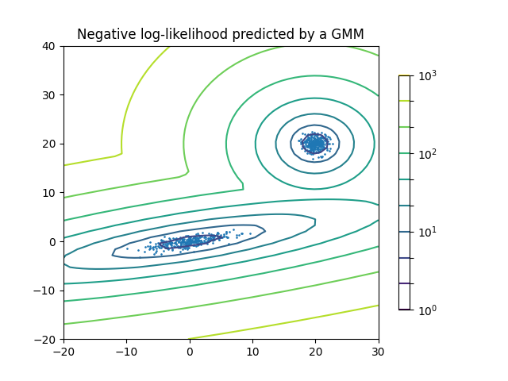
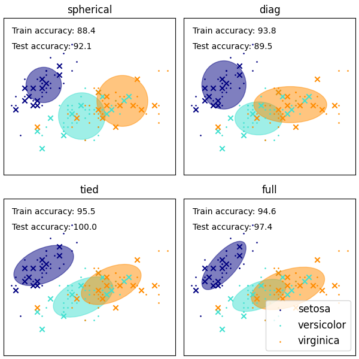

نماذج المزيج الغاوسي
=======================

.. currentmodule:: sklearn.mixture

تتيح حزمة ``sklearn.mixture`` إمكانية تعلم نماذج المزيج الغاوسي (يتم دعم المصفوفات المقطوعة والكرية والمربوطة والمكتملة)، وأخذ العينات منها، وتقديرها من البيانات. كما يتم توفير المرافق للمساعدة في تحديد العدد المناسب من المكونات.

  **نموذج المزيج الغاوسي مكونين:** *نقاط البيانات، وسطح تساوي احتمالية النموذج.*

نموذج المزيج الغاوسي هو نموذج احتمالي يفترض أن جميع نقاط البيانات تم توليدها من مزيج من عدد محدود من التوزيعات الغاوسية ذات المعلمات المجهولة. يمكن اعتبار نماذج المزيج تعميمًا لخوارزمية k-means clustering لدمج معلومات حول بنية التغاير للبيانات بالإضافة إلى مراكز الغاوسيات الكامنة.

ينفذ Scikit-learn فئات مختلفة لتقدير نماذج المزيج الغاوسي، والتي تتوافق مع استراتيجيات التقدير المختلفة، الموضحة أدناه.

المزيج الغاوسي
================

تنفذ فئة :class:`GaussianMixture` خوارزمية :ref:`التوقع الأقصى <expectation_maximization>` (EM) لتناسب نماذج المزيج الغاوسي. يمكنه أيضًا رسم قطع ناقص الثقة للنماذج متعددة المتغيرات، وحساب معيار المعلومات التمييزي لتقييم عدد المجموعات في البيانات. يتم توفير طريقة :meth:`GaussianMixture.fit` التي تتعلم نموذج المزيج الغاوسي من بيانات التدريب. وبالنظر إلى بيانات الاختبار، يمكنه تعيين كل عينة إلى الغاوسي الذي من المحتمل أن تنتمي إليه باستخدام طريقة :meth:`GaussianMixture.predict`.

..
    Alternatively, the probability of each
    sample belonging to the various Gaussians may be retrieved using the
    :meth:`GaussianMixture.predict_proba` method.

تأتي فئة :class:`GaussianMixture` بخيارات مختلفة لتقييد تغاير فئات الفرق المقدرة: الكروية، أو القطري، أو المربوط، أو التغاير الكامل.

.. rubric:: الأمثلة

* راجع :ref:`sphx_glr_auto_examples_mixture_plot_gmm_covariances.py` للحصول على مثال على
  استخدام المزيج الغاوسي كتصنيف تجميعي في مجموعة بيانات Iris.

* راجع :ref:`sphx_glr_auto_examples_mixture_plot_gmm_pdf.py` للحصول على مثال حول رسم
  تقدير الكثافة.

.. dropdown:: إيجابيات وسلبيات فئة GaussianMixture

  .. rubric:: الإيجابيات

  :السرعة: إنه أسرع خوارزمية لتعلم نماذج المزيج

  :عدم التحيز: نظرًا لأن هذا الخوارزمية يزيد فقط من الاحتمالية، فلن يتحيز المتوسطات إلى الصفر، أو التحيز في أحجام المجموعات
  ليكون لها هياكل محددة قد تنطبق أو لا.

  .. rubric:: السلبيات

  :التفردات: عندما يكون لدى المرء عدد غير كافٍ من النقاط لكل
  مزيج، يصبح تقدير مصفوفات التغاير صعبًا،
  ومن المعروف أن الخوارزمية تنحرف وتجد حلولًا باحتمالية لانهائية ما لم يتم تنظيم مصفوفات التغاير بشكل مصطنع.

  :عدد المكونات: سيستخدم هذا الخوارزم دائمًا جميع المكونات المتاحة له، مما يتطلب بيانات محجوزة
  أو معايير نظرية المعلومات لاتخاذ قرار بشأن عدد المكونات التي سيتم استخدامها
  في حالة عدم وجود مؤشرات خارجية.

.. dropdown:: تحديد عدد المكونات في نموذج المزيج الغاوسي الكلاسيكي

  يمكن استخدام معيار BIC لاختيار عدد المكونات في مزيج غاوسي
  بطريقة فعالة. من الناحية النظرية، فإنه يسترد العدد الحقيقي للمكونات
  فقط في النظام الأساسي (أي إذا كانت هناك الكثير من البيانات المتاحة
  وافتراض أن البيانات تم توليدها بالفعل بشكل مستقل ومتطابق من
  توزيع المزيج الغاوسي). لاحظ أن استخدام :ref:`نموذج المزيج الغاوسي الخلطي الخلطي <bgmm>`
  يتجنب تحديد عدد المكونات لنموذج المزيج الغاوسي.

  .. figure:: ../auto_examples/mixture/images/sphx_glr_plot_gmm_selection_002.png
    :target: ../auto_examples/mixture/plot_gmm_selection.html
    :align: center
    :scale: 50%

  .. rubric:: الأمثلة

  * راجع :ref:`sphx_glr_auto_examples_mixture_plot_gmm_selection.py` للحصول على مثال
    على اختيار النموذج الذي يتم إجراؤه باستخدام المزيج الغاوسي الكلاسيكي.

.. _expectation_maximization:

.. dropdown:: خوارزمية التقدير التوقع الأقصى

  تتمثل الصعوبة الرئيسية في تعلم نماذج المزيج الغاوسي من البيانات غير الموسومة
  في أنه عادةً لا يعرف المرء أي نقاط جاءت من
  أي مكون كامن (إذا كان لدى المرء حق الوصول إلى هذه المعلومات، فمن السهل جدًا
  تناسب توزيع غاوسي منفصل لكل مجموعة من النقاط). التوقع الأقصى
  <https://en.wikipedia.org/wiki/Expectation%E2%80%93maximization_algorithm>`_
  هو خوارزمية إحصائية راسخة للالتفاف حول هذه المشكلة من خلال عملية تكرارية. أولاً
  يفترض المرء مكونات عشوائية (مركّزة بشكل عشوائي على نقاط البيانات،
  أو متعلمة من k-means، أو حتى موزعة بشكل طبيعي حول
  الأصل) ويحسب لكل نقطة احتمال أن يتم توليدها بواسطة
  كل مكون من مكونات النموذج. ثم، يتم ضبط المعلمات لتعظيم احتمالية البيانات
  بالنظر إلى هذه التعيينات. إن تكرار هذه العملية مضمون دائمًا للتقارب
  إلى حد أمثل محلي.

.. dropdown:: اختيار طريقة التهيئة

  هناك أربعة خيارات لطرق التهيئة (بالإضافة إلى إمكانية إدخال متوسطات أولية محددة من قبل المستخدم)
  لتوليد المراكز الأولية لمكونات النموذج:

  k-means (افتراضي)
    يطبق هذا الخيار خوارزمية التجميع k-means التقليدية.
    قد يكون هذا مكلفًا من الناحية الحسابية مقارنة بطرق التهيئة الأخرى.

  k-means++
    يستخدم هذا الخيار طريقة التهيئة الخاصة بخوارزمية k-means clustering: k-means++.
    سيختار هذا الخيار المركز الأول بشكل عشوائي من البيانات. سيتم اختيار المراكز اللاحقة من توزيع مرجح للبيانات التي تفضل النقاط الأبعد عن المراكز الموجودة. k-means++ هو التهيئة الافتراضية لـ k-means لذلك سيكون
  أسرع من تشغيل k-means الكامل ولكنه لا يزال قد يستغرق وقتًا كبيرًا لمجموعات البيانات الكبيرة مع العديد من المكونات.

  random_from_data
    سيختار هذا الخيار نقاط بيانات عشوائية من بيانات الإدخال كمراكز أولية. هذه طريقة تهيئة سريعة للغاية ولكنها قد تؤدي إلى نتائج غير متقاربة
  إذا كانت النقاط المختارة قريبة جدًا من بعضها البعض.

  random
    يتم اختيار المراكز كاضطراب صغير بعيدًا عن متوسط جميع البيانات.
  هذه الطريقة بسيطة ولكنها قد تؤدي إلى استغراق النموذج وقتًا أطول للتقارب.

  .. figure:: ../auto_examples/mixture/images/sphx_glr_plot_gmm_init_001.png
    :target: ../auto_examples/mixture/plot_gmm_init.html
    :align: center
    :scale: 50%

  .. rubric:: الأمثلة

  * راجع :ref:`sphx_glr_auto_examples_mixture_plot_gmm_init.py` للحصول على مثال على
    استخدام تهيئات مختلفة في المزيج الغاوسي.

.. _bgmm:

نموذج المزيج الغاوسي الخلطي الخلطي
ينفذ كائن :class:`BayesianGaussianMixture` متغيرًا من نموذج المزيج الغاوسي باستخدام خوارزميات الاستدلال المتغير. ويشبه واجهة البرمجة التطبيقية تلك المحددة بواسطة :class:`GaussianMixture`.

**خوارزمية التقدير: الاستدلال المتغير**

يعد الاستدلال المتغير امتدادًا لخوارزمية التوقع-المطابقة التي تعمل على زيادة الحد الأدنى من الأدلة النموذجية (بما في ذلك المعلمات السابقة) بدلاً من احتمالية البيانات. والمبدأ وراء الأساليب المتغيرة هو نفسه بالنسبة لخوارزمية التوقع-المطابقة (أي أن كليهما خوارزميات تكرارية تتناوب بين إيجاد الاحتمالات لكل نقطة يتم توليدها بواسطة كل مزيج وتناسب المزيج مع هذه النقاط المعينة)، ولكن الأساليب المتغيرة تضيف تنظيمًا عن طريق دمج المعلومات من التوزيعات السابقة. ويؤدي ذلك إلى تجنب الحالات الشاذة التي يتم العثور عليها غالبًا في حلول التوقع-المطابقة، ولكنه يؤدي إلى بعض التحيزات الدقيقة في النموذج. وغالبًا ما يكون الاستدلال أبطأ بشكل ملحوظ، ولكنه ليس بطيئًا عادةً لدرجة تجعل الاستخدام غير عملي.

ونظرًا لطبيعة بايز للخوارزمية المتغيرة، فإنها تحتاج إلى المزيد من المعلمات أكثر من خوارزمية التوقع-المطابقة، وأهمها معلمة التركيز ``weight_concentration_prior``. ويؤدي تحديد قيمة منخفضة لمعلمة التركيز السابقة إلى جعل النموذج يضع معظم الوزن على عدد قليل من المكونات ويحدد أوزان المكونات المتبقية لتكون قريبة جدًا من الصفر. وتسمح القيم المرتفعة لمعلمة التركيز السابقة لعدد أكبر من المكونات بأن تكون نشطة في المزيج.

وتقترح معلمات تنفيذ فئة :class:`BayesianGaussianMixture` نوعين من التوزيعات السابقة للوزن: نموذج المزيج المحدود مع التوزيعات الاحتمالية ونموذج المزيج اللانهائي مع العملية الاحتمالية. وفي الممارسة العملية، يتم تقريب خوارزمية الاستدلال في العملية الاحتمالية واستخدام توزيع مقتطع مع عدد أقصى ثابت من المكونات (يسمى تمثيل كسر العصا). ويعتمد عدد المكونات المستخدمة بالفعل دائمًا تقريبًا على البيانات.

ويقارن الشكل التالي النتائج التي تم الحصول عليها لنوع مختلف من معلمة التركيز السابقة للوزن (معلمة ``weight_concentration_prior_type``) بالنسبة لقيم مختلفة من ``weight_concentration_prior``.

وهنا، يمكننا أن نرى أن لقيمة معلمة ``weight_concentration_prior`` تأثيرًا قويًا على العدد الفعال للمكونات النشطة التي تم الحصول عليها. ويمكننا أيضًا ملاحظة أن القيم الكبيرة لمعلمة التركيز على الوزن تؤدي إلى أوزان أكثر توحيدًا عندما يكون نوع المعلمة السابقة هو 'dirichlet_distribution' في حين أن هذا ليس بالضرورة هو الحال بالنسبة لنوع 'dirichlet_process' (يتم استخدامه بشكل افتراضي).

وتقارن الأمثلة أدناه نماذج المزيج الغاوسي بعدد ثابت من المكونات، مع نماذج المزيج الغاوسي المتغيرة مع المعلمة السابقة للعملية الاحتمالية. وهنا، يتم تركيب مزيج غاوسي كلاسيكي بـ 5 مكونات على مجموعة بيانات مكونة من عنقودين. ويمكننا أن نرى أن نموذج المزيج الغاوسي المتغير مع المعلمة السابقة للعملية الاحتمالية قادر على الحد من نفسه إلى مكونين فقط، في حين أن نموذج المزيج الغاوسي يتناسب مع البيانات بعدد ثابت من المكونات التي يجب تحديدها مسبقًا بواسطة المستخدم. وفي هذه الحالة، اختار المستخدم ``n_components=5`` والتي لا تتطابق مع التوزيع التوليدي الحقيقي لهذه المجموعة الفرعية من البيانات. وتجدر الإشارة إلى أنه مع وجود عدد قليل جدًا من الملاحظات، يمكن لنماذج المزيج الغاوسي المتغيرة مع المعلمة السابقة للعملية الاحتمالية أن تتخذ موقفًا محافظًا، وأن تتناسب مع مكون واحد فقط.

وعلى الشكل التالي، نقوم بتركيب مجموعة بيانات لا يتم تمثيلها جيدًا بواسطة مزيج غاوسي. وتتحكم معلمة ``weight_concentration_prior``، لفئة :class:`BayesianGaussianMixture` في عدد المكونات المستخدمة لتركيب هذه البيانات. كما نقدم في المخططين الأخيرين عينة عشوائية تم إنشاؤها من المزيجين الناتجين.

.. rubric:: الأمثلة

* راجع :ref:`sphx_glr_auto_examples_mixture_plot_gmm.py` للحصول على مثال حول رسم قطع ناقص الثقة لكل من :class:`GaussianMixture` و :class:`BayesianGaussianMixture`.

* يُظهر :ref:`sphx_glr_auto_examples_mixture_plot_gmm_sin.py` استخدام :class:`GaussianMixture` و :class:`BayesianGaussianMixture` لتناسب موجة جيبية.

* راجع :ref:`sphx_glr_auto_examples_mixture_plot_concentration_prior.py` للحصول على مثال حول رسم قطع ناقص الثقة لـ :class:`BayesianGaussianMixture` مع أنواع مختلفة من ``weight_concentration_prior_type`` لقيم مختلفة من معلمة ``weight_concentration_prior``.

.. dropdown:: مزايا وعيوب الاستدلال المتغير مع BayesianGaussianMixture

  .. rubric:: المزايا

  :الاختيار التلقائي: عندما تكون ``weight_concentration_prior`` صغيرة بدرجة كافية ويكون ``n_components`` أكبر مما هو مطلوب، يكون لنموذج المزيج البايزي المتغير ميل طبيعي لوضع بعض قيم أوزان المزيج بالقرب من الصفر. ويجعل هذا من الممكن السماح للنموذج باختيار عدد مناسب من المكونات الفعالة تلقائيًا. ولا يلزم سوى توفير حد أعلى لهذا الرقم. ومع ذلك، تجدر الإشارة إلى أن العدد "الأمثل" للمكونات النشطة محدد للغاية بالتطبيق، وعادة ما يكون غير محدد في إعداد استكشاف البيانات.

  :قلة الحساسية لعدد المعلمات: على عكس النماذج المحدودة، والتي ستستخدم دائمًا جميع المكونات قدر الإمكان، وبالتالي ستنتج حلولًا مختلفة تمامًا لأعداد مختلفة من المكونات، لن يتغير الاستدلال المتغير مع المعلمة السابقة للعملية الاحتمالية (``weight_concentration_prior_type='dirichlet_process'``) كثيرًا مع التغييرات في المعلمات، مما يؤدي إلى مزيد من الاستقرار والضبط الأقل.

  :التنظيم: نظرًا لدمج معلومات المعلمات السابقة، فإن الحلول المتغيرة لديها حالات خاصة أقل مرضية من حلول التوقع-المطابقة.

  .. rubric:: العيوب

  :السرعة: تجعل المعلمات الإضافية اللازمة للاستدلال المتغير الاستدلال أبطأ، وإن لم يكن كثيرًا.

  :المعلمات الفائقة: تحتاج هذه الخوارزمية إلى معلمة فائقة إضافية قد تحتاج إلى ضبط تجريبي عبر التحقق من صحة التقاطع.

  :التحيز: هناك العديد من التحيزات الضمنية في خوارزميات الاستدلال (وأيضًا في العملية الاحتمالية إذا تم استخدامها)، وكلما كان هناك عدم تطابق بين هذه التحيزات والبيانات، فقد يكون من الممكن تركيب نماذج أفضل باستخدام مزيج محدود.

العملية الاحتمالية
------------------

نصف هنا خوارزميات الاستدلال المتغير على مزيج العملية الاحتمالية. والعملية الاحتمالية هي توزيع احتمالي مسبق على *تصنيفات بعدد غير محدود، وغير محدود، من الأقسام*. وتسمح لنا التقنيات المتغيرة بدمج هذا الهيكل السابق في نماذج المزيج الغاوسي دون أي عقوبة تقريبًا في وقت الاستدلال، مقارنة بنموذج المزيج الغاوسي المحدود.

ويكمن السؤال المهم في كيفية استخدام العملية الاحتمالية لعدد غير محدود، وغير محدود، من المجموعات وتبقى متسقة. وفي حين أن الشرح الكامل لا يناسب هذا الدليل، فيمكن للمرء أن يفكر في عملية `كسر العصا <https://en.wikipedia.org/wiki/Dirichlet_process#The_stick-breaking_process>`_ لمساعدته على فهمها. وعملية كسر العصا هي قصة توليدية للعملية الاحتمالية. نبدأ بعصا ذات طول وحدة وفي كل خطوة، نقطع جزءًا من الجزء المتبقي من العصا. وفي كل مرة، نقوم بربط طول قطعة العصا بنسبة النقاط التي تقع في مجموعة من المزيج. وفي النهاية، لتمثيل المزيج اللانهائي، نقوم بربط الجزء المتبقي الأخير من العصا بنسبة النقاط التي لا تقع في جميع المجموعات الأخرى. وطول كل قطعة هو متغير عشوائي باحتمالية تتناسب مع معلمة التركيز. وستقسم القيم الأصغر للتركيز العصا ذات الطول الوحدوي إلى قطع أكبر من العصا (تحديد توزيع أكثر تركيزًا). وستؤدي قيم التركيز الأكبر إلى إنشاء قطع أصغر من العصا (زيادة عدد المكونات ذات الأوزان غير الصفرية).

ولا تزال تقنيات الاستدلال المتغير للعملية الاحتمالية تعمل مع تقريب محدود لنموذج المزيج اللانهائي هذا، ولكن بدلاً من الاضطرار إلى تحديد عدد المكونات مسبقًا، يقوم المرء فقط بتحديد معلمة التركيز وحد أعلى لعدد مكونات المزيج (يؤثر هذا الحد الأعلى، بافتراض أنه أعلى من العدد "الحقيقي" للمكونات، على التعقيد الخوارزمي فقط، وليس على العدد الفعلي للمكونات المستخدمة).