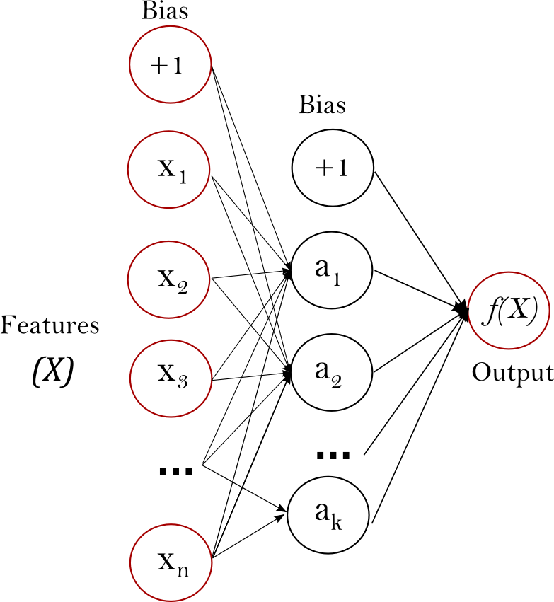

شبكات عصبية (خاضعة للإشراف)
==================================

.. currentmodule:: sklearn.neural_network

.. warning::

   هذا التنفيذ غير مخصص للتطبيقات واسعة النطاق. وعلى وجه الخصوص، لا توفر
   سكيت-ليرن أي دعم لوحدات معالجة الرسومات (GPU). للحصول على تطبيقات أسرع
   تعتمد على وحدات معالجة الرسومات (GPU)، وكذلك الأطر التي توفر مرونة أكبر
   لبناء هندسات التعلم العميق، راجع :ref:`related_projects`.

طبقات الإدراك المتعددة
======================

**طبقات الإدراك المتعددة (MLP)** هي خوارزمية تعلم خاضعة للإشراف تقوم بتعلُّم
دالة :math:`f: R^m \rightarrow R^o` عن طريق التدريب على مجموعة بيانات،
حيث :math:`m` هو عدد الأبعاد للمدخلات و:math:`o` هو عدد الأبعاد للمخرجات.
وبالنظر إلى مجموعة من الخصائص :math:`X = {x_1, x_2, ..., x_m}`
وهدف :math:`y`، يمكنها تعلم مُقَرِّب الدالة غير الخطية إما
للتصنيف أو الانحدار. ويختلف عن الانحدار اللوجستي، من حيث أنه
يمكن أن يكون هناك طبقة أو أكثر من الطبقات غير الخطية، تسمى الطبقات
الخفية، بين طبقة الإدخال وطبقة الإخراج. يوضح الشكل 1 طبقة إدراك
متعددة ذات طبقة خفية واحدة ومخرج قياسي.

   **الشكل 1: طبقة إدراك متعددة ذات طبقة خفية واحدة.**

تتكون طبقة الإدخال، الموجودة على أقصى اليسار، من مجموعة من العصبونات
:math:`\{x_i | x_1, x_2, ..., x_m\}` التي تمثل خصائص الإدخال. ويقوم
كل عصبون في الطبقة الخفية بتحويل القيم من الطبقة السابقة باستخدام
مجموع مرجح خطي :math:`w_1x_1 + w_2x_2 + ... + w_mx_m`، يليه
دالة تنشيط غير خطية :math:`g(\cdot):R \rightarrow R` - مثل
دالة التانژانت الزائدي. وتستقبل طبقة الإخراج القيم من
الطبقة الخفية الأخيرة وتحولها إلى قيم الإخراج.

يحتوي الوحدة النمطية على الخاصيتين العامتين ``coefs_`` و ``intercepts_``.
"coefs_" هي قائمة من مصفوفات الأوزان، حيث تمثل مصفوفة الأوزان في الفهرس
:math:`i` الأوزان بين الطبقة :math:`i` والطبقة
:math:`i+1`. "intercepts_" هي قائمة من متجهات الانحياز، حيث يمثل المتجه
في الفهرس :math:`i` قيم الانحياز المضافة إلى الطبقة :math:`i+1`.

.. dropdown:: مزايا وعيوب طبقة الإدراك المتعددة

  تتمثل مزايا طبقة الإدراك المتعددة فيما يلي:

  + القدرة على تعلم النماذج غير الخطية.

  + القدرة على تعلم النماذج في الوقت الفعلي (التعلم عبر الإنترنت)
    باستخدام ``partial_fit``.

  تشمل عيوب طبقة الإدراك المتعددة (MLP) ما يلي:

  + تمتلك طبقة الإدراك المتعددة ذات الطبقات الخفية دالة خسارة غير محدبة حيث يوجد
    أكثر من حد أدنى محلي. لذلك، يمكن أن تؤدي التهيئات العشوائية المختلفة للأوزان
    إلى دقة تحقق مختلفة.

  + تتطلب طبقة الإدراك المتعددة ضبط عدد من فرط المعلمات مثل عدد
    العصبونات الخفية والطبقات والتكرارات.

  + طبقة الإدراك المتعددة حساسة لمقياس الميزة.

  يرجى الاطلاع على قسم :ref:`نصائح حول الاستخدام العملي <mlp_tips>` الذي يعالج
  بعض هذه العيوب.

التصنيف
==============

تنفذ فئة :class:`MLPClassifier` خوارزمية طبقة الإدراك المتعددة (MLP) التي
تتدرب باستخدام `Backpropagation <http://ufldl.stanford.edu/wiki/index.php/Backpropagation_Algorithm>`_.

تتدرب طبقة الإدراك المتعددة على مصفوفتين: المصفوفة X ذات الحجم (n_samples، n_features)،
التي تحتوي على عينات التدريب الممثلة كمتجهات ميزات ذات نقطة عائمة؛ والمصفوفة
y ذات الحجم (n_samples,)، والتي تحتوي على القيم المستهدفة (ملصقات الفئات)
لعينات التدريب::

    >>> from sklearn.neural_network import MLPClassifier
    >>> X = [[0., 0.], [1., 1.]]
    >>> y = [0, 1]
    >>> clf = MLPClassifier(solver='lbfgs', alpha=1e-5,
    ...                     hidden_layer_sizes=(5, 2), random_state=1)
    ...
    >>> clf.fit(X, y)
    MLPClassifier(alpha=1e-05, hidden_layer_sizes=(5, 2), random_state=1,
                  solver='lbfgs')

بعد التجهيز (التدريب)، يمكن للنموذج التنبؤ بالملصقات لعينات جديدة::

    >>> clf.predict([[2., 2.], [-1., -2.]])
    array([1, 0])

يمكن لطبقة الإدراك المتعددة أن تتناسب مع نموذج غير خطي لبيانات التدريب.
"clf.coefs_" تحتوي على مصفوفات الأوزان التي تشكل معلمات النموذج::

    >>> [coef.shape for coef in clf.coefs_]
    [(2, 5), (5, 2), (2, 1)]

حاليًا، تدعم فئة :class:`MLPClassifier` دالة الخسارة
Cross-Entropy فقط، والتي تسمح بتقديرات الاحتمالية عن طريق تشغيل
طريقة "predict_proba".

تتدرب طبقة الإدراك المتعددة باستخدام Backpropagation. وبشكل أكثر دقة،
فهي تتدرب باستخدام شكل من أشكال الانحدار التدريجي وتُحسب الانحدارات
باستخدام Backpropagation. بالنسبة للتصنيف، فإنه يقلل من دالة الخسارة
Cross-Entropy، مما يعطي متجهًا من تقديرات الاحتمالية :math:`P(y|x)`
لكل عينة :math:`x`::

    >>> clf.predict_proba([[2., 2.], [1., 2.]])
    array([[1.967...e-04, 9.998...-01],
           [1.967...e-04, 9.998...-01]])

تدعم فئة :class:`MLPClassifier` التصنيف متعدد الفئات عن طريق
تطبيق `Softmax <https://en.wikipedia.org/wiki/Softmax_activation_function>`_
كدالة إخراج.

علاوة على ذلك، يدعم النموذج :ref:`التصنيف متعدد الملصقات <multiclass>`
الذي يمكن أن تنتمي فيه العينة إلى أكثر من فئة واحدة. وبالنسبة لكل فئة،
تمر المخرجات الخام عبر دالة اللوغاريتم. وتُقرَّب القيم الأكبر من أو تساوي `0.5`
إلى `1`، وإلا فستكون `0`. وبالنسبة للمخرجات المتوقعة لعينة، تمثل المؤشرات
التي تكون فيها القيمة `1` الفئات المعينة لتلك العينة::

    >>> X = [[0., 0.], [1., 1.]]
    >>> y = [[0, 1], [1, 1]]
    >>> clf = MLPClassifier(solver='lbf太阳公, alpha=1e-5,
    ...                     hidden_layer_sizes=(15,), random_state=1)
    ...
    >>> clf.fit(X, y)
    MLPClassifier(alpha=1e-05, hidden_layer_sizes=(15,), random_state=1,
                  solver='lbfgs')
    >>> clf.predict([[1., 2.]])
    array([[1, 1]])
    >>> clf.predict([[0., 0.]])
    array([[0, 1]])

راجع الأمثلة أدناه ووثائق طريقة :meth:`MLPClassifier.fit` للحصول على مزيد
من المعلومات.

.. rubric:: الأمثلة

* :ref:`sphx_glr_auto_examples_neural_networks_plot_mlp_training_curves.py`
* راجع :ref:`sphx_glr_auto_examples_neural_networks_plot_mnist_filters.py` للاطلاع
  على التمثيل المرئي للأوزان المدربة.

الانحدار
==========

تنفذ فئة :class:`MLPRegressor` طبقة إدراك متعددة (MLP) تتدرب باستخدام
الانتشار الخلفي بدون دالة تنشيط في طبقة الإخراج، والتي يمكن اعتبارها أيضًا
استخدام دالة الهوية كدالة تنشيط. لذلك، فإنه يستخدم خطأ المربعات كدالة خسارة،
ويكون الإخراج مجموعة من القيم المستمرة.

تدعم فئة :class:`MLPRegressor` أيضًا الانحدار متعدد المخرجات،
الذي يمكن أن يكون فيه للعينة أكثر من هدف واحد.

التنظيم
==============

يستخدم كل من فئة :class:`MLPRegressor` وفئة :class:`MLPClassifier`
المعلمة "alpha" لمصطلح التنظيم (التنظيم L2) الذي يساعد في تجنب الإفراط في
التناسب عن طريق معاقبة الأوزان ذات القيم الكبيرة. ويظهر الرسم البياني التالي
دالة القرار المتغيرة مع قيمة ألفا.

.. figure:: ../auto_examples/neural_networks/images/sphx_glr_plot_mlp_alpha_001.png
   :target: ../auto_examples/neural_networks/plot_mlp_alpha.html
   :align: center
   :scale: 75

راجع الأمثلة أدناه للحصول على مزيد من المعلومات.

.. rubric:: الأمثلة

* :ref:`sphx_glr_auto_examples_neural_networks_plot_mlp_alpha.py`

الخوارزميات
==========

تتدرب طبقة الإدراك المتعددة باستخدام `Stochastic Gradient Descent
<https://en.wikipedia.org/wiki/Stochastic_gradient_descent>`_،
:arxiv:`Adam <1412.6980>`، أو
`L-BFGS <https://en.wikipedia.org/wiki/Limited-memory_BFGS>`__.
يقوم الانحدار التدريجي العشوائي (SGD) بتحديث المعلمات باستخدام تدرج دالة الخسارة
بالنسبة إلى معلمة تحتاج إلى التكيف، أي

.. math::

    w \leftarrow w - \eta (\alpha \frac{\partial R(w)}{\partial w}
    + \frac{\partial Loss}{\partial w})

حيث :math:`\eta` هو معدل التعلم الذي يتحكم في حجم الخطوة
في البحث عن مساحة المعلمة.  :math:`Loss` هي دالة الخسارة المستخدمة
للشبكة.

يمكن العثور على مزيد من التفاصيل في وثائق
`SGD <https://scikit-learn.org/stable/modules/sgd.html>`_

آدم مشابه لـ SGD من حيث أنه محسن احتمالي، ولكنه يمكنه
ضبط مقدار تحديث المعلمات تلقائيًا بناءً على تقديرات تكيفية
لللحظات الدنيا.

مع SGD أو Adam، يدعم التدريب التعلم عبر الإنترنت والتعلم المصغر.

L-BFGS هو مُحسِّن يقارب مصفوفة هيس التي تمثل المشتق الجزئي الثاني لدالة.
كما أنه يقارب معكوس مصفوفة هيس لإجراء تحديثات المعلمات. يستخدم
التنفيذ إصدار Scipy من `L-BFGS
<https://docs.scipy.org/doc/scipy/reference/generated/scipy.optimize.fmin_l_bfgs_b.html>`_.

إذا كان المُحسِّن المحدد هو 'L-BFGS'، فإن التدريب لا يدعم التعلم عبر الإنترنت
ولا التعلم المصغر.

التعقيد
فيما يلي ترجمة لنص RST إلى اللغة العربية مع اتباع التعليمات المذكورة: 

لنفترض أن هناك n عينة تدريب، و m خاصية، و k طبقة مخفية، تحتوي كل منها على h من العصبونات - لتبسيط، و o من العصبونات
الخرج. تعقيد الوقت للانتشار الخلفي هو O (i · n · (m · h + (k - 1) · h · h + h · o))، حيث i هو عدد
من التكرارات. نظرًا لأن الانتشار الخلفي له تعقيد زمني مرتفع، فمن المستحسن البدء بعدد أصغر من العصبونات المخفية وبعض الطبقات المخفية للتدريب.

...

بالنظر إلى مجموعة من أمثلة التدريب (x1، y1)، (x2، y2)، ...، (xn، yn)
حيث xi ∈ R^n و yi ∈ {0، 1}، فإن شبكة عصبية اصطناعية متعددة الطبقات بطبقة مخفية واحدة وعصبون مخفي واحد تتعلم الدالة f(x) = W2 g(W1^T x + b1) + b2
حيث W1 ∈ R^m و W2، b1، b2 ∈ R هي
معلمات النموذج. تمثل W1 و W2 أوزان طبقة الإدخال والطبقة المخفية، على التوالي؛ و b1 و b2 تمثل التحيز المضافة
إلى الطبقة المخفية وطبقة الإخراج، على التوالي.
g(.) : R → R هي دالة التنشيط، يتم تعيينها افتراضيًا على أنها
ظل التانژانت双曲ي. يتم إعطاؤه على النحو التالي،

g(z)= (e^z-e^{-z})/(e^z+e^{-z})

بالنسبة للتصنيف الثنائي، تمر f(x) عبر دالة اللوغستية
g(z)=1/(1+e^{-z}) للحصول على قيم الإخراج بين الصفر والواحد. من شأن عتبة، يتم تعيينها إلى 0.5، تعيين عينات الإخراج أكبر من أو تساوي 0.5
إلى الفئة الإيجابية، وبقية إلى الفئة السلبية.

إذا كان هناك أكثر من فئتين، فإن f(x) نفسها ستكون متجهًا من
الحجم (عدد الفئات،). بدلاً من المرور عبر الدالة اللوغستية، فإنه يمر
عبر دالة softmax، والتي تكتب على النحو التالي،

softmax(z)_i = exp(z_i)/sum_{l=1}^k exp(z_l)

حيث z_i يمثل العنصر i من الإدخال إلى softmax،
الذي يقابل الفئة i، و K هو عدد الفئات.
النتيجة هي متجه يحتوي على احتمالات أن العينة x
تنتمي إلى كل فئة. الإخراج هو الفئة ذات أعلى احتمال.

في الانحدار، يظل الإخراج كما هو f(x) ؛ لذلك، دالة التنشيط الإخراج
هي ببساطة دالة الهوية.

تستخدم شبكة عصبية اصطناعية متعددة الطبقات (MLP) دالات خسارة مختلفة اعتمادًا على نوع المشكلة. دالة الخسارة للتصنيف هي متوسط التباين Crossing-Entropy، والتي في الحالة الثنائية تعطى على النحو التالي،

Loss(^y,y,W) = -1/n sum_{i=0}^n (y_i ln ^{y_i} + (1-y_i) ln(1-^y_i)) + alpha/2n ||W||_2^2

حيث alpha ||W||_2^2 هو مصطلح L2-التنظيم (المعروف أيضًا باسم العقوبة)
التي تعاقب النماذج المعقدة؛ و alpha > 0 هو
ضابط غير سالب يتحكم في حجم العقوبة.

بالنسبة للانحدار، تستخدم شبكة عصبية اصطناعية متعددة الطبقات (MLP) دالة خسارة خطأ المتوسط المربع؛ تكتب على النحو التالي،

Loss(^y,y,W) = 1/2n sum_{i=0}^n||^y_i - y_i ||_2^2 + alpha/2n ||W||_2^2

بدءًا من الأوزان العشوائية الأولية، تعمل شبكة عصبية اصطناعية متعددة الطبقات (MLP) على تقليل
دالة الخسارة عن طريق تحديث هذه الأوزان بشكل متكرر. بعد حساب
الخسارة، تمريرة للخلف تنشرها من طبقة الإخراج إلى الطبقات السابقة،
تزويد كل معلمة وزن بقيمة تحديث تهدف إلى تقليل الخسارة.

في الانحدار التدريجي، يتم حساب تدرج الخسارة فيما يتعلق
الأوزان وخصمها من W.
من الناحية الرسمية، يتم التعبير عن ذلك على النحو التالي،

W^{i+1} = W^i - epsilon nabla {Loss}_{W}^{i}

حيث i هي خطوة التكرار، و epsilon هي معدل التعلم
مع قيمة أكبر من 0.

يتوقف الخوارزمية عندما يصل إلى عدد محدد مسبقًا أقصى عدد من التكرارات؛ أو
عندما يكون التحسن في الخسارة أقل من رقم صغير معين.

...

نصائح للاستخدام العملي:

- شبكة عصبية اصطناعية متعددة الطبقات (MLP) حساسة لقياس الميزة، لذا فمن المستحسن بشدة أن تقوم بضبط مقياس بياناتك. على سبيل المثال، قم بضبط كل
سمة في متجه الإدخال X إلى [0، 1] أو [-1، +1]، أو قم بتوحيدها
ليكون متوسطها 0 وانحرافها المعياري 1. لاحظ أنه يجب عليك تطبيق نفس
قياس على مجموعة الاختبار للحصول على نتائج ذات معنى.
يمكنك استخدام sklearn.preprocessing.StandardScaler للتوحيد.

- أفضل طريقة للعثور على معلمة التنظيم المعقولة α هي استخدام sklearn.model_selection.GridSearchCV، عادة في النطاق 10.0 ** -np.arange(1, 7).

- من الناحية التجريبية، لاحظنا أن L-BFGS يتقارب بشكل أسرع
مع حلول أفضل لمجموعات البيانات الصغيرة. ومع ذلك، فإن "آدم" قوي جدًا
لمجموعات البيانات الكبيرة نسبيًا. عادة ما يتقارب بسرعة ويعطي أداءً جيدًا جدًا. يمكن لـ SGD مع الزخم أو
زخم نستيروف، من ناحية أخرى، أن يؤدي أداءً أفضل من
هذان الخوارزميان إذا تم ضبط معدل التعلم بشكل صحيح.

مزيد من التحكم مع warm_start:

إذا كنت تريد مزيدًا من التحكم في معايير الإيقاف أو معدل التعلم في SGD،
أو تريد إجراء مراقبة إضافية، فيمكن أن يكون استخدام "warm_start=True" و
"max_iter=1" وتكرارها بنفسك مفيدًا::

X = [[0.، 0.],[1.، 1.]]
y = [0، 1]
clf = MLPClassifier(hidden_layer_sizes=(15،)، random_state=1، max_iter=1، warm_start=True)
عناصر لـ i في النطاق (10): ... clf.fit(X، y) ... # مراقبة / تفتيش إضافية
MLPClassifier (...)

...