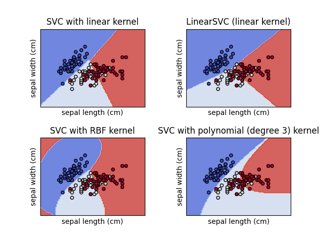
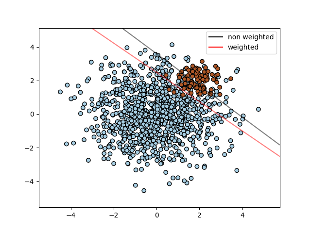
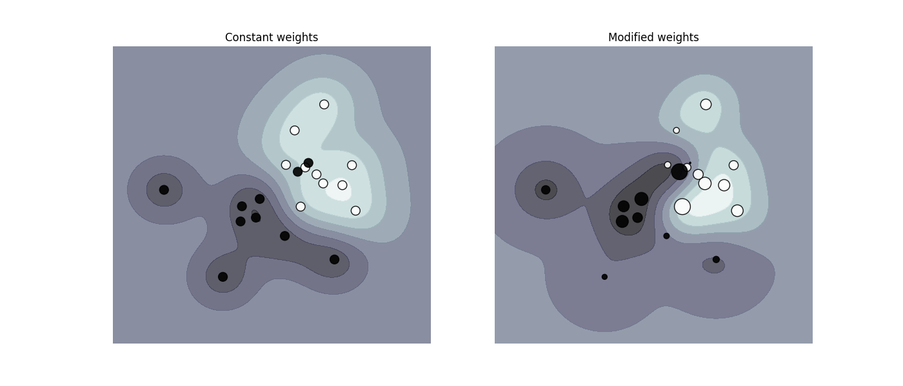

آلات المتجهات الداعمة SVM
=======================

**آلات المتجهات الداعمة (SVMs)** هي مجموعة من طرق التعلم الخاضعة للإشراف والتي تستخدم في: التصنيف، والانحدار، وكشف النقاط الشاذة.

مزايا آلات المتجهات الداعمة هي:

- فعالة في الفراغات ذات الأبعاد العالية.

- لا تزال فعالة في الحالات التي يكون فيها عدد الأبعاد أكبر من عدد العينات.

- تستخدم مجموعة فرعية من نقاط التدريب في دالة القرار (تسمى المتجهات الداعمة)، لذلك فهي أيضًا فعالة من حيث الذاكرة.

- متعددة الاستخدامات: يمكن تحديد نوى مختلفة لدالة القرار. يتم توفير النواة الشائعة، ولكن من الممكن أيضًا تحديد نوى مخصصة.

تشمل عيوب آلات المتجهات الداعمة ما يلي:

- إذا كان عدد الميزات أكبر بكثير من عدد العينات، فإن تجنب الإفراط في الملاءمة عند اختيار النواة ومصطلح التنظيم أمر بالغ الأهمية.

- لا توفر SVMs تقديرات احتمالية مباشرة، ويتم حسابها باستخدام التحقق من صحة الاسترجاع الخماسي المكلف.

تدعم آلات المتجهات الداعمة في scikit-learn كلاً من المتجهات الكثيفة (numpy.ndarray والقابلة للتحويل إلى ذلك بواسطة numpy.asarray) والمتجهات النادرة (أي scipy.sparse) كمدخلات. ومع ذلك، لاستخدام SVM للتنبؤ بالبيانات النادرة، يجب أن يكون قد تم ملاءمته على مثل هذه البيانات. للحصول على أداء مثالي، استخدم C-ordered numpy.ndarray (dense) أو scipy.sparse.csr_matrix (sparse) مع dtype=float64.

التصنيف
:class:`SVC` و :class:`NuSVC` و :class:`LinearSVC` هي فئات قادرة على أداء التصنيف الثنائي والمتعدد الفئات على مجموعة بيانات.

:class:`SVC` و :class:`NuSVC` هما أسلوبان متشابهان، ولكنهما يقبلان مجموعات مختلفة قليلاً من المعلمات ولهما صيغ رياضية مختلفة (راجع القسم :ref:`svm_mathematical_formulation`). من ناحية أخرى، :class:`LinearSVC` هو تنفيذ آخر (أسرع) لتصنيف المتجه الداعم في حالة النواة الخطية. كما يفتقر أيضًا إلى بعض سمات :class:`SVC` و :class:`NuSVC`، مثل `support_`. يستخدم :class:`LinearSVC` دالة الخسارة `squared_hinge` وبسبب تنفيذه في `liblinear`، فإنه ينظم أيضًا المعترض، إذا تم أخذه في الاعتبار. ومع ذلك، يمكن تقليل هذا التأثير عن طريق الضبط الدقيق بعناية لمعلمة `intercept_scaling` الخاصة به، والتي تسمح لمصطلح المعترض بأن يكون له سلوك تنظيم مختلف مقارنة بالسمات الأخرى. لذلك، قد تختلف نتائج التصنيف والنتيجة عن المصنفين الآخرين.

كما هو الحال مع المصنفات الأخرى، :class:`SVC`، :class:`NuSVC` و :class:`LinearSVC` تأخذ كمدخلات مصفوفتين: مصفوفة `X` ذات شكل `(n_samples، n_features)` التي تحتوي على عينات التدريب، ومصفوفة `y` من تسميات الفئات (سلاسل أو أعداد صحيحة)، ذات شكل `(n_samples)`. ::

    >>> from sklearn import svm
    >>> X = [[0, 0], [1, 1]]
    >>> y = [0, 1]
    >>> clf = svm.SVC()
    >>> clf.fit(X, y)
    SVC()

بعد التهيئة، يمكن بعد ذلك استخدام النموذج للتنبؤ بقيم جديدة ::

    >>> clf.predict([[2., 2.]])
    array([1])

تعتمد دالة القرار الخاصة بالآلات الداعمة للمتجهات (كما هو موضح بالتفصيل في :ref:`svm_mathematical_formulation`) على بعض المجموعات الفرعية من بيانات التدريب، والتي يطلق عليها المتجهات الداعمة. يمكن العثور على بعض خصائص هذه المتجهات الداعمة في السمات "support_vectors_" و"support_" و"n_support_" ::

    >>> # الحصول على المتجهات الداعمة
    >>> clf.support_vectors_
    array([[0., 0.],
           [1., 1.]])
    >>> # الحصول على مؤشرات المتجهات الداعمة
    >>> clf.support_
    array([0, 1]...)
    >>> # الحصول على عدد المتجهات الداعمة لكل فئة
    >>> clf.n_support_
    array([1, 1]...)

.. rubric:: الأمثلة

* :ref:`sphx_glr_auto_examples_svm_plot_separating_hyperplane.py`
* :ref:`sphx_glr_auto_examples_svm_plot_svm_anova.py`

.. _svm_multi_class:

التصنيف متعدد الفئات
--------------------------

ينفذ :class:`SVC` و :class:`NuSVC` نهج "واحد مقابل واحد" للتصنيف متعدد الفئات. في المجموع، يتم إنشاء ``n_classes * (n_classes - 1) / 2`` من المصنفات، ويتم تدريب كل منها على بيانات من فئتين.

لتوفير واجهة متسقة مع المصنفات الأخرى، يسمح خيار ``decision_function_shape`` بالتحويل الأحادي الاتجاه لنتائج مصنفات "واحد مقابل واحد" إلى دالة قرار "واحد مقابل الباقي" ذات شكل ``(n_samples، n_classes)``، وهو الإعداد الافتراضي للمعلمة (default='ovr').

    >>> X = [[0], [1], [2], [3]]
    >>> Y = [0, 1, 2, 3]
    >>> clf = svm.SVC(decision_function_shape='ovo')
    >>> clf.fit(X, Y)
    SVC(decision_function_shape='ovo')
    >>> dec = clf.decision_function([[1]])
    >>> dec.shape[1] # 6 فئات: 4*3/2 = 6
    6
    >>> clf.decision_function_shape = "ovr"
    >>> dec = clf.decision_function([[1]])
    >>> dec.shape[1] # 4 فئات
    4

من ناحية أخرى، ينفذ :class:`LinearSVC` استراتيجية "واحد مقابل الباقي" متعددة الفئات، وبالتالي تدريب `n_classes` من النماذج.

    >>> lin_clf = svm.LinearSVC()
    >>> lin_clf.fit(X, Y)
    LinearSVC()
    >>> dec = lin_clf.decision_function([[1]])
    >>> dec.shape[1]
    4

راجع :ref:`svm_mathematical_formulation` للحصول على وصف كامل لدالة القرار.

.. dropdown:: تفاصيل حول استراتيجيات متعددة الفئات

  لاحظ أن :class:`LinearSVC` ينفذ أيضًا استراتيجية متعددة الفئات بديلة، ما يسمى SVM متعدد الفئات الذي صاغه كرامر وسينجر [#8]_، باستخدام خيار ``multi_class='crammer_singer'``. في الممارسة العملية، يُفضل التصنيف "واحد مقابل الباقي" عادةً، حيث تكون النتائج متشابهة في الغالب، ولكن وقت التشغيل أقل بكثير.

  بالنسبة لـ "واحد مقابل الباقي" :class:`LinearSVC`، يكون للسمات ``coef_`` و ``intercept_`` الشكل ``(n_classes، n_features)`` و ``(n_classes,)`` على التوالي. يتوافق كل صف من المعاملات مع أحد المصنفات "واحد مقابل الباقي" من ``n_classes``، وبالمثل بالنسبة للمعترضات، بترتيب فئة "الواحد".

  في حالة "واحد مقابل واحد" :class:`SVC` و :class:`NuSVC`، يكون تخطيط السمات أكثر تعقيدًا بعض الشيء. في حالة النواة الخطية، يكون للسمات ``coef_`` و ``intercept_`` الشكل ``(n_classes * (n_classes - 1) / 2، n_features)`` و ``(n_classes * (n_classes - 1) / 2)`` على التوالي. هذا مشابه لتخطيط :class:`LinearSVC` الموضح أعلاه، مع كل صف الآن يتوافق مع مصنف ثنائي. الترتيب للفئات من 0 إلى n هو "0 مقابل 1"، "0 مقابل 2"، ... "0 مقابل n"، "1 مقابل 2"، "1 مقابل 3"، "1 مقابل n"، . . . "n-1 مقابل n".

  شكل مصفوفة ``dual_coef_`` هو ``(n_classes-1، n_SV)`` بتخطيط يصعب فهمه بعض الشيء.
  تتوافق الأعمدة مع المتجهات الداعمة المشاركة في أي من مصنفات "واحد مقابل واحد" ``n_classes * (n_classes - 1) / 2``.
  لكل متجه داعم ``v`` معامل ثنائي في كل من مصنفات ``n_classes - 1`` التي تقارن فئة ``v`` بفئة أخرى.
  لاحظ أن بعض هذه المعاملات الثنائية، ولكن ليس كلها، قد تكون صفرية.
  تكون إدخالات ``n_classes - 1`` في كل عمود هي هذه المعاملات الثنائية، مرتبة حسب الفئة المعارضة.

  قد يكون هذا أوضح مع مثال: ضع في اعتبارك مشكلة ذات ثلاث فئات حيث تحتوي الفئة 0 على ثلاث متجهات داعمة :math:`v^0_0, v^1_0, v^2_0` والفئتين 1 و2 تحتوي على متجهين داعمين :math:`v^0_1, v^1_1` و:math:`v^0_2, v^1_2` على التوالي. لكل متجه داعم :math:`v^j_i`، هناك معاملان ثنائيان. دعنا نطلق على معامل المتجه الداعم :math:`v^j_i` في المصنف بين الفئتين :math:`i` و:math:`k` اسم :math:`\alpha^j_{i,k}`.
  ثم يبدو ``dual_coef_`` على النحو التالي:

  +------------------------+------------------------+------------------------+------------------------+------------------------+------------------------+------------------------+
  |:math:`\alpha^0_{0,1}`|:math:`\alpha^1_{0,1}`|:math:`\alpha^2_{0,1}`|:math:`\alpha^0_{1,0}`|:math:`\alpha^1_{1,0}`|:math:`\alpha^0_{2,0}`|:math:`\alpha^1_{2,0}`|
  +------------------------+------------------------+------------------------+------------------------+------------------------+------------------------+------------------------+
  |:math:`\alpha^0_{0,2}`|:math:`\alpha^1_{0,2}`|:math:`\alpha^2_{0,2}`|:math:`\alpha^0_{1,2}`|:math:`\alpha^1_{1,2}`|:math:`\alpha^0_{2,1}`|:math:`\alpha^1_{2,1}`|
  +------------------------+------------------------+------------------------+------------------------+------------------------+------------------------+------------------------+
  |معاملات للمتجهات الداعمة للفئة 0                                                        |معاملات للمتجهات الداعمة للفئة 1                               |معاملات للمتجهات الداعمة للفئة 2                               |
  +--------------------------------------------------------------------------+-------------------------------------------------+-------------------------------------------------+

.. rubric:: الأمثلة

* :ref:`sphx_glr_auto_examples_svm_plot_iris_svc.py`

.. _scores_probabilities:

النتائج والاحتمالات
------------------------

تعطي طريقة ``decision_function`` في :class:`SVC` و :class:`NuSVC` درجات لكل فئة لكل عينة (أو درجة واحدة لكل عينة في الحالة الثنائية). عندما يتم تعيين خيار الباني ``probability`` إلى ``True``، يتم تمكين تقديرات احتمالية العضوية في الفئات (من طريقتي ``predict_proba`` و ``predict_log_proba``). في الحالة الثنائية، يتم معايرة الاحتمالات باستخدام تحجيم Platt [#1]_: الانحدار اللوجستي على درجات SVM، والتي يتم ضبطها بواسطة تحقق إضافي من الصحة متقاطع على بيانات التدريب.
في حالة الفئات المتعددة، يتم تمديدها كما هو موضح في [#2]_.

.. note::

  تتوفر نفس إجراءات معايرة الاحتمالات لجميع التقديرات
  عبر :class:`~sklearn.calibration.CalibratedClassifierCV` (راجع
  :ref:`التدرج`). في حالة :class:`SVC` و :class:`NuSVC`، يتم تضمين هذا الإجراء في `libsvm`_ المستخدم تحت الغطاء، لذا فهو لا يعتمد على :class:`~sklearn.calibration.CalibratedClassifierCV` من scikit-learn.

التحقق من الصحة المتقاطع المعني في تحجيم Platt
هي عملية مكلفة للمجموعات الكبيرة من البيانات.
بالإضافة إلى ذلك، قد تكون تقديرات الاحتمالات غير متسقة مع الدرجات:

- قد لا يكون "argmax" من الدرجات هو "argmax" من الاحتمالات
- في التصنيف الثنائي، قد يتم وضع علامة على عينة بواسطة ``predict`` على أنها
  تنتمي إلى الفئة الإيجابية حتى إذا كان إخراج `predict_proba` أقل من 0.5؛ وبالمثل، فقد يتم وضع علامة عليه على أنه سلبي حتى إذا كان إخراج `predict_proba` أكبر من 0.5.

من المعروف أيضًا أن طريقة Platt بها مشكلات نظرية.
إذا كانت درجات الثقة مطلوبة، ولكن لا يلزم أن تكون احتمالات،
فمن المستحسن تعيين ``probability=False``
واستخدام ``decision_function`` بدلاً من ``predict_proba``.

يرجى ملاحظة أنه عندما يكون ``decision_function_shape='ovr'`` و ``n_classes > 2``، على عكس ``decision_function``، لا تحاول طريقة ``predict`` كسر التعادل بشكل افتراضي. يمكنك تعيين ``break_ties=True`` ليكون إخراج ``predict`` هو نفسه ``np.argmax(clf.decision_function(...)، axis=1)``، وإلا فسيتم دائمًا إرجاع الفئة الأولى بين الفئات المتعادلة؛ ولكن ضع في اعتبارك أنها تأتي بتكلفة حسابية. راجع
:ref:`sphx_glr_auto_examples_svm_plot_svm_tie_breaking.py` للحصول على مثال على كسر التعادل.

المشكلات غير المتوازنة
--------------------

في المشكلات التي يرغب المرء فيها في إعطاء أهمية أكبر لفئات أو عينات فردية معينة، يمكن استخدام معلمتي ``class_weight`` و ``sample_weight``.

ينفذ :class:`SVC` (ولكن ليس :class:`NuSVC`) معلمة ``class_weight`` في طريقة ``fit``. إنها عبارة عن قاموس على الشكل ``{class_label: value}``، حيث تكون القيمة عبارة عن رقم مميز أكبر من 0
يحدد معلمة ``C`` لفئة ``class_label`` إلى ``C * value``.
يوضح الشكل أدناه حدود القرار لمشكلة غير متوازنة،
مع تصحيح الوزن وبدونه.

:class:`SVC`، :class:`NuSVC`، :class:`SVR`، :class:`NuSVR`، :class:`LinearSVC`،
:class:`LinearSVR` و :class:`OneClassSVM` تنفذ أيضًا أوزانًا للعينات الفردية في طريقة `fit` من خلال معلمة ``sample_weight``.
على غرار ``class_weight``، يحدد هذا المعلمة ``C`` للعينة i-th إلى ``C * sample_weight[i]``، والتي ستشجع المصنف على الحصول على هذه العينات بشكل صحيح. يوضح الشكل أدناه تأثير وزن العينة على حد القرار. يتناسب حجم الدوائر مع أوزان العينات:

.. rubric:: الأمثلة

* :ref:`sphx_glr_auto_examples_svm_plot_separating_hyperplane_unbalanced.py`
* :ref:`sphx_glr_auto_examples_svm_plot_weighted_samples.py`

.. _svm_regression:

الانحدار
يمكن توسيع طريقة تصنيف المتجه الداعم لحل مشكلات الانحدار. وتسمى هذه الطريقة "انحدار المتجه الداعم".

يعتمد النموذج الذي ينتجه تصنيف المتجه الداعم (كما هو موضح أعلاه) فقط على مجموعة فرعية من بيانات التدريب، لأن دالة التكلفة لبناء النموذج لا تهتم بنقاط التدريب التي تقع خارج الهامش. وبالمثل، يعتمد النموذج الذي ينتجه انحدار المتجه الداعم فقط على مجموعة فرعية من بيانات التدريب، لأن دالة التكلفة تتجاهل العينات التي يكون تنبؤها قريبًا من هدفها.

هناك ثلاث عمليات تنفيذ مختلفة لانحدار المتجه الداعم: :class:`SVR`، و:class:`NuSVR`، و:class:`LinearSVR`. يوفر :class:`LinearSVR` تنفيذًا أسرع من :class:`SVR` ولكنه لا يأخذ في الاعتبار سوى النواة الخطية، في حين أن :class:`NuSVR` ينفذ صيغة مختلفة قليلاً عن :class:`SVR` و:class:`LinearSVR`. وبسبب تنفيذه في `liblinear`، فإن :class:`LinearSVR` ينظم أيضًا المعترض، إذا تم أخذه في الاعتبار. ومع ذلك، يمكن تقليل هذا التأثير عن طريق الضبط الدقيق بعناية لمعلمة `intercept_scaling` الخاصة به، والتي تسمح لمصطلح المعترض أن يكون له سلوك تنظيم مختلف مقارنة بالسمات الأخرى. لذلك، قد تختلف نتائج التصنيف والدرجات عن المصنفين الآخرين. راجع :ref:`svm_implementation_details` لمزيد من التفاصيل.

كما هو الحال مع فئات التصنيف، ستأخذ طريقة التجهيز كوسائل متجهات X، y، ولكن في هذه الحالة من المتوقع أن يكون لـ y قيم ذات نقطة عائمة بدلاً من قيم صحيحة::

    >>> from sklearn import svm
    >>> X = [[0, 0], [2, 2]]
    >>> y = [0.5, 2.5]
    >>> regr = svm.SVR()
    >>> regr.fit(X, y)
    SVR()
    >>> regr.predict([[1, 1]])
    array([1.5])

.. rubric:: الأمثلة

* :ref:`sphx_glr_auto_examples_svm_plot_svm_regression.py`

.. _svm_outlier_detection:

تقدير الكثافة، اكتشاف الأنماط غير المعتادة
=======================================

تنفذ فئة :class:`OneClassSVM` طريقة SVM ذات الفئة الواحدة والتي تستخدم في اكتشاف القيم الشاذة.

راجع :ref:`outlier_detection` للحصول على وصف واستخدام :class:`OneClassSVM`.

التعقيد
==========

تعد آلات المتجهات الداعمة أدوات قوية، ولكن متطلبات الحوسبة والتخزين الخاصة بها تزداد بسرعة مع عدد متجهات التدريب. جوهر SVM هو مشكلة البرمجة التربيعية (QP)، والتي تفصل المتجهات الداعمة عن بقية بيانات التدريب. يتراوح محسن QP الذي يستخدمه التنفيذ القائم على `libsvm`_ بين :math:`O(n_{features} \times n_{samples}^2)` و:math:`O(n_{features} \times n_{samples}^3)` اعتمادًا على مدى كفاءة استخدام ذاكرة التخزين المؤقتة `libsvm`_ في الممارسة العملية (تعتمد على مجموعة البيانات). إذا كانت البيانات غير متجانسة للغاية، فيجب استبدال :math:`n_{features}` بمتوسط عدد السمات غير الصفرية في متجه العينة.

بالنسبة للحالة الخطية، فإن الخوارزمية المستخدمة في :class:`LinearSVC` بواسطة تنفيذ `liblinear`_ أكثر كفاءة بكثير من نظيرتها القائمة على `libsvm`_ :class:`SVC` ويمكن أن تتوسع بشكل خطي تقريبًا إلى الملايين من العينات و/أو الميزات.

نصائح حول الاستخدام العملي
=====================

* **تجنب نسخ البيانات**: بالنسبة لـ :class:`SVC`، و:class:`SVR`، و:class:`NuSVC`، و:class:`NuSVR`، إذا لم تكن البيانات التي تم تمريرها إلى طرق معينة مرتبة بشكل متجاور ومتواصلة ودقة مزدوجة، فسيتم نسخها قبل استدعاء التنفيذ C الأساسي. يمكنك التحقق مما إذا كان صفيف نومبي معين متجاورًا عن طريق فحص سمة "الأعلام" الخاصة به.

  بالنسبة لـ :class:`LinearSVC` (و:class:`LogisticRegression <sklearn.linear_model.LogisticRegression>`)، يتم نسخ أي إدخال تم تمريره كصفيف نومبي وتحويله إلى تمثيل البيانات المتناثرة الداخلي `liblinear`_ (أرقام الفاصلة العائمة ذات الدقة المزدوجة ومؤشرات 32 بت للمكونات غير الصفرية). إذا كنت تريد ملاءمة مصنف خطي واسع النطاق بدون نسخ صفيف نومبي متجاور مزدوج الدقة كإدخال، فنحن نقترح استخدام فئة :class:`SGDClassifier <sklearn.linear_model.SGDClassifier>` بدلاً من ذلك. يمكن تكوين دالة الهدف لتكون مشابهة تقريبًا لنموذج :class:`LinearSVC`.

* **حجم ذاكرة التخزين المؤقت للنواة**: بالنسبة لـ :class:`SVC`، و:class:`SVR`، و:class:`NuSVC`، و:class:`NuSVR`، يكون لحجم ذاكرة التخزين المؤقت للنواة تأثير قوي على أوقات التشغيل للمشكلات الأكبر. إذا كان لديك ذاكرة RAM كافية، فيوصى بتعيين "حجم_الذاكرة_المؤقتة" إلى قيمة أعلى من القيمة الافتراضية 200(ميجابايت)، مثل 500(ميجابايت) أو 1000(ميجابايت).

* **تعيين C**: القيمة الافتراضية لـ C هي 1 وهي اختيار افتراضي معقول. إذا كان لديك الكثير من الملاحظات الضجيج، فيجب تقليلها: حيث يتوافق تقليل C مع المزيد من التنظيم.

  :class:`LinearSVC` و:class:`LinearSVR` أقل حساسية لـ C عندما تصبح كبيرة، وتتوقف نتائج التنبؤ عن التحسن بعد عتبة معينة. في الوقت نفسه، ستستغرق قيم C الأكبر وقتًا أطول للتدريب، وقد يستغرق الأمر 10 مرات أطول، كما هو موضح في [#3]_.

* خوارزميات آلات المتجهات الداعمة ليست ثابتة النطاق، لذلك **من المستحسن بشدة ضبط نطاق بياناتك**. على سبيل المثال، قم بضبط كل سمة في متجه الإدخال X إلى [0,1] أو [-1,+1]، أو قم بتوحيدها بحيث يكون لها متوسط 0 وانحراف معياري 1. لاحظ أنه يجب تطبيق *نفس* الضبط على متجه الاختبار للحصول على نتائج ذات معنى. يمكن القيام بذلك بسهولة باستخدام :class:`~sklearn.pipeline.Pipeline`::

      >>> from sklearn.pipeline import make_pipeline
      >>> from sklearn.preprocessing import StandardScaler
      >>> from sklearn.svm import SVC

      >>> clf = make_pipeline(StandardScaler(), SVC())

  راجع القسم :ref:`preprocessing` لمزيد من التفاصيل حول الضبط والتطبيع.

.. _shrinking_svm:

* فيما يتعلق بمعلمة "الانكماش"، نقلاً عن [#4]_: *وجدنا أنه إذا كان عدد التكرارات كبيرًا، فيمكن للانكماش أن يقصر وقت التدريب. ومع ذلك، إذا قمنا بحل مشكلة التحسين بشكل فضفاض (على سبيل المثال، باستخدام حد تسامح إيقاف كبير)، فقد يكون الكود بدون استخدام الانكماش أسرع بكثير*

* تقريب معلمة "nu" في :class:`NuSVC`/:class:`OneClassSVM`/:class:`NuSVR` نسبة أخطاء التدريب والمتجهات الداعمة.

* في :class:`SVC`، إذا كانت البيانات غير متوازنة (على سبيل المثال، العديد من الإيجابيات والقليل من السلبيات)، فحدد ``class_weight='balanced'`` و/أو جرب معلمات العقوبة المختلفة ``C``.

* **عشوائية التنفيذ الأساسي**: يستخدم التنفيذ الأساسي لـ :class:`SVC` و:class:`NuSVC` مولد رقم عشوائي لخلط البيانات من أجل تقدير الاحتمالية (عندما يتم تعيين "الاحتمالية" على "صحيح"). يمكن التحكم في هذه العشوائية باستخدام معلمة "حالة_عشوائية". إذا تم تعيين "الاحتمالية" على "خطأ"، فإن هذه المصنفات ليست عشوائية و"حالة_عشوائية" ليس لها تأثير على النتائج. التنفيذ الأساسي لـ :class:`OneClassSVM` مشابه لـ :class:`SVC` و:class:`NuSVC`. نظرًا لأنه لا يتم توفير تقدير الاحتمالية لـ :class:`OneClassSVM`، فإنه ليس عشوائيًا.

  يستخدم التنفيذ الأساسي لـ :class:`LinearSVC` مولد رقم عشوائي لاختيار الميزات عند ملاءمة النموذج باستخدام الانحدار المنسق المزدوج (أي عندما يتم تعيين "ثنائي" على "صحيح"). لذلك، من غير المعتاد الحصول على نتائج مختلفة قليلاً لنفس بيانات الإدخال. إذا حدث ذلك، فجرب باستخدام معلمة "tol" أصغر. يمكن أيضًا التحكم في هذه العشوائية باستخدام معلمة "حالة_عشوائية". عندما يتم تعيين "ثنائي" على "خطأ"، فإن التنفيذ الأساسي لـ :class:`LinearSVC` ليس عشوائيًا و"حالة_عشوائية" ليس لها تأثير على النتائج.

* يؤدي استخدام العقوبة L1 كما هو موضح في ``LinearSVC(penalty='l1'، dual=False)`` إلى حل متفرق، أي أن مجموعة فرعية فقط من أوزان الميزات تختلف عن الصفر وتساهم في دالة القرار. يؤدي زيادة C إلى الحصول على نموذج أكثر تعقيدًا (يتم تحديد المزيد من الميزات). يمكن حساب قيمة C التي ينتج عنها نموذج "صفري" (جميع الأوزان تساوي الصفر) باستخدام :func:`l1_min_c`.

.. _svm_kernels:

دالات النواة
================

يمكن أن تكون *دالة النواة* أي مما يلي:

* خطية: :math:`\langle x، x'\rangle`.

* متعددة الحدود: :math:`(\gamma \langle x، x'\rangle + r)^d`، حيث
  :math:`d` تحددها معلمة "الدرجة"، :math:`r` بواسطة "coef0".

* rbf: :math:`\exp(-\gamma \|x-x'\|^2)`، حيث :math:`\gamma` تحددها معلمة "جاما"، ويجب أن تكون أكبر من 0.

* سيجمويد :math:`\tanh(\gamma \langle x،x'\rangle + r)`،
  حيث :math:`r` تحددها "coef0".

يتم تحديد نوى مختلفة بواسطة معلمة "النواة"::

    >>> linear_svc = svm.SVC(kernel='linear')
    >>> linear_svc.kernel
    'linear'
    >>> rbf_svc = svm.SVC(kernel='rbf')
    >>> rbf_svc.kernel
    'rbf'

راجع أيضًا :ref:`kernel_approximation` للحصول على حل لاستخدام نوى RBF أسرع وأكثر قابلية للتطوير.

معلمات نواة RBF
----------------------------

عند تدريب SVM باستخدام نواة "دالة الأساس الشعاعي" (RBF)، يجب مراعاة معلمتين: "C" و"جاما". المعلمة "C"، المشتركة في جميع نوى SVM، تُوازن بين سوء تصنيف أمثلة التدريب وسلاسة سطح القرار. تجعل قيمة "C" المنخفضة سطح القرار سلسًا، بينما تهدف قيمة "C" المرتفعة إلى تصنيف جميع أمثلة التدريب بشكل صحيح. تحدد "جاما" مدى تأثير مثال التدريب الفردي. كلما كانت "جاما" أكبر، اقتربت الأمثلة الأخرى التي يجب أن تتأثر.

يعد الاختيار الصحيح لـ "C" و"جاما" أمرًا بالغ الأهمية لأداء SVM. يُنصح باستخدام :class:`~sklearn.model_selection.GridSearchCV` مع "C" و"جاما" المتباعدة بشكل أسّي للاختيار من بين القيم الجيدة.

.. rubric:: الأمثلة

* :ref:`sphx_glr_auto_examples_svm_plot_rbf_parameters.py`
* :ref:`sphx_glr_auto_examples_svm_plot_svm_scale_c.py`

نوى مخصصة
--------------

يمكنك تحديد نواك الخاصة إما عن طريق إعطاء النواة كدالة بايثون أو عن طريق حساب مصفوفة غرام مسبقًا.

تتصرف المصنفات ذات النواة المخصصة بنفس طريقة أي مصنفات أخرى، باستثناء ما يلي:

* حقل "support_vectors_" فارغ الآن، ويتم تخزين مؤشرات المتجهات الداعمة فقط في "الدعم"

* يتم تخزين مرجع (وليس نسخة) من الحجة الأولى في طريقة "التجهيز"
  للرجوع إليها في المستقبل. إذا تغير هذا الصفيف بين استخدام "التجهيز" و"التنبؤ"، فستحصل على نتائج غير متوقعة.

.. dropdown:: استخدام دالات بايثون كنوى

  يمكنك استخدام نواك المحددة عن طريق تمرير دالة إلى
  معلمة "النواة".

  يجب أن تأخذ نواة الدالة كوسيطين مصفوفتين بشكل
  ``(n_samples_1، n_features)``، ``(n_samples_2، n_features)``
  وإرجاع مصفوفة نواة الشكل ``(n_samples_1، n_samples_2)``.

  يقوم الكود التالي بتعريف نواة خطية وإنشاء مثيل مصنف
  سيستخدم تلك النواة::

      >>> import numpy as np
      >>> from sklearn import svm
      >>> def my_kernel(X، Y):
      ...:     return np.dot(X، Y.T)
      ...:
      >>> clf = svm.SVC(kernel=my_kernel)

.. dropdown:: استخدام مصفوفة غرام

  يمكنك تمرير نوى محسوبة مسبقًا باستخدام الخيار "kernel='precomputed'". يجب عليك بعد ذلك تمرير مصفوفة غرام بدلاً من X إلى طريقتي "التجهيز" و"التنبؤ". يجب توفير قيم النواة بين
  *جميع* متجهات التدريب ومتجهات الاختبار:

      >>> import numpy as np
      >>> from sklearn.datasets import make_classification
      >>> from sklearn.model_selection import train_test_split
      >>> from sklearn import svm
      >>> X، y = make_classification(n_samples=10، random_state=0)
      >>> X_train، X_test، y_train، y_test = train_test_split(X، y، random_state=0)
      >>> clf = svm.SVC(kernel='precomputed')
      >>> # حساب النواة الخطية
      >>> غرام_التدريب = np.dot(X_train، X_train.T)
      >>> clf.fit(gram_train، y_train)
      SVC(kernel='precomputed')
      >>> # التنبؤ على أمثلة التدريب
      >>> غرام_الاختبار = np.dot(X_test، X_train.T)
      >>> clf.predict(gram_test)
      array([0، 1، 0])

.. rubric:: الأمثلة

* :ref:`sphx_glr_auto_examples_svm_plot_custom_kernel.py`

.. _svm_mathematical_formulation:

الصيغة الرياضية
تقوم آلة المتجهات الداعمة ببناء فراغ فائق أو مجموعة من الفضاءات الفائقة في فضاء عالي الأبعاد أو لا نهائي الأبعاد، والذي يمكن استخدامه للتصنيف أو الانحدار أو مهام أخرى. بديهيا، يتم تحقيق فصل جيد بواسطة الفضاء الفائق الذي له أكبر مسافة إلى أقرب نقاط بيانات التدريب من أي فئة (ما يسمى الهامش الوظيفي)، لأن الهامش الأكبر يؤدي بشكل عام إلى خطأ تعميم أقل للمصنف. يوضح الشكل أدناه دالة القرار لمشكلة قابلة للفصل الخطي، مع ثلاث عينات على حدود الهوامش، تسمى "متجهات الدعم":

في العموم، عندما لا تكون المشكلة قابلة للفصل الخطي، تكون متجهات الدعم هي العينات *داخل* حدود الهامش.

نوصي بـ [#5] _ و [#6] _ كمراجع جيدة لنظرية SVMs وواقعيتها.

SVC
---

بالنسبة لمتجهات التدريب :math:`x_i \in \mathbb{R}^p`، i=1,..., n، في فئتين، ومتجه :math:`y \in {1, -1}^n`، يكون هدفنا هو إيجاد :math:`w \in \mathbb{R}^p` و :math:`b \in \mathbb{R}` بحيث يكون التنبؤ الذي يعطيه :math:`\text {sign} (w^T\phi (x) + b)` صحيحًا لمعظم العينات.

تحل SVC مشكلة المعلم الأولية التالية:

.. math::

    \min_ {w, b, \zeta} \frac{1}{2} w^T w + C \sum_{i=1}^{n} \zeta_i

    \textrm {subject to } & y_i (w^T \phi (x_i) + b) \geq 1 - \zeta_i، \\
    & \zeta_i \geq 0، i=1، ...، n

بديهيا، نحاول تعظيم الهامش (عن طريق تقليل :math:`|| w ||^2 = w^Tw`)، مع تحمل عقوبة عند تصنيف عينة بشكل خاطئ أو ضمن حد الهامش. في الوضع المثالي، ستكون القيمة :math:`y_i (w^T \phi (x_i) + b)` :math:`\geq 1` لجميع العينات، مما يشير إلى تنبؤ مثالي. ولكن المشكلات لا تكون دائمًا قابلة للفصل تمامًا بواسطة فراغ فائق، لذا فإننا نسمح لبعض العينات بأن تكون على مسافة :math:`\zeta_i` من حد الهامش الصحيح. يتحكم مصطلح العقوبة `C` في قوة هذه العقوبة، ونتيجة لذلك، يعمل كمعلمة عكسية للتنظيم (راجع الملاحظة أدناه).

المشكلة المزدوجة للمعلم الأولي هي

.. math::

   \min_{\alpha} \frac{1}{2} \alpha^T Q \alpha - e^T \alpha

   \textrm {subject to } & y^T \alpha = 0\\
   & 0 \leq \alpha_i \leq C، i=1، ...، n

حيث :math:`e` هو متجه الوحدة،
و :math:`Q` هو مصفوفة :math:`n` بواسطة :math:`n` نصف محددة إيجابية،
:math:`Q_{ij} \equiv y_i y_j K (x_i، x_j)`، حيث :math:`K (x_i، x_j) = \phi (x_i)^T \phi (x_j)`
هي النواة. تسمى المصطلحات :math:`\alpha_i` معاملات مزدوجة،
وهي محددة علويًا بـ :math:`C`.
يسلط هذا التمثيل المزدوج الضوء على حقيقة أن متجهات التدريب يتم رسمها
ضمنيًا إلى مساحة ذات أبعاد أعلى (ربما لانهائية)
بواسطة الدالة :math:`\phi`: راجع `حيلة النواة
<https://en.wikipedia.org/wiki/Kernel_method>`_.

بمجرد حل مشكلة التحسين، يصبح إخراج :term: `decision_function` لعينة معينة :math:`x` هو:

.. math:: \sum_{i \in SV} y_i \ alpha_i K (x_i، x) + b،

وتتوافق الفئة المتوقعة مع إشارتها. نحن بحاجة فقط إلى جمع متجهات الدعم (أي العينات الموجودة داخل الهامش) لأن معاملات المزدوج :math:`\ alpha_i` تساوي صفرا للعينات الأخرى.

يمكن الوصول إلى هذه المعلمات من خلال السمات ``dual_coef_``
التي تحتوي على المنتج :math:`y_i \ alpha_i`، ``support_vectors_`` التي
تحتوي على متجهات الدعم، و ``intercept_`` التي تحتوي على المصطلح المستقل :math:`b`

.. note::

    بينما تستخدم نماذج SVM المستمدة من `libsvm`_ و `liblinear`_ ``C`` كمعلمة للتنظيم، تستخدم معظم التقديرات الأخرى ``alpha``. تعتمد المطابقة الدقيقة بين مقدار التنظيم في نموذجين على دالة الهدف الدقيقة التي يحسنها النموذج. على سبيل المثال، عندما يكون المثمن المستخدم هو :class: `~ sklearn.linear_model.Ridge` regression،
تكون العلاقة بينهما هي :math:`C = \frac {1} {alpha}`.

.. dropdown:: LinearSVC

يمكن صياغة مشكلة المعلم الأولي بشكل مكافئ على النحو التالي:

.. math::

    \min_ {w، b} \frac {1} {2} w^T w + C \sum_{i=1}^{n} \max (0، 1 - y_i (w^T \phi (x_i) + b))،

حيث نستخدم "خسارة المفصل
<https://en.wikipedia.org/wiki/Hinge_loss>`_. هذا هو النموذج الذي يحسن مباشرة من قبل :class: `LinearSVC`، ولكن على عكس النموذج المزدوج، لا يتضمن هذا النموذج المنتجات الداخلية بين العينات، لذا لا يمكن تطبيق خدعة النواة الشهيرة. هذا هو السبب في أن :class: `LinearSVC` يدعم فقط النواة الخطية (:math:`\ phi` هي دالة الهوية).

.. _nu_svc:

.. dropdown:: NuSVC

الصيغة :math:`\ nu` -SVC [#7] _ هي إعادة معلمجة لـ :math:`C` -SVC وبالتالي فهي مكافئة رياضيا.

نقدم معلمة جديدة :math:`\ nu` (بدلاً من :math:`C`) والتي
التحكم في عدد متجهات الدعم وأخطاء الهامش: :math:`\ nu \in (0، 1]` هو حد أعلى على كسر أخطاء الهامش و
حد أدنى من كسر متجهات الدعم. يتوافق خطأ الهامش مع عينة موجودة على الجانب الخطأ من حد الهامش الخاص بها: إما
مصنف بشكل خاطئ، أو مصنف بشكل صحيح ولكنه لا يقع بعد الهامش.

SVR
---

بالنسبة لمتجهات التدريب :math:`x_i \in \mathbb{R}^p`، i=1,..., n، ومتجه :math:`y \in \mathbb{R}^n`، يحل :math:`\varepsilon` -SVR مشكلة المعلم الأولية التالية:

.. math::

    \min_ {w، b، \ zeta، \ zeta ^*} \frac {1} {2} w^T w + C \ sum_ {i = 1} ^ {n} (\ zeta_i + \ zeta_i ^ *)

    \ textrm {subject to } & y_i - w^T \ phi (x_i) - b \ leq \ varepsilon + \ zeta_i، \\
    & w^T \ phi (x_i) + b - y_i \ leq \ varepsilon + \ zeta_i ^ *، \\
    & \ zeta_i، \ zeta_i ^ * \ geq 0، i = 1، ...، n

هنا، نحن نعاقب العينات التي يكون تنبؤها على الأقل :math:`\ varepsilon`
بعيدًا عن هدفهم الحقيقي. تعاقب هذه العينات الهدف بـ :math:`\ zeta_i` أو :math:`\ zeta_i ^ *`، اعتمادًا على ما إذا كانت تنبؤاتها تقع فوق أو أسفل أنبوب :math:`\ varepsilon`.

المشكلة المزدوجة هي

.. math::

   \min_{\alpha، \ alpha ^*} \frac {1} {2} (\ alpha - \ alpha ^ *)^ T Q (\ alpha - \ alpha ^ *) + \ varepsilon e^ T (\ alpha + \ alpha ^ *) - y^ T (\ alpha - \ alpha ^ *)

   \ textrm {subject to } & e^ T (\ alpha - \ alpha ^ *) = 0\\
   & 0 \ leq \ alpha_i، \ alpha_i ^ * \ leq C، i = 1، ...، n

حيث :math:`e` هو متجه الوحدة،
:math:`Q` هو مصفوفة :math:`n` بواسطة :math:`n` نصف محددة إيجابية،
:math:`Q_{ij} \equiv K (x_i، x_j) = \ phi (x_i)^ T \ phi (x_j)`
هي النواة. هنا يتم رسم متجهات التدريب ضمنيًا إلى مساحة ذات أبعاد أعلى
(ربما لانهائي) بواسطة الدالة :math:`\ phi`.

التنبؤ هو:

.. math:: \ sum_ {i \ in SV} (\ alpha_i - \ alpha_i ^ *) K (x_i، x) + b

يمكن الوصول إلى هذه المعلمات من خلال السمات ``dual_coef_``
التي تحتوي على الفرق :math:`\ alpha_i - \ alpha_i ^ *`، ``support_vectors_`` التي
تحتوي على متجهات الدعم، و ``intercept_`` التي تحتوي على المصطلح المستقل :math:`b`

.. dropdown:: LinearSVR

يمكن صياغة مشكلة المعلم الأولي بشكل مكافئ على النحو التالي:

.. math::

    \min_ {w، b} \frac {1} {2} w^T w + C \ sum_ {i = 1} ^ {n} \ max (0، | y_i - (w^T \ phi (x_i) + b) | - \ varepsilon)،

حيث نستخدم الخسارة غير الحساسة لـ epsilon، أي يتم تجاهل الأخطاء الأقل من
:math:`\ varepsilon`. هذا هو النموذج الذي يحسن مباشرة من قبل :class: `LinearSVR`.

.. _svm_implementation_details:

تفاصيل التنفيذ
======================

داخليا، نستخدم `libsvm`_ [#4] _ و `liblinear`_ [#3] _ للتعامل مع جميع
عمليات الحساب. يتم لف هذه المكتبات باستخدام C و Cython.
لوصف التنفيذ وتفاصيل الخوارزميات المستخدمة، يرجى الرجوع إلى أوراقهم البحثية.

.. _ `libsvm`: https://www.csie.ntu.edu.tw/~cjlin/libsvm/
.. _ `liblinear`: https://www.csie.ntu.edu.tw/~cjlin/liblinear/

.. rubric:: المراجع

.. [#1] بلات "المخرجات الاحتمالية لـ SVMs ومقارناتها بطرق الاحتمالية المنتظمة"
<https://www.cs.colorado.edu/~mozer/Teaching/syllabi/6622/papers/Platt1999.pdf>`_.

.. [#2] وو، لين وونج، "تقديرات الاحتمالية للتصنيف متعدد الفئات عن طريق الاقتران الزوجي"
<https://www.csie.ntu.edu.tw/~cjlin/papers/svmprob/svmprob.pdf>`_،
JMLR 5: 975-1005، 2004.

.. [#3] المعجب، رونج -إن، وآخرون.،
"LIBLINEAR: مكتبة للتصنيف الخطي الكبير."
<https://www.csie.ntu.edu.tw/~cjlin/papers/liblinear.pdf>`_،
مجلة بحوث التعلم الآلي 9. أغسطس (2008): 1871-1874.

.. [#4] تشانغ ولين، "LIBSVM: مكتبة لآلات المتجهات الداعمة
<https://www.csie.ntu.edu.tw/~cjlin/papers/libsvm.pdf>`_.

.. [#5] الأسقف، "الاعتراف بالأنماط والتعلم الآلي
<https://www.microsoft.com/en-us/research/uploads/prod/2006/01/Bishop-Pattern-Recognition-and-Machine-Learning-2006.pdf>`_،
الفصل 7 آلات النواة المتناثرة

.. [#6]: doi: "دليل تعليمي حول الانحدار المتجه الداعم"
<10.1023/B: STCO.0000035301.49549.88>`
أليكس جي سمولا، بيرنهارد شولكوف - إحصاءات وحوسبة المحفوظات
المجلد 14 العدد 3، أغسطس 2004، ص. 199-222.

.. [#7] شولكوف وآخرون. "خوارزميات متجه الدعم الجديدة
<https://www.stat.purdue.edu/~yuzhu/stat598m3/Papers/NewSVM.pdf>`_

.. [#8] كرامر وسينجر "حول التنفيذ الخوارزمي لـ Multiclass
Kernel-based Vector Machines
<http://jmlr.csail.mit.edu/papers/volume2/crammer01a/crammer01a.pdf>`_، JMLR 2001.