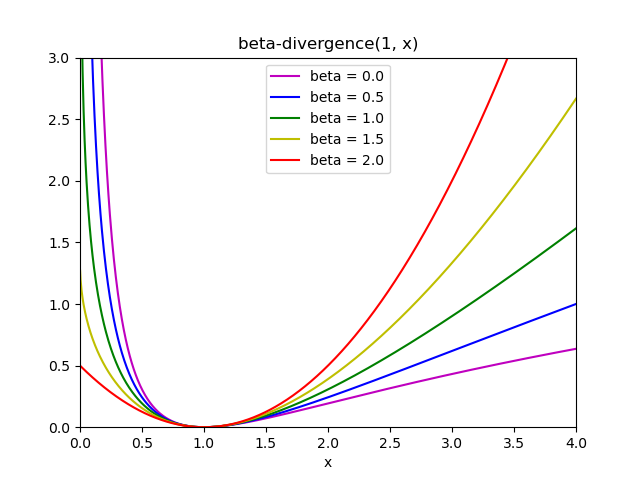

.. _decompositions:

=================================================================
تحليل الإشارات إلى مكونات (مشاكل تحليل المصفوفات)
=================================================================

.. currentmodule:: sklearn.decomposition

.. _PCA:

تحليل المكونات الأساسية (PCA)

    
    (ملاحظة: لم يتم ترجمة الكلمات بين علامتي ``__`` لأنها رموز خاصة أو شفرات برمجية)

  هذا نص بتنسيق RST أريد ترجمته إلى اللغة العربية، مع الحفاظ على الرموز الخاصة والرموز والمعادلات الرياضية والروابط والتاجات والشفرة البرمجية كما هي:

==================================

تحليل المكونات الأساسية الدقيق والتفسير الاحتمالي
------------------------------------------

يستخدم تحليل المكونات الأساسية (PCA) لتفكيك مجموعة بيانات متعددة المتغيرات في مجموعة من المكونات المتعامدة المتتالية التي تشرح أكبر قدر ممكن من التباين. في مكتبة scikit-learn، يتم تنفيذ PCA ككائن محول يتعلم ن مكونات في طريقة "fit" الخاصة به، ويمكن استخدامه على بيانات جديدة لإسقاطها على هذه المكونات.

يقوم PCA بتركيز البيانات المدخلة ولكنه لا يغير مقياسها لكل ميزة قبل تطبيق SVD. يسمح المعلمة الاختيارية "whiten=True" بإسقاط البيانات على الفضاء الفريد مع تغيير مقياس كل مكون إلى تباين الوحدة. غالبًا ما يكون هذا مفيدًا إذا كانت النماذج اللاحقة تقوم بفرضيات قوية على توازي الإشارة: على سبيل المثال، هذا هو الحال بالنسبة لآلة الدعم الشعاعي مع نواة RBF وخوارزمية التجميع K-Means.

فيما يلي مثال لمجموعة بيانات iris، والتي تتكون من 4 ميزات، يتم إسقاطها على البعدين اللذين يشرحان معظم التباين:

.. figure:: ../auto_examples/decomposition/images/sphx_glr_plot_pca_vs_lda_001.png
    :target: ../auto_examples/decomposition/plot_pca_vs_lda.html
    :align: center
    :scale: 

يوفر كائن PCA أيضًا تفسيرًا احتماليًا للتحليلPCA الذي يمكنه إعطاء احتمال للبيانات بناءً على مقدار التباين الذي تشرحه. على هذا النحو، فإنه ينفذ طريقة "score" التي يمكن استخدامها في التحقق المتقاطع:

.. figure:: ../auto_examples/decomposition/images/sphx_glr_plot_pca_vs_fa_model_selection_001.png
    :target: ../auto_examples/decomposition/plot_pca_vs_fa_model_selection.html
    :align: center
    :scale: 

.. rubric:: الأمثلة

* :ref:`sphx_glr_auto_examples_decomposition_plot_pca_iris.py`
* :ref:`sphx_glr_auto_examples_decomposition_plot_pca_vs_lda.py`
* :ref:`sphx_glr_auto_examples_decomposition_plot_pca_vs_fa_model_selection.py`

.. _IncrementalPCA:

تحليل المكونات الأساسية التدريجي
---------------

إن كائن PCA مفيد جدًا، ولكنه يحتوي على بعض القيود للمجموعات الكبيرة من البيانات. أكبر قيود هي أن PCA يدعم فقط المعالجة الدُفْعِيَّة، مما يعني أنه يجب أن تتناسب جميع البيانات التي سيتم معالجتها في الذاكرة الرئيسية. يستخدم كائن IncrementalPCA شكلًا مختلفًا من المعالجة ويسمح بالحسابات الجزئية التي تطابق تقريبًا نتائج PCA أثناء معالجة البيانات بطريقة الدُفْعِيَّة الصغيرة. يجعل IncrementalPCA من الممكن تنفيذ تحليل المكونات الأساسية خارج النواة إما عن طريق:

* استخدام طريقة "partial_fit" على أجزاء من البيانات التي يتم جلبها بشكل تسلسلي من القرص الصلب المحلي أو قاعدة بيانات الشبكة.

* استدعاء طريقة "fit" الخاصة به على ملف خريطة ذاكرة باستخدام "numpy.memmap".

يخزن IncrementalPCA تقديرات مكونات وتباينات الضوضاء فقط، من أجل تحديث "explained_variance_ratio_" بشكل تدريجي. هذا هو السبب في أن استخدام الذاكرة يعتمد على عدد العينات لكل دُفْعَة، بدلاً من عدد العينات التي سيتم معالجتها في المجموعة.

كما هو الحال في PCA، فإن IncrementalPCA يركز ولكنه لا يغير مقياس البيانات المدخلة لكل ميزة قبل تطبيق SVD.

.. figure:: ../auto_examples/decomposition/images/sphx_glr_plot_incremental_pca_001.png
    :target: ../auto_examples/decomposition/plot_incremental_pca.html
    :align: center
    :scale: 

.. figure:: ../auto_examples/decomposition/images/sphx_glr_plot_incremental_pca_002.png
    :target: ../auto_examples/decomposition/plot_incremental_pca.html
    :align: center
    :scale: 

.. rubric:: الأمثلة

* :ref:`sphx_glr_auto_examples_decomposition_plot_incremental_pca.py`

.. _RandomizedPCA:

تحليل المكونات الأساسية باستخدام SVD العشوائي

    

من المثير للاهتمام في كثير من الأحيان إسقاط البيانات على فضاء ذي أبعاد أقل الذي يحافظ على معظم التباين، عن طريق إسقاط المتجه المفرد للمكونات المرتبطة بالقيم الفردية الأقل.

على سبيل المثال، إذا كنا نعمل مع صور رمادية بدقة 64x64 بكسل للتعرف على الوجوه، فإن أبعاد البيانات تكون 4096، ويستغرق تدريب جهاز الدعم الناقل RBF وقتًا طويلاً على بيانات واسعة كهذه. علاوة على ذلك، نعلم أن الأبعاد الداخلية للبيانات أقل بكثير من 4096 نظرًا لأن جميع صور الوجوه البشرية تبدو متشابهة إلى حد ما. تقع العينات على تنوع من أبعاد أقل بكثير (لنفترض حوالي 200 على سبيل المثال). يمكن استخدام خوارزمية PCA لتحويل البيانات خطيًا مع تقليل الأبعاد والحفاظ على معظم التباين المشروح في نفس الوقت.

فئة :class:`PCA` المستخدمة مع البارامتر الاختياري ``svd_solver='randomized'`` مفيدة جدًا في هذه الحالة: بما أننا سنقوم بإسقاط معظم المتجهات المفردة، فمن الأكثر كفاءة تقييد الحساب بتقدير تقريبي للمتجهات المفردة التي سنحتفظ بها بالفعل لأداء التحويل.

على سبيل المثال، يُظهر ما يلي 16 صورة عينة (مركزة حول 0.0) من مجموعة بيانات Olivetti. على الجانب الأيمن توجد أول 16 متجهًا فرديًا تم إعادة تشكيلها كصور شخصية. نظرًا لأننا نطلب فقط المتجهات المفردة العلوية الـ 16 لمجموعة بيانات ذات حجم :math:`n_{samples} = 400` و:math:`n_{features} = 64 \times 64 = 4096`، فإن وقت الحساب أقل من ثانية واحدة:

.. |orig_img| image:: ../auto_examples/decomposition/images/sphx_glr_plot_faces_decomposition_001.png
   :target: ../auto_examples/decomposition/plot_faces_decomposition.html
   :scale: 60%

.. |pca_img| image:: ../auto_examples/decomposition/images/sphx_glr_plot_faces_decomposition_002.png
   :target: ../auto_examples/decomposition/plot_faces_decomposition.html
   :scale: 60%

.. centered:: |orig_img| |pca_img|

إذا لاحظنا :math:`n_{\max} = \max(n_{\mathrm{samples}}, n_{\mathrm{features}})` و:math:`n_{\min} = \min(n_{\mathrm{samples}}, n_{\mathrm{features}})`, فإن التعقيد الزمني لـ :class:`PCA` العشوائي هو :math:`O(n_{\max}^2 \cdot n_{\mathrm{components}})` بدلاً من :math:`O(n_{\max}^2 \cdot n_{\min})` للطريقة الدقيقة المطبقة في :class:`PCA`.

إن حجم الذاكرة لـ :class:`PCA` العشوائي يتناسب أيضًا مع :math:`2 \cdot n_{\max} \cdot n_{\mathrm{components}}` بدلاً من :math:`n_{\max} \cdot n_{\min}` للطريقة الدقيقة.

ملاحظة: إن تطبيق ``inverse_transform`` في :class:`PCA` مع ``svd_solver='randomized'`` ليس هو التحويل العكسي الدقيق لـ ``transform`` حتى عندما يكون ``whiten=False`` (افتراضي).

.. rubric:: أمثلة

* :ref:`sphx_glr_auto_examples_applications_plot_face_recognition.py`
* :ref:`sphx_glr_auto_examples_decomposition_plot_faces_decomposition.py`

.. rubric:: مراجع

* الخوارزمية 4.3 في :arxiv:`"Finding structure with randomness: Stochastic algorithms for constructing approximate matrix decompositions" <0909.4061>` Halko، et al.، 2

* :arxiv:`"An implementation of a randomized algorithm for principal component analysis" <1412.3510>` A. Szlam et al. 2014

.. _SparsePCA:

تحليل المكونات الأساسية النادرة (SparsePCA و MiniBatchSparsePCA)

    

:class:`SparsePCA` هو نوع من التحليل ألرئيسي للمكونات (PCA)، والغرض منه هو استخراج مجموعة المكونات النادرة التي تعيد بناء البيانات بأفضل شكل.

التحليل الرئيسي للمكونات النادرة المصغرة (:class:`MiniBatchSparsePCA`) هو نوع من :class:`SparsePCA`، لكنه أسرع ولكن أقل دقة. يتم الوصول إلى السرعة المتزايدة من خلال التكرار على أجزاء صغيرة من مجموعة الميزات، لعدد معين من التكرارات.

تحليل المكونات الرئيسية (:class:`PCA`) له عيب في أن المكونات المستخرجة بواسطة هذه الطريقة لها تعبيرات كثيفة بشكل حصري، أي أن لها معاملات غير صفرية عند التعبير عنها كمجموعات خطية للمتغيرات الأصلية. هذا يمكن أن يجعل التفسير صعبًا. في كثير من الحالات، يمكن تخيل المكونات الحقيقية الأساسية بشكل أكثر طبيعية على أنها متجهات نادرة؛ على سبيل المثال في التعرف على الوجه، قد تتوافق المكونات بشكل طبيعي مع أجزاء الوجوه.

تؤدي مكونات رئيسية نادرة إلى تمثيل أكثر قابلية للتفسير، مع التأكيد بوضوح على أي من الميزات الأصلية تساهم في الاختلافات بين العينات.

يوضح المثال التالي 16 مكونًا تم استخراجها باستخدام التحليل الرئيسي للمكونات النادرة من مجموعة بيانات أوجه Olivetti. يمكن ملاحظة كيف أن مصطلح التناظم يحث على العديد من الأصفار. علاوة على ذلك، فإن التركيب الطبيعي للبيانات يجعل المعاملات غير الصفرية متجاورة رأسيًا. لا يفرض النموذج هذا رياضيًا: كل مكون هو متجه :math:`h \in \mathbf{R}^{4096}`, وليس هناك مفهوم للتجاور الرأسي سوى أثناء التصور الصديق للبشر كصور بحجم 64x64 بكسل. حقيقة أن المكونات المعروضة أدناه تبدو محلية هي تأثير التركيب المتأصل في البيانات، مما يجعل مثل هذه الأنماط المحلية تقلل من أخطاء إعادة البناء. هناك معايير تحث على الندرة والتي تأخذ في الاعتبار التجاذب وأنواع مختلفة من التركيب؛ انظر [Jen09]_ لمراجعة هذه الأساليب.
للحصول على مزيد من التفاصيل حول كيفية استخدام التحليل الرئيسي للمكونات النادرة، انظر قسم الأمثلة أدناه.

.. |spca\_img| image:: ../auto\_examples/decomposition/images/sphx\_glr\_plot\_faces\_decomposition\_005.png
   :target: ../auto\_examples/decomposition/plot\_faces\_decomposition.html
   :scale: 6

.. centered:: |pca\_img| |spca\_img|

لاحظ أن هناك العديد من الصيغ المختلفة لمشكلة التحليل الرئيسي للمكونات النادرة. الصيغة التي يتم تنفيذها هنا تستند إلى [Mrl09]_. مشكلة التحسين التي تم حلها هي مشكلة تحليل المكونات الرئيسية (تعلم القاموس) مع عقوبة :math:`\ell_1` على المكونات:

.. math::
   (U^*, V^*) = \underset{U, V}{\operatorname{arg\,min\,}} & \frac{1}{2}
                ||X-UV||_{\text{Fro}}^2+\alpha||V||_{1,1} \\
                \text{subject to } & ||U\_k||\_2 <= 1 \text{ for all }
                0 \leq k < n_{components}

:math:`||.||_{\text{Fro}}` يشير إلى معيار فرونيوس و :math:`||.||_{1,1}` يشير إلى معيار المصفوفة بدخولها الذي هو مجموع القيم المطلقة لجميع الدخول في المصفوفة.
معيار :math:`||.||_{1,1}` الذي يحث على الندرة يمنع أيضًا تعلم المكونات من الضوضاء عندما تتوفر عينات تدريب قليلة. يمكن ضبط درجة العقوبة (وبالتالي الندرة) من خلال الباراميتر الفائق ``alpha``. تؤدي القيم الصغيرة إلى تعميم لطيف، بينما تقود القيم الأكبر العديد من المعاملات إلى الصفر.

.. note::

  على الرغم من كونها في روح الخوارزمية عبر الإنترنت، إلا أن الفئة :class:`MiniBatchSparsePCA` لا تنفذ ``partial_fit`` لأن الخوارزمية عبر الإنترنت على طول اتجاه الميزات، وليس اتجاه العينات.

.. rubric:: أمثلة

* :ref:`sphx\_glr\_auto\_examples\_decomposition\_plot\_faces\_decomposition.py`

.. rubric:: المراجع

.. [Mrl09] `"Online Dictionary Learning for Sparse Coding"
   <https://www.di.ens.fr/sierra/pdfs/icml09.pdf>`_
   J. Mairal, F. Bach, J. Ponce, G. Sapiro, 2009
.. [Jen0

...

(غير كامل، يرجى توفير النص الكامل للترجمة الكاملة)

(لاحظ أنني لم أترجم الروابط والتاجات والرموز، كما هو مطلوب في السؤال)

KernelPCA بالتنسيق RST إلى اللغة العربية
-------------------------

:class:`KernelPCA` هي امتداد لـ PCA التي تحقق تخفيض الأبعاد غير الخطية من خلال استخدام النواة (انظر: :ref:`metrics`) [Scholkopf1997]_. لديها العديد من التطبيقات بما في ذلك إزالة الضوضاء والضغط والتنبؤ المنظم (تقدير اعتماد النواة). :class:`KernelPCA` تدعم كل من ``transform`` و ``inverse_transform``.

.. figure:: ../auto_examples/decomposition/images/sphx_glr_plot_kernel_pca_002.png
    :target: ../auto_examples/decomposition/plot_kernel_pca.html
    :align: center
    :scale: 75%

.. note::
    تعتمد :meth:`KernelPCA.inverse_transform` على تراجع النواة لتعلم دالة تعيين العينات من أساس PCA إلى مساحة الميزة الأصلية [Bakir2003]_. وبالتالي ، فإن إعادة البناء التي تم الحصول عليها باستخدام :meth:`KernelPCA.inverse_transform` هي تقريب. راجع المثال المرتبط أدناه لمزيد من التفاصيل.

.. rubric:: أمثلة

* :ref:`sphx_glr_auto_examples_decomposition_plot_kernel_pca.py`
* :ref:`sphx_glr_auto_examples_applications_plot_digits_denoising.py`

.. rubric:: المراجع

.. [Scholkopf1

...

1997] Schölkopf، Bernhard، Alexander Smola، و Klaus-Robert Müller. `"تحليل المكون الرئيسي للنواة." <https://people.eecs.berkeley.edu/~wainwrig/stat241b/scholkopf_kernel.pdf>`_ المؤتمر الدولي حول الشبكات العصبية الاصطناعية. Springer ، برلين ، هايدلبرغ ، 1997.

.. [Bakir2003] Bakır، Gökhan H.، Jason Weston، و Bernhard Schölkopf. `"تعلم العثور على الصور المسبقة." <https://papers.nips.cc/paper/2003/file/ac1ad983e08ad3304a97e147f522747e-Paper.pdf>`_ التقدم في أنظمة معالجة المعلومات العصبية 16 (2003): 449-456.

.. _kPCA_Solvers:

اختيار حل لمشكلة Kernel PCA
---------------------------------

في حين أن في :class:`PCA` عدد المكونات محدود بعدد الميزات ، في :class:`KernelPCA` عدد المكونات محدود بعدد العينات. تحتوي العديد من مجموعات البيانات الواقعية على عدد كبير من العينات! في هذه الحالات ، يعد العثور على *جميع* المكونات باستخدام kPCA الكامل مضيعة لوقت الحساب ، نظرًا لأن البيانات موصوفة في الغالب بالمكونات القليلة الأولى (على سبيل المثال ، ``n_components<=100``). بمعنى آخر ، فإن مصفوفة Gram المركزة التي يتم تحليلها في عملية تركيب Kernel PCA لها رتبة فعالة أصغر بكثير من حجمها. هذا هو الوضع الذي يمكن لحلالات التقريب أن توفر فيه تسريعًا مع فقدان دقة منخفض للغاية.

.. dropdown:: حلقات التحليل

    يمكن استخدام المعلمة الاختيارية ``eigen_solver='randomized'`` لـ *تقليل* وقت الحساب بشكل كبير عند طلب ``n_components`` صغير مقارنة بعدد العينات. إنه يعتمد على طرق التحلل العشوائية لإيجاد حل تقريبي في وقت أقصر.

    تعقيد الوقت في :class:`KernelPCA` العشوائي هو :math:`O(n_{\mathrm{samples}}^2 \cdot n_{\mathrm{components}})` بدلاً من :math:`O(n_{\mathrm{samples}}^3)` للطريقة الدقيقة المطبقة مع ``eigen_solver='dense'``.

    بصمة الذاكرة لـ :class:`KernelPCA` العشوائية تتناسب أيضًا مع :math:`2 \cdot n_{\mathrm{samples}} \cdot n_{\mathrm{components}}` بدلاً من :math:`n_{\mathrm{samples}}^2` للطريقة الدقيقة.

    ملاحظة: هذه التقنية هي نفسها في :ref:`RandomizedPCA`.

    بالإضافة إلى المحللين المذكورين أعلاه ، يمكن استخدام ``eigen_solver='arpack'`` كطريقة بديلة للحصول على تحليل تقريبي. في الواقع ، توفر هذه الطريقة أوقات تنفيذ معقولة فقط عندما يكون عدد المكونات المطلوب العثور عليها صغيرًا للغاية. يتم تمكينه افتراضيًا عندما يكون عدد المكونات المطلوبة أقل من 10 (صارم) وعدد العينات أكثر من 200 (صارم). انظر :class:`KernelPCA` للتفاصيل.

    .. rubric:: المراجع

    * محلل *dense*: `وثائق scipy.linalg.eigh <https://docs.scipy.org/doc/scipy/reference/generated/scipy.linalg.eigh.html>`_

    * محلل *randomized*:

      * الخوارزمية 4.3 في :arxiv:`"Finding structure with randomness: Stochastic algorithms for constructing approximate matrix decompositions" <0909.4061>` Halko ، et al. (2009)

      * :arxiv:`"An implementation of a randomized algorithm for principal component analysis" <1412.3510>` A. Szlam et al. (2014)

    * محلل *arpack*: `وثائق scipy.sparse.linalg.eigsh <https://docs.scipy.org/doc/scipy/reference/generated/scipy.sparse.linalg.eigsh.html>`_ R. B. Lehoucq ، D. C. Sorensen ، و C. Yang ، (1998)

.. _LSA:

تحلل القيمة المفردة المقتطعة والتحليل الدلالي الكامن

    

(ملاحظة: لم يتم ترجمة القسم الأخير لأنه يبدو أنه قسم غير مكتمل في النص الأصلي.)

:class:`TruncatedSVD` تنفذ نوعا من تحليل القيمة المفردة (SVD) الذي يحسب فقط القيم الفردية :math:`k` الأكبر، حيث :math:`k` هي معلمة يحددها المستخدم.

:class:`TruncatedSVD` يشبه جدا :class:`PCA`، لكنه يختلف في أن المصفوفة :math:`X` لا تحتاج إلى أن تكون مركزية. عندما يتم طرح الوسائل العمودية (لكل ميزة) من :math:`X` من قيم الميزة، فإن SVD المقتطعة على المصفوفة الناتجة تعادل PCA.

.. dropdown:: حول SVD المقتطعة والتحليل الدلالي الكامن (LSA)

    عندما يتم تطبيق SVD المقتطعة على مصفوفات مصطلح المستند (كما يتم إرجاعها بواسطة :class:`~sklearn.feature_extraction.text.CountVectorizer` أو :class:`~sklearn.feature_extraction.text.TfidfVectorizer`)، يُعرف هذا التحويل باسم `تحليل الدلالي الكامن <https://nlp.stanford.edu/IR-book/pdf/18lsi.pdf>`_ (LSA)، لأنه يحول هذه المصفوفات إلى مساحة "دلالية" منخفضة الأبعاد. على وجه الخصوص، من المعروف أن LSA يقاتل آثار الترادف والتعددية (كلاهما يعني تقريبا أن هناك معاني متعددة لكل كلمة)، مما يتسبب في أن تكون مصفوفات مصطلح المستند مفرطة في التفرق وتظهر تشابهًا ضعيفًا في ظل تدابير مثل التشابه الجيبي.

    .. note::
        يُعرف LSA أيضًا باسم فهرسة الدلالي الكامنة، LSI، على الرغم من أن هذا يشير بشكل صارم إلى استخدامه في الفهارس المستمرة لأغراض استرجاع المعلومات.

    من الناحية الرياضية، ينتج SVD المقتطع المطبق على عينات التدريب :math:`X` تقريبًا منخفض الرتبة :math:`X`:

    .. math::
        X \approx X_k = U_k \Sigma_k V_k^\top

    بعد هذه العملية، يكون :math:`U_k \Sigma_k` مجموعة التدريب المحولة مع ميزات :math:`k` (تسمى ``n_components`` في API).

    لتحويل مجموعة اختبار :math:`X` أيضًا، نقوم بضربها مع :math:`V_k`:

    .. math::
        X' = X V_k

    .. note::
        تتعامل معظم معالجات LSA في معالجة اللغة الطبيعية (NLP) وأدبيات استرجاع المعلومات (IR) مع محاور المصفوفة :math:`X` بحيث يكون لها شكل ``(n_features، n_samples)``. نحن نقدم LSA بطريقة مختلفة تتطابق بشكل أفضل مع واجهة برمجة تطبيقات scikit-learn، ولكن القيم الفردية التي تم العثور عليها هي نفسها.

    بينما يعمل محول :class:`TruncatedSVD` مع أي مصفوفة ميزة، فإن استخدامه على مصفوفات tf-idf موصى به على عدد الترددات الخام في إعداد LSA / معالجة المستندات. على وجه الخصوص، يجب تشغيل القياس تحت الخطي وتردد المستند العكسي (``sublinear_tf=True, use_idf=True``) لجلب قيم الميزة أقرب إلى التوزيع الغوسي، وتعويض افتراضات LSA الخاطئة حول البيانات النصية.

.. rubric:: أمثلة

* :ref:`sphx_glr_auto_examples_text_plot_document_clustering.py`

.. rubric:: المراجع

* كريستوفر د. مانينغ، برابهكار راهيجان وهينريش شوتز (2008)، *مقدمة في استرجاع المعلومات*، مطبعة جامعة كامبريدج، الفصل 18: `تحليل مصفوفات وفهرسة الدلالي الكامن <https://nlp.stanford.edu/IR-book/pdf/18lsi.pdf>`_

.. _DictionaryLearning:

تعلم القاموس

    

تعلم القاموس هو طريقة غير خاضعة للرقابة لاستخراج الميزة التي تتعلم تجميعات خطية صغيرة وكثيفة من المدخلات، والتي يمكن استخدامها لإعادة بناء الإشارات الأصلية بدقة.

على عكس PCA الذي يسعى إلى تقليل الخطأ الأمثل العالمي، يجد تعلم القاموس مجموعات فرعية محلية من الذرات التي تصف أفضل أجزاء مختلفة من الفضاء. وبالتالي، يمكنها التقاط الخصائص المحلية بشكل أفضل وبالتالي غالبا ما توفر جودة أفضل في إعادة البناء من PCA.

في scikit-learn، يتم تنفيذ تعلم القاموس على النحو التالي :class:`sklearn.decomposition.DictionaryLearning`.

لمزيد من المعلومات، راجع:

* `تعلم القاموس للمواد الطبيعية والصور <https:// impatiencer.github.io/dictionary-learning/>`_

* <NAME>، <NAME>، <NAME> (2009)، `"تعلم القاموس البصري عبر الانحدار الجزئي" <https://lear.inrialpes.fr/pubs/2009/MYP_iccv09.pdf>`_.

* <NAME>، <NAME> (2014)، `"تعلم القاموس للمواد الطبيعية والصور: حالة الفن" <https://hal.archives-ouvertes.fr/hal-00925542/document>`_.

* <NAME>، <NAME>، <NAME> (2016)، `"المقدمة في تعلم القاموس وتطبيقاته" <https://sparse.tuebingen.mpg.de/MTP-DLC/>`_.
===================

.. _SparseCoder:

التشفير الضعيف باستخدام قاموس تم حسابه مسبقًا
-------------------------------------------

إن كائن :class:`SparseCoder` هو مُقدّر يمكن استخدامه لتحويل الإشارات إلى مجموعة خطية ضعيفة من الذرات من قاموس ثابت ومحسوب مسبقًا مثل أساس الموجي المنفصل. لذلك، لا ينفذ هذا الكائن طريقة ``fit``. إن التحويل يعادل مشكلة التشفير الضعيف: إيجاد تمثيل للبيانات كمجموعة خطية من أقل عدد ممكن من ذرات القاموس. جميع تنويعات تعلم القاموس تنفذ طرق التحويل التالية، والتي يمكن التحكم بها عبر معامل التهيئة ``transform_method``:

* مطابقة السعي المتعامد (:ref:`omp`)

* انحدار الزاوية الأقل (:ref:`least_angle_regression`)

* لاسو يتم حسابها بواسطة انحدار الزاوية الأقل

* لاسو باستخدام نزول الإحداثيات (:ref:`lasso`)

* عتبة

تتميز العتبة بالسرعة العالية ولكنها لا تعطي إعادة بناء دقيقة. لقد ثبتت فائدتها في الأدبيات لمهام التصنيف. لمهام إعادة بناء الصور، فإن مطابقة السعي المتعامد تعطي إعادة بناء دقيقة وغير متحيزة.

توفر كائنات تعلم القاموس، عبر معامل ``split_code``، إمكانية فصل القيم الموجبة والسالبة في نتائج التشفير الضعيف. هذا مفيد عندما يستخدم تعلم القاموس لاستخراج الميزات التي ستستخدم للتعلم تحت الإشراف، لأنه يسمح لخوارزمية التعلم بتعيين أوزان مختلفة للتحميلات السالبة لذرة معينة، من الحمل الموجب المناظر.

يكون طول الكود المنفصل لعينة واحدة ``2 * n_components`` ويتم بناؤه باستخدام القاعدة التالية: أولاً، يتم حساب الكود المنتظم بطول ``n_components``. ثم، يتم ملء النصف الأول من ``split_code`` بالجزء الموجب من متجه الكود المنتظم. يتم ملء النصف الثاني من الكود المنفصل بالجزء السالب من متجه الكود، ولكن بعلامة موجبة. لذلك، يكون الكود المنفصل غير سالب.

.. rubric:: أمثلة

* :ref:`sphx_glr_auto_examples_decomposition_plot_sparse_coding.py`

تعلم القاموس العام
---------------------------

تعلم القاموس (:class:`DictionaryLearning`) هو مشكلة تحليل المصفوفة التي تصل إلى إيجاد قاموس (عادة ما يكون مفرط الاكتمال) والذي سيؤدي أداءً جيدًا في التشفير الضعيف للبيانات المجهزة.

تمثل البيانات كمجموعات ضعيفة من الذرات من قاموس مفرط الاكتمال هو الطريقة التي يعمل بها القشرة البصرية الأولية للثدييات. نتيجة لذلك، فإن تعلم القاموس المطبق على رقعات الصور قد أعطى نتائج جيدة في مهام معالجة الصور مثل إكمال الصورة، الترميم والتنقية، وكذلك لمهام التعرف تحت الإشراف.

تعلم القاموس هو مشكلة تحسين تحل عن طريق تحديث الكود الضعيف بشكل متكرر، كحل لمشاكل لاسو المتعددة، مع اعتبار القاموس ثابتًا، ثم تحديث القاموس ليناسب الكود الضعيف بأفضل شكل.

.. math::
   (U^*, V^*) = \underset{U, V}{\operatorname{arg\,min\,}} & \frac{1}{2}
                ||X-UV||_{\text{Fro}}^2+\alpha||U||_{1,1} \\
                \text{subject to } & ||V_k||_2 <= 1 \text{ for all }
                0 \leq k < n_{\mathrm{atoms}}

.. |pca_img2| image:: ../auto_examples/decomposition/images/sphx_glr_plot_faces_decomposition_002.png
   :target: ../auto_examples/decomposition/plot_faces_decomposition.html
   :scale: 60%

.. |dict_img2| image:: ../auto_examples/decomposition/images/sphx_glr_plot_faces_decomposition_007.png
   :target: ../auto_examples/decomposition/plot_faces_decomposition.html
   :scale: 60%

.. centered:: |pca_img2| |dict_img2|

:math:`||.||_{\text{Fro}}` ترمز إلى معيار فوبينيوس و:math:`||.||_{1,1}` ترمز إلى المعيار المصفوفي المدخلي الذي هو مجموع القيم المطلقة لجميع المدخلات في المصفوفة.
بعد استخدام مثل هذا الإجراء لتجهيز القاموس، يكون التحويل ببساطة خطوة التشفير الضعيف التي تشترك في نفس التنفيذ مع جميع كائنات تعلم القاموس (انظر :ref:`SparseCoder`).

من الممكن أيضًا تقييد القاموس و/أو الكود ليكونا موجبين لمطابقة القيود التي قد تكون موجودة في البيانات. في الأسفل وجوه مع قيود إيجابية مختلفة مطبقة. الأحمر يشير إلى القيم السالبة، الأزرق يشير إلى القيم الموجبة، والأبيض يمثل الأصفار.

.. |dict_img_pos1| image:: ../auto_examples/decomposition/images/sphx_glr_plot_faces_decomposition_010.png
    :target: ../auto_examples/decomposition/plot_image_denoising.html
    :scale: 60%

.. |dict_img_pos2| image:: ../auto_examples/decomposition/images/sphx_glr_plot_faces_decomposition_011.png
    :target: ../auto_examples/decomposition/plot_image_denoising.html
    :scale: 60%

.. |dict_img_pos3| image:: ../auto_examples/decomposition/images/sphx_glr_plot_faces_decomposition_012.png
    :target: ../auto_examples/decomposition/plot_image_denoising.html
    :scale: 60%

.. |dict_img_pos4| image:: ../auto_examples/decomposition/images/sphx_glr_plot_faces_decomposition_013.png
    :target: ../auto_examples/decomposition/plot_image_denoising.html
    :scale: 60%

.. centered:: |dict_img_pos1| |dict_img_pos2|
.. centered:: |dict_img_pos3| |dict_img_pos4|

تعرض الصورة التالية كيف يبدو قاموس تم تعلمه من رقعات صور بحجم 4x4 بكسل مستخرجة من جزء من صورة وجه الراكون.

.. figure:: ../auto_examples/decomposition/images/sphx_glr_plot_image_denoising_001.png
    :target: ../auto_examples/decomposition/plot_image_denoising.html
    :align: center
    :scale: 50%

.. rubric:: أمثلة

* :ref:`sphx_glr_auto_examples_decomposition_plot_image_denoising.py`

.. rubric:: المراجع

* `"Online dictionary learning for sparse coding"
  <https://www.di.ens.fr/sierra/pdfs/icml09.pdf>`_
  J. Mairal, F. Bach, J. Ponce, G. Sapiro, 2

.. _MiniBatchDictionaryLearning:

تعلم القاموس بواسطة الدُفعات الصغيرة

    

------------------------------

تقوم :class:`MiniBatchDictionaryLearning` بتنفيذ نسخة أسرع ولكن أقل دقة من خوارزمية تعلم القاموس، والتي تكون أكثر ملاءمة لمجموعات البيانات الكبيرة.

بشكل افتراضي، تقوم :class:`MiniBatchDictionaryLearning` بتقسيم البيانات إلى مجموعات صغيرة وتحسنها بطريقة عبر الإنترنت من خلال الدوران فوق المجموعات الصغيرة لعدد محدد من التكرارات. ومع ذلك، في الوقت الحالي، لا تنفذ شرط توقف.

كما ينفذ ASSESSOR أيضًا ``partial_fit``، والذي يقوم بتحديث القاموس عن طريق التكرار مرة واحدة فقط على مجموعة صغيرة. يمكن استخدام هذا للتعلم عبر الإنترنت عندما تكون البيانات غير متوفرة بسهولة من البداية، أو عندما لا تتناسب البيانات مع الذاكرة.

.. currentmodule:: sklearn.cluster

.. image:: ../auto_examples/cluster/images/sphx_glr_plot_dict_face_patches_001.png
    :target: ../auto_examples/cluster/plot_dict_face_patches.html
    :scale: 50%
    :align: right

.. topic:: **التجميع لتعلم القاموس**

   لاحظ أنه عند استخدام تعلم القاموس لاستخراج التمثيل (مثل الترميز الضئيل)، يمكن أن يكون التجميع وكيلًا جيدًا لتعلم القاموس. على سبيل المثال، فإن ASSESSOR :class:`MiniBatchKMeans` يكون فعالاً حسابياً وينفذ التعلم عبر الإنترنت باستخدام طريقة ``partial_fit``.

   مثَال: :ref:`sphx_glr_auto_examples_cluster_plot_dict_face_patches.py`

.. currentmodule:: sklearn.decomposition

.. _FA:

تحليل العوامل

    

في التعلم غير الخاضع للإشراف، لدينا مجموعة بيانات فقط :math:`X = \{x_1, x_2, \dots, x_n
\}`. كيف يمكن وصف هذه المجموعة البيانات رياضياً؟ نموذج بسيط جداً لمتغير كامن مستمّر لـ :math:`X` هو

.. math:: x_i = W h_i + \mu + \epsilon

يُسمى المتجه :math:`h_i` "كامن" لأنه غير مراقَب. :math:`\epsilon` يعتبر مصطلح ضوضاء موزع وفقاً لتوزيع غاوسي بمتوسط 0 و تباين :math:`\Psi` (أي :math:`\epsilon \sim \mathcal{N}(0, \Psi)`)، :math:`\mu` هو متجه إزاحة عشوائي. يُسمى هذا النموذج "توليدي" لأنه يصف كيف يتم توليد :math:`x_i` من :math:`h_i`. إذا استخدمنا جميع :math:`x_i` كأعمدة لتشكيل مصفوفة :math:`\mathbf{X}` وجميع :math:`h_i` كأعمدة لمصفوفة :math:`\mathbf{H}`، فيمكننا الكتابة (مع تحديد :math:`\mathbf{M}` و :math:`\mathbf{E}` بشكل مناسب):

.. math::
    \mathbf{X} = W \mathbf{H} + \mathbf{M} + \mathbf{E}

بعبارة أخرى، قمنا *بتحلل* المصفوفة :math:`\mathbf{X}`.

إذا تم إعطاء :math:`h_i`، فإن المعادلة أعلاه تعني تلقائياً التفسير الاحتمالي التالي:

.. math:: p(x_i|h_i) = \mathcal{N}(Wh_i + \mu, \Psi)

للحصول على نموذج احتمالي كامل، نحتاج أيضاً إلى توزيع قبلي للمتغير الكامن :math:`h`. الافتراض الأكثر مباشرة (بناءً على الخصائص اللطيفة للتوزيع الغاوسي) هو :math:`h \sim \mathcal{N}(0،
\mathbf{I})`.  وهذا ينتج توزيع غاوسي كتوزيع هامشي لـ :math:`x`:

.. math:: p(x) = \mathcal{N}(\mu, WW^T + \Psi)

الآن، دون أي افتراضات أخرى، ستكون فكرة وجود متغير كامن :math:`h` زائدة عن الحاجة - يمكن نمذجة :math:`x` بالكامل بمتوسط وتباين. نحتاج إلى فرض بنية أكثر تحديداً على أحد هذين البارامترين. افتراض بسيط إضافي يتعلق بهيكل تباين الخطأ :math:`\Psi`:

* :math:`\Psi = \sigma^2 \mathbf{I}`: يؤدي هذا الافتراض إلى
  النموذج الاحتمالي لـ :class:`PCA`.

* :math:`\Psi = \mathrm{diag}(\psi_1, \psi_2, \dots, \psi_n)`: يُسمى هذا النموذج
  :class:`FactorAnalysis`، وهو نموذج إحصائي كلاسيكي. تُسمى المصفوفة W أحياناً "مصفوفة تحميل العامل".

يقوم كلا الطرازين أساساً بتقدير غاوسي مع مصفوفة التباين منخفضة الرتبة.
نظرًا لأن كلا الطرازين احتماليان، فيمكن دمجهما في نماذج أكثر تعقيدًا، على سبيل المثال مزيج محللي العوامل. يتم الحصول على نماذج مختلفة تماماً (على سبيل المثال
:class:`FastICA`) إذا تم افتراض توزيعات غير غاوسية على المتغيرات الكامنة.

يمكن لـ Factor analysis *إنتاج* مكونات مماثلة (أعمدة مصفوفة التحميل الخاصة به) لـ :class:`PCA`. ومع ذلك، لا يمكن الإدلاء بأي تصريحات عامة
حول هذه المكونات (على سبيل المثال، ما إذا كانت متعامدة):

.. |pca_img3| image:: ../auto_examples/decomposition/images/sphx_glr_plot_faces_decomposition_002.png
    :target: ../auto_examples/decomposition/plot_faces_decomposition.html
    :scale: 60%

.. |fa_img3| image:: ../auto_examples/decomposition/images/sphx_glr_plot_faces_decomposition_008.png
    :target: ../auto_examples/decomposition/plot_faces_decomposition.html
    :scale: 60%

.. centered:: |pca_img3| |fa_img3|

الميزة الرئيسية لـ Factor Analysis على :class:`PCA` هي أنه
يمكنه نمذجة التباين في كل اتجاه من مساحة الإدخال بشكل مستقل
(ضوضاء غير متماثلة):

.. figure:: ../auto_examples/decomposition/images/sphx_glr_plot_faces_decomposition_009.png
    :target: ../auto_examples/decomposition/plot_faces_decomposition.html
    :align: center
    :scale: 75%

هذا يسمح باختيار نموذج أفضل من PCA الاحتمالي في وجود
ضوضاء غير متماثلة:

.. figure:: ../auto_examples/decomposition/images/sphx_glr_plot_pca_vs_fa_model_selection_002.png
    :target: ../auto_examples/decomposition/plot_pca_vs_fa_model_selection.html
    :align: center
    :scale: 75%

غالباً ما يتبع Factor Analysis دوران العوامل (مع
المعلمة `rotation`)، عادة لتحسين قابلية التفسير. على سبيل المثال،
دوران Varimax يزيد من مجموع تباينات التحميلات المربعة،
أي أنها تميل إلى إنتاج عوامل أكثر تجزئة، والتي تتأثر فقط ببعض
الميزات لكل منها (البنية البسيطة). انظر، على سبيل المثال، المثال الأول أدناه.

.. rubric:: أمثلة

* :ref:`sphx_glr_auto_examples_decomposition_plot_varimax_fa.py`
* :ref:`sphx_glr_auto_examples_decomposition_plot_pca_vs_fa_model_selection.py`

.. _ICA:

تحليل المكونات المستقلة (ICA)
====================================

يفصل تحليل المكونات المستقلة إشارة متعددة المتغيرات إلى
مكونات فرعية تضافية تكون مستقلة بشكل أقصى. يتم
تنفيذها في scikit-learn باستخدام
خوارزمية :class:`Fast ICA <FastICA>`. عادةً، لا يتم استخدام ICA لخفض الأبعاد ولكن
لفصل الإشارات المتراكبة. نظرًا لأن نموذج ICA لا يشمل مصطلح الضوضاء،
لكي يكون النموذج صحيحاً، يجب تطبيق التبييض.
يمكن القيام بذلك داخلياً باستخدام وسيطة التبييض أو يدوياً باستخدام أحد
متغيرات PCA.

يتم استخدامه بشكل كلاسيكي لفصل الإشارات المختلطة (المعروفة باسم
*فصل المصدر الأعمى*)، كما في المثال أدناه:

.. figure:: ../auto_examples/decomposition/images/sphx_glr_plot_ica_blind_source_separation_001.png
    :target: ../auto_examples/decomposition/plot_ica_blind_source_separation.html
    :align: center
    :scale: 60%

يمكن أيضاً استخدام ICA كحل غير خطي آخر يجد
مكونات ببعض التفرق:

.. |pca_img4| image:: ../auto_examples/decomposition/images/sphx_glr_plot_faces_decomposition_002.png
    :target: ../auto_examples/decomposition/plot_faces_decomposition.html
    :scale: 60%

.. |ica_img4| image:: ../auto_examples/decomposition/images/sphx_glr_plot_faces_decomposition_004.png
    :target: ../auto_examples/decomposition/plot_faces_decomposition.html
    :scale: 60%

.. centered:: |pca_img4| |ica_img4|

.. rubric:: أمثلة

* :ref:`sphx_glr_auto_examples_decomposition_plot_ica_blind_source_separation.py`
* :ref:`sphx_glr_auto_examples_decomposition_plot_ica_vs_pca.py`
* :ref:`sphx_glr_auto_examples_decomposition_plot_faces_decomposition.py`
NMF مع المعيار Frobenius
---------------------------

إن NMF [1]_ هو نهج بديل للتفكيك الذي يفترض أن البيانات والمكونات غير سالبة. يمكن استخدام NMF بدلاً من PCA أو متغيراتها، في الحالات التي لا تحتوي فيها مصفوفة البيانات على قيم سالبة. إنها تجد تحليلاً للعينات :math:`X` في مصفوفتين :math:`W` و :math:`H` من العناصر غير السالبة، من خلال تحسين المسافة :math:`d` بين :math:`X` وناتج ضرب المصفوفة :math:`WH`. إن دالة المسافة الأكثر استخدامًا هي تربيع معيار Frobenius، وهو امتداد واضح للمعيار Euclid للمصفوفات:

.. math::
    d_{\mathrm{Fro}}(X, Y) = \frac{1}{2} ||X - Y||_{\mathrm{Fro}}^2 = \frac{1}{2} \sum_{i,j} (X_{ij} - {Y}_{ij})^2

على عكس PCA، يتم الحصول على تمثيل متجه بطريقة إضافية، عن طريق تراكب المكونات، دون طرح. مثل هذه النماذج الإضافية فعالة لتمثيل الصور والنص.

تم ملاحظة أنه في [Hoyer، 2004] [2]_ ، عندما يتم تقييده بعناية، يمكن لـ NMF إنتاج تمثيل قائم على الأجزاء لمجموعة البيانات، مما يؤدي إلى نماذج قابلة للتفسير. يعرض المثال التالي 16 مكونًا متفرقًا تم العثور عليها بواسطة NMF من الصور في مجموعة بيانات Olivetti للوجوه، مقارنةً بوجه PCA المميز.

.. |pca_img5| image:: ../auto_examples/decomposition/images/sphx_glr_plot_faces_decomposition_002.png
    :target: ../auto_examples/decomposition/plot_faces_decomposition.html
    :scale: 60%

.. |nmf_img5| image:: ../auto_examples/decomposition/images/sphx_glr_plot_faces_decomposition_003.png
    :target: ../auto_examples/decomposition/plot_faces_decomposition.html
    :scale: 60%

.. centered:: |pca_img5| |nmf_img5|

يحدد سمة `init` طريقة التهيئة المطبقة، والتي لها تأثير كبير على أداء الطريقة. تنفذ NMF طريقة Nonnegative Double Singular Value Decomposition. تعتمد NNDSVD [4]_ على عمليتي SVD، واحدة تقترب من مصفوفة البيانات، والأخرى تقترب من المقاطع الإيجابية لعوامل SVD الجزئية الناتجة باستخدام خاصية جبرية للمصفوفات ذات الرتبة الواحدة. خوارزمية NNDSVD الأساسية هي الأنسب للتحلل النادر. يوصى باستخدام المتغيرات NNDSVDa (التي يتم فيها تعيين جميع الأصفار مساوية لمتوسط جميع عناصر البيانات) و NNDSVDar (التي يتم فيها تعيين الأصفار على اضطرابات عشوائية أقل من متوسط البيانات مقسومًا على 100) في الحالة الكثيفة.

لاحظ أن المحلِّل Multiplicative Update ('mu') لا يمكنه تحديث الأصفار الموجودة في التهيئة، لذلك يؤدي إلى نتائج أضعف عند استخدامه مع خوارزمية NNDSVD الأساسية التي تقدم الكثير من الأصفار؛ في هذه الحالة، يجب تفضيل NNDSVDa أو NNDSVDar.

يمكن أيضًا تهيئة NMF بمصفوفات غير سالبة عشوائية ذات نطاق صحيح عن طريق تعيين `init="random"`. يمكن أيضًا تمرير رقم صحيح أو ``RandomState`` إلى `random_state` للتحكم في قابلية التكرار.

في NMF، يمكن إضافة مُسبقات L1 و L2 إلى دالة الخسارة من أجل انتظام النموذج. يستخدم المسبق L2 معيار Frobenius، بينما يستخدم المسبق L1 معيار L1 لكل عنصر. كما هو الحال في :class:`~sklearn.linear_model.ElasticNet` ، نتحكم في مزيج L1 و L2 باستخدام معامل `l1_ratio` (:math:`\rho`) ، وكثافة الانتظام باستخدام معاملات `alpha_W` و `alpha_H` (:math:`\alpha_W` و :math:`\alpha_H`). يتم قياس المسبقات حسب عدد العينات (:math:`n\_samples`) لـ `H` وعدد الميزات (:math:`n\_features`) لـ `W` للحفاظ على تأثيرها متوازنًا بالنسبة لبعضها البعض وإلى مصطلح ملائمة البيانات بشكل مستقل قدر الإمكان عن حجم مجموعة التدريب. ثم مصطلحات المسبقات هي:

.. math::
    (\alpha_W \rho ||W||_1 + \frac{\alpha_W(1-\rho)}{2} ||W||_{\mathrm{Fro}} ^ 2) * n\_features
    + (\alpha_H \rho ||H||_1 + \frac{\alpha_H(1-\rho)}{2} ||H||_{\mathrm{Fro}} ^ 2) * n\_samples

ودالة الهدف المنتظمة هي:

.. math::
    d_{\mathrm{Fro}}(X, WH)
    + (\alpha_W \rho ||W||_1 + \frac{\alpha_W(1-\rho)}{2} ||W||_{\mathrm{Fro}} ^ 2) * n\_features
    + (\alpha_H \rho ||H||_1 + \frac{\alpha_H(1-\rho)}{2} ||H||_{\mathrm{Fro}} ^ 2) * n\_samples

NMF مع اختلاف بيتا

كما هو موضح سابقًا، فإن دالة المسافة الأكثر استخدامًا هي القاعدة التربيعية لـ Frobenius، والتي تعتبر امتدادًا واضحًا للمعيار الأوربي للمصفوفات:

.. math::
    d_{\mathrm{Fro}}(X, Y) = \frac{1}{2} ||X - Y||_{Fro}^2 = \frac{1}{2} \sum_{i,j} (X_{ij} - {Y}_{ij})^2

يمكن استخدام دوال مسافة أخرى في NMF مثل تباعد (المعمم) Kullback-Leibler (KL)، والذي يشار إليه أيضًا باسم I-divergence:

.. math::
    d_{KL}(X, Y) = \sum_{i,j} (X_{ij} \log(\frac{X_{ij}}{Y_{ij}}) - X_{ij} + Y_{ij})

أو تباعد Itakura-Saito (IS):

.. math::
    d_{IS}(X, Y) = \sum_{i,j} (\frac{X_{ij}}{Y_{ij}} - \log(\frac{X_{ij}}{Y_{ij}}) - 1)

هذه الدوال الثلاثة هي حالات خاصة لعائلة beta-divergence، مع :math:`\beta = 2, 1, 0` على التوالي [6]_. يتم تعريف beta-divergence بواسطة:

.. math::
    d_{\beta}(X, Y) = \sum_{i,j} \frac{1}{\beta(\beta - 1)}(X_{ij}^\beta + (\beta-1)Y_{ij}^\beta - \beta X_{ij} Y_{ij}^{\beta - 

لاحظ أن هذا التعريف غير صالح إذا :math:`\beta \in (0; 1)`, ومع ذلك يمكن تمديده بشكل مستمر إلى تعريفات :math:`d_{KL}` و :math:`d_{IS}` على التوالي.

.. dropdown:: NMF solvers المطبقة

    يقوم :class:`NMF` بتطبيق حلان، باستخدام اسلوب Coordinate Descent ('cd') [5]_, وتحديث Multiplicative ('mu') [6]_. يمكن أن يحسن محلل 'mu' كل تباعد من عائلة beta-divergence، بما في ذلك بالطبع قاعدة Frobenius (:math:`\beta=2`), وتباعد (المعمم) Kullback-Leibler (:math:`\beta=1`) وتباعد Itakura-Saito (:math:`\beta=0`). لاحظ أنه بالنسبة لـ :math:`\beta \in (1; 2)`, فإن محلل 'mu' أسرع بكثير من القيم الأخرى لـ :math:`\beta`. لاحظ أيضًا أنه مع :math:`\beta` سالب (أو 0، أي 'itakura-saito')، لا يمكن أن تحتوي مصفوفة الإدخال على قيم صفرية.

    يمكن لمحلل 'cd' فقط تحسين قاعدة Frobenius. نظرًا للتحدب غير الكامن في NMF، قد تتقارب الحلول المختلفة إلى مختلف الحدود الدنيا، حتى عند تحسين دالة المسافة نفسها.

    يُستخدَم NMF بشكل أفضل مع طريقة ``fit_transform``، والتي تقوم بإرجاع المصفوفة W. يتم تخزين المصفوفة H في النموذج المناسب في السمة ``components_``؛ ستقوم طريقة ``transform`` بتحليل مصفوفة جديدة X_new بناءً على هذه المكونات المخزنة::

        >>> import numpy as np
        >>> X = np.array([[1, 1], [2, 1], [3, 1.2], [4, 1], [5, 0.8], [6, 1]])
        >>> from sklearn.decomposition import NMF
        >>> model = NMF(n_components=2, init='random', random_state=0)
        >>> W = model.fit_transform(X)
        >>> H = model.components_
        >>> X_new = np.array([[1, 0], [1, 6.1], [1, 0], [1, 4], [3.2, 1], [0, 4]])
        >>> W_new = model.transform(X_new)

.. rubric:: أمثلة

* :ref:`sphx_glr_auto_examples_decomposition_plot_faces_decomposition.py`
* :ref:`sphx_glr_auto_examples_applications_plot_topics_extraction_with_nmf_lda.py`

.. _MiniBatchNMF:

تجزئة مصفوفة Mini-batch Non Negative
-----------------------------------

:class:`MiniBatchNMF` [7]_ يطبق نسخة أسرع ولكن أقل دقة عن تجزئة المصفوفة غير السالبة (أي :class:`~sklearn.decomposition.NMF`), والمناسبة بشكل أفضل للمجموعات الكبيرة من البيانات.

بشكل افتراضي، يقوم :class:`MiniBatchNMF` بتقسيم البيانات إلى تجميعات صغيرة ويحسن نموذج NMF بطريقة عبر الإنترنت عن طريق الدوران فوق التجميعات الصغيرة لعدد محدد من التكرارات. يقوم معامل ``batch_size`` بالتحكم في حجم التجميعات.

من أجل تسريع الخوارزمية المصغرة، من الممكن أيضًا توسيع نطاق التجميعات السابقة، مما يقلل من أهميتها مقارنة بالتجميعات الأحدث. يتم القيام بذلك عن طريق إدخال ما يسمى بعامل النسيان الذي يتم التحكم فيه بواسطة معامل ``forget_factor``.

يقوم التقييم أيضًا بتطبيق ``partial_fit``، الذي يقوم بتحديث ``H`` عن طريق التكرار مرة واحدة فقط فوق مجموعة صغيرة. يمكن استخدام ذلك للتعلم عبر الإنترنت عندما لا تكون البيانات متاحة بسهولة من البداية، أو عندما لا تتناسب البيانات مع الذاكرة.

.. rubric:: المراجع

.. [1] `"Learning the parts of objects by non-negative matrix factorization"
  <http://www.cs.columbia.edu/~blei/fogm/2020F/readings/LeeSeung1999.pdf>`_
  D. Lee, S. Seung, 1999

.. [2] `"Non-negative Matrix Factorization with Sparseness Constraints"
  <https://www.jmlr.org/papers/volume5/hoyer04a/hoyer04a.pdf>`_
  P. Hoyer, 2004

.. [4] `"SVD based initialization: A head start for nonnegative
 matrix factorization"
  <https://www.boutsidis.org/Boutsidis_PRE_08.pdf>`_
  C. Boutsidis, E. Gallopoulos, 2008

.. [5] `"Fast local algorithms for large scale nonnegative matrix and tensor
 factorizations."
  <https://www.researchgate.net/profile/Anh-Huy-Phan/publication/220241471_Fast_Local_Algorithms_for_Large_Scale_Nonnegative_Matrix_and_Tensor_Factorizations>`_
  A. Cichocki, A. Phan, 2009

.. [6] :arxiv:`"Algorithms for nonnegative matrix factorization with
 the beta-divergence" <1010.1763>`
  C. Fevotte, J. Idier, 2011

.. [7] :arxiv:`"Online algorithms for nonnegative matrix factorization with the
  Itakura-Saito divergence" <1106.4198>`
  A. Lefevre, F. Bach, C. Fevotte, 2011

.. _LatentDirichletAllocation:

تخصيص الدليل المخفي (LDA)

    
--------------------------

ترجمة واعداد: فريق منظمة التعريب aubergine_tech

.. |icon_github| image:: /_static/github.png
    :width: 25pt

المصدر: `فريق منظمة التعريب على Github <https://github.com/aubergine-tech>`_ |icon_github|

.. _فريق منظمة التعريب: http://aubergine.tech

.. _aubergine tech: http://aubergine.tech

.. _aubergine technology: http://aubergine.tech

.. _github: https://github.com/aubergine-tech

.. _sklearn: https://scikit-learn.org/stable/index.html

.. _scikit-learn: https://scikit-learn.org/stable/index.html

.. _NMF: https://scikit-learn.org/stable/modules/generated/sklearn.decomposition.NMF.html

.. _MiniBatchNMF: https://scikit-learn.
  التخصيص الكامن لديريتشليت (Latent Dirichlet Allocation - LDA) هو نموذج احتمالي توليدي لمجموعات البيانات المنفصلة مثل مجموعات النصوص. وهو أيضًا نموذج موضوعي يستخدم لاكتشاف الموضوعات المجردة من مجموعة من المستندات.

    يمثل النموذج البياني لـ LDA نموذجًا توليديًا من ثلاثة مستويات:

    .. image:: ../images/lda_model_graph.png
       :align: center

    ملاحظة حول الرموز المستخدمة في النموذج البياني أعلاه، والتي يمكن العثور عليها في Hoffman et al. (2013):

    * المجموعة هي مجموعة من :math:`D` مستندات.
    * المستند هو تسلسل من :math:`N` كلمات.
    * هناك :math:`K` موضوعات في المجموعة.
    * تمثل الصناديق أخذ العينات المتكرر.

    في النموذج البياني، كل عقدة هي متغير عشوائي ولها دور في العملية التوليدية. تشير العقدة المظللة إلى متغير ملحوظ وتشير العقدة غير المظللة إلى متغير مخفي (كامن). في هذه الحالة، الكلمات في المجموعة هي البيانات الوحيدة التي نلاحظها. تحدد المتغيرات الكامنة الخليط العشوائي للموضوعات في المجموعة وتوزيع الكلمات في المستندات. الهدف من LDA هو استخدام الكلمات الملحوظة لاستنتاج بنية الموضوع المخفية.

    .. dropdown:: التفاصيل حول نمذجة مجموعات النصوص

        عند نمذجة مجموعات النصوص، يفترض النموذج العملية التوليدية التالية لمجموعة من :math:`D` مستندات و :math:`K` موضوعات، مع :math:`K` المقابلة لـ `n_components` في الواجهة البرمجية:

        1. لكل موضوع :math:`k \in K`, اسحب :math:`\beta_k \sim \mathrm{Dirichlet}(\eta)`. هذا يوفر توزيعًا على الكلمات، أي احتمال ظهور كلمة في الموضوع :math:`k`. :math:`\eta` يقابل `topic_word_prior`.

        2. لكل مستند :math:`d \in D`, اسحب نسب الموضوع :math:`\theta_d \sim \mathrm{Dirichlet}(\alpha)`. :math:`\alpha` يقابل `doc_topic_prior`.

        3. لكل كلمة :math:`i` في المستند :math:`d`:

           أ. اسحب تعيين الموضوع :math:`z_{di} \sim \mathrm{Multinomial}(\theta_d)`
           ب. اسحب الكلمة الملحوظة :math:`w_{ij} \sim \mathrm{Multinomial}(\beta_{z_{di}})`

        لتقدير المعلمة، يكون التوزيع البعدي:

        .. math::
            p(z, \theta, \beta |w, \alpha, \eta) =
            \frac{p(z, \theta, \beta|\alpha, \eta)}{p(w|\alpha, \eta)}

        نظرًا لأن التوزيع البعدي غير قابل للحل، تستخدم طريقة بايز المتغيرة توزيعًا أبسط :math:`q(z,\theta,\beta | \lambda, \phi, \gamma)` لتقريبه، ويتم تحسين معاملات الاختلاف :math:`\lambda`, :math:`\phi`, :math:`\gamma` لزيادة الحد الأدنى من الأدلة الأدنى (ELBO):

        .. math::
            \log\: P(w | \alpha, \eta) \geq L(w,\phi,\gamma,\lambda) \overset{\triangle}{=}
            E_{q}[\log\:p(w,z,\theta,\beta|\alpha,\eta)] - E_{q}[\log\:q(z, \theta, \beta)]

        يعادل زيادة ELBO تقليل انحراف Kullback-Leibler(KL) بين :math:`q(z,\theta,\beta)` والتوزيع البعدي الحقيقي :math:`p(z, \theta, \beta |w, \alpha, \eta)`.

    تقوم :class:`LatentDirichletAllocation` بتنفيذ خوارزمية بايز المتغيرة عبر الإنترنت وتدعم كل من طرق التحديث عبر الإنترنت والدُفعات. بينما تقوم طريقة الدُفعات بتحديث متغيرات الاختلاف بعد كل تمرير كامل عبر البيانات، تقوم الطريقة عبر الإنترنت بتحديث متغيرات الاختلاف من نقاط بيانات صغيرة.

    .. note::

        على الرغم من أن الطريقة عبر الإنترنت مضمونة للتقارب إلى نقطة مثالية محلية، إلا أن جودة النقطة المثلى وسرعة التقارب قد تعتمد على حجم الدُفعات الصغيرة والسمات المتعلقة بإعداد معدل التعلم.

    عند تطبيق :class:`LatentDirichletAllocation` على مصفوفة "المستندات والكلمات"، سيتم تحليل المصفوفة إلى مصفوفة "الموضوعات والكلمات" ومصفوفة "المستندات والموضوعات". بينما يتم تخزين مصفوفة "الموضوعات والكلمات" كـ `components_` في النموذج، يمكن حساب مصفوفة "المستندات والموضوعات" من طريقة ``transform``.

    تقوم :class:`LatentDirichletAllocation` أيضًا بتنفيذ طريقة ``partial_fit``. يتم استخدام هذا عندما يمكن جلب البيانات بالتتابع.

    .. rubric:: الأمثلة

    * :ref:`sphx_glr_auto_examples_applications_plot_topics_extraction_with_nmf_lda.py`

    .. rubric:: المراجع

    * `"Latent Dirichlet Allocation"
      <https://www.jmlr.org/papers/volume3/blei03a/blei03a.pdf>`_
      D. Blei, A. Ng, M. Jordan, 2003

    * `"Online Learning for Latent Dirichlet Allocation”
      <https://papers.nips.cc/paper/3902-online-learning-for-latent-dirichlet-allocation.pdf>`_
      M. Hoffman, D. Blei, F. Bach, 2010

    * `"Stochastic Variational Inference"
      <https://www.cs.columbia.edu/~blei/papers/HoffmanBleiWangPaisley2013.pdf>`_
      M. Hoffman, D. Blei, C. Wang, J. Paisley, 2013

    * `"The varimax criterion for analytic rotation in factor analysis"
      <https://link.springer.com/article/10.1007%2FBF02289233>`_
      H. F. Kaiser, 1958

    انظر أيضًا :ref:`nca_dim_reduction` لخفض الأبعاد باستخدام تحليل مكونات الجوار.
